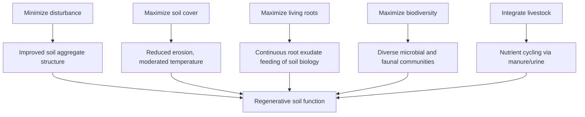

## Regenerative Soil Practices

### Definition and Core Philosophy

Regenerative soil practices comprise a set of management principles aimed at actively rebuilding soil health, biological function, and organic matter over time, rather than merely sustaining or slowing degradation. The approach treats soil as a living system whose biological, chemical, and physical properties are interdependent and improvable through management.

**Key Points**

- Distinguished from "sustainable agriculture" (which emphasizes maintaining current resource levels) by its explicit goal of net improvement in soil function over baseline
- Not a certified or legally standardized term (unlike "organic," which has regulatory definitions); practices vary by proponent, region, and system, though a common core set of principles recurs across frameworks
- Frequently associated with the "soil health principles" popularized by USDA-NRCS and figures such as Gabe Brown, though the underlying science draws on decades of soil microbiology and agroecology research

### The Five Commonly Cited Soil Health Principles

Most regenerative frameworks converge on a similar set of guiding principles:

1. **Minimize soil disturbance** — physical (tillage), chemical (excess synthetic inputs), and biological (overgrazing)
2. **Maximize soil cover** — via residue retention, cover crops, or mulch, protecting against erosion and temperature extremes
3. **Maximize living roots** — keeping continuous living root presence in the soil for as much of the year as possible to feed soil biology
4. **Maximize biodiversity** — above and below ground, through diverse rotations, cover crop mixes, and habitat provision
5. **Integrate livestock** — where feasible, reintroducing grazing animals to cycle nutrients and stimulate plant regrowth

These five principles are not independent; they function as an interlocking system where each reinforces the others.

### Soil Biology and the Soil Food Web

Central to regenerative practice is management of the **soil food web** — the community of organisms (bacteria, fungi, protozoa, nematodes, arthropods, earthworms) that drive nutrient cycling.

#### Key Biological Mechanisms

- **Mycorrhizal fungi**: Form symbiotic associations with plant roots (arbuscular mycorrhizal fungi being most common in agricultural systems), extending the effective root system's reach for water and phosphorus uptake in exchange for plant-supplied carbon (photosynthate)
- **Root exudates**: Plants allocate a portion of fixed carbon (commonly cited estimates range from roughly 5–20% of photosynthate, varying by species and conditions [Unverified — highly variable and difficult to measure precisely]) as root exudates that feed rhizosphere microbial communities
- **Glomalin**: A glycoprotein produced by mycorrhizal fungal hyphae, contributing to soil aggregate stability by acting as a binding agent
- **Nutrient cycling**: Microbial decomposition of organic matter releases plant-available nutrients (mineralization); disturbance-sensitive fungal networks are particularly implicated in phosphorus and micronutrient cycling

#### Soil Aggregate Formation

Soil aggregates form hierarchically:

$$\text{Clay-humus complexes} \rightarrow \text{microaggregates} \rightarrow \text{macroaggregates}$$

Fungal hyphae and root hairs physically enmesh microaggregates into macroaggregates, while microbial secretions (polysaccharides, glomalin) act as binding cement. Tillage disrupts this hierarchy by physically shearing hyphal networks and exposing protected organic matter to rapid oxidation.

### Core Practices

#### Cover Cropping

Maintains living roots and soil cover between cash crop cycles (see dedicated cover cropping strategies for full detail). Within a regenerative framework, cover crop diversity (multi-species "cocktail" mixes) is emphasized specifically to diversify root exudate chemistry and support varied microbial guilds.

#### Reduced/No-Till Management

Minimizes mechanical disruption of fungal networks and aggregate structure (see no-till and reduced tillage systems for full detail). Within regenerative systems, this is framed less as an erosion-control tactic alone and more as biological preservation.

#### Diverse Crop Rotations

Rotating among crop families (grasses, legumes, brassicas, broadleaves) diversifies:

- Root architecture and depth of soil exploration
- Pest and disease cycles (breaking host-specific pathogen and pest life cycles)
- Root exudate profiles feeding different microbial community compositions

#### Managed/Rotational Grazing

Integrating livestock through planned rotational or "mob" grazing systems mimics historic grassland-herbivore relationships:

- Short, intensive grazing periods followed by extended rest periods allow forage plants to fully recover root reserves before regrazing
- Manure and urine deposition returns nutrients directly to the field in a spatially distributed, biologically active form (versus stockpiled/exported manure)
- Hoof action can help incorporate surface litter and stimulate tillering in grasses, though overgrazing or excessive stocking density produces the opposite effect (compaction, vegetation loss) [Inference — outcome is highly dependent on stocking density, rest period length, and soil moisture at grazing time]

#### Compost and Organic Amendments

- Compost application introduces stabilized organic matter and a diverse microbial inoculum
- Compost extracts and teas (aerated or non-aerated) are used by some practitioners to inoculate soil or foliage with beneficial microorganisms, though efficacy and consistency of compost tea applications are debated in the scientific literature [Unverified/Speculation — results vary widely by preparation method, feedstock, and application context, with limited standardized peer-reviewed consensus]
- Biochar (pyrolyzed organic material) is sometimes incorporated for its high surface area, potential to serve as microbial habitat, and long residence time in soil, though outcomes vary by feedstock and soil context [Unverified]

### Monitoring and Assessment Metrics

Regenerative soil health is typically assessed through a combination of physical, chemical, and biological indicators, since conventional soil tests (NPK, pH) alone do not capture biological function.

| Indicator Category | Example Metrics | What It Reflects |
| --- | --- | --- |
| Physical | Aggregate stability, bulk density, infiltration rate | Structural integrity, compaction |
| Chemical | Soil organic matter %, cation exchange capacity, stratified nutrient levels | Fertility, nutrient-holding capacity |
| Biological | Active/permanganate-oxidizable carbon (POXC), soil respiration, microbial biomass, earthworm counts | Biological activity and food web function |

**Key Points**

- Soil organic matter (SOM) percentage is a commonly tracked long-term indicator, though changes occur slowly (often measured in years to decades) and require consistent sampling depth and methodology for valid comparison
- Water infiltration rate (measured via simple ring infiltrometer tests) is a widely used field-level proxy for aggregate structure and pore continuity
- No single metric fully captures "soil health"; multi-indicator frameworks (e.g., the Haney test, Cornell Soil Health Assessment) combine several measures into composite scores [Unverified — specific test methodologies and scoring weight; consult current test provider documentation for exact protocols]

### Carbon Sequestration Considerations

Regenerative practices are frequently promoted for their potential to sequester atmospheric carbon in soil organic matter via enhanced photosynthetic carbon input and reduced oxidative losses.

$$CO_2 \xrightarrow{\text{photosynthesis}} \text{plant biomass} \xrightarrow{\text{root exudates/residue}} \text{soil organic carbon}$$

**Key Points**

- Surface-layer carbon increases under reduced disturbance and cover cropping are relatively well documented
- Whole-profile net sequestration magnitude, permanence, and the rate at which soils reach a new carbon equilibrium remain active areas of scientific investigation and are contested in the literature, particularly regarding claims of significant climate-mitigation-scale sequestration from regenerative practices [Speculation — the appropriate framing is that this is a genuinely disputed area rather than settled science, and claims of specific tonnage sequestered per acre should be treated cautiously without site-specific measurement]

### Economic and Transition Considerations

- **Transition period**: Soil biological rebuilding is a multi-year process; economic returns (reduced input costs, improved resilience) often lag behind the initial investment and potential short-term yield adjustments
- **Input cost reduction**: Mature regenerative systems often report reduced reliance on synthetic fertilizer and pesticide inputs as biological nutrient cycling and pest regulation improve, though transition-period costs (cover crop seed, equipment, potential yield variability) require budgeting [Inference — economic outcomes are farm-specific and depend heavily on starting soil condition, climate, and market access]
- **Certification and market access**: Some regenerative frameworks now offer third-party verification (distinct from organic certification), which can support premium market access, though standards are less uniform than organic certification

### Common Practice Stack Example

**Example**

A representative regenerative crop rotation integrating multiple principles:

1. Diverse multi-species cover crop mix planted post-harvest (living roots, biodiversity, soil cover)
2. No-till or strip-till seeding of the following cash crop directly into terminated cover residue (minimize disturbance)
3. Rotational grazing of livestock across cover crop and crop residue in appropriate windows (livestock integration, nutrient cycling)
4. Legume-inclusive rotation sequencing to manage nitrogen without full reliance on synthetic fertilizer
5. Periodic compost application to introduce organic matter and microbial diversity

### Distinguishing Regenerative from Organic Certification

| Aspect | Organic Certification | Regenerative Practices |
| --- | --- | --- |
| Legal/regulatory status | Legally defined (e.g., USDA NOP) | No single universal legal standard |
| Primary focus | Input restriction (synthetic pesticides/fertilizers prohibited) | Soil function and biological improvement |
| Tillage requirements | Not restricted by certification itself | Explicitly minimized as a core principle |
| Certification body | Government-recognized certifiers | Various private/NGO frameworks, still evolving |
| Compatibility | Can overlap significantly | Often practiced within or alongside organic systems, but not mutually inclusive |

**Next Steps**

- Cover cropping strategies (species selection, termination methods)
- No-till and reduced tillage systems
- Rotational and mob grazing system design
- Compost production and application methods
- Soil health testing protocols (Haney test, Cornell Soil Health Assessment, POXC)
- Mycorrhizal fungi and soil microbiome management
- Biochar production and application
- Carbon farming and soil carbon measurement methodologies
- Diverse crop rotation design principles