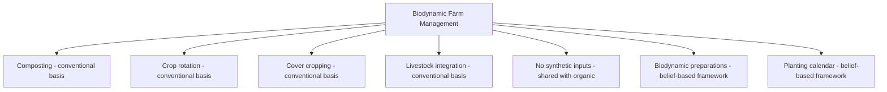

## Biodynamic Farming Principles

### Definition and Origins

Biodynamic farming is an agricultural system founded on a series of lectures given by Rudolf Steiner in 1924 (the "Agriculture Course"), combining organic farming practices with a broader philosophical framework (anthroposophy) that treats the farm as a single, self-sustaining living organism. It predates the formal organic farming movement and is considered one of its historical roots.

**Key Points**

- Biodynamic practice combines elements verifiable through conventional agronomic science (composting, crop rotation, cover cropping, livestock integration) with elements rooted in Steiner's spiritual/esoteric cosmology (planetary influences, preparation "dynamization") that fall outside conventional empirical agricultural science
- This response distinguishes between the two categories throughout, since conflating them would misrepresent both the certifiable/testable practices and the belief-based framework
- Biodynamic certification (Demeter International) is the primary third-party certification standard for the system

### The Farm-as-Organism Concept

Central to biodynamic philosophy is the idea that a farm should function as a largely closed, self-sustaining system — a single living organism with its own identity, drawing minimal inputs from outside its boundaries.

- Livestock, crops, and soil are managed as interdependent components rather than isolated enterprises
- On-farm generation of fertility (via composting, manure, and nitrogen-fixing rotations) is prioritized over imported inputs, aligning practically with organic and regenerative principles even though the philosophical framing differs
- Farm individuality ("farm individuality" is a term used in biodynamic literature) suggests each farm should develop practices suited to its specific ecological and even cosmological context [this framing is part of the belief system rather than an empirically testable claim]

### Biodynamic Preparations

The most distinctive element of biodynamic practice is a set of nine numbered preparations (BD 500–508), used in small quantities to treat compost, soil, or plants.

#### Field Sprays

- **BD 500 (Horn Manure)**: Cow manure packed into a cow horn, buried in soil over winter, then diluted in water and stirred ("dynamized") before being sprayed on soil to stimulate root growth and soil life
- **BD 501 (Horn Silica)**: Ground quartz packed into a cow horn, buried over summer, diluted and sprayed on foliage, intended to enhance light metabolism and ripening

#### Compost Preparations

- **BD 502–507**: Made from yarrow, chamomile, stinging nettle, oak bark, dandelion, and valerian respectively, each prepared through specific fermentation or burial processes and inserted into compost piles in small quantities to guide decomposition
- **BD 508**: A liquid preparation from horsetail (*Equisetum arvense*), used as a spray, traditionally associated with fungal disease suppression

**Key Points**

- Preparations are used in homeopathic-scale quantities (grams to a compost pile of many tons, or highly diluted sprays across acres)
- "Dynamization" refers to a specific rhythmic stirring process (alternating clockwise/counterclockwise vortex creation) believed in biodynamic theory to potentize the preparation
- [Speculation/Unverified] The mechanism by which these preparations would exert an agronomic effect at such dilute concentrations is not established within conventional soil science or plant physiology, and controlled scientific studies on preparation efficacy have produced inconsistent or contested results. This is presented as a factual description of the biodynamic practice and its contested scientific standing, not an endorsement or dismissal of the practice itself

### The Biodynamic (Planting) Calendar

Biodynamic practice incorporates timing of farm activities (sowing, cultivating, harvesting) according to lunar and astrological/planetary positions, categorizing days into four types associated with the classical elements:

| Day Type | Associated Element | Traditionally Recommended For |
| --- | --- | --- |
| Root days | Earth | Root crops (carrots, potatoes) |
| Leaf days | Water | Leafy vegetables |
| Flower days | Air | Flowering crops/ornamentals |
| Fruit/seed days | Fire | Fruiting crops, grains |

**Key Points**

- This calendar system (popularized by Maria Thun's biodynamic sowing calendars) assigns planting/cultivation timing based on the moon's position relative to zodiacal constellations
- [Unverified/Speculation] This is a described belief-based practice within the biodynamic system; it is not derived from, nor supported by, mainstream plant physiology or agronomic science regarding lunar/astrological effects on plant growth. It is documented here as a defining characteristic of biodynamic methodology, factually and neutrally, without asserting its agronomic validity

### Practical Agronomic Overlap with Organic/Regenerative Systems

Despite its distinctive cosmological framework, the majority of day-to-day biodynamic farm management consists of practices with established conventional agronomic basis, shared with organic and regenerative systems:

- **Composting**: Biodynamic systems place strong emphasis on high-quality, well-managed compost as the primary fertility source, using standard composting science (carbon:nitrogen ratios, aeration, moisture management) alongside the preparations
- **Crop rotation and diversity**: Diverse rotations, intercropping, and integration of livestock are emphasized for the same agronomic reasons found in organic and regenerative systems (pest/disease cycle disruption, nutrient cycling)
- **No synthetic inputs**: Like organic certification, biodynamic standards prohibit synthetic fertilizers and pesticides
- **On-farm fertility**: Emphasis on closed-loop nutrient cycling (manure, compost, nitrogen-fixing legumes) rather than imported fertility inputs

### Demeter Certification Standards

Demeter International administers the primary biodynamic certification standard globally.

**Key Points**

- Demeter certification requirements are generally considered more stringent than baseline organic certification in several respects, including mandatory use of the biodynamic preparations, minimum percentage of farm land or on-farm-produced feed for livestock operations, and stronger emphasis on farm-level biodiversity provisions [Unverified — exact percentage thresholds and specific requirements are set by Demeter's published standards documents and may vary by country/region; consult current Demeter standards for precise figures]
- A farm typically must complete organic transition/certification requirements as a baseline before or alongside biodynamic certification, since biodynamic standards build upon organic input restrictions
- Certification requires demonstrated use of specific biodynamic preparations as part of standard farm management, not merely optional or occasional use

### Comparison: Biodynamic vs. Organic vs. Regenerative

| Aspect | Organic | Regenerative | Biodynamic |
| --- | --- | --- | --- |
| Legal/regulatory basis | Yes (e.g., USDA NOP) | No universal standard | Yes (Demeter private standard) |
| Synthetic input restriction | Yes | Not inherently defined | Yes (generally stricter) |
| Soil biology focus | Present but not primary framework | Central framework | Present, integrated with cosmological framework |
| Preparations/lunar calendar | Not required | Not required | Central, required for certification |
| Philosophical basis | Regulatory/input-based | Ecological/soil-science-based | Anthroposophical (spiritual philosophy) |
| Farm as closed system | Encouraged but not required | Encouraged | Foundational requirement |

### Practical Implementation Considerations

**Example**

A biodynamic grain farm's typical annual practice sequence might include:

1. Compost preparation using BD 502–507 inserted into the compost pile during construction
2. Application of BD 500 (horn manure) to soil in autumn, following dynamization/stirring
3. Crop rotation incorporating legume cover crops and diverse cash crops for on-farm fertility
4. Sowing timed according to the biodynamic planting calendar's designated day types for the crop in question
5. Application of BD 501 (horn silica) during the growing season to support foliage development
6. Integration of livestock (commonly a requirement or strong recommendation under Demeter standards) for manure-based fertility

### Economic and Market Context

- Biodynamic-certified products (particularly wine, notable adopters including several prominent vineyards) often command premium pricing in specialty and export markets
- Certification costs and preparation labor represent additional inputs relative to conventional or even standard organic operations
- Market demand for biodynamic products is often driven by perceived quality (a claim debated separately from the certification's scientific mechanisms) and niche consumer interest in the philosophy itself [Unverified — quality perception studies show mixed results and are confounded by other factors such as farm management quality independent of biodynamic-specific practices]

**Next Steps**

- Organic certification standards and requirements (USDA NOP, EU organic regulation)
- Composting methods and carbon:nitrogen ratio management
- Cover cropping strategies
- Livestock integration in crop-livestock systems
- Demeter International certification process and standards documentation
- Comparative field trials on biodynamic preparation efficacy
- On-farm nutrient cycling and closed-loop fertility systems