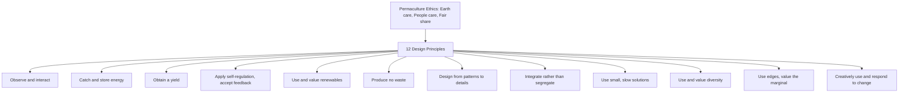
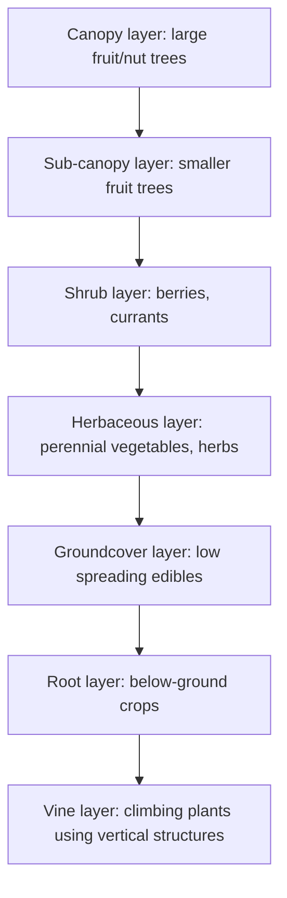

## Permaculture Design Principles

### Definition and Origins

Permaculture ("permanent agriculture," later broadened to "permanent culture") is a design system for creating sustainable human settlements and agricultural systems by mimicking patterns and relationships found in natural ecosystems. It was formalized by Bill Mollison and David Holmgren in Australia in the mid-1970s, first published in *Permaculture One* (1978).

**Key Points**

- Permaculture is fundamentally a **design methodology** rather than a specific set of farming techniques — it provides a framework for arranging elements (water, plants, structures, animals) to minimize waste and labor while maximizing beneficial relationships
- It draws on ecology, systems thinking, and traditional/indigenous land management knowledge
- Two commonly referenced formulations of core principles exist: Mollison's broader design principles and Holmgren's later, more widely taught 12 principles (2002, *Permaculture: Principles and Pathways Beyond Sustainability*); this response covers Holmgren's 12 principles as the more commonly referenced framework, alongside Mollison's foundational ethics

### The Three Ethics

Permaculture design is grounded in three foundational ethics that precede and inform all design decisions:

1. **Earth care**: Provision for all life systems to continue and multiply
2. **People care**: Provision for people to access resources necessary for their existence
3. **Fair share (return of surplus)**: Setting limits to consumption and reproduction, and redistributing surplus

### Holmgren's 12 Design Principles

#### 1. Observe and Interact

Prioritizes sustained site observation (across seasons, weather events, sun/shade patterns, water flow) before design intervention, rather than imposing a predetermined plan.

#### 2. Catch and Store Energy

Design systems to capture resources (water, sunlight, biomass, nutrients) when abundant, for use during periods of scarcity.

**Example**

Swales (on-contour water-harvesting ditches) capture rainfall runoff and allow it to infiltrate slowly into the soil profile, effectively storing water in the landscape rather than losing it to surface runoff.

#### 3. Obtain a Yield

Ensures designs produce genuinely useful output (food, materials, energy), reinforcing that permaculture is intended as a productive system, not purely ornamental or theoretical.

#### 4. Apply Self-Regulation and Accept Feedback

Design systems with built-in feedback mechanisms that discourage inappropriate or excessive activity, and remain responsive to outcomes rather than rigidly adhering to an initial plan.

#### 5. Use and Value Renewable Resources and Services

Prioritizes resources that are naturally replenished (solar energy, biological nitrogen fixation, natural pest predation) over non-renewable inputs.

#### 6. Produce No Waste

Reframes "waste" as an unused resource — a design failure to capture value rather than an inevitable output. Encourages closed-loop nutrient and material cycles.

#### 7. Design from Patterns to Details

Begin with broad ecological and landscape patterns (climate, water flow, sun path) before working down to specific plant placement and structural details.

#### 8. Integrate Rather Than Segregate

Emphasizes beneficial relationships between elements placed in proximity, rather than isolating functions into separate monocultural zones.

**Example**

Guild planting (see below) integrates multiple plant functions in a single spatial arrangement rather than segregating a fruit tree, nitrogen fixer, and groundcover into separate plots.

#### 9. Use Small and Slow Solutions

Favors incremental, manageable interventions that are easier to maintain, understand, and adjust than large-scale, capital-intensive systems.

#### 10. Use and Value Diversity

Diverse systems are more resilient to shocks (pest outbreaks, disease, climate variability) than monocultures, echoing regenerative agriculture's biodiversity principle.

#### 11. Use Edges and Value the Marginal

Edge zones between two ecosystems (e.g., forest-meadow boundary, pond-shoreline interface) tend to have higher biodiversity and productivity than the interior of either zone — a concept drawn from the ecological "edge effect."

#### 12. Creatively Use and Respond to Change

Views change as inevitable and designs systems with the flexibility to adapt, rather than resisting change or assuming static conditions.

### Zone and Sector Planning

A core practical design tool in permaculture is zone/sector analysis, used to organize a site based on frequency of human interaction and external energy flows.

#### Zones (Frequency of Use/Access)

| Zone | Description | Typical Elements |
| --- | --- | --- |
| Zone 0 | The home/central structure | House, primary living space |
| Zone 1 | Closest, most frequently visited area | Kitchen garden, herbs, daily-harvest crops |
| Zone 2 | Regularly visited, less intensive | Orchards, small livestock, perennial beds |
| Zone 3 | Main productive/farm area | Field crops, larger livestock, main crop production |
| Zone 4 | Semi-managed, infrequent visits | Managed woodland, forage, timber |
| Zone 5 | Unmanaged/wild | Wildlife habitat, natural ecosystem observation |

**Key Points**

- Zones are organized by *frequency of visitation and management intensity*, not simply physical distance, though the two often correlate
- The zone concept reduces unnecessary travel/labor by placing frequently tended elements (herbs, salad greens) closest to daily activity centers

#### Sectors (External Energy Flows)

Sector analysis maps external forces entering the site from outside its boundary: sun angle and path, prevailing wind direction, water flow/drainage patterns, fire risk direction, and wildlife movement corridors. Design elements are positioned to either capture beneficial sector flows (e.g., sun for a greenhouse) or block/deflect detrimental ones (e.g., windbreaks against prevailing cold winds).

### Guild Planting

A "guild" is a group of plants (and sometimes animals) selected and arranged to support each other's growth through complementary functions, often modeled on naturally occurring plant associations.

**Example**

The "Three Sisters" companion planting system (traditional to several Indigenous agricultural systems in the Americas) is frequently cited as an early guild example:

- **Corn**: Provides vertical structure for beans to climb
- **Beans**: Fix atmospheric nitrogen, benefiting the nitrogen-demanding corn and squash
- **Squash**: Sprawling growth habit shades soil, suppressing weeds and conserving moisture

A modern temperate fruit tree guild commonly includes: a central fruit tree, a nitrogen-fixing shrub or tree (e.g., certain *Elaeagnus* species), dynamic accumulator plants (deep-rooted species theorized to bring subsoil minerals to the surface via leaf drop) [Unverified/Speculation — the "dynamic accumulator" concept has limited direct scientific validation regarding the magnitude of mineral transfer, though the general principle of deep-rooted plants cycling subsoil nutrients into surface litter is plausible and partially supported], pest-confusing aromatic herbs, and a groundcover for weed suppression and living mulch.

### Food Forests (Forest Gardening)

A food forest is a designed perennial polyculture system modeled on natural forest structure, using vertical stratification (layering) to maximize productive use of light and space within a given footprint.

**Key Points**

- The seven-layer model (canopy, sub-canopy, shrub, herbaceous, groundcover, root, vine) is a commonly taught framework, though not every food forest implements all seven layers
- Food forests are typically slower to establish and reach full production than annual cropping systems, given reliance on perennial and woody species maturation timelines, but require lower ongoing input once established [Inference — establishment timelines and labor trade-offs are highly site- and species-specific]

### Water Harvesting Earthworks

Permaculture design places significant emphasis on landscape-scale water management, particularly in dryland contexts.

- **Swales**: On-contour ditches that intercept surface runoff and allow infiltration, often paired with a downslope berm planted with trees to utilize the infiltrated moisture
- **Keyline design** (developed by P.A. Yeomans, adopted into permaculture practice): A land-planning approach using the natural "keypoints" of valley contours to guide subsoiling and water distribution patterns, aiming to spread water evenly across a landscape rather than concentrating it in valleys
- **Ponds and dams**: Positioned according to sector analysis (catching runoff, providing microclimate moderation, aquaculture potential)

### Relationship to Organic and Regenerative Agriculture

| Aspect | Organic | Regenerative | Permaculture |
| --- | --- | --- | --- |
| Primary framework | Input restriction (certified standard) | Soil biology/function improvement | Whole-system design methodology |
| Scale of application | Farm/field level | Farm/field level | Site design (farm to household to community) |
| Core unit of analysis | Crop/input | Soil | Element relationships and energy flows |
| Perennial emphasis | Not inherent | Often present via cover crops/reduced till | Strong emphasis (food forests, perennial polycultures) |
| Certification | Yes (regulatory) | No universal standard | No standard certification (design consultancy/PDC courses exist) |

**Key Points**

- Permaculture is compatible with and often incorporates organic and regenerative practices (no-till, composting, cover cropping) as implementation tools within its broader design framework, rather than treating them as separate systems
- The Permaculture Design Certificate (PDC) is the standard entry-level training credential in the field, typically a 72-hour curriculum tracing back to Mollison's original course structure, though content and depth vary by instructor and organization [Unverified — curriculum specifics vary by teaching organization]

### Practical Application Example

**Example**

A small-scale permaculture homestead design process might proceed as:

1. Site observation across a full year (sun angles, water flow, frost pockets, wind exposure) — Principle 1
2. Sector mapping of prevailing wind, sun path, and water flow direction
3. Zone planning placing kitchen garden (Zone 1) nearest the house, orchard/food forest (Zone 2) further out, and larger-scale grazing or field crops (Zone 3) at greatest distance
4. Swale installation on contour upslope of the food forest area to passively irrigate fruit trees
5. Guild planting around each fruit tree combining nitrogen fixers, pest-deterrent herbs, and groundcover
6. Integration of small livestock (poultry) into the system for pest control, manure, and waste (kitchen scrap) processing, positioned per zone and sector analysis

**Next Steps**

- Regenerative soil practices
- Cover cropping strategies
- Companion planting and polyculture design
- Water harvesting earthworks (swales, keyline design) engineering
- Agroforestry and food forest establishment
- Permaculture Design Certificate (PDC) curriculum structure
- Integrated pest management within polyculture systems