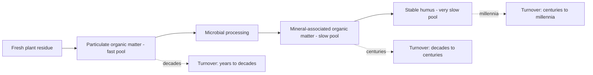
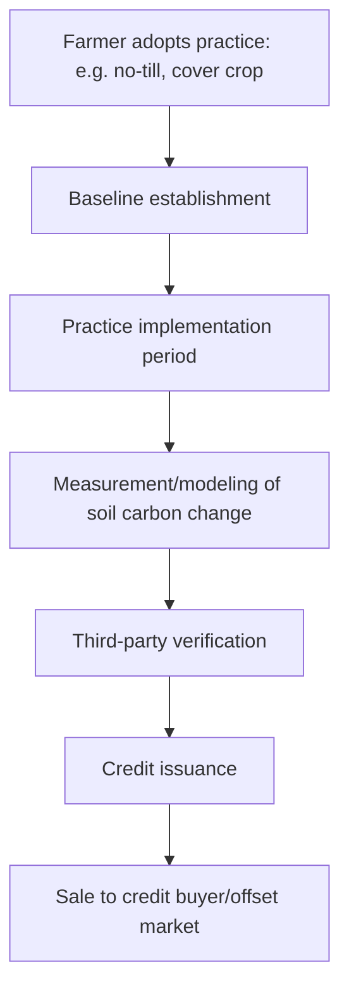

## Carbon Sequestration in Agriculture

### Definition and Basic Mechanism

Carbon sequestration in agriculture refers to the process of capturing atmospheric carbon dioxide ($CO_2$) via plant photosynthesis and storing the resulting carbon in relatively stable forms in soil organic matter, plant biomass, or woody perennial structures, thereby removing it from active atmospheric circulation for extended periods.

$$CO_2 + H_2O \xrightarrow{\text{light energy}} (\text{CH}_2\text{O})_n + O_2$$

Fixed carbon then follows one of several pathways: incorporation into plant structural tissue, transfer to soil via root exudates and residue decomposition, or transformation into more persistent soil organic matter fractions through microbial processing.

**Key Points**

- Sequestration is distinct from simple carbon "storage" — it implies active, ongoing capture and net accumulation over time relative to a baseline, not merely holding existing stock static
- Agricultural soils have historically lost significant carbon relative to native/undisturbed conditions due to tillage-induced oxidation, erosion, and reduced organic matter inputs, meaning many agricultural soils have theoretical capacity to sequester carbon back toward pre-cultivation baseline levels [Unverified — the magnitude of historical loss and theoretical recovery ceiling is highly site- and soil-type dependent]

### The Soil Carbon Pool System

Soil organic carbon (SOC) is not a single homogeneous pool but is conventionally modeled as multiple fractions with differing turnover rates.

| Pool | Turnover Time | Description |
| --- | --- | --- |
| Particulate organic matter (POM) | Years to a decade | Recognizable plant fragments, fast-cycling |
| Mineral-associated organic matter (MAOM) | Decades to centuries | Carbon bound to clay/mineral surfaces, more stable |
| Stable/humified fraction | Centuries to millennia | Highly processed, chemically recalcitrant organic compounds |

**Key Points**

- MAOM formation is increasingly emphasized in current soil science as the primary mechanism for durable, long-term carbon storage, since mineral-surface binding physically and chemically protects carbon from microbial decomposition [Unverified — this represents current research emphasis; specific proportions attributable to each pool vary by soil type, climate, and management, and remains an active area of ongoing research]
- The relative durability of stable soil carbon does not mean sequestration is permanent under all conditions — pool stability can shift significantly if management (e.g., resumed tillage) disturbs previously protected mineral-associated carbon

### Practices That Enhance Sequestration

#### No-Till and Reduced Tillage

Avoiding mechanical soil disruption reduces oxidative exposure of protected organic matter and preserves fungal networks involved in aggregate-mediated carbon protection (see no-till and reduced tillage systems for full mechanism detail). Effects are most consistently documented in surface soil layers (0–5 cm), with whole-profile effects being more variable and debated in the literature.

#500

#### Cover Cropping

Extends the duration of living root presence and photosynthetic carbon input across periods that would otherwise be fallow, directly increasing the annual carbon input available for potential sequestration (see cover cropping strategies for species and mechanism detail).

#### Diverse Rotations and Perennial Integration

- Deeper and more architecturally diverse root systems (achieved through crop diversity) access different soil depths and produce varied root exudate chemistry, potentially engaging a broader range of microbial carbon-processing pathways
- Perennial crops and pastures generally maintain substantially more continuous root biomass and photosynthetic carbon input than annual cropping systems, and are frequently associated with higher soil carbon accumulation rates relative to annual cropland [Unverified — comparative magnitude varies by region, climate, and specific perennial system]

#### Agroforestry and Silvopasture

Integrating trees into cropland or pastureland adds a long-lived woody biomass carbon pool in addition to soil carbon pathways, and tree root systems can access and stabilize soil carbon at greater depths than annual crop roots typically reach.

#### Managed Grazing

Well-managed rotational grazing systems are proposed to enhance soil carbon through stimulated root regrowth cycles (grazing pressure followed by adequate rest periods can stimulate root exudation and turnover) and manure redistribution, though the net soil carbon impact of grazing management relative to ungrazed or continuously grazed systems remains contested in the scientific literature, with results varying significantly by region, stocking method, and baseline conditions [Speculation — this is a genuinely disputed area; claims of large-scale carbon sequestration from "regenerative grazing" specifically should be treated with caution absent site-specific measurement]

#### Compost and Organic Amendments

Direct addition of stabilized organic carbon (via compost) provides an immediate carbon input distinct from in-situ crop-derived sequestration, though questions remain regarding what fraction of applied compost carbon persists long-term versus is rapidly mineralized back to $CO_2$ [Unverified — persistence fraction depends on compost maturity/stability and soil conditions]

#### Biochar

Pyrolyzed organic material (biochar) represents a distinct sequestration pathway: rather than relying on biological stabilization of fresh organic matter, pyrolysis chemically transforms carbon into a highly recalcitrant aromatic structure with an estimated mean residence time potentially spanning centuries to millennia, depending on feedstock and pyrolysis conditions [Unverified — persistence estimates vary substantially across studies and biochar production parameters, and remain an active research area]

### Measurement and Verification

Accurately quantifying soil carbon sequestration is technically challenging and represents a significant practical constraint on carbon farming programs.

**Key Points**

- **Spatial variability**: Soil carbon varies substantially even within a single field, requiring numerous sampling points and standardized depth protocols for statistically valid measurement
- **Temporal detection limits**: Annual sequestration rates are typically small relative to existing background soil carbon stock and natural year-to-year variability, meaning changes often require multiple years of consistent sampling to detect with confidence above measurement noise
- **Sampling depth**: Measuring only surface soil (e.g., 0–15 cm) can overstate whole-profile change if carbon is being redistributed vertically rather than net-added; deeper sampling (to 30 cm or more) is increasingly recommended for defensible sequestration accounting [Unverified — recommended depths vary by protocol and soil type]
- **Model-based estimation**: Given measurement cost and difficulty, many carbon credit programs rely partly or wholly on process-based models (e.g., COMET-Farm, DNDC) calibrated with regional data rather than direct field measurement of every enrolled acre, introducing model uncertainty into credited estimates [Unverified — specific model accuracy and current adoption status should be verified against current program documentation, as this is an evolving area]

### Agricultural Carbon Credit Markets

Carbon credit programs allow farmers to generate tradeable credits by adopting sequestration-associated practices, sold to buyers seeking to offset emissions.

**Key Points**

- **Additionality**: Credits are intended to represent sequestration that would not have occurred without the incentive program — a practice a farmer was already planning to adopt regardless of payment complicates additionality claims
- **Permanence risk**: Since soil carbon can be released relatively quickly if practices are reversed (e.g., a return to intensive tillage), credit programs typically require long-term (often multi-year to decade-plus) commitments and may include reversal/buffer provisions
- **Leakage**: A theoretical concern where reduced production on a credited farm (e.g., from a-yield-affecting practice change) shifts production, and its associated emissions, to another location
- [Unverified] The agricultural carbon credit market is a rapidly evolving commercial and regulatory space; specific program structures, pricing, and verification standards change frequently and should be verified against current program documentation rather than treated as fixed

### Emissions Considerations Beyond Soil Carbon

A complete accounting of agriculture's climate impact requires considering emissions alongside sequestration, since net climate benefit depends on both sides of the balance.

- **Nitrous oxide ($N_2O$)**: Emitted from soil microbial processes (nitrification/denitrification), particularly following nitrogen fertilizer application; $N_2O$ has a substantially higher global warming potential per unit mass than $CO_2$ over a 100-year horizon [Unverified — specific GWP multiplier figures are periodically revised by IPCC assessment reports; consult current IPCC AR documentation for exact values]
- **Methane ($CH_4$)**: Produced by ruminant livestock digestion (enteric fermentation) and flooded rice paddy soils, also with elevated global warming potential relative to $CO_2$
- **Fuel-related emissions**: Field operations (tillage passes, input application, harvest) consume fossil fuel, with reduced-tillage and no-till systems generally lowering this component

### Comparative Summary of Sequestration Practices

| Practice | Primary Mechanism | Relative Certainty of Effect | Typical Depth of Impact |
| --- | --- | --- | --- |
| No-till/reduced till | Reduced oxidation, preserved aggregates | Well-documented at surface; profile-level debated | Surface (0–15 cm) strongest |
| Cover cropping | Extended photosynthetic input | Reasonably well-documented | Surface to root depth |
| Perennial/agroforestry integration | Continuous root biomass, woody carbon pool | Reasonably well-documented for woody biomass; soil component varies | Surface and subsoil |
| Managed grazing | Root stimulation, manure cycling | Contested/actively debated | Surface, variable |
| Biochar | Chemical recalcitrance | Persistence reasonably supported; net climate benefit accounting is complex | Wherever applied |
| Compost application | Direct organic carbon addition | Persistence fraction debated | Surface |

### Practical Farm-Level Example

**Example**

A row-crop operation transitioning toward higher sequestration potential might combine:

1. Transition from conventional tillage to no-till or strip-till over a multi-year period
2. Introduction of a diverse multi-species cover crop following cash crop harvest
3. Extension of crop rotation diversity (adding a small grain or forage phase)
4. Periodic compost or manure application where locally available
5. Baseline soil carbon sampling (standardized depth, multiple points, georeferenced) prior to practice change, repeated on a multi-year cycle to track change with statistical confidence

**Next Steps**

- No-till and reduced tillage systems
- Cover cropping strategies
- Regenerative soil practices
- Soil organic carbon measurement protocols and standardized sampling depth
- Agroforestry and silvopasture system design
- Biochar production methods and application rates
- Agricultural carbon credit program structures and verification standards
- Life-cycle greenhouse gas accounting in agricultural systems