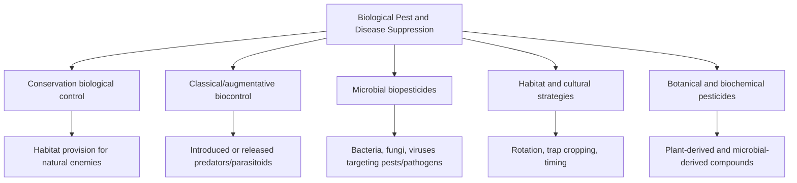

## Biological Pest and Disease Suppression

### Definition and Scope

Biological pest and disease suppression refers to the management of agricultural pests, pathogens, and weeds through living organisms, ecological relationships, and biologically derived mechanisms, rather than synthetic chemical pesticides. It encompasses natural enemy conservation, introduced biocontrol agents, microbial antagonists, and habitat-based strategies that reduce pest pressure through ecological function.

**Key Points**

- Distinguished from Integrated Pest Management (IPM) broadly, which may still include synthetic chemical tools as one component; biological suppression specifically emphasizes living-organism and ecological mechanisms
- Central to organic certification (which prohibits most synthetic pesticides) and to regenerative/permaculture frameworks that treat pest regulation as an emergent property of a well-designed, biodiverse system rather than an input to be purchased
- Effectiveness is generally more variable and context-dependent than synthetic chemical control, often requiring a systems-level approach combining multiple tactics rather than a single substitute product [Inference — this reflects the general ecological complexity of biological control compared to a targeted chemical mode of action]

### Classification of Approaches

### Conservation Biological Control

This approach focuses on protecting and enhancing populations of naturally occurring predators and parasitoids already present in or near the agricultural landscape, rather than introducing new organisms.

#### Natural Enemy Groups

- **Predators**: Ladybird beetles (Coccinellidae, aphid predators), lacewings (*Chrysopidae*, aphid and soft-bodied insect predators), predatory mites, ground beetles (*Carabidae*, seed and soil pest predators), spiders
- **Parasitoids**: Parasitic wasps (e.g., *Trichogramma* spp. targeting lepidopteran eggs, *Aphidius* spp. targeting aphids) that lay eggs in or on host pests, with larvae consuming the host

#### Habitat Provisioning Strategies

- **Beetle banks**: Raised, vegetated strips within or adjacent to fields providing overwintering habitat for ground beetles and other predatory arthropods
- **Flowering insectary strips**: Plantings of nectar- and pollen-producing species (e.g., alyssum, buckwheat, phacelia) providing adult food sources for parasitoid wasps and predatory flies, many of which require nectar/pollen in their adult stage despite being predatory or parasitic as larvae
- **Hedgerows and field margins**: Provide season-long habitat continuity, shelter, and alternative prey/hosts that sustain natural enemy populations through periods when the cash crop cannot
- **Reduced/targeted pesticide use**: Broad-spectrum insecticide applications, even when organically approved, can disrupt natural enemy populations; selective timing and targeted (rather than blanket) application helps preserve beneficial insect populations

**Key Points**

- Conservation biocontrol operates on the principle that naturally occurring biological control is already happening at some baseline level in most systems, and can often be substantially enhanced through habitat modification rather than requiring organism introduction
- Effects typically build over multiple seasons as habitat matures and natural enemy populations establish, rather than providing immediate suppression [Inference]

### Classical and Augmentative Biocontrol

#### Classical Biocontrol

Introduction of a natural enemy (typically from a pest's region of origin) to establish a permanent, self-sustaining population that provides long-term control — used historically for invasive pest species lacking natural enemies in their introduced range.

**Key Points**

- Requires extensive host-specificity testing before release to avoid non-target ecological impacts, as historical classical biocontrol introductions without adequate testing have in some cases caused unintended ecological harm [Unverified — specific historical case outcomes and current regulatory testing standards vary by country and should be verified against current biosecurity/regulatory documentation]
- Regulated by government biosecurity agencies in most jurisdictions due to the permanent, self-replicating nature of the introduction

#### Augmentative Biocontrol

Periodic release of commercially reared natural enemies to supplement existing populations, without expectation of permanent establishment.

**Example**

- *Trichogramma* wasp releases in field crops or orchards, timed to coincide with target pest egg-laying periods, to parasitize eggs before larval hatch and crop damage occurs
- Predatory mite releases (e.g., *Phytoseiulus persimilis*) in greenhouse production against spider mites, a common commercial biocontrol application in protected-culture systems

### Microbial Biopesticides

Formulated products containing living microorganisms or their derived compounds, applied similarly to conventional pesticides but functioning through biological mechanisms.

#### Bacterial Agents

- ***Bacillus thuringiensis* (Bt)**: Produces crystalline (Cry) proteins toxic to specific insect larvae upon ingestion; different Bt subspecies/strains target different insect orders (e.g., *Bt kurstaki* for lepidopteran larvae, *Bt israelensis* for mosquito/blackfly larvae), providing relatively narrow, target-specific activity compared to broad-spectrum synthetic insecticides
- ***Bacillus subtilis***: Used as a biofungicide, competing with pathogenic fungi for resources and producing antifungal compounds

#### Fungal Agents

- ***Beauveria bassiana* and *Metarhizium* spp.**: Entomopathogenic fungi that infect and kill a broad range of insect pests through cuticle penetration and internal colonization
- ***Trichoderma* spp.**: Applied to soil or seed, acts against soilborne pathogens (e.g., *Fusarium*, *Rhizoctonia*, *Pythium*) through mechanisms including mycoparasitism (direct parasitism of pathogenic fungi), competition for nutrients/space, and induction of systemic plant resistance

#### Viral Agents

- **Baculoviruses**: Insect-specific viruses (e.g., codling moth granulovirus) used against specific lepidopteran pests, offering high target specificity since baculoviruses generally infect only a narrow host range

### Suppressive Soils and Disease-Antagonistic Microbiomes

Certain soils exhibit natural or cultivated "disease suppressiveness" — the capacity to limit pathogen establishment or activity through resident microbial community function, independent of any applied biocontrol product.

$$\text{Suppressiveness} \propto \text{microbial diversity} \times \text{antagonist abundance} \times \text{organic matter availability}$$

[Inference — this relationship is illustrative of the general factors implicated in soil suppressiveness rather than a validated quantitative formula]

- **General suppression**: Broad microbial competition and resource depletion limiting pathogen establishment, associated with overall microbial biomass and diversity, often linked to organic matter content and management practices that support diverse soil biology (reduced tillage, cover cropping, compost addition)
- **Specific suppression**: Targeted antagonism of a particular pathogen by specific microbial populations (e.g., certain *Pseudomonas* and *Streptomyces* species producing antibiotics active against specific soilborne fungal pathogens)
- Compost and well-managed organic amendments are frequently associated with enhanced disease suppressiveness, attributed to the diverse and often antagonist-rich microbial populations introduced [Unverified — the degree of suppressiveness conferred varies substantially by compost source, maturity, and target pathogen, and is an active area of research]

### Cultural and Habitat-Based Strategies

#### Crop Rotation

Interrupting the life cycle of pests and pathogens with host-specific requirements by rotating away from susceptible crop families, reducing the buildup of soilborne pathogen populations and pest reservoirs tied to a specific crop.

#### Trap Cropping

Planting a preferred host species to draw pests away from the main cash crop, concentrating the pest population in a smaller, more manageable area for targeted control.

**Example**

Planting a border of collards or mustard around a cabbage field to attract flea beetles and diamondback moths preferentially, reducing pressure on the main crop.

#### Intercropping and Polyculture

Diverse plantings can disrupt pest host-finding behavior (through visual and chemical camouflage of the host crop among non-host plants) and support natural enemy populations simultaneously, overlapping with permaculture guild concepts.

#### Resistant Cultivar Selection

Utilizing crop varieties bred or selected for genetic resistance or tolerance to specific pests and diseases reduces reliance on any suppression input, biological or chemical, by lowering baseline susceptibility.

#### Timing and Sanitation

Adjusting planting/harvest timing to avoid peak pest pressure windows, and removing crop residue or volunteer plants that harbor pest or pathogen populations between seasons.

### Botanical and Biochemical Pesticides

- **Neem-based products** (derived from *Azadirachta indica*): Contain azadirachtin, which acts as an insect growth regulator and feeding deterrent
- **Pyrethrin** (derived from *Chrysanthemum cinerariifolium*): A botanical insecticide acting on insect nervous systems; note that natural pyrethrins are generally less persistent in the environment than synthetic pyrethroid analogs, though they can still affect beneficial insects and require careful, targeted application
- **Insecticidal soaps and horticultural oils**: Function through physical/mechanical disruption (suffocation, membrane disruption) of soft-bodied insects rather than a biochemical toxic mode of action

**Key Points**

- Botanical pesticides are often approved for organic use but are not inherently "safe" for all non-target organisms simply by virtue of being plant-derived; application timing and targeting remain important to avoid harming beneficial insects
- Many botanical compounds have shorter environmental persistence than synthetic alternatives, which can be a benefit (reduced residue/non-target exposure over time) and a limitation (more frequent reapplication needed) [Inference]

### Integration with Organic and Regenerative Systems

| Practice | Primary Suppression Mechanism | System Overlap |
| --- | --- | --- |
| Insectary strips/hedgerows | Natural enemy habitat | Permaculture zone/guild design |
| Diverse rotation | Pest/pathogen cycle disruption | Regenerative soil practices |
| Compost/suppressive soil | Microbial antagonism | Regenerative soil biology |
| Cover crop-based suppression | Habitat, allelopathy, soil health | Cover cropping strategies |
| Microbial biopesticides | Direct biological control agents | Organic-approved input use |

Biological suppression is rarely deployed as a single tactic; systems following organic and regenerative principles typically layer multiple approaches (habitat, rotation, resistant varieties, targeted biopesticide use) into an integrated strategy, reflecting the general ecological principle that diverse, redundant control mechanisms are more resilient than reliance on any single tactic.

### Practical Implementation Example

**Example**

A diversified vegetable operation's biological pest suppression stack might include:

1. Permanent hedgerow and flowering insectary strip borders supporting resident natural enemy populations
2. Diverse crop rotation sequencing unrelated plant families to disrupt soilborne pathogen and pest buildup
3. Trap crop borders (e.g., mustard around brassica plantings) to concentrate and manage flea beetle pressure
4. Targeted *Bt kurstaki* application against lepidopteran larvae only when monitoring indicates pressure exceeds an action threshold
5. Compost application to support general soil disease suppressiveness
6. Resistant cultivar selection for known regional disease pressures (e.g., late blight-tolerant tomato varieties)

**Next Steps**

- Integrated Pest Management (IPM) monitoring and threshold-based decision making
- Cover cropping strategies (habitat and allelopathic functions)
- Permaculture guild and polyculture design
- Regenerative soil practices and disease-suppressive soil management
- Beneficial insect habitat design (insectary strips, beetle banks, hedgerows)
- Organic-approved input standards and certification lists (e.g., OMRI)
- Compost quality and disease suppressiveness research