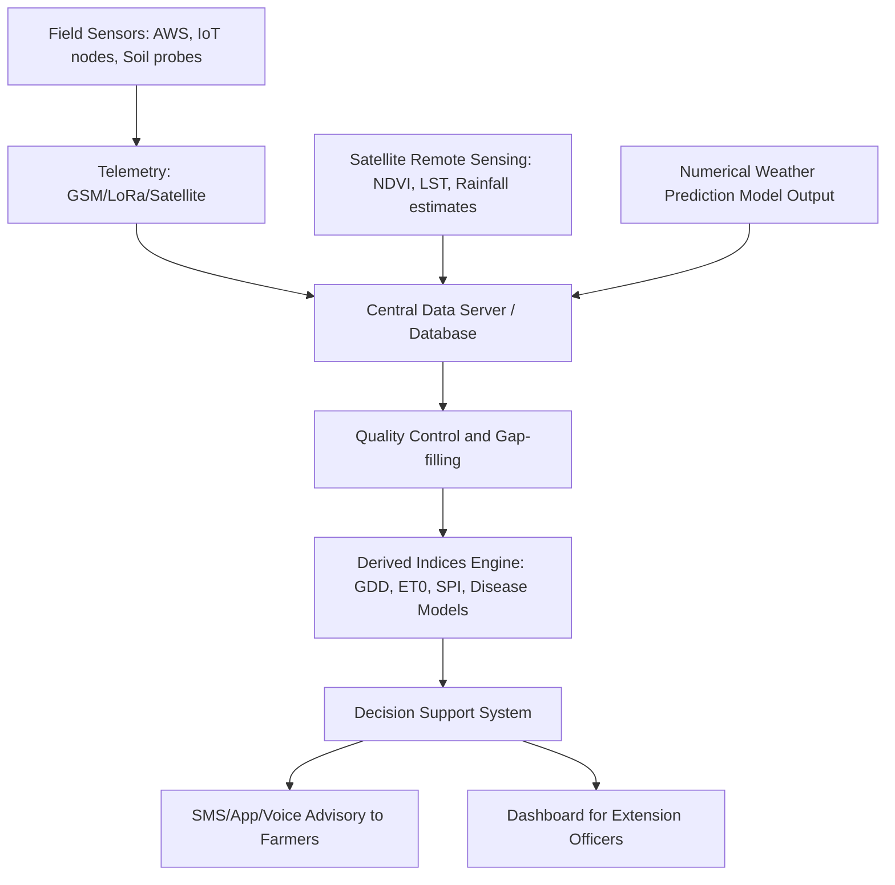

## Agrometeorology and Weather Monitoring


### Definition and Scope

Agrometeorology is the applied science studying the interactions between meteorological, hydrological, and climatological factors on one hand, and agricultural production (crops, livestock, forestry, fisheries) on the other. It integrates atmospheric science with agronomy, soil science, and plant physiology to optimize farming decisions, manage climate-related risk, and improve resource-use efficiency.

Weather monitoring is the observational backbone of agrometeorology: the systematic measurement of atmospheric and soil variables that drive crop growth, pest pressure, water demand, and yield outcomes.

**Key Points**

- Agrometeorology sits at the intersection of weather/climate science and crop-livestock production systems.
- It operates across three timescales: weather (hours to ~10 days), climate variability (seasons to years, e.g., El Niño–Southern Oscillation), and climate change (decades).
- Core outputs include agromet advisories, crop weather calendars, pest/disease risk alerts, irrigation scheduling guidance, and yield forecasts.

### Core Meteorological Variables Relevant to Agriculture

| Variable | Typical Instrument | Agricultural Relevance |
| --- | --- | --- |
| Air temperature (max/min) | Thermometer, thermistor, thermocouple | Growing degree days, frost risk, phenology timing |
| Relative humidity | Hygrometer, capacitive sensor | Disease sporulation, transpiration rate, drying conditions |
| Rainfall | Tipping-bucket or weighing rain gauge | Water balance, planting windows, erosion risk |
| Solar radiation | Pyranometer | Photosynthesis, evapotranspiration ($ET_0$), biomass accumulation |
| Wind speed/direction | Cup anemometer, sonic anemometer | Spray drift, lodging risk, evapotranspiration, wildfire/dust risk |
| Soil temperature | Soil thermistor probes | Germination timing, root activity, microbial activity |
| Soil moisture | TDR, capacitance probes, tensiometers | Irrigation scheduling, drought stress, trafficability |
| Atmospheric pressure | Barometer | Storm tracking, frontal passage forecasting |
| Leaf wetness | Leaf wetness sensor (resistance grid) | Fungal disease infection period modeling |

### Instrumentation and Station Types

**Manual/Conventional Stations**

Standard Stevenson screen setups with mercury/alcohol thermometers, standard rain gauges, and manually logged readings, typically read once or twice daily. Still used in many national meteorological networks for long-term climate continuity, since automated sensors introduce homogenization challenges when replacing decades-long manual records.

**Automatic Weather Stations (AWS)**

Solar- or battery-powered stations with electronic sensors logging data at sub-hourly intervals (commonly 5–15 minutes), transmitted via GSM/GPRS, satellite (e.g., Iridium), radio telemetry, or LoRaWAN to a central server. AWS networks underpin most modern agromet advisory services because of their high temporal resolution and near-real-time data availability.

**On-Farm/IoT Micro-Weather Sensors**

Low-cost sensor nodes (e.g., built on ESP32/Arduino-class microcontrollers with commodity sensors such as the BME280 for temperature/humidity/pressure, or DHT22) deployed at field scale. These trade absolute accuracy and calibration rigor for spatial density, capturing microclimate variation across a farm or even within a single field (canopy vs. open, valley vs. ridge).

[Inference] Low-cost IoT sensor networks generally require more frequent calibration drift-checking against a reference-grade station than professional-grade AWS equipment, though the magnitude of drift is sensor- and manufacturer-specific.

**Remote Sensing Platforms**

- **Geostationary satellites** (e.g., Himawari, GOES, Meteosat): continuous coverage for cloud tracking, convective storm nowcasting.
- **Polar-orbiting satellites** (e.g., MODIS, VIIRS, Sentinel-3): land surface temperature, vegetation indices, evapotranspiration proxies.
- **Weather radar**: precipitation intensity and storm tracking at high spatial/temporal resolution, critical for short-term irrigation and spray-timing decisions.
- **Radiosondes/weather balloons**: upper-air profiles feeding into numerical weather prediction (NWP) models that downstream agromet forecasts depend on.

### Derived Agrometeorological Indices

**Growing Degree Days (GDD)**

$$GDD = \frac{T_{max} + T_{min}}{2} - T_{base}$$

Where $T_{base}$ is the crop-specific threshold below which development effectively halts (e.g., ~10°C for maize, ~4–5°C for wheat). Accumulated GDD predicts phenological milestones (emergence, flowering, maturity) and is standard in crop calendars and pest-emergence models.

**Reference Evapotranspiration ($ET_0$)**

The FAO Penman-Monteith equation is the internationally standardized method:

$$ET_0 = \frac{0.408\Delta(R_n - G) + \gamma \frac{900}{T+273}u_2(e_s - e_a)}{\Delta + \gamma(1 + 0.34u_2)}$$

Where $R_n$ is net radiation, $G$ is soil heat flux, $T$ is mean air temperature, $u_2$ is wind speed at 2m, $e_s - e_a$ is vapor pressure deficit, $\Delta$ is the slope of the saturation vapor pressure curve, and $\gamma$ is the psychrometric constant. Crop water requirement is then $ET_c = ET_0 \times K_c$, where $K_c$ is a crop coefficient varying by growth stage.

**Standardized Precipitation Index (SPI)** and **Standardized Precipitation Evapotranspiration Index (SPEI)** — statistical indices for quantifying drought severity over selectable time windows (1, 3, 6, 12 months), widely used in agricultural drought early-warning systems.

**Chilling Hours/Units** — accumulated cold exposure required by temperate fruit trees (apple, peach, cherry) to break dormancy; insufficient chill accumulation under warming trends causes erratic flowering.

**Disease Forecasting Models** — e.g., the Blitecast/late blight model for potatoes relies on temperature and relative humidity thresholds sustained over consecutive hours; leaf wetness duration models similarly drive fungicide spray-timing decisions.

### Data Flow Architecture (Agromet Advisory System)



### Numerical Weather Prediction (NWP) in Agromet

Agricultural forecasting relies on downscaled output from global and regional NWP models:

- **Global models**: GFS (NOAA), ECMWF-IFS, ICON (DWD) — provide 7–16 day forecasts at ~9–25 km resolution.
- **Regional/mesoscale models**: WRF (Weather Research and Forecasting), often run at 1–4 km resolution for localized frost, convective storm, and fog forecasting relevant to field-level decisions.
- **Seasonal forecasts**: coupled ocean-atmosphere models providing probabilistic outlooks (e.g., ENSO phase forecasts) that inform planting date and crop choice decisions months in advance.

[Inference] Mesoscale model output generally requires local bias-correction against ground station data before being used for operational farm advisories, since terrain and land-use representation in the model may not match actual field conditions at the sub-kilometer scale.

### Applications in Farm Decision-Making

**Planting and Sowing Windows**

Onset-of-rains detection algorithms (e.g., requiring a minimum cumulative rainfall threshold within a defined period, with a defined dry-spell tolerance) trigger planting advisories in rainfed systems, reducing the risk of germination failure from false starts.

**Irrigation Scheduling**

Soil water balance modeling combines $ET_c$, effective rainfall, and soil moisture sensor data to compute a daily water balance, triggering irrigation when depletion crosses a management allowable depletion (MAD) threshold — typically 40–60% of total available water depending on crop sensitivity.

**Frost Protection**

Radiative frost forecasting (clear sky, calm wind, low humidity, dropping dew point) allows timed activation of wind machines, sprinkler-based ice-encapsulation systems, or smudge heating before critical temperature thresholds are crossed.

**Pest and Disease Early Warning**

Degree-day accumulation models predict insect life-cycle stages (e.g., codling moth emergence); humidity/leaf-wetness-driven models predict fungal infection windows (e.g., rice blast, potato late blight), enabling targeted rather than calendar-based pesticide application.

**Spray Timing**

Wind speed, temperature inversion risk, and delta-T (a function of temperature and humidity indicating droplet evaporation risk) determine safe windows for pesticide/herbicide application to minimize drift.

**Harvest Timing and Post-Harvest Logistics**

Short-range rainfall forecasts inform harvest-window decisions for moisture-sensitive crops (grain, hay) to avoid field losses and quality degradation.

### Example: Simple GDD-Based Crop Stage Estimator (Python)

```python
def calculate_gdd(t_max, t_min, t_base=10):
    """Calculate daily Growing Degree Days using the standard method,
    with the common modification that Tmin is floored at Tbase."""
    t_min_adj = max(t_min, t_base)
    t_max_adj = max(t_max, t_base)
    return ((t_max_adj + t_min_adj) / 2) - t_base

def accumulate_gdd(daily_temps, t_base=10):
    """daily_temps: list of (t_max, t_min) tuples"""
    cumulative = 0
    results = []
    for t_max, t_min in daily_temps:
        daily_gdd = calculate_gdd(t_max, t_min, t_base)
        cumulative += daily_gdd
        results.append(cumulative)
    return results

# Example: maize (Tbase = 10°C), silking typically near 800-900 GDD
daily_temps = [(32, 21), (30, 22), (33, 20), (29, 19)]
cum_gdd = accumulate_gdd(daily_temps, t_base=10)
print(cum_gdd)  # cumulative GDD per day, compared against phenology thresholds
```

**Output**

`[16.5, 32.5, 48.5, 62.5]` — cumulative GDD after each day, checked against crop-specific stage thresholds (e.g., emergence ~50 GDD, tasseling ~700–800 GDD for maize, values vary by hybrid).

### Data Quality Control Considerations

- **Sensor drift**: periodic calibration against reference instruments (e.g., a Stevenson-screen thermometer) is standard practice for AWS networks.
- **Gap-filling**: missing values are commonly interpolated using nearby station data, satellite proxies, or reanalysis datasets (e.g., ERA5) when short-duration outages occur.
- **Homogenization**: long climate records require adjustment when station location, instrumentation, or observation time changes, to avoid artificial trend artifacts.
- **Spatial representativeness**: a single station may not represent field-level microclimate variation, particularly in complex terrain or near water bodies; this is a primary justification for denser IoT sensor deployment.

### Illustrative Diagram: Agrometeorological Station Sensor Layout (svg_diagram)

<svg xmlns="http://www.w3.org/2000/svg" viewBox="0 0 800 420">
<rect x="0" y="0" width="800" height="420" fill="#f7f7f2" />
<text x="400" y="30" font-size="18" font-family="sans-serif" text-anchor="middle" fill="#222">Automatic Weather Station Layout (svg_diagram)</text>

<line x1="50" y1="350" x2="750" y2="350" stroke="#5b3a29" stroke-width="4" />

<rect x="395" y="80" width="8" height="270" fill="#555" />

<circle cx="399" cy="70" r="6" fill="#2266aa" />
<line x1="380" y1="70" x2="418" y2="70" stroke="#2266aa" stroke-width="2" />
<text x="480" y="75" font-size="13" font-family="sans-serif" fill="#222">Anemometer (wind speed/direction)</text>

<rect x="360" y="110" width="20" height="10" fill="#cc8800" />
<text x="480" y="118" font-size="13" font-family="sans-serif" fill="#222">Pyranometer (solar radiation)</text>

<rect x="150" y="300" width="30" height="50" fill="#2266aa" />
<text x="150" y="290" font-size="13" font-family="sans-serif" fill="#222">Tipping-bucket rain gauge</text>

<rect x="300" y="250" width="70" height="60" fill="#ffffff" stroke="#333" stroke-width="2" />
<line x1="300" y1="260" x2="370" y2="260" stroke="#999" />
<line x1="300" y1="270" x2="370" y2="270" stroke="#999" />
<line x1="300" y1="280" x2="370" y2="280" stroke="#999" />
<text x="255" y="330" font-size="13" font-family="sans-serif" fill="#222">Stevenson screen (temp/humidity)</text>

<rect x="450" y="270" width="50" height="40" fill="#444" />
<text x="510" y="295" font-size="13" font-family="sans-serif" fill="#222">Data logger + telemetry</text>

<line x1="600" y1="350" x2="600" y2="390" stroke="#8b5a2b" stroke-width="4" />
<line x1="620" y1="350" x2="620" y2="400" stroke="#8b5a2b" stroke-width="4" />
<text x="560" y="415" font-size="13" font-family="sans-serif" fill="#222">Soil temp/moisture probes (varied depths)</text>

<rect x="410" y="150" width="60" height="20" fill="#1a3d6d" transform="rotate(-20 410 150)" />
<text x="490" y="160" font-size="13" font-family="sans-serif" fill="#222">Solar power panel</text>
</svg>

### Emerging Technologies

**Hyperlocal Forecasting via Dense Sensor Networks + Machine Learning**

Companies and research groups increasingly combine dense low-cost IoT ground sensor arrays with satellite data and machine-learning downscaling (e.g., random forests, gradient boosting, or spatiotemporal neural networks) to produce field-level (sub-1 km) forecasts beyond what traditional NWP grid resolution allows. [Inference] The accuracy advantage of these hyperlocal ML approaches over well-calibrated mesoscale NWP output is still an active area of validation and appears to vary significantly by region and terrain complexity.

**Drone-Based Microclimate Mapping**

UAVs equipped with thermal and multispectral sensors can map canopy temperature and stress patterns at sub-meter resolution, complementing fixed-station point measurements with spatial context across a field.

**LoRaWAN and Low-Power Wide-Area Networks**

Enable long-range (several km), low-power connectivity for scattered field sensors without cellular coverage, increasingly used in smallholder and precision agriculture deployments in regions with limited GSM infrastructure.

**API-Based Weather Data Integration**

Modern farm management platforms integrate programmatically with weather data providers (e.g., via REST APIs from national meteorological agencies, Open-Meteo, or commercial providers) to pull forecast and historical data directly into decision-support dashboards, rather than relying on manual data entry.

### Limitations and Uncertainty Sources

- Point-source station data may not represent field-scale spatial variability, especially in hilly or coastal microclimates.
- Seasonal forecast skill (ENSO-based outlooks) is probabilistic, not deterministic, and skill varies substantially by region and season. [Speculation] is not required here since this is well-documented forecast science, but the practical translation of a seasonal outlook into a specific farm-level planting decision carries genuine uncertainty that advisory services must communicate carefully.
- Climate change is shifting the statistical baselines (e.g., historical GDD accumulation patterns, chill hour availability) that many existing agromet models were calibrated against, requiring periodic recalibration.

**Related Topics**

- Crop water requirement estimation and irrigation scheduling
- Remote sensing indices (NDVI, EVI, LST) for crop monitoring
- Climate risk transfer: index-based (parametric) agricultural insurance
- Pest and disease forecasting models
- Precision agriculture and IoT sensor networks
- Numerical weather prediction fundamentals
- Drought monitoring and early warning systems
- Microclimate modification techniques (windbreaks, mulching, frost protection)