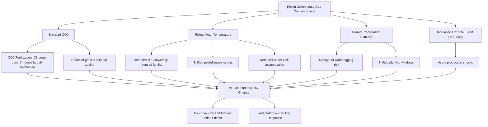

## Climate Change Impacts on Agriculture


### Overview

Climate change alters the physical, chemical, and biological conditions underpinning crop and livestock production through shifts in mean climate (temperature, precipitation, atmospheric CO₂) and changes in the frequency/intensity of extreme events. Impacts are heterogeneous across regions, crops, and adaptive capacity, producing both losses and, in some cases, localized gains.

**Key Points**

- Impacts operate through direct physiological pathways (heat stress, CO₂ fertilization) and indirect pathways (pest ranges, water availability, soil degradation, market disruption).
- Effects differ by latitude: mid-to-high latitude regions may see near-term yield benefits for some crops, while tropical and subtropical regions generally face net negative impacts.
- Adaptation and mitigation are distinct but interlinked response categories within agricultural policy and practice.

### Primary Climate Drivers Affecting Agriculture

| Driver | Mechanism | Agricultural Consequence |
| --- | --- | --- |
| Rising mean temperature | Accelerated phenological development, heat stress during sensitive stages | Shortened grain-fill period, reduced yield per unit time, forced shifts in cultivar zones |
| Elevated atmospheric CO₂ | Enhanced photosynthesis in C3 plants (CO₂ fertilization effect) | Yield increases in C3 crops (wheat, rice, soybean) under experimental conditions; limited effect in C4 crops (maize, sorghum, sugarcane) |
| Altered precipitation patterns | Changes in timing, intensity, and total seasonal rainfall | Shifted planting windows, increased drought or waterlogging risk |
| Increased frequency of extreme heat events | Heat stress during flowering/reproductive stages | Pollen sterility, reduced fruit/grain set |
| Sea level rise | Saline intrusion into coastal aquifers and soils | Loss of arable land, reduced yields in coastal deltaic agriculture |
| Changing frost/chill patterns | Reduced winter chilling in temperate zones; altered last-frost dates | Disrupted dormancy-break in fruit trees, false springs |
| Ocean warming and acidification | Altered marine productivity, coral/shellfish stress | Reduced fisheries and aquaculture yields |

### Physiological Mechanisms of Heat and CO₂ Effects

**Heat Stress on Reproductive Development**

Most staple grain crops have a critical temperature threshold during flowering beyond which pollen viability drops sharply. For example, sustained temperatures above approximately 35°C during anthesis in wheat, or above approximately 33–35°C during flowering in maize, substantially increase spikelet/kernel sterility. This reproductive-stage sensitivity often drives yield loss more than vegetative-stage heat exposure.

**CO₂ Fertilization Effect**

C3 plants (wheat, rice, soybean, most trees) show enhanced net photosynthesis under elevated CO₂ because Rubisco's carboxylation efficiency improves relative to its oxygenation (photorespiration) side reaction. C4 plants (maize, sorghum, sugarcane, millet) already concentrate CO₂ internally via the C4 pathway and show comparatively muted direct CO₂ response, though they may benefit indirectly through improved water-use efficiency (reduced stomatal conductance lowers transpirational water loss at a given CO₂ assimilation rate).

[Inference] Free-Air CO₂ Enrichment (FACE) field experiments have generally found smaller CO₂ fertilization benefits than earlier closed-chamber studies suggested, and the magnitude of realized benefit under field nutrient and water constraints remains an active research question rather than a fixed number.

**Nutritional Quality Effects**

Elevated CO₂ has been associated in multiple FACE studies with reduced grain protein, zinc, and iron concentrations in wheat and rice, an effect with direct implications for human nutrition security independent of total yield changes.

### Regional and Crop-Specific Impact Patterns

**Wheat**: Generally projected to face yield declines in already-warm, low-latitude wheat-growing regions (South Asia, parts of the Middle East), while some higher-latitude regions (parts of Northern Europe, Canada, Russia) may see extended growing seasons and potential yield gains, subject to water and pest constraints.

**Rice**: Nighttime (minimum) temperature increases have been specifically linked to rice yield reductions in multiple long-term field studies, independent of daytime maximum temperature effects, attributed to increased nighttime respiration consuming photosynthate.

**Maize**: Highly sensitive to both heat stress during silking and drought stress, given its C4 physiology's more limited direct CO₂ benefit; sub-Saharan Africa and parts of the U.S. Corn Belt are frequently identified as high-vulnerability zones in climate-yield modeling studies.

**Livestock**: Heat stress reduces feed intake, milk yield, reproductive performance (conception rates), and increases mortality risk in dairy cattle, poultry, and swine; the Temperature-Humidity Index (THI) is the standard metric used to quantify livestock heat stress risk.

**Fisheries and Aquaculture**: Ocean warming shifts fish stock distributions poleward and to greater depths; ocean acidification (from CO₂ absorption lowering ocean pH) impairs shell and skeleton formation in mollusks and some crustaceans.

### Standardized Impact Metrics

**Temperature-Humidity Index (THI) for Livestock**

$$THI = T_{db} - [(0.55 - 0.0055 \times RH)(T_{db} - 58)]$$

(Fahrenheit-based formulation; metric-unit variants also exist.) THI thresholds above approximately 72 are commonly associated with the onset of measurable heat stress in dairy cattle, with severity categories increasing above ~79 and ~90.

**Climate Suitability/Vulnerability Indices**: composite indices combining exposure (magnitude of climate change), sensitivity (crop/system physiological tolerance), and adaptive capacity (infrastructure, income, access to technology) are widely used in vulnerability assessments (e.g., IPCC AR6 agricultural chapters), following the standard exposure–sensitivity–adaptive-capacity framework.

### Indirect and Cascading Impacts

**Pest, Weed, and Disease Range Shifts**

Warming expands the geographic and altitudinal range of many insect pests and pathogens into previously unsuitable regions, and can increase the number of generations per season for multivoltine pests. Weeds, often possessing broader physiological tolerance than crops, may gain competitive advantage under elevated CO₂ and warming in some systems.

**Water Resource Stress**

Changes in snowpack accumulation and melt timing affect irrigation water availability in snowmelt-dependent basins; increased evaporative demand ($ET_0$) raises crop water requirements even where total precipitation is unchanged.

**Soil Degradation**

Increased rainfall intensity elevates erosion risk; more frequent drought-flood cycles can degrade soil structure and accelerate organic matter loss, particularly in already-degraded soils.

**Extreme Event Exposure**

Increased frequency/intensity of droughts, floods, tropical cyclones, and heatwaves creates acute production shocks superimposed on gradual mean-climate shifts, often with disproportionate impact on smallholder and rain-fed systems lacking risk-buffering infrastructure.

**Market and Food Security Effects**

Regional production shocks propagate through global commodity markets, affecting price volatility and food access, particularly for import-dependent and low-income regions.

### Impact Pathway Diagram



### Adaptation Strategies

**Agronomic Adaptation**

- Shifting planting dates to align crop-sensitive stages with more favorable temperature windows.
- Adopting heat- and drought-tolerant cultivars, including breeding for delayed senescence and improved reproductive-stage thermotolerance.
- Diversifying cropping systems and intercropping to spread climate risk.
- Adjusting irrigation scheduling based on updated $ET_0$/water-balance calculations (see Agrometeorology and weather monitoring).

**Breeding and Genetic Approaches**

- Marker-assisted selection and genomic selection for heat/drought tolerance traits.
- Introgression of wild relative germplasm carrying stress-tolerance alleles.
- [Inference] Gene-editing approaches (e.g., CRISPR-based modification of stomatal density or heat-shock protein regulation) are an active research area with promising early results, though widely deployed, field-validated commercial cultivars using these specific edits for climate stress tolerance remain limited as of current literature.

**Water Management Adaptation**

- Deficit irrigation and precision irrigation technologies to improve water-use efficiency under increased scarcity.
- Rainwater harvesting and managed aquifer recharge in rain-fed systems.
- Soil moisture conservation practices (mulching, conservation tillage, cover cropping).

**Livestock Adaptation**

- Shade structures, evaporative cooling, and modified housing ventilation to reduce THI exposure.
- Breeding for heat-tolerant breeds/crossbreds (e.g., Bos indicus genetics in tropical dairy systems).
- Adjusted feeding strategies and timing to reduce metabolic heat load during peak heat periods.

**Institutional and Policy Adaptation**

- Index-based (parametric) crop and livestock insurance triggered by weather thresholds rather than assessed losses.
- Early warning systems integrating seasonal climate forecasts with agromet advisories.
- Climate-smart agriculture (CSA) frameworks explicitly targeting the triple goal of productivity, adaptation, and mitigation simultaneously.

### Mitigation: Agriculture as an Emissions Source and Sink

Agriculture, forestry, and land use collectively account for a substantial share of global anthropogenic greenhouse gas emissions, primarily through:

- **Methane (CH₄)**: enteric fermentation in ruminant livestock, flooded rice paddies, manure management.
- **Nitrous oxide (N₂O)**: nitrogen fertilizer application and soil microbial nitrification/denitrification processes.
- **Carbon dioxide (CO₂)**: land-use change (deforestation for agricultural expansion), fossil fuel use in farm operations.

Mitigation practices include:

- Improved nitrogen use efficiency (precision fertilization, slow-release formulations, nitrification inhibitors) to reduce N₂O emissions.
- Alternate wetting and drying (AWD) in rice systems to reduce methane emissions from continuous flooding.
- Enteric methane mitigation via feed additives (e.g., 3-NOP, certain seaweed-derived compounds under active research) and improved feed digestibility.
- Soil carbon sequestration through reduced tillage, cover cropping, and agroforestry integration.
- Renewable energy adoption on-farm (solar irrigation pumps, biogas from manure).

### Example: Simple Yield Sensitivity Estimation

A simplified linear temperature-sensitivity approach commonly used in early-stage climate impact screening:

$$\Delta Yield (\%) = \beta \times \Delta T$$

Where $\beta$ is an empirically derived crop- and region-specific sensitivity coefficient (percentage yield change per °C), often negative for tropical staple crops near their thermal optimum.

```python
def estimate_yield_change(delta_t, sensitivity_coefficient):
    """
    delta_t: projected temperature change (°C)
    sensitivity_coefficient: % yield change per °C (crop/region specific,
    typically derived from historical regression or crop model ensembles)
    """
    return delta_t * sensitivity_coefficient

# Example: illustrative maize sensitivity coefficient of -7% per °C
# in a tropical low-latitude context (values vary widely by study/region)
projected_change = estimate_yield_change(delta_t=1.5, sensitivity_coefficient=-7)
print(f"Estimated yield change: {projected_change}%")
```

**Output**

`Estimated yield change: -10.5%`

[Unverified] The specific sensitivity coefficient used above is illustrative; actual coefficients vary substantially by crop, cultivar, baseline climate, management level, and study methodology, and should be sourced from region-specific crop model calibrations (e.g., DSSAT, APSIM outputs) rather than treated as a universal constant.

### Modeling Tools Used in Climate-Agriculture Impact Assessment

- **Process-based crop models**: DSSAT, APSIM, AquaCrop — simulate daily crop growth response to weather, soil, and management inputs, widely used for climate scenario impact projection.
- **Global gridded crop models**: part of the AgMIP (Agricultural Model Intercomparison and Improvement Project) framework, used to generate multi-model yield projection ensembles under different Shared Socioeconomic Pathway (SSP) and Representative Concentration Pathway (RCP) scenarios.
- **General Circulation Models / Earth System Models (GCMs/ESMs)**: provide the underlying climate projections (temperature, precipitation) that are downscaled and fed into crop models.
- **Statistical/econometric panel models**: relate historical yield-weather relationships to project future impacts, often used as a complement to process-based modeling.

### Limitations and Sources of Uncertainty

- Crop model projections carry compounding uncertainty from GCM structural differences, emission scenario choice, downscaling method, and crop model parameterization; multi-model ensembles are standard practice specifically to characterize this spread rather than to eliminate it.
- CO₂ fertilization benefits observed in controlled experiments may not fully translate to field conditions with nutrient, water, or pest constraints.
- Adaptive capacity varies enormously by region, income level, and institutional context, meaning biophysical impact projections alone do not determine realized socioeconomic outcomes.
- [Speculation] Long-term interactions between multiple simultaneous stressors (combined heat, drought, and elevated CO₂, plus pest pressure shifts) are less well quantified than single-factor experiments, and current models may not fully capture non-additive stress interaction effects.

**Related Topics**

- Agrometeorology and weather monitoring
- Climate-smart agriculture frameworks
- Drought and heat stress physiology in crops
- Crop simulation modeling (DSSAT, APSIM, AquaCrop)
- Index-based agricultural insurance
- Soil carbon sequestration practices
- Livestock heat stress management
- Water-use efficiency and deficit irrigation
- Plant breeding for abiotic stress tolerance
- Greenhouse gas mitigation in agriculture