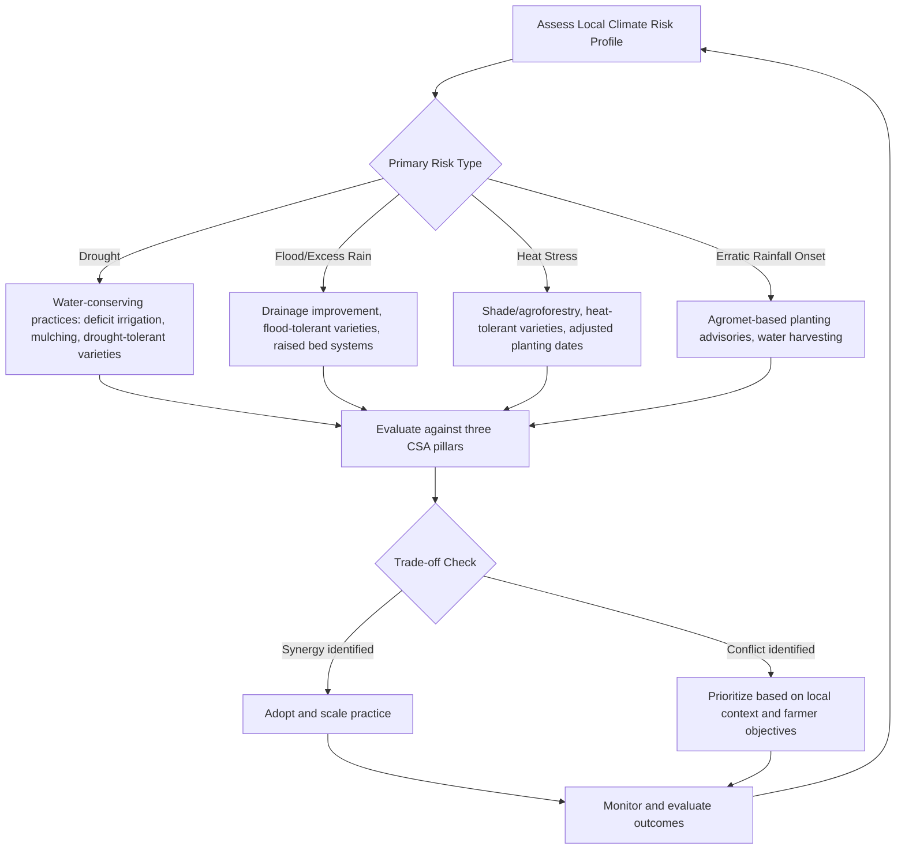

## Climate-Smart Agriculture Practices


### Definition and Framework

Climate-Smart Agriculture (CSA), a term formalized by the FAO in 2010, is an integrated approach to managing landscapes—cropland, livestock, forests, and fisheries—that addresses the interlinked challenges of food security and climate change. CSA is defined by three simultaneous pillars, distinguishing it from conventional sustainable agriculture approaches that may pursue only one or two of these goals in isolation.

**Key Points**

- The three CSA pillars are: (1) sustainably increasing agricultural productivity and incomes, (2) adapting and building resilience to climate change, and (3) reducing/removing greenhouse gas emissions where possible.
- CSA is not a fixed set of practices but a context-specific planning approach; a practice considered climate-smart in one agroecological zone may not be appropriate in another.
- Trade-offs and synergies between the three pillars must be explicitly evaluated, since practices optimizing one pillar can sometimes conflict with another.

### The Three CSA Pillars in Detail

**Pillar 1: Productivity**

Sustainable intensification—increasing output per unit of land, water, and input without expanding the agricultural frontier into natural ecosystems—is central. This includes efficient input use, improved varieties, and diversified income streams to strengthen farmer resilience.

**Pillar 2: Adaptation/Resilience**

Building the capacity of farming systems to absorb climate shocks (drought, flood, heat) and stresses (shifting seasons, new pest pressure) while maintaining function. Resilience is assessed both at the biophysical level (soil health, water buffering capacity) and the socioeconomic level (income diversification, access to credit and insurance).

**Pillar 3: Mitigation**

Reducing greenhouse gas emissions per unit of output (emission intensity) and/or increasing carbon sequestration in soils and biomass. Distinct from adaptation, since a practice can improve resilience without reducing emissions, or vice versa.

### CSA Practice Categories

| Category | Example Practices | Primary Pillar(s) Addressed |
| --- | --- | --- |
| Soil management | Conservation tillage, cover cropping, organic matter addition | Productivity, Mitigation |
| Water management | Drip/precision irrigation, rainwater harvesting, alternate wetting and drying (AWD) | Adaptation, Mitigation |
| Crop management | Stress-tolerant varieties, crop diversification, intercropping | Adaptation, Productivity |
| Agroforestry | Alley cropping, silvopasture, windbreaks | All three pillars |
| Livestock management | Improved feed digestibility, rotational grazing, methane-reducing feed additives | Mitigation, Productivity |
| Integrated systems | Integrated crop-livestock-fish systems, agro-silvopastoral systems | All three pillars |
| Nutrient management | Precision fertilization, nitrification inhibitors, integrated soil fertility management | Productivity, Mitigation |
| Post-harvest/energy | Solar-powered irrigation, improved storage reducing food loss | Mitigation, Productivity |

### Conservation Agriculture (CA)

Conservation agriculture is one of the most widely promoted CSA practice bundles, built on three interlinked principles that function synergistically:

1. **Minimal soil disturbance**: no-till or reduced-till systems, preserving soil structure and reducing oxidative loss of soil organic carbon.
2. **Permanent soil cover**: retaining crop residues or cover crops to reduce evaporation, suppress weeds, and protect against erosion.
3. **Crop rotation/diversification**: breaking pest and disease cycles and improving nutrient cycling relative to monoculture.

[Inference] Yield outcomes under no-till adoption are commonly reported as neutral-to-positive in moisture-limited environments over a multi-year transition period, but can show a short-term yield penalty in the initial 2–3 years post-conversion in some soil types before benefits from improved soil structure and water infiltration materialize; results are highly context- and soil-type dependent rather than universally positive.

### Agroforestry Systems

Integrating trees into crop and/or livestock systems provides multiple simultaneous CSA benefits:

- **Alley cropping**: rows of trees interspersed with annual crops, providing windbreak effects, leaf litter for soil fertility, and diversified income (timber, fruit, fodder).
- **Silvopasture**: integrating trees with livestock grazing, providing shade (reducing heat stress, addressed under Temperature-Humidity Index considerations), and additional forage/browse.
- **Windbreaks/shelterbelts**: reduce wind erosion, evapotranspiration rates in adjacent crop areas, and mechanical crop damage.
- Trees sequester atmospheric carbon in above- and below-ground biomass over their lifespan, contributing directly to the mitigation pillar while also diversifying farm income against single-crop climate risk.

### Water Management Practices

**Alternate Wetting and Drying (AWD) in Rice**

A water management technique where paddy fields are allowed to dry to a defined threshold (commonly monitored via a perforated field water tube, drying to approximately 15 cm below the soil surface) before re-flooding, rather than maintaining continuous flooding. This reduces methane emissions from anaerobic decomposition in permanently flooded soils while typically maintaining yield, and reduces irrigation water demand.

**Deficit and Precision Irrigation**

Deliberately applying less than full crop water requirement during drought-tolerant growth stages, guided by soil moisture monitoring and $ET_c$ calculations (see Agrometeorology and weather monitoring), to conserve water without proportional yield loss.

**Rainwater Harvesting**

Techniques ranging from simple contour bunds and terracing to more engineered farm ponds and check dams, capturing runoff for supplemental irrigation during dry spells, particularly valuable in rain-fed smallholder systems.

### Nutrient Management for Mitigation

**4R Nutrient Stewardship** framework—applying the **R**ight source, **R**ight rate, **R**ight time, **R**ight place—is a widely adopted principle for maximizing nitrogen use efficiency while minimizing N₂O emission losses from over-application or poorly timed fertilization.

**Nitrification Inhibitors**: compounds (e.g., DCD, DMPP) added to nitrogen fertilizers to slow the microbial conversion of ammonium to nitrate, reducing the window during which N₂O-producing denitrification can occur and improving nitrogen use efficiency.

**Integrated Soil Fertility Management (ISFM)**: combining organic amendments (compost, manure, crop residues) with judicious mineral fertilizer use, improving both soil organic carbon and nutrient use efficiency simultaneously.

### Livestock-Focused CSA Practices

- **Improved feed quality and digestibility**: higher-digestibility feed reduces enteric methane produced per unit of milk or meat output (reduced emission intensity), even when total herd-level emissions may not decrease.
- **Rotational/managed grazing**: improves pasture productivity and soil carbon accumulation relative to continuous overgrazing, while supporting resilience through better forage availability during dry periods.
- **Methane-reducing feed additives**: compounds such as 3-nitrooxypropanol (3-NOP) and certain seaweed-derived additives (e.g., *Asparagopsis* species) have shown substantial enteric methane reductions in trials. [Unverified] Commercial-scale, long-term field deployment data and regulatory approval status vary by country and are evolving; current adoption remains limited relative to the scale of research interest, and this is an active area worth confirming against current regulatory and market status.
- **Manure management**: covered lagoons with biogas capture convert a methane emission source into a renewable energy resource (biogas) while reducing direct atmospheric release.

### CSA Practice Selection Decision Flow



### Trade-offs and Synergy Considerations

CSA planning explicitly requires evaluating interactions between pillars, since practices are not universally win-win-win:

- **Synergy example**: Agroforestry commonly improves productivity (diversified products), adaptation (microclimate buffering), and mitigation (carbon sequestration) simultaneously.
- **Trade-off example**: Intensive irrigation expansion may improve productivity and short-term resilience to rainfall variability but can increase energy-related emissions (pumping) and deplete groundwater resources, undermining longer-term adaptive capacity.
- **Trade-off example**: Increased mineral nitrogen fertilizer use can boost short-term productivity but may increase N₂O emissions if not managed under 4R principles, working against the mitigation pillar.

[Inference] Because context specificity is central to CSA methodology, generic practice recommendations without local agroecological, socioeconomic, and institutional assessment risk producing suboptimal or even counterproductive outcomes; site-specific evaluation tools (e.g., FAO's CSA Prioritization Framework) are generally recommended over blanket practice transfer between regions.

### Institutional and Policy Support Mechanisms

- **Climate-Smart Villages**: a CGIAR-associated research-for-development model piloting and evaluating bundled CSA practices at community scale with participatory farmer involvement.
- **Index-based agricultural insurance**: parametric insurance products (e.g., rainfall-indexed or satellite-NDVI-indexed) that pay out based on measured weather/vegetation triggers rather than assessed on-farm loss, reducing the resilience gap for smallholders facing climate shocks.
- **Nationally Determined Contributions (NDCs)**: many countries include agricultural mitigation and adaptation targets within their UNFCCC climate commitments, creating policy-level demand for CSA practice scaling.
- **Carbon credit/payment-for-ecosystem-services schemes**: emerging markets compensating farmers for verified soil carbon sequestration or emission reduction practices, though methodological standardization and verification costs remain a practical adoption barrier in many contexts.

### Example: Simple CSA Practice Scoring Framework

A basic multi-criteria scoring approach used in participatory CSA prioritization exercises:

```python
def score_practice(practice_name, productivity, adaptation, mitigation, weights=(0.4, 0.4, 0.2)):
    """
    Scores range 1-5 per pillar (farmer/expert assessed).
    weights: (productivity_weight, adaptation_weight, mitigation_weight)
    Default weighting reflects common farmer prioritization of
    immediate productivity/resilience over mitigation co-benefits.
    """
    w_prod, w_adapt, w_mit = weights
    total_score = (productivity * w_prod) + (adaptation * w_adapt) + (mitigation * w_mit)
    return {"practice": practice_name, "composite_score": round(total_score, 2)}

practices = [
    score_practice("Alternate Wetting and Drying", productivity=4, adaptation=3, mitigation=5),
    score_practice("Agroforestry (alley cropping)", productivity=3, adaptation=5, mitigation=4),
    score_practice("Drip irrigation", productivity=5, adaptation=4, mitigation=2),
]

for p in practices:
    print(p)
```

**Output**



```
{'practice': 'Alternate Wetting and Drying', 'composite_score': 3.8}
{'practice': 'Agroforestry (alley cropping)', 'composite_score': 4.0}
{'practice': 'Drip irrigation', 'composite_score': 4.0}
```

[Unverified] The specific scores and weights in this example are illustrative for demonstrating the scoring methodology; actual CSA prioritization exercises should derive scores from local field trial data, farmer participatory assessment, and expert consultation rather than assumed values.

### Barriers to Adoption

- **Upfront cost and access to capital**: many CSA practices (drip irrigation infrastructure, improved seed, biogas digesters) require initial investment that smallholders may lack access to without credit or subsidy support.
- **Knowledge and extension gaps**: effective CSA implementation often requires locally-adapted technical knowledge not always available through conventional extension services.
- **Land tenure insecurity**: practices with delayed benefits (agroforestry, soil carbon building) are less attractive to farmers without secure long-term land tenure.
- **Measurement, Reporting, and Verification (MRV) costs**: for mitigation-linked incentive schemes (carbon markets), the cost of verifying emission reductions or sequestration at smallholder scale can be disproportionately high relative to potential payments.

### Limitations and Uncertainty

- Long-term soil carbon sequestration potential from practices like no-till and cover cropping varies substantially by soil type, climate, and baseline carbon stock, and can reach saturation over a multi-decade timeframe rather than continuing indefinitely.
- The realized emission reduction from many mitigation-focused CSA practices depends heavily on baseline management practices being displaced, making generalized global emission reduction estimates less reliable than site-specific measurement.
- [Speculation] The interaction between multiple simultaneously adopted CSA practices (e.g., combined agroforestry, AWD, and precision fertilization) is less thoroughly quantified in field trials than single-practice interventions, and cumulative synergy or interference effects across practice bundles remain an area of ongoing research.

**Related Topics**

- Agrometeorology and weather monitoring
- Climate change impacts on agriculture
- Conservation tillage and soil health management
- Agroforestry system design
- Index-based agricultural insurance
- Integrated soil fertility management
- Enteric methane mitigation in livestock
- Soil organic carbon sequestration measurement
- Precision irrigation technologies
- Carbon credit and payment-for-ecosystem-services schemes