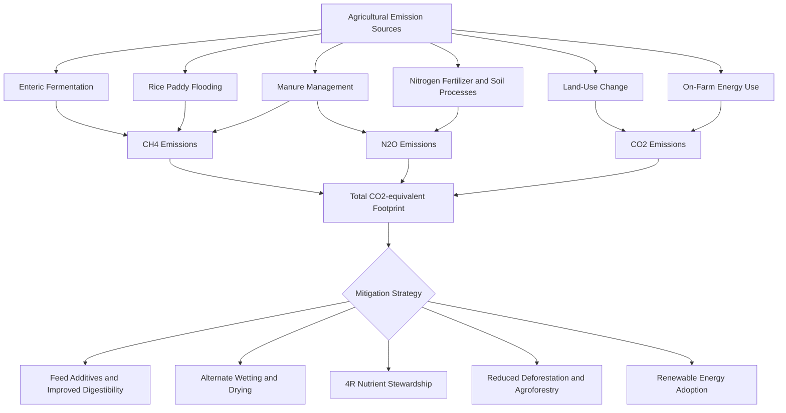

## Greenhouse Gas Emissions from Farming


### Overview

Agriculture is both a significant source of anthropogenic greenhouse gas (GHG) emissions and a sector with substantial technical mitigation potential. Emissions arise from biological processes (enteric fermentation, soil microbial activity, manure decomposition), land-use change, and energy use in farm operations. Quantifying and attributing these emissions accurately is foundational to designing effective mitigation and climate-smart agriculture strategies.

**Key Points**

- Agriculture, forestry, and other land use (AFOLU) collectively account for a substantial share of global anthropogenic GHG emissions, commonly cited in the range of roughly 13–21% depending on methodology, land-use change inclusion, and reporting year.
- The three primary agricultural GHGs are methane ($CH_4$), nitrous oxide ($N_2O$), and carbon dioxide ($CO_2$), each with distinct sources and radiative properties.
- Emission intensity (emissions per unit of output) is often a more actionable mitigation target than absolute emissions, since it can be reduced while production continues to meet growing food demand.

### The Three Primary Agricultural Greenhouse Gases

| Gas | Global Warming Potential (100-yr, AR5/AR6) | Primary Agricultural Sources |
| --- | --- | --- |
| Carbon dioxide ($CO_2$) | 1 (reference) | Land-use change/deforestation, fossil fuel combustion in farm machinery, lime application to soils |
| Methane ($CH_4$) | ~28–30 (AR5); ~27–30 non-fossil (AR6) | Enteric fermentation in ruminants, flooded rice paddies, manure management (anaerobic storage) |
| Nitrous oxide ($N_2O$) | ~265–298 (AR5/AR6) | Nitrogen fertilizer application, soil nitrification/denitrification, manure nitrogen, crop residue decomposition |

[Inference] Global Warming Potential values are periodically revised between IPCC assessment reports as atmospheric chemistry understanding improves; the ranges above reflect commonly cited AR5/AR6 figures, and readers should confirm the specific value against the most current IPCC assessment report when precision matters for formal reporting or policy work.

### Methane ($CH_4$) Sources in Detail

**Enteric Fermentation**

The largest single agricultural methane source globally. Ruminant livestock (cattle, sheep, goats, buffalo) host methanogenic archaea in the rumen that ferment complex carbohydrates anaerobically, producing methane as a metabolic byproduct that is primarily eructated (belched) rather than emitted from the other end, contrary to common public perception. Methane yield varies with diet composition, feed digestibility, and animal genetics.

**Rice Cultivation**

Continuously flooded paddy soils create anaerobic conditions in which methanogenic bacteria decompose organic matter, releasing methane that diffuses through the rice plant's aerenchyma tissue and via ebullition (bubbling) to the atmosphere. Emission rates are strongly influenced by water management regime, organic amendment type, and soil redox conditions.

**Manure Management**

Anaerobic decomposition of manure in lagoons, slurry pits, or deep-litter systems generates methane; the emission factor depends heavily on storage method, temperature, and duration, with liquid/slurry systems in warm climates generally producing substantially higher methane yields than dry, aerated manure handling.

### Nitrous Oxide ($N_2O$) Sources in Detail

**Direct Soil Emissions**

Occur through two competing microbial pathways:

- **Nitrification**: aerobic oxidation of ammonium ($NH_4^+$) to nitrate ($NO_3^-$), which can produce $N_2O$ as an incomplete byproduct.
- **Denitrification**: anaerobic microbial reduction of nitrate to nitrogen gas, with $N_2O$ produced as an intermediate step, particularly under conditions of restricted oxygen (waterlogged or compacted soils).

Emissions are strongly nonlinear with fertilizer application rate, tend to spike after rainfall or irrigation events following fertilization, and vary with soil temperature, pH, and moisture.

**Indirect Emissions**

$N_2O$ also arises indirectly from: (1) volatilized ammonia and $NO_x$ that redeposit and undergo nitrification/denitrification elsewhere, and (2) nitrate leaching into groundwater and surface water systems where it can subsequently be denitrified.

**IPCC Default Emission Factor Approach**

The IPCC Tier 1 methodology applies a default emission factor (historically approximately 1% of applied nitrogen converted to direct $N_2O$-N, subject to periodic revision) to estimate national inventory emissions from synthetic and organic nitrogen inputs, while Tier 2/3 methods use country- or site-specific factors and process-based models for greater accuracy.

### Carbon Dioxide ($CO_2$) Sources in Detail

**Land-Use Change**

Conversion of forest, grassland, or wetland to cropland releases substantial stored carbon, both immediately (biomass burning/decomposition) and over subsequent years (soil organic carbon oxidation following tillage and disturbance). This is often the single largest CO₂ source associated with agricultural expansion, particularly in tropical deforestation frontiers.

**Soil Organic Carbon Loss**

Tillage disturbs soil aggregates, exposing previously protected organic matter to microbial decomposition and oxidation, releasing stored carbon as CO₂; this process can continue for years to decades following land conversion before reaching a new equilibrium.

**On-Farm Energy Use**

Fossil fuel combustion in tractors, irrigation pumps, grain dryers, and greenhouse heating, plus indirect emissions embedded in fertilizer manufacturing (particularly nitrogen fertilizer, which is energy-intensive to produce via the Haber-Bosch process) and pesticide production.

**Liming**

Application of agricultural lime (calcium carbonate) to correct soil acidity releases $CO_2$ through a carbonate dissolution reaction, a smaller but internationally inventoried source category.

### Emissions Accounting Frameworks

**IPCC National Greenhouse Gas Inventory Guidelines**

The standard international framework (currently the 2006 IPCC Guidelines with a 2019 Refinement) structures agricultural emissions reporting under the AFOLU sector, using tiered methodological approaches:

- **Tier 1**: default emission factors and simplified activity data, lowest data requirement, lowest precision.
- **Tier 2**: country-specific emission factors reflecting local management and climate conditions.
- **Tier 3**: process-based models or direct measurement, highest data requirement, highest precision, typically reserved for major emission source categories within a country's inventory.

**Life Cycle Assessment (LCA)**

A methodology quantifying emissions across a product's full value chain (cradle-to-gate or cradle-to-grave), commonly expressed as $CO_2$-equivalent per unit of product (e.g., kg $CO_2e$ per kg of milk, per kg of liveweight gain, or per kg of grain), enabling comparison of emission intensity across production systems and supply chains.

### Emission Pathway Diagram



### Quantification Example: Simple Farm-Level GHG Estimate

Illustrating a basic Tier 1-style calculation combining enteric fermentation and fertilizer-derived $N_2O$:

```python
def estimate_enteric_ch4(num_cattle, ch4_per_head_kg_yr=70):
    """
    ch4_per_head_kg_yr: IPCC Tier 1 default varies by region/production system
    (dairy vs. beef, feed quality); ~70 kg/head/yr is an illustrative
    mid-range figure for reference only.
    """
    total_ch4_kg = num_cattle * ch4_per_head_kg_yr
    gwp_ch4 = 28  # AR5 100-yr GWP, non-fossil methane
    return total_ch4_kg * gwp_ch4  # kg CO2-equivalent

def estimate_fertilizer_n2o(n_applied_kg, ef1=0.01):
    """
    ef1: IPCC Tier 1 default direct emission factor
    (fraction of applied N emitted as N2O-N); subject to periodic revision.
    """
    n2o_n_kg = n_applied_kg * ef1
    n2o_kg = n2o_n_kg * (44/28)  # convert N2O-N to N2O mass
    gwp_n2o = 265  # AR5 100-yr GWP
    return n2o_kg * gwp_n2o  # kg CO2-equivalent

enteric_co2e = estimate_enteric_ch4(num_cattle=50)
fertilizer_co2e = estimate_fertilizer_n2o(n_applied_kg=2000)

total_co2e = enteric_co2e + fertilizer_co2e
print(f"Enteric CH4: {enteric_co2e:.0f} kg CO2e")
print(f"Fertilizer N2O: {fertilizer_co2e:.0f} kg CO2e")
print(f"Total: {total_co2e:.0f} kg CO2e/year")
```

**Output**



```
Enteric CH4: 98000 kg CO2e
Fertilizer N2O: 12386 kg CO2e
Total: 110386 kg CO2e/year
```

[Unverified] The emission factors used above (70 kg CH₄/head/yr, 1% N₂O-N conversion) are simplified Tier 1-style illustrative defaults; actual farm-level assessments should use Tier 2/3 country- or system-specific factors, since default factors can substantially over- or under-estimate actual emissions for a specific production system, diet, or climate.

### Mitigation Strategies by Gas

**Methane Mitigation**

- Enteric: improved feed digestibility, methane-reducing feed additives (3-NOP, certain seaweed-derived compounds under active research and regulatory review), genetic selection for lower methane-yield animals, optimized herd management to reduce unproductive animal-days.
- Rice: Alternate Wetting and Drying (AWD), mid-season drainage, selection of shorter-duration or methane-lower-emitting rice cultivars, residue management avoiding fresh organic matter incorporation before flooding.
- Manure: anaerobic digesters capturing methane as biogas for energy use, solid-liquid separation, covered storage with flaring or capture systems.

**Nitrous Oxide Mitigation**

- 4R Nutrient Stewardship (Right source, Right rate, Right time, Right place) to minimize surplus nitrogen availability for microbial conversion.
- Nitrification inhibitors (e.g., DCD, DMPP) and slow/controlled-release fertilizer formulations.
- Precision agriculture technologies (variable-rate application, soil/tissue testing-guided fertilization) to match nitrogen supply to crop demand more precisely.
- Cover cropping and improved crop rotation to reduce fallow-period nitrate accumulation vulnerable to loss.

**Carbon Dioxide Mitigation**

- Halting deforestation and agricultural expansion into forested/high-carbon-stock land.
- Conservation tillage/no-till to reduce soil organic carbon oxidation.
- Agroforestry and afforestation integrated into farming systems for biomass carbon sequestration.
- On-farm renewable energy adoption (solar-powered irrigation pumps, biogas-fueled equipment) to displace fossil fuel use.
- Improved nitrogen fertilizer manufacturing efficiency and reduced over-application, indirectly lowering embedded emissions.

### Measurement and Monitoring Approaches

**Chamber-Based Flux Measurement**

Static or dynamic chambers placed over soil or plant surfaces measure gas concentration change over time, from which flux rates are calculated; widely used in research settings for $N_2O$ and $CH_4$ flux quantification but labor-intensive for continuous farm-scale monitoring.

**Eddy Covariance Towers**

Micrometeorological technique measuring net ecosystem gas exchange over a field footprint using high-frequency wind and gas concentration sensors, providing continuous flux data without disturbing the measured surface, though requiring substantial capital investment and technical expertise.

**Remote Sensing and Satellite Monitoring**

Emerging satellite missions (e.g., methane-detecting instruments on various Earth observation satellites) increasingly enable detection of large point-source methane emissions, though [Inference] current satellite resolution and detection thresholds are generally better suited to identifying large concentrated sources (e.g., large feedlots, major leaks) than the diffuse, spatially distributed emissions typical of most cropland and pastoral systems.

**Digital MRV (Measurement, Reporting, Verification) Platforms**

Software platforms combining farm activity data, remote sensing, and process-based emission models to estimate farm-level GHG footprints for carbon credit programs and supply chain sustainability reporting, an area of active commercial development given growing corporate and regulatory demand for verified agricultural emissions data.

### Limitations and Uncertainty Sources

- Default (Tier 1) emission factors can carry substantial uncertainty ranges, sometimes exceeding ±50%, when applied outside the conditions from which they were originally derived.
- Soil $N_2O$ flux is highly spatially and temporally variable (often described as occurring in unpredictable "hot moments" following rainfall/fertilization on "hot spots" of favorable soil conditions), making representative field-scale measurement genuinely challenging.
- Attribution of land-use change emissions to specific agricultural commodities involves methodological choices (e.g., how to allocate historical deforestation to current production) that can vary between studies and datasets.
- [Speculation] The net climate effect of some methane-reduction feed additives over full life-cycle and long-term herd-level adoption, including potential feed-conversion or animal-health interaction effects, is still being established through ongoing field-scale trials beyond the initial controlled studies.

**Related Topics**

- Climate-smart agriculture practices
- Climate change impacts on agriculture
- Enteric methane mitigation and feed additives
- Alternate Wetting and Drying in rice systems
- 4R Nutrient Stewardship and precision fertilization
- Soil organic carbon sequestration
- Life Cycle Assessment methodology in agriculture
- Carbon credit and payment-for-ecosystem-services schemes
- Agroforestry and land-use change
- Digital MRV platforms for agricultural emissions