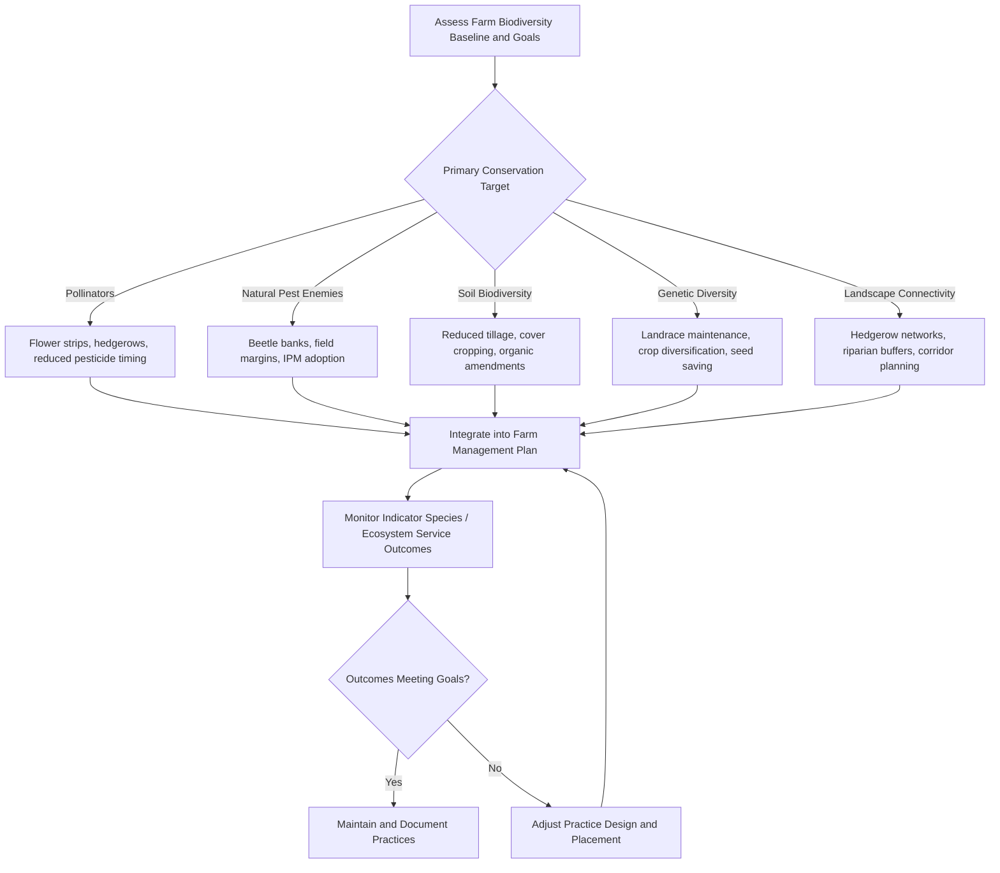

## Biodiversity Conservation on Farms


### Overview

Agricultural biodiversity conservation encompasses the management practices, landscape design principles, and policy mechanisms that maintain and enhance species diversity, genetic diversity, and ecosystem function within and around farming systems. This spans wild biodiversity (pollinators, natural pest predators, soil organisms, non-crop flora and fauna) and agricultural biodiversity proper (crop genetic diversity, livestock breed diversity), both of which underpin long-term agricultural resilience and ecosystem service provision.

**Key Points**

- Biodiversity conservation on farms operates at multiple scales: within-field (soil biota, beneficial insects), field-margin/farm-scale (hedgerows, buffer strips), and landscape scale (habitat connectivity, land-sparing vs. land-sharing configurations).
- Biodiversity underpins critical ecosystem services to agriculture itself, including pollination, natural pest regulation, soil fertility maintenance, and water regulation—conservation is not solely an externality-offsetting activity but has direct production co-benefits.
- Trade-offs exist between production intensification and biodiversity outcomes, though well-designed integrated systems can reduce this trade-off substantially compared to conventional intensification.

### Categories of Agricultural Biodiversity

| Category | Examples | Primary Ecosystem Service |
| --- | --- | --- |
| Pollinators | Wild bees, honeybees, butterflies, hoverflies, bats | Crop pollination (estimated to affect a substantial share of global food crop volume) |
| Natural enemies of pests | Parasitoid wasps, ladybird beetles, spiders, predatory ground beetles, insectivorous birds/bats | Biological pest control |
| Soil biota | Earthworms, mycorrhizal fungi, nitrogen-fixing bacteria, soil arthropods | Nutrient cycling, soil structure, disease suppression |
| Crop genetic diversity | Landraces, crop wild relatives, heirloom varieties | Breeding resource for stress tolerance, disease resistance |
| Livestock breed diversity | Local/indigenous breeds adapted to regional climate and disease pressure | Genetic resource for resilience, adaptation to local conditions |
| Non-crop flora | Hedgerow plants, cover crop species, field margin vegetation | Habitat provision, erosion control, nutrient retention |
| Aquatic/wetland biodiversity | Fish, amphibians, aquatic invertebrates in farm ponds/rice paddies | Integrated aquaculture, natural pest control (e.g., mosquito larvae predation) |

### Ecosystem Services Provided by On-Farm Biodiversity

**Pollination Services**

A substantial proportion of global crop species (particularly fruits, vegetables, and some oilseeds) depend to varying degrees on animal pollination for yield and quality. Wild pollinator diversity has been associated in multiple studies with more stable and sometimes higher pollination service delivery than reliance on managed honeybees alone, since different pollinator species have complementary foraging behaviors, active periods, and weather tolerances.

**Natural Pest Regulation (Conservation Biological Control)**

Maintaining habitat for natural enemies of crop pests—through field margins, beetle banks, flowering strips providing nectar/pollen resources for adult parasitoids, and reduced broad-spectrum pesticide use—can suppress pest populations below economically damaging thresholds, reducing reliance on chemical control inputs.

**Soil Biodiversity and Fertility**

Soil organisms drive decomposition, nutrient mineralization, and soil structure formation. Mycorrhizal fungal networks extend root nutrient/water uptake capacity; earthworm activity improves soil aeration, water infiltration, and organic matter incorporation; diverse soil microbial communities are increasingly linked to disease suppression through competitive exclusion of soil-borne pathogens.

**Genetic Resources for Breeding**

Crop wild relatives and traditional landraces represent reservoirs of genetic diversity for traits such as drought tolerance, disease resistance, and pest resistance that may have been narrowed in modern high-yielding cultivars through selective breeding; ex-situ (gene banks) and in-situ (on-farm landrace maintenance) conservation both serve as insurance against future breeding needs.

### On-Farm Habitat Management Practices

**Hedgerows and Field Margins**

Strips of woody and herbaceous vegetation along field boundaries provide nesting habitat, overwintering sites, and floral resources for pollinators and natural enemies, while also contributing to erosion control, windbreak function, and habitat connectivity across the landscape.

**Beetle Banks**

Raised, vegetated strips (typically grass tussock species) running through or bordering fields, providing overwintering habitat for ground-dwelling predatory beetles that emerge in spring to prey on crop pests.

**Flower Strips / Pollinator Habitat Plantings**

Sown strips of nectar- and pollen-rich flowering species positioned within or adjacent to crop fields, timed to bloom sequentially across the season to provide continuous forage resources for pollinators and beneficial insects.

**Cover Cropping**

Beyond soil health benefits, cover crops (particularly diverse multi-species mixes) provide habitat structure and floral resources during periods when cash crops offer little support, and can host beneficial arthropod populations that migrate into adjacent cash crops.

**Riparian Buffer Strips**

Vegetated zones maintained along waterways adjacent to farmland, filtering agricultural runoff (sediment, nutrients, pesticides) before it reaches water bodies while providing habitat corridors and supporting aquatic biodiversity.

**Reduced Pesticide Use / Integrated Pest Management (IPM)**

Minimizing broad-spectrum insecticide applications, using selective/targeted products, and timing applications to avoid pollinator activity periods reduces non-target mortality of beneficial organisms, directly supporting the natural enemy and pollinator communities that provide pest control and pollination services.

### Landscape-Scale Approaches

**Land Sparing vs. Land Sharing**

Two contrasting conceptual strategies for reconciling production and conservation goals:

- **Land sparing**: concentrating agricultural intensification on a smaller land area to free up other land for strict conservation/wild habitat.
- **Land sharing**: integrating biodiversity-friendly practices within the working agricultural landscape itself (lower-intensity, wildlife-compatible farming across a larger area).

[Inference] Empirical land-sparing/land-sharing research generally suggests the optimal strategy varies by taxonomic group and region; species highly sensitive to any agricultural disturbance often benefit more from land sparing, while species tolerant of moderate disturbance can benefit more from land sharing, meaning a universal prescription is not well supported by the literature.

**Habitat Connectivity and Corridors**

Fragmented habitat patches support smaller, more isolated populations vulnerable to local extinction; maintaining or restoring corridors (hedgerow networks, riparian strips, uncultivated field margins linked across a landscape) supports species movement, gene flow, and metapopulation resilience.

**Agroecological Landscape Design**

Deliberately structuring the spatial arrangement of crops, non-crop habitat, and semi-natural elements at the landscape level to maximize both production and biodiversity/ecosystem service outcomes, often guided by principles from landscape ecology.

### Integrated Production Systems Supporting Biodiversity

**Agroforestry**

Tree integration (see Climate-Smart Agriculture Practices) provides vertical habitat structure absent in monoculture annual cropping, supporting bird, insect, and mammal diversity while delivering the climate and productivity co-benefits discussed elsewhere.

**Integrated Rice-Fish/Rice-Duck Systems**

Combining rice cultivation with fish or duck integration in paddies supports aquatic biodiversity, provides natural pest control (fish/ducks consuming insect pests and weeds), and can reduce reliance on synthetic pesticide and herbicide inputs.

**Silvopasture and Rotational Grazing**

Well-managed rotational grazing systems that allow adequate pasture rest periods can support greater plant species diversity and associated invertebrate/bird diversity compared to continuous, uniform grazing pressure.

**Polyculture and Crop Diversification**

Diversified cropping systems (intercropping, multi-species rotations) generally support greater associated biodiversity than monocultures by providing varied habitat structure, resource availability, and reduced pest/disease buildup associated with continuous single-crop cultivation.

### On-Farm Biodiversity Management Decision Flow



### Monitoring and Assessment Methods

**Indicator Species Monitoring**

Tracking presence/abundance of selected indicator taxa (e.g., pollinator counts via transect walks or pan traps, ground beetle pitfall trapping, earthworm counts via soil sampling) as proxies for broader ecosystem health, since comprehensive full-biodiversity surveys are typically impractical at farm scale.

**Environmental DNA (eDNA) Sampling**

An increasingly used technique analyzing DNA traces in soil or water samples to detect species presence without direct observation or trapping, enabling more comprehensive biodiversity assessment with lower field labor requirements than traditional survey methods. [Inference] eDNA-based farm biodiversity monitoring is a rapidly developing methodology; specific protocols, detection sensitivity, and cost-effectiveness continue to be refined, and practitioners should consult current literature for the most reliable current application guidance for on-farm contexts.

**Remote Sensing for Habitat Mapping**

Satellite and drone-based imagery can map field margin extent, hedgerow density, and land-cover heterogeneity across a farm or landscape, supporting habitat connectivity assessment and change detection over time.

**Farm Biodiversity Assessment Tools**

Various standardized on-farm biodiversity assessment frameworks and certification schemes (e.g., components within some sustainability certification standards) provide structured scorecards evaluating habitat presence, management practices, and species indicators to benchmark farm-level biodiversity performance.

### Policy and Incentive Mechanisms

**Agri-Environment Schemes**

Government payment programs (prominent in the EU Common Agricultural Policy and similar schemes elsewhere) compensating farmers for adopting biodiversity-supporting practices (hedgerow maintenance, reduced input use, habitat set-asides) that may not be immediately profit-maximizing under conventional production economics alone.

**Certification and Market-Based Incentives**

Sustainability certification schemes (various organic, biodiversity-specific, and integrated sustainability standards) can create market premiums or access incentives for biodiversity-supporting practices, translating conservation outcomes into economic value for producers.

**Payments for Ecosystem Services (PES)**

Direct compensation mechanisms for farmers maintaining or restoring biodiversity-supporting habitat, analogous to carbon credit schemes but targeting biodiversity or water quality outcomes specifically.

**Seed Bank and Genetic Resource Conservation Programs**

International and national gene bank networks (e.g., international agricultural research center collections, national plant genetic resource programs) conserve crop genetic diversity ex-situ, complementing on-farm in-situ conservation of landraces by traditional and smallholder farming communities.

### Example: Simple Pollinator Habitat Planning Calculation

A basic approach used in participatory farm planning to estimate flower strip area needed for target pollinator forage provision:

```python
def estimate_flower_strip_area(total_farm_area_ha, target_percentage=0.05):
    """
    target_percentage: commonly cited starting guideline in various
    agri-environment scheme designs is in the range of 3-7% of farm area
    dedicated to pollinator/biodiversity habitat, though specific
    targets vary by scheme, region, and crop pollination dependency.
    """
    strip_area_ha = total_farm_area_ha * target_percentage
    return strip_area_ha

farm_area = 50  # hectares
strip_area = estimate_flower_strip_area(farm_area, target_percentage=0.05)
print(f"Recommended flower strip/habitat area: {strip_area} ha")
```

**Output**

`Recommended flower strip/habitat area: 2.5 ha`

[Unverified] The 5% target percentage used above is an illustrative mid-range figure drawn from commonly cited agri-environment scheme guidelines; actual recommended habitat area proportions vary by region, scheme, crop type, and specific conservation objective, and should be confirmed against local agricultural extension or scheme guidance rather than treated as a fixed universal standard.

### Trade-offs and Practical Considerations

- **Land opportunity cost**: dedicating farmland to non-crop habitat (field margins, flower strips) removes that area from direct production, representing a real short-term cost that must be weighed against ecosystem service benefits and any available incentive payments.
- **Pest habitat risk**: some habitat features intended to support beneficial organisms can, if poorly designed or placed, also harbor crop pests or weed seed banks; species selection and placement design matter significantly to outcomes.
- **Scale mismatch**: individual farm-level biodiversity actions may have limited impact if not coordinated at a landscape scale with neighboring farms, since many mobile species (pollinators, birds) operate across property boundaries.
- **Establishment and maintenance costs**: perennial habitat features (hedgerows, riparian buffers) often involve multi-year establishment periods and ongoing maintenance labor/cost before full ecosystem service benefits are realized.

### Limitations and Uncertainty

- The magnitude of yield benefit from enhanced natural pest control or pollination services is highly context-dependent (crop type, surrounding landscape composition, pest/pollinator community present) and does not translate into a universal quantitative benefit applicable across all farm settings.
- Long-term population-level biodiversity outcomes from farm-scale interventions are harder to attribute definitively than short-term indicator species counts, given natural population variability and the influence of landscape-scale factors beyond a single farm's control.
- [Speculation] The relative cost-effectiveness of land-sparing versus land-sharing strategies for a given region's overall biodiversity outcome remains a genuinely debated question in the conservation science literature, and context-specific research rather than general principle should inform actual land-use policy decisions.

**Related Topics**

- Climate-smart agriculture practices
- Integrated Pest Management (IPM)
- Agroforestry system design
- Soil health and soil biota management
- Crop genetic diversity and landrace conservation
- Pollinator ecology and conservation biological control
- Payments for Ecosystem Services (PES) schemes
- Agri-environment scheme policy design
- Riparian buffer and water quality management
- Landscape ecology in agricultural systems