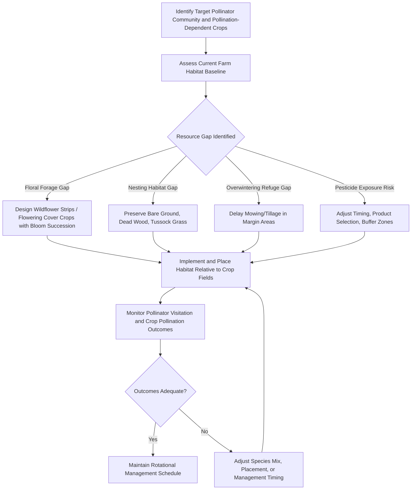

## Pollinator Habitat Management

### Overview

Pollinator habitat management encompasses the deliberate design, establishment, and maintenance of on-farm and landscape features that provide the forage, nesting, and overwintering resources pollinating insects and other animals require to sustain populations capable of delivering reliable crop pollination services. This is a more specific, practice-focused discipline building on the broader biodiversity conservation principles covered under Biodiversity Conservation on Farms.

**Key Points**

- Effective pollinator habitat addresses three core resource needs simultaneously: floral forage (nectar/pollen), nesting/reproductive sites, and overwintering refugia—habitat lacking any one element will support pollinators only partially.
- Different pollinator taxa (managed honeybees, wild bees, butterflies, hoverflies, moths, bats) have distinct habitat requirements, foraging ranges, and seasonal activity windows, so habitat design should target the specific pollinator community relevant to the crops being pollinated.
- Habitat placement, timing of floral bloom, and pesticide exposure management are as important as habitat area in determining conservation and pollination-service outcomes.

### Pollinator Taxa and Their Habitat Requirements

| Pollinator Group | Nesting Habitat | Foraging Range | Key Management Consideration |
| --- | --- | --- | --- |
| Wild solitary bees (majority of bee species) | Bare/sparse ground (ground-nesting, ~70% of species), pithy stems, dead wood cavities (cavity-nesting) | Typically a few hundred meters, varies by body size | Preserve undisturbed bare soil patches and standing dead wood/stems |
| Bumblebees | Abandoned rodent burrows, dense grass tussocks, cavities under vegetation | Up to 1–2 km, larger than most solitary bees | Maintain undisturbed grassy/tussocky field margins |
| Managed honeybees | Hive-provided (beekeeper managed) | 2–5 km typical foraging radius | Season-long floral succession to support colony nutrition |
| Butterflies and moths | Larval host plants (often species-specific) | Variable, often more localized than bees | Provide both larval host plants and adult nectar sources |
| Hoverflies | Varies by species; larvae often aquatic/semi-aquatic or in decaying organic matter | Generally more mobile, some migratory | Maintain wetland/moist margin habitat alongside flowering strips |
| Bats (in regions with bat-pollinated crops) | Tree cavities, caves, structures | Several km | Preserve roosting trees/structures near pollinated crops |

### Core Habitat Components

**Floral Resource Provision**

The single most emphasized and most tractable intervention in most pollinator habitat programs. Design principles include:

- **Species diversity**: mixing multiple flowering plant species with different flower morphologies (open, tubular) to serve pollinators with different tongue lengths and foraging behaviors.
- **Bloom succession**: selecting species that collectively provide continuous bloom across the full pollinator active season, avoiding gaps (particularly early spring and late summer/fall "hungry gaps" when forage is often scarce in intensively managed agricultural landscapes).
- **Native vs. non-native species**: native plant species are generally preferred where locally-adapted pollinator communities have co-evolved relationships with them, though well-chosen non-invasive non-native species can supplement forage availability, particularly during gap periods.

**Nesting Habitat**

- **Ground-nesting bee habitat**: bare or sparsely vegetated, well-drained soil patches, south-facing slopes where relevant for thermal preference, left undisturbed by tillage.
- **Cavity-nesting bee habitat**: standing dead wood, pithy-stemmed plants (e.g., bramble, elder) left uncut over winter, artificial nest structures ("bee hotels") as a supplementary measure.
- **Bumblebee nesting habitat**: rough, tussocky grassland margins and hedge bases providing insulated cavities.

**Overwintering Refugia**

Many pollinators overwinter as adults, larvae, pupae, or eggs in leaf litter, hollow plant stems, bunch grasses, or just below the soil surface; delayed autumn mowing/cutting and reduced fall tillage in margin areas preserve these overwintering sites through the dormant season.

### Habitat Feature Types for Farm Implementation

**Wildflower/Pollinator Strips**

Sown linear or block plantings of nectar- and pollen-rich species positioned along field edges, within field margins, or as in-field strips in larger fields. Design considerations include seed mix selection for regional adaptation and bloom succession, strip width (wider strips generally support more stable pollinator populations than narrow strips, though even narrow strips provide meaningful benefit), and multi-year establishment planning since many perennial wildflower mixes take 2–3 years to reach full flowering potential.

**Hedgerows**

Beyond the broader biodiversity and windbreak functions described in Biodiversity Conservation on Farms, hedgerows with flowering woody species (e.g., willow for early-season forage, bramble, hawthorn) provide critical early and late-season forage when herbaceous flower strips may not yet be blooming.

**Cover Crop Flowering Species**

Incorporating flowering species (e.g., phacelia, buckwheat, clover, mustards) into cover crop mixes provides substantial forage during the cover crop period while delivering the soil health benefits covered under Climate-Smart Agriculture Practices; timing termination to allow at least partial bloom before incorporation increases the pollinator benefit.

**Hedgerow/Margin Timing Management**

Delayed mowing schedules (avoiding cutting during peak bloom and peak larval development periods) and rotational mowing (cutting only a portion of margin habitat at a time) maintain continuous forage and refuge availability rather than removing all habitat simultaneously.

**Bee Hotels / Artificial Nest Structures**

Constructed nesting substrates (bundled hollow stems, drilled wood blocks) targeting cavity-nesting solitary bee species; function as a supplementary habitat element rather than a substitute for natural nesting habitat, and require periodic maintenance/replacement to avoid disease or parasite buildup.

**Farm Ponds and Wet Margins**

Support hoverfly larval habitat and provide water sources for pollinators, particularly valuable during hot/dry periods when foraging bees require water for hive thermoregulation (honeybees) or personal hydration.

### Landscape-Scale Habitat Placement Principles

**Foraging Range Matching**

Because different pollinator taxa forage across different distances, habitat placement density should reflect the foraging range of target species; solitary bees with short foraging ranges benefit more from densely distributed small habitat patches across a landscape than from a single large distant patch, whereas bumblebees and honeybees can access more widely spaced larger patches.

**Connectivity Between Habitat Patches**

Linking habitat features (hedgerow networks connecting flower strips and margin habitat) supports pollinator movement between patches, reducing population isolation, consistent with the connectivity principles discussed in the broader biodiversity conservation context.

**Proximity to Pollination-Dependent Crops**

Habitat placed directly adjacent to or interspersed within pollinator-dependent crop fields generally delivers greater pollination service benefit than distant habitat, since pollination service delivery typically declines with distance from nesting/forage habitat into crop field interiors.

### Pesticide Exposure Management

**Application Timing**

Avoiding insecticide application during crop bloom periods and during peak daily pollinator foraging activity (typically midday) substantially reduces direct exposure risk.

**Product Selection**

Selecting pollinator-safer active ingredients and formulations where efficacy allows, and following label restrictions specifically addressing pollinator protection (many product labels include explicit bee-hazard statements and application timing restrictions).

**Buffer Zones**

Maintaining untreated buffer distances between pesticide application areas and known nesting sites or flowering habitat reduces spray drift exposure.

**Systemic Pesticide Considerations**

[Inference] Systemic insecticides (e.g., neonicotinoid seed treatments) can be translocated into pollen and nectar of treated plants, creating a chronic sublethal exposure pathway distinct from direct-contact spray exposure; the population-level significance of this pathway relative to other stressors (habitat loss, disease, nutrition) has been an active area of scientific research and regulatory debate, with regulatory restrictions varying by jurisdiction and continuing to evolve—current regional regulatory status should be verified rather than assumed.

### Habitat Management Planning Workflow



### Monitoring Pollinator Habitat Effectiveness

**Transect Walks and Pan Trapping**

Standardized visual survey transects counting pollinator visitation to flowers, or passive pan trap sampling (colored bowls filled with soapy water attracting and capturing flying insects for identification), are common low-cost monitoring approaches for tracking relative pollinator abundance and diversity over time.

**Pollination Service Assessment**

Direct measurement of crop pollination adequacy (e.g., seed set, fruit set, or pollen deposition on stigmas in test flowers, compared against pollinator-excluded control flowers) provides a more production-relevant metric than pollinator counts alone, since abundance does not always translate linearly to effective pollination delivery.

**Nesting Activity Surveys**

Observing nest establishment in provided artificial nest structures, or ground-nest entrance counts in managed bare-ground patches, indicates whether nesting habitat provision is being utilized by target species.

### Example: Bloom Succession Planning Table Structure

A simplified framework used in habitat seed mix design to check for forage continuity gaps:

| Bloom Period | Example Species Category | Gap Risk if Absent |
| --- | --- | --- |
| Early spring | Willow, early-flowering bulbs, winter heather | Colony buildup failure for overwintering queens/colonies |
| Late spring | Clover, phacelia, hawthorn | Reduced forage during crop pre-bloom buildup period |
| Summer | Buckwheat, sunflower family species, bramble | Mid-season "June gap" commonly cited in temperate systems |
| Late summer/fall | Ivy, asters, late-flowering mustards | Insufficient fat reserves for overwintering queens/colonies |

[Unverified] Specific gap periods (e.g., "June gap") are commonly referenced in temperate-climate pollinator management literature but their exact timing and severity are regionally and climatically specific; local agricultural extension guidance should be consulted for region-specific bloom calendar planning rather than applying a generic temperate-zone template universally.

### Example: Simple Habitat Area Sufficiency Check

```python
def check_forage_sufficiency(bloom_calendar):
    """
    bloom_calendar: dict mapping month -> list of species blooming
    Flags months with no recorded bloom as potential forage gaps.
    """
    gaps = [month for month, species in bloom_calendar.items() if len(species) == 0]
    return gaps

bloom_calendar = {
    "March": ["willow"],
    "April": ["clover"],
    "May": [],  # potential gap
    "June": ["buckwheat", "bramble"],
    "July": ["sunflower"],
    "August": [],  # potential gap
    "September": ["aster", "ivy"],
}

gaps = check_forage_sufficiency(bloom_calendar)
print(f"Months with no recorded floral resource: {gaps}")
```

**Output**

`Months with no recorded floral resource: ['May', 'August']`

**Next Steps**

- Cross-reference identified gap months against target pollinator active periods and regional bloom calendars.
- Select additional species specifically filling the identified gap months.
- Re-run the sufficiency check after revising the seed mix or planting plan.

### Trade-offs and Practical Considerations

- **Establishment timeline**: perennial wildflower plantings often require 1–3 years to reach full flowering density, meaning conservation and pollination benefits are not immediate; annual flowering cover crops can provide faster, though shorter-duration, forage in the interim.
- **Weed management interaction**: some wildflower species can behave as agricultural weeds if they spread beyond intended habitat boundaries; species selection should consider regional invasiveness status.
- **Managed honeybee vs. wild pollinator interaction**: [Speculation] some research has raised questions about potential competition between high-density managed honeybee colonies and wild pollinator populations for shared floral resources in resource-limited landscapes, though the practical significance and generalizability of this competitive effect across different contexts remains a topic of ongoing scientific discussion rather than settled consensus.
- **Cost and labor**: habitat establishment (seed cost, planting labor) and ongoing management (rotational mowing scheduling, weed control during establishment) represent real costs that may be offset by agri-environment scheme payments or pollination service value depending on the operation.

### Limitations and Uncertainty

- Pollinator population responses to habitat interventions can lag behind habitat establishment by multiple years, making short-term monitoring potentially misleading about longer-term program effectiveness.
- The relative importance of forage versus nesting habitat versus pesticide exposure as limiting factors varies by region, landscape context, and pollinator taxon, meaning a generic habitat prescription may not address the actual limiting factor in a specific location without local assessment.
- Attribution of observed pollinator population changes to a specific on-farm habitat intervention, versus broader landscape-scale or regional population trends, is methodologically difficult without controlled comparison sites.

**Related Topics**

- Biodiversity conservation on farms
- Integrated Pest Management (IPM) and conservation biological control
- Climate-smart agriculture practices
- Cover cropping and soil health
- Agroforestry system design
- Pesticide stewardship and application timing
- Agri-environment scheme policy design
- Crop pollination biology and yield dependency