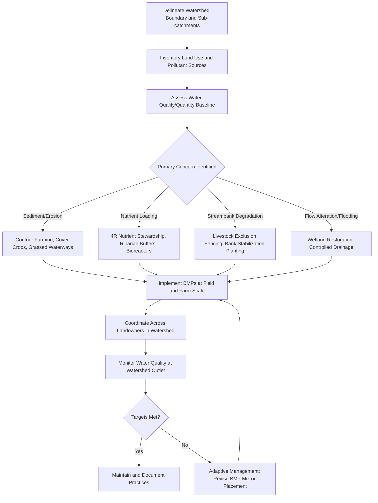

## Watershed and Riparian Management


### Overview

Watershed and riparian management addresses the design and implementation of land- and water-management practices at both the farm and catchment scale to protect water quality, regulate hydrological flow, and maintain the ecological function of streams, rivers, and their adjacent land corridors. It integrates hydrology, soil science, and land management to address how agricultural activity affects, and is affected by, water moving through a landscape.

**Key Points**

- A watershed (catchment) is the total land area draining to a common outlet point; management decisions anywhere within a watershed can affect water quantity and quality downstream, making coordination across property boundaries important.
- The riparian zone—the interface between land and a stream or river—performs disproportionately important ecological and water-quality functions relative to its typically small land area.
- Effective watershed management requires addressing both point-source inputs (direct discharges) and, more commonly in agricultural contexts, diffuse non-point-source pollution (runoff distributed across a landscape).

### Watershed Concepts and Hydrological Basics

**Watershed Delineation**

A watershed's boundary (drainage divide) is topographically defined; all precipitation falling within that boundary theoretically drains toward a shared outlet (stream confluence, lake, or coastal discharge point). Watersheds are nested hierarchically—small sub-watersheds combine into progressively larger catchments.

**The Water Balance Equation**

Watershed hydrology is fundamentally governed by the water balance:

$$P = ET + Q + \Delta S$$

Where $P$ is precipitation, $ET$ is evapotranspiration, $Q$ is runoff/streamflow, and $\Delta S$ is the change in water storage (soil moisture, groundwater, surface storage). Agricultural land management alters each term: crop cover and irrigation affect $ET$, soil compaction and land cover affect infiltration and therefore $Q$, and drainage/tillage practices affect $\Delta S$.

**Runoff Generation Mechanisms**

- **Infiltration-excess (Hortonian) runoff**: occurs when rainfall intensity exceeds the soil's infiltration capacity, common on compacted, crusted, or bare agricultural soils during intense rainfall events.
- **Saturation-excess runoff**: occurs when soil becomes fully saturated (often in lower-slope or riparian areas with shallow water tables), after which any additional rainfall or upslope flow becomes runoff regardless of intensity.

### Agricultural Non-Point-Source Pollution

**Sediment**

Erosion from tilled or bare cropland, overgrazed pasture, and unstabilized stream banks contributes suspended sediment to waterways, degrading aquatic habitat (smothering spawning gravels, reducing light penetration for aquatic plants) and often transporting adsorbed nutrients and pesticides.

**Nutrients (Nitrogen and Phosphorus)**

Excess nitrogen (primarily as nitrate, highly soluble and mobile through soil and groundwater) and phosphorus (often sediment-bound, transported via surface runoff and erosion) from fertilizer and manure application drive eutrophication in receiving water bodies—excessive algal growth, subsequent oxygen depletion upon decomposition, and resulting aquatic dead zones in severe cases, with well-documented examples in numerous coastal and freshwater systems globally.

**Pesticides and Veterinary Pharmaceuticals**

Runoff and leaching of applied pesticides, and pharmaceutical residues from livestock waste, can reach surface and groundwater, with ecological and, in some cases, drinking-water-quality implications depending on compound persistence and mobility.

**Pathogens**

Manure and livestock waste can introduce bacterial and protozoan pathogens to water bodies, particularly where livestock have direct stream access or where manure is applied near waterways without adequate buffer or timing controls.

**Thermal Pollution**

Removal of riparian shade vegetation allows increased solar heating of stream water, which can exceed thermal tolerance thresholds for temperature-sensitive aquatic species (e.g., many coldwater fish species) even without any chemical pollutant input.

### Riparian Buffer Zone Design and Function

**Multi-Zone Riparian Buffer Concept**

A widely referenced design framework (developed extensively in USDA agroforestry and conservation buffer research) structures riparian buffers into functional zones moving away from the water body:

- **Zone 1 (streamside)**: Undisturbed, typically permanent woody vegetation immediately adjacent to the water body; provides shade, bank stabilization via root structure, large woody debris input to the channel, and direct filtration of the shallow subsurface flow closest to the stream.
- **Zone 2 (managed woody/shrub zone)**: A wider band of trees and shrubs, potentially managed for products (timber, biomass) while still providing filtration and habitat function; roots further stabilize the streambank and adjacent floodplain soil.
- **Zone 3 (grass/herbaceous filter strip)**: The outermost zone adjacent to the actively farmed area, typically dense grass or herbaceous vegetation that slows and spreads concentrated surface runoff, promoting sediment deposition and infiltration before water reaches the woody buffer zones.

**Functions Performed by Riparian Buffers**

- **Sediment trapping**: reduced flow velocity across the vegetated buffer allows suspended sediment to settle out before reaching the channel.
- **Nutrient uptake and transformation**: buffer vegetation takes up nitrogen and phosphorus; riparian soils, particularly under saturated conditions, can support denitrification converting nitrate to gaseous nitrogen forms.
- **Bank stabilization**: root systems mechanically reinforce streambank soil, reducing erosion and channel widening during high-flow events.
- **Stream shading and thermal regulation**: canopy cover moderates water temperature, particularly important for temperature-sensitive aquatic species.
- **Habitat and wildlife corridor function**: complements the broader biodiversity and connectivity functions discussed under Biodiversity Conservation on Farms.
- **Flood attenuation**: riparian vegetation and associated floodplain roughness can slow flood wave movement and provide temporary water storage during high-flow events.

### Watershed-Scale Best Management Practices (BMPs)

| Practice Category | Example Practices | Primary Function |
| --- | --- | --- |
| Erosion control | Contour farming, terracing, grassed waterways, cover cropping | Reduce sediment and adsorbed nutrient runoff |
| Nutrient management | 4R nutrient stewardship, variable-rate application, setback distances from waterways | Reduce nutrient loading to water bodies |
| Livestock management | Stream fencing/exclusion, off-stream watering, rotational grazing | Reduce direct bank damage, pathogen input, and streamside vegetation loss |
| Drainage management | Controlled drainage structures, saturated buffers, bioreactors (woodchip denitrification) | Reduce nitrate loss through subsurface tile drainage |
| Wetland restoration | Constructed and restored wetlands within or at the edge of agricultural watersheds | Nutrient/sediment filtration, flood storage, habitat |
| Structural controls | Grade stabilization structures, sediment retention ponds | Reduce gully erosion and downstream sediment delivery |

### Tile Drainage and Nitrate Management

In regions with extensive subsurface (tile) drainage systems, a substantial share of nitrate loss to surface waters can bypass surface riparian buffers entirely, moving through subsurface tile networks directly to drainage ditches and streams. This has driven development of drainage-specific mitigation practices:

- **Controlled drainage**: water control structures that allow managed raising/lowering of the drainage outlet elevation, retaining more water and allowing greater in-field denitrification during non-critical periods rather than continuous free drainage.
- **Saturated buffers**: engineered systems that divert a portion of tile drainage flow laterally through a saturated riparian buffer zone before it reaches the stream, allowing buffer vegetation and soil microbial processes to remove nitrate that would otherwise bypass the buffer.
- **Woodchip bioreactors**: buried trenches filled with woodchips positioned to intercept tile drainage flow; the woodchip carbon source fuels microbial denitrification, converting nitrate to gaseous nitrogen before water discharges to the receiving stream.

[Inference] The nitrate removal efficiency of bioreactors and saturated buffers varies considerably with flow rate, retention time, temperature, and carbon source condition, and reported removal percentages in the literature span a wide range; site-specific design and monitoring is generally recommended over applying a single expected removal efficiency figure.

### Watershed Management Planning Framework



### Monitoring and Assessment Approaches

**Water Quality Sampling**

Regular sampling for nutrients (total nitrogen, total phosphorus, nitrate-N), sediment (total suspended solids, turbidity), and sometimes pesticide residues or bacterial indicators (e.g., E. coli) at watershed outlet points or key tributary junctions, tracked over time to assess trends and BMP effectiveness.

**Streamflow Gauging**

Continuous or periodic discharge measurement at gauging stations provides the flow data necessary to convert concentration measurements into pollutant load estimates (load = concentration × flow), since concentration alone can be misleading without accounting for flow volume.

**Biological/Habitat Indicators**

Macroinvertebrate community sampling (certain aquatic insect groups are sensitive indicators of water quality degradation) and fish community assessment provide integrated biological measures of stream health reflecting cumulative watershed condition over time, complementing chemical water quality snapshots.

**Watershed Modeling Tools**

Process-based watershed models (e.g., SWAT—Soil and Water Assessment Tool—and similar hydrologic-water quality models) simulate the relationship between land use, management practices, and downstream water quality/quantity outcomes, widely used for BMP scenario planning and watershed management plan development, particularly where direct monitoring at all relevant scales is impractical.

### Example: Simple Nutrient Load Calculation

Basic load calculation illustrating the concentration-flow relationship underlying watershed nutrient budgets:

```python
def calculate_nutrient_load(concentration_mg_l, flow_rate_m3_s, time_period_days):
    """
    concentration_mg_l: nutrient concentration in mg/L
    flow_rate_m3_s: mean streamflow in cubic meters per second
    time_period_days: monitoring period length in days
    Returns load in kilograms.
    """
    seconds_per_day = 86400
    total_flow_m3 = flow_rate_m3_s * seconds_per_day * time_period_days
    total_flow_liters = total_flow_m3 * 1000
    load_mg = concentration_mg_l * total_flow_liters
    load_kg = load_mg / 1_000_000
    return load_kg

# Example: nitrate-N load over a 30-day period
load = calculate_nutrient_load(concentration_mg_l=5.0, flow_rate_m3_s=2.0, time_period_days=30)
print(f"Estimated nitrate-N load: {load:.1f} kg over the period")
```

**Output**

`Estimated nitrate-N load: 25920.0 kg over the period`

**Example**

A watershed group observing this load might compare it against an established total maximum daily load (TMDL) allocation for the catchment (where such regulatory targets exist) to assess whether current BMP implementation is sufficient or whether additional mitigation is needed upstream.

### Institutional and Policy Frameworks

**Watershed-Based Planning**

Many water quality management programs are organized at the watershed/catchment scale rather than purely by political jurisdiction, recognizing that pollutant sources and impacts do not respect administrative boundaries; this often requires voluntary or regulatory coordination among multiple landowners and, in some cases, multiple local government jurisdictions.

**Total Maximum Daily Load (TMDL) Programs**

In jurisdictions with such frameworks (notably under the U.S. Clean Water Act), impaired water bodies are assigned a calculated maximum pollutant load they can receive while still meeting water quality standards, allocated among point and non-point sources within the watershed, driving targeted agricultural BMP implementation in impaired watersheds.

**Payments for Watershed Services**

Analogous to the broader payments-for-ecosystem-services mechanisms discussed under Biodiversity Conservation on Farms, some programs compensate upstream landowners for adopting practices that protect downstream water quality or quantity, particularly relevant where downstream water users (municipalities, other farms) have a direct economic interest in upstream watershed condition.

**Cost-Share and Conservation Programs**

Government cost-share programs (e.g., various national agricultural conservation program mechanisms) commonly subsidize riparian buffer establishment, livestock exclusion fencing, and other watershed BMPs, recognizing the public-good nature of downstream water quality benefits relative to private on-farm costs.

### Trade-offs and Practical Considerations

- **Land removed from production**: riparian buffers and grassed waterways remove land from direct crop or grazing production, representing an opportunity cost that is often, though not always, offset by cost-share payments or the value of reduced erosion/nutrient loss on remaining productive land.
- **Buffer width vs. effectiveness trade-off**: wider buffers generally provide greater pollutant removal and habitat value but at proportionally greater land opportunity cost; minimum effective width varies by slope, soil type, and target pollutant, meaning a single universal buffer width recommendation is not well supported across all conditions.
- **Tile drainage bypass**: as noted above, surface riparian buffers alone provide limited protection against nitrate loss through subsurface tile drainage networks, requiring complementary drainage-specific practices in tile-drained landscapes.
- **Coordination challenge**: because watershed outcomes depend on cumulative upstream land management, individual farm-level BMP adoption may show limited measurable downstream water quality improvement without broader coordinated adoption across the watershed, which can be a source of practical and motivational difficulty in voluntary program design.

### Limitations and Uncertainty

- Watershed-scale water quality response to BMP implementation often exhibits substantial time lags (particularly for groundwater-connected nitrate loading), meaning monitoring programs may not detect measurable improvement for multiple years after BMP adoption, complicating short-term program evaluation.
- Legacy nutrient stores (historically accumulated phosphorus in soils and stream sediments, or nitrate in groundwater) can continue contributing to water quality impairment for years to decades after upstream management practices have improved, a phenomenon sometimes termed "legacy effects" in the watershed science literature.
- [Speculation] The relative cost-effectiveness ranking of different BMP combinations for a specific watershed's pollutant reduction goals is highly site-specific (soil type, climate, existing land use, drainage infrastructure), and generalized BMP effectiveness rankings from one region or study should not be assumed to transfer directly to a different hydrological or agricultural context without local validation or modeling.

**Related Topics**

- Biodiversity conservation on farms
- Climate-smart agriculture practices
- Soil erosion control and conservation tillage
- Nutrient management and 4R stewardship
- Wetland restoration and constructed wetlands
- Livestock grazing management and stream exclusion
- Agricultural drainage engineering
- Water quality monitoring and watershed modeling (SWAT)