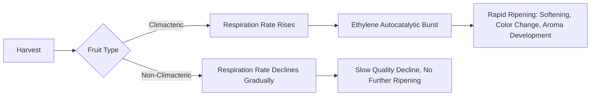

## Postharvest Physiology of Crops

### Overview

Postharvest physiology is the study of the biological and biochemical processes that continue in harvested plant organs (fruits, vegetables, flowers, grains, tubers) after separation from the parent plant. Unlike the plant in the field, a harvested commodity can no longer replace water, sugars, or nutrients lost through respiration and transpiration. Understanding these residual life processes allows the design of handling, storage, and transport systems that slow deterioration, preserve quality, and extend shelf life.

### Biological Status of Harvested Produce

Harvested plant parts remain living tissue and continue metabolic activity using stored reserves.

- **Key Points**
  - Respiration continues, consuming stored carbohydrates, organic acids, and lipids
  - Transpiration (water loss) continues but cannot be replenished, leading to wilting and shriveling
  - Cells continue to synthesize enzymes, hormones, and secondary metabolites
  - Senescence (the final stage of development leading to tissue death) is an ongoing, irreversible program in most tissues once initiated

### Respiration

Respiration is the oxidative breakdown of stored organic substrates (mainly sugars) to yield energy (ATP), carbon dioxide, and water.

$$C_6H_{12}O_6 + 6O_2 \rightarrow 6CO_2 + 6H_2O + \text{energy}$$

**Respiration Rate and Shelf Life**

Respiration rate is inversely related to postharvest life: commodities with high respiration rates (e.g., asparagus, broccoli, mushrooms) deteriorate quickly, while low-respiration commodities (e.g., onions, garlic, nuts) store longer.

| Respiration Class | Rate (mg CO₂/kg·h at 5°C) | Example Crops |
| --- | --- | --- |
| Very Low | <5 | Nuts, dates, dried produce |
| Low | 5–10 | Onion, garlic, potato |
| Moderate | 10–20 | Cabbage, lettuce, carrot |
| High | 20–40 | Strawberry, cauliflower |
| Very High | 40–60 | Asparagus, mushroom, pea |
| Extremely High | >60 | Broccoli, spinach |

[Inference] Exact respiration rates vary considerably with cultivar, maturity stage, and measurement conditions, so tabulated values should be treated as approximate reference ranges rather than fixed constants.

**Climacteric vs. Non-Climacteric Fruits**

This classification is fundamental to postharvest handling strategy.

- **Climacteric fruits**: show a sharp rise in respiration rate and ethylene production coinciding with ripening; can ripen after harvest. Examples: banana, mango, tomato, apple, avocado, papaya.
- **Non-climacteric fruits**: show a gradual, steady decline in respiration; ripening quality does not improve after harvest. Examples: citrus, grape, strawberry, pineapple, cherry.



### Ethylene: The Ripening Hormone

Ethylene ($C_2H_4$) is a gaseous plant hormone that regulates ripening, senescence, and stress responses.

- **Key Points**
  - Triggers autocatalytic ethylene production in climacteric fruit (ethylene induces its own synthesis)
  - Accelerates chlorophyll degradation, starch-to-sugar conversion, cell wall softening, and volatile (aroma) synthesis
  - Even trace amounts (as low as 0.1 ppm) can trigger ripening in sensitive commodities
  - Sources of exogenous ethylene include: ripening fruit, combustion engines, cigarette smoke, and decaying produce

**Practical Implications**

- Store ethylene-sensitive commodities (lettuce, broccoli, carrots) away from ethylene-producing fruit (apples, bananas, tomatoes)
- Ethylene scrubbers (potassium permanganate systems) and ventilation reduce ethylene accumulation in storage
- 1-Methylcyclopropene (1-MCP) is used commercially to block ethylene receptors and delay ripening

### Transpiration and Water Loss

Water loss occurs through stomata, lenticels, and cuticle, driven by the vapor pressure deficit between the commodity and surrounding air.

$$WL = k \times (VP_{commodity} - VP_{air})$$

where $WL$ is water loss rate and $k$ is a commodity-specific permeance coefficient.

- **Key Points**
  - A water loss of just 5–10% of fresh weight often causes visible wilting and loss of marketability in leafy vegetables
  - High relative humidity (90–95%) in storage minimizes transpiration for most produce
  - Waxing, film wrapping, and modified atmosphere packaging (MAP) reduce water loss by creating a humidity barrier

### Factors Affecting Postharvest Physiology

**Temperature**

Temperature is the single most influential factor controlling postharvest metabolic rate.

$$Q_{10} = \left(\frac{R_2}{R_1}\right)^{\frac{10}{T_2 - T_1}}$$

where $Q_{10}$ is the temperature quotient describing the fold-change in reaction (respiration) rate per 10°C change, $R_1$ and $R_2$ are the rates at temperatures $T_1$ and $T_2$.

Most fresh produce shows a $Q_{10}$ of 2–3, meaning respiration roughly doubles or triples for every 10°C rise. Rapid cooling ("precooling") immediately after harvest is therefore one of the most effective interventions to extend shelf life.

**Chilling Injury**

Tropical and subtropical commodities (banana, mango, cucumber, tomato) are physiologically sensitive to low but non-freezing temperatures (typically below 10–13°C), resulting in surface pitting, discoloration, off-flavors, and increased decay susceptibility. [Inference] Exact chilling thresholds are cultivar- and maturity-dependent, so specific temperatures should be verified against commodity-specific storage guides.

**Relative Humidity, Atmosphere Composition, and Mechanical Injury**

- Low $O_2$ / elevated $CO_2$ atmospheres (controlled atmosphere, CA storage) suppress respiration and ethylene action
- Excessively low $O_2$ or excessively high $CO_2$ can induce anaerobic respiration and fermentation off-flavors
- Mechanical injuries (bruising, cuts, abrasion) increase respiration and ethylene production locally and provide entry points for decay organisms

### Postharvest Biochemical Changes

| Component | Typical Change During Ripening/Senescence |
| --- | --- |
| Chlorophyll | Degrades, unmasking carotenoids/anthocyanins (color change) |
| Starch | Hydrolyzed to sugars (sweetening) in starchy climacteric fruits |
| Organic acids | Generally decline (reduced sourness) |
| Pectin/cell wall | Enzymatically degraded (pectinase, cellulase) causing softening |
| Volatiles | Increase, producing characteristic ripe aroma |
| Vitamin C | Progressively declines with storage time and temperature abuse |

### Postharvest Physiological Disorders

- **Example**
  - **Chilling injury**: pitting and internal browning in cold-stored tropical fruit
  - **Freezing injury**: ice crystal formation rupturing cell membranes
  - **Water core** (apples): sugar alcohol accumulation in intercellular spaces
  - **Blackheart** (potato): tissue death from oxygen deficiency during storage
  - **Bitter pit** (apple): calcium deficiency-related necrotic spotting

### Postharvest Handling Chain (Illustration)

<svg xmlns="http://www.w3.org/2000/svg" viewBox="0 0 900 220">
<text x="450" y="20" font-size="14" text-anchor="middle" font-family="sans-serif" font-weight="bold">Postharvest Handling Chain (svg_diagram)</text>
<g font-family="sans-serif" font-size="12">
<rect x="10" y="60" width="110" height="50" rx="6" fill="#DFF5E1" stroke="#2E7D32" />
<text x="65" y="90" text-anchor="middle">Harvest</text>



```
<rect x="150" y="60" width="110" height="50" rx="6" fill="#DFF5E1" stroke="#2E7D32" />
<text x="205" y="85" text-anchor="middle">Field Heat</text>
<text x="205" y="100" text-anchor="middle">Removal</text>

<rect x="290" y="60" width="110" height="50" rx="6" fill="#DFF5E1" stroke="#2E7D32" />
<text x="345" y="85" text-anchor="middle">Precooling</text>

<rect x="430" y="60" width="110" height="50" rx="6" fill="#DFF5E1" stroke="#2E7D32" />
<text x="485" y="85" text-anchor="middle">Sorting &amp;</text>
<text x="485" y="100" text-anchor="middle">Grading</text>

<rect x="570" y="60" width="110" height="50" rx="6" fill="#DFF5E1" stroke="#2E7D32" />
<text x="625" y="85" text-anchor="middle">Packaging</text>

<rect x="710" y="60" width="110" height="50" rx="6" fill="#DFF5E1" stroke="#2E7D32" />
<text x="765" y="85" text-anchor="middle">Cold Storage</text>
<text x="765" y="100" text-anchor="middle">/ Transport</text>

<line x1="120" y1="85" x2="150" y2="85" stroke="#2E7D32" stroke-width="2" marker-end="url(#arrow)" />
<line x1="260" y1="85" x2="290" y2="85" stroke="#2E7D32" stroke-width="2" marker-end="url(#arrow)" />
<line x1="400" y1="85" x2="430" y2="85" stroke="#2E7D32" stroke-width="2" marker-end="url(#arrow)" />
<line x1="540" y1="85" x2="570" y2="85" stroke="#2E7D32" stroke-width="2" marker-end="url(#arrow)" />
<line x1="680" y1="85" x2="710" y2="85" stroke="#2E7D32" stroke-width="2" marker-end="url(#arrow)" />

<text x="450" y="160" text-anchor="middle" font-size="12" fill="#555">Each stage aims to minimize respiration rate, water loss, and mechanical damage</text>
<text x="450" y="180" text-anchor="middle" font-size="12" fill="#555">to slow senescence and preserve marketable quality.</text>
```

</g>
</svg>

### Postharvest Management Strategies

- **Next Steps** (practical interventions derived from physiological principles)
  - Harvest at optimal physiological maturity to balance shelf life and eating quality
  - Rapid field-heat removal via precooling (hydrocooling, forced-air cooling, vacuum cooling)
  - Maintain cold chain continuity from harvest to retail (temperature abuse is cumulative and irreversible)
  - Use controlled atmosphere (CA) or modified atmosphere packaging (MAP) for extended storage
  - Apply ethylene management (scrubbing, 1-MCP, segregation from ethylene sources)
  - Minimize mechanical injury through careful handling, padded containers, and appropriate stacking

### Related Topics

- Cold chain logistics and precooling methods (hydrocooling, forced-air, vacuum cooling)
- Controlled atmosphere (CA) and modified atmosphere packaging (MAP) storage
- Ethylene biosynthesis pathway and 1-MCP mode of action
- Postharvest pathology and decay control
- Maturity indices and harvest timing
- Cell wall degradation enzymes (polygalacturonase, pectin methylesterase)
- Vitamin and nutrient retention during storage
- Grain postharvest physiology and dormancy (contrast with fruit/vegetable physiology)