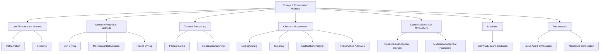

## Storage and Preservation Methods

### Overview

Storage and preservation methods encompass the range of physical, chemical, and biological techniques used to extend the usable life of agricultural produce by controlling the factors that drive spoilage: microbial growth, enzymatic activity, respiration, moisture migration, and oxidation. Method selection depends on the commodity type (perishable produce, grains, dairy, meat), the desired shelf-life extension, cost constraints, and the target market.

### Principles of Food Spoilage

Preservation methods work by targeting one or more of these deterioration mechanisms:

- **Key Points**
  - **Microbial growth**: bacteria, yeasts, and molds degrade food and produce toxins
  - **Enzymatic activity**: endogenous enzymes (polyphenol oxidase, lipase, pectinase) cause browning, softening, and rancidity
  - **Moisture changes**: water activity ($a_w$) governs microbial growth potential and textural quality
  - **Oxidation**: lipid oxidation causes rancidity; oxidative browning affects color
  - **Physical damage**: bruising and abrasion accelerate all of the above

$$a_w = \frac{p}{p_0}$$

where $p$ is the vapor pressure of water in the food and $p_0$ is the vapor pressure of pure water at the same temperature. Most bacteria require $a_w > 0.90$; molds can grow at $a_w$ as low as 0.60–0.70.

### Classification of Preservation Methods

### Low-Temperature Preservation

**Refrigeration (Cold Storage)**

Refrigeration slows microbial growth and enzymatic and respiratory reactions without freezing the product, typically operating in the range of 0–13°C depending on chilling sensitivity.

| Commodity Group | Recommended Storage Temp | Relative Humidity | Approx. Storage Life |
| --- | --- | --- | --- |
| Leafy vegetables | 0–2°C | 95–100% | 1–3 weeks |
| Citrus fruits | 3–10°C | 85–90% | 3–8 weeks |
| Tropical fruits (banana, mango) | 10–13°C | 85–95% | 1–4 weeks |
| Root vegetables (potato, carrot) | 4–10°C | 90–95% | Months |

[Inference] Optimal temperature and humidity combinations vary by cultivar and are best confirmed against commodity-specific postharvest handling guides.

**Freezing**

Freezing converts water to ice, drastically reducing water activity and halting microbial growth; enzymatic activity is slowed but not eliminated (blanching is used to inactivate enzymes before freezing vegetables).

- **Key Points**
  - Slow freezing forms large ice crystals that rupture cell walls, causing textural damage upon thawing
  - Fast/blast freezing (below −18°C rapidly) produces smaller ice crystals, better preserving cellular structure
  - Commercial methods: blast freezing, cryogenic freezing (liquid nitrogen/CO₂), plate freezing

### Moisture Reduction (Drying/Dehydration)

Removing water lowers $a_w$ below the threshold required for microbial growth and slows enzymatic reactions.

- **Sun drying**: low-cost, weather-dependent, risk of contamination and uneven drying
- **Mechanical/hot-air drying**: controlled temperature and airflow in drying chambers or tunnel dryers; more uniform and hygienic
- **Freeze drying (lyophilization)**: product is frozen, then water is removed by sublimation under vacuum; preserves structure, flavor, and nutrients best but is costly
- **Spray drying**: used for liquid foods (milk, juice) to produce powders

$$MC_{wb} = \frac{W_i - W_f}{W_i} \times 100$$

where $MC_{wb}$ is moisture content on a wet basis, $W_i$ is initial weight, and $W_f$ is final (dry) weight.

### Thermal Processing

**Pasteurization**

Mild heat treatment (typically 63–100°C depending on method) designed to destroy pathogenic and spoilage microorganisms while retaining most sensory and nutritional qualities. Common in dairy and juice processing.

| Method | Temperature | Time |
| --- | --- | --- |
| LTLT (batch) | 63°C | 30 min |
| HTST (flash) | 72°C | 15 sec |
| UHT (ultra-high temp) | 135–150°C | 2–5 sec |

**Sterilization / Canning**

Sterilization destroys all viable microorganisms, including heat-resistant spores (notably *Clostridium botulinum*), typically via retort processing at temperatures above 100°C under pressure.

$$F_0 = \int_0^t 10^{\frac{T - 121.1}{z}} dt$$

where $F_0$ is the equivalent sterilization time at a reference temperature of 121.1°C, $T$ is the process temperature, and $z$ is the temperature increase required to reduce the decimal reduction time ($D$-value) by a factor of 10. Commercial sterility for low-acid canned foods generally targets a minimum $F_0$ of 3 minutes to achieve a 12-log reduction of *C. botulinum* spores. [Inference] Specific target $F_0$ values are process- and product-dependent and should be validated against food safety regulatory standards for the given commodity.

- **Example**
  - Canning of low-acid vegetables (green beans, corn) requires retort sterilization due to *C. botulinum* risk
  - High-acid foods (tomatoes, fruit, pickles with pH < 4.6) can be safely processed by boiling-water-bath pasteurization since the acidity itself inhibits *C. botulinum* growth

### Chemical and Osmotic Preservation

- **Salting/curing**: draws out water via osmosis, lowering $a_w$; used for meat, fish, and some vegetables
- **Sugaring**: high sugar concentration (jams, preserves) similarly reduces $a_w$
- **Acidification/pickling**: lowering pH below 4.6 inhibits most pathogenic bacteria, including *C. botulinum*
- **Chemical preservatives**: sulfites (dried fruit), benzoates, sorbates, and nitrites (cured meats) inhibit microbial growth or oxidation; usage is regulated by permissible concentration limits that vary by country and food category

### Controlled and Modified Atmosphere Storage

**Controlled Atmosphere (CA) Storage**

Precisely regulated levels of $O_2$ (often 1–5%) and $CO_2$ (often 1–10%) in sealed storage rooms suppress respiration, ethylene production, and senescence, extending storage life significantly for commodities like apples and pears (often 6–12 months).

**Modified Atmosphere Packaging (MAP)**

Gas composition inside a sealed package is altered at packing time (often via flushing with $N_2$/$CO_2$ mixtures) and then allowed to passively equilibrate with produce respiration; commonly used for fresh-cut produce, bakery, and meat products.

- **Key Points**
  - Excessively low $O_2$ (below tolerance threshold, commodity-specific) risks anaerobic fermentation and off-flavors
  - Packaging film permeability must be matched to the commodity's respiration rate

### Irradiation

Exposure to ionizing radiation (gamma rays, X-rays, or electron beams) at regulated doses destroys microorganisms, insects, and inhibits sprouting (e.g., in onions and potatoes) without significant heat generation.

- Low dose (<1 kGy): sprout inhibition, insect disinfestation
- Medium dose (1–10 kGy): pathogen reduction, shelf-life extension
- High dose (>10 kGy): commercial sterilization

[Unverified] Consumer acceptance and specific regulatory dose limits for irradiated food vary substantially by country and should be checked against current national food safety authority guidelines.

### Fermentation as Preservation

Controlled microbial fermentation preserves food by generating inhibitory byproducts (organic acids, alcohol, or antimicrobial compounds) that suppress spoilage organisms.

- **Lactic acid fermentation**: sauerkraut, kimchi, yogurt, silage — lactic acid bacteria lower pH
- **Alcoholic fermentation**: wine, beer — yeasts convert sugars to ethanol
- **Acetic acid fermentation**: vinegar production

### Comparative Summary

| Method | Primary Mechanism | Typical Shelf-Life Extension | Nutrient/Quality Impact |
| --- | --- | --- | --- |
| Refrigeration | Slows metabolism/microbial growth | Days–weeks | Minimal |
| Freezing | Halts microbial growth, low $a_w$ | Months–year+ | Moderate (texture changes) |
| Drying | Reduces $a_w$ | Months–years | Significant (volume, texture, some nutrients) |
| Pasteurization | Kills pathogens/spoilage organisms | Days–weeks (refrigerated) | Minimal–moderate |
| Canning/Sterilization | Kills all microorganisms + spores | Years | Moderate (heat-sensitive nutrients) |
| CA/MAP | Suppresses respiration & ethylene | Weeks–months | Minimal |
| Irradiation | Destroys microorganisms/pests | Weeks–months | Minimal |
| Fermentation | Inhibitory metabolites, low pH | Weeks–months | Can enhance nutrition (e.g., B vitamins) |

### Selecting an Appropriate Method

- **Next Steps** (decision factors for method selection)
  - Identify the commodity's dominant spoilage mechanism (microbial vs. enzymatic vs. physiological)
  - Match method to commodity sensitivity (e.g., avoid freezing for chilling-tolerant fresh produce meant for fresh sale)
  - Balance shelf-life goals against cost, energy requirements, and quality/nutrient retention
  - Consider regulatory compliance for chemical preservatives, irradiation doses, and thermal process validation
  - Evaluate infrastructure availability (cold chain access, electricity, processing equipment) relevant to the production context

### Related Topics

- Cold chain infrastructure and precooling technologies
- Controlled atmosphere (CA) storage system design
- Food packaging materials and permeability engineering
- HACCP and food safety validation for thermal processes
- Water activity ($a_w$) measurement and its role in shelf-life prediction
- Fermentation microbiology and starter culture technology
- Postharvest physiology of crops (complementary foundational topic)
- Food irradiation regulations and consumer acceptance studies