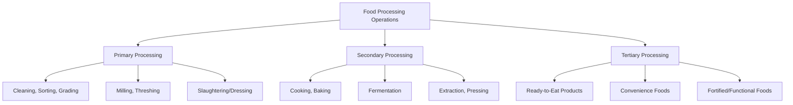

## Food Processing Fundamentals


### Overview

Food processing encompasses the set of physical, chemical, and biological operations applied to raw agricultural commodities to convert them into safe, stable, and consumable food products. It draws on food chemistry, microbiology, and engineering principles to achieve safety, extend shelf life, improve digestibility or convenience, and create value-added products. This topic establishes the foundational unit operations and principles that underlie all specific preservation and processing technologies.

### Objectives of Food Processing

- **Key Points**
  - **Safety**: eliminate or reduce pathogens and toxins to acceptable levels
  - **Preservation**: extend shelf life by controlling spoilage mechanisms
  - **Nutritional value**: retain or fortify nutrient content
  - **Palatability and convenience**: improve taste, texture, and ease of preparation
  - **Value addition**: transform raw commodities into higher-value products (e.g., wheat into flour and bread)
  - **Reduced post-harvest losses**: convert perishable surplus into stable products

### Classification of Food Processing Operations



- **Primary processing**: minimal transformation of raw commodities (cleaning, sorting, grading, milling)
- **Secondary processing**: converts primary-processed ingredients into intermediate or finished products (baking, fermenting, extracting)
- **Tertiary processing**: produces ready-to-eat or highly convenient final products, often combining multiple ingredients

### Unit Operations in Food Processing

Food processing is built from a set of common unit operations, each targeting specific physical or chemical transformations.

| Unit Operation | Purpose | Example |
| --- | --- | --- |
| Cleaning | Remove dirt, debris, foreign matter | Washing vegetables |
| Sorting/Grading | Separate by size, weight, quality, maturity | Fruit grading lines |
| Size reduction | Reduce particle size | Milling grain into flour |
| Mixing/Blending | Combine ingredients uniformly | Dough mixing |
| Heat processing | Cook, pasteurize, sterilize | Blanching, canning |
| Cooling/Freezing | Preserve via reduced temperature | Cold storage, blast freezing |
| Dehydration | Remove moisture | Drying grains, fruit |
| Separation | Isolate components | Filtration, centrifugation |
| Fermentation | Microbial transformation | Yogurt, silage production |
| Packaging | Protect and contain product | Vacuum sealing, MAP |

### Effects of Processing on Food Components

**Carbohydrates**

Heat processing gelatinizes starches (improving digestibility) and can cause Maillard browning and caramelization at high temperatures, affecting color and flavor.

$$\text{Maillard reaction: } \text{Reducing sugar} + \text{Amino acid} \xrightarrow{\Delta} \text{Melanoidins (brown pigments)} + \text{Flavor compounds}$$

**Proteins**

Heat causes protein denaturation, altering structure and often improving digestibility, but excessive heat can reduce the bioavailability of certain amino acids (e.g., lysine, via Maillard-related loss).

**Lipids**

Processing and storage conditions influence lipid oxidation, producing rancidity; antioxidants (natural or added) and inert-atmosphere packaging mitigate this.

**Vitamins and Minerals**

- **Key Points**
  - Water-soluble vitamins (vitamin C, B-complex) are most susceptible to loss through leaching and heat degradation
  - Fat-soluble vitamins (A, D, E, K) are relatively heat-stable but can be lost via oxidation
  - Minerals are generally heat-stable but can be lost through leaching into cooking water or processing liquid

[Inference] The magnitude of nutrient loss depends heavily on processing time, temperature, and method, so specific percentage losses cited in literature should be treated as method-specific rather than universal constants.

### Enzymatic Considerations in Processing

Endogenous enzymes remain active in raw commodities and can cause undesirable changes if not controlled.

- **Blanching**: brief heat treatment (typically 70–100°C for seconds to minutes) used before freezing, drying, or canning to inactivate enzymes (notably polyphenol oxidase and peroxidase) that cause browning, off-flavors, and nutrient degradation
- **Polyphenol oxidase (PPO)**: causes enzymatic browning in cut fruits/vegetables (apples, potatoes); controlled via blanching, acidification (ascorbic/citric acid), or reduced oxygen exposure

$$\text{Phenolic compound} + O_2 \xrightarrow{\text{PPO}} \text{Quinones} \rightarrow \text{Melanin (brown pigment)}$$

### Microbiological Principles in Processing

**Decimal Reduction Time (D-value)**

The D-value represents the time required at a given temperature to reduce a microbial population by 90% (one log cycle).

$$D_T = \frac{t}{\log(N_0) - \log(N)}$$

where $N_0$ is the initial microbial population, $N$ is the population after time $t$ at temperature $T$.

**Z-value**

The z-value is the temperature change required to change the D-value by a factor of 10, describing the temperature sensitivity of a microorganism's thermal death.

- **Example**
  - A process targeting a "12-D reduction" of *Clostridium botulinum* spores in low-acid canned foods reduces the population by 12 log cycles, providing a very high safety margin against survival

### Food Processing Equipment Overview (Illustration)

<svg xmlns="http://www.w3.org/2000/svg" viewBox="0 0 900 260">
<text x="450" y="20" font-size="14" text-anchor="middle" font-family="sans-serif" font-weight="bold">Generic Food Processing Line (svg_diagram)</text>
<g font-family="sans-serif" font-size="11">
<rect x="10" y="60" width="100" height="50" rx="6" fill="#FDEBD0" stroke="#B9770E" />
<text x="60" y="90" text-anchor="middle">Raw Material</text>



```
<rect x="140" y="60" width="100" height="50" rx="6" fill="#FDEBD0" stroke="#B9770E" />
<text x="190" y="90" text-anchor="middle">Cleaning</text>

<rect x="270" y="60" width="100" height="50" rx="6" fill="#FDEBD0" stroke="#B9770E" />
<text x="320" y="85" text-anchor="middle">Sorting/</text>
<text x="320" y="100" text-anchor="middle">Grading</text>

<rect x="400" y="60" width="100" height="50" rx="6" fill="#FDEBD0" stroke="#B9770E" />
<text x="450" y="85" text-anchor="middle">Size</text>
<text x="450" y="100" text-anchor="middle">Reduction</text>

<rect x="530" y="60" width="100" height="50" rx="6" fill="#FDEBD0" stroke="#B9770E" />
<text x="580" y="85" text-anchor="middle">Heat/</text>
<text x="580" y="100" text-anchor="middle">Thermal Step</text>

<rect x="660" y="60" width="100" height="50" rx="6" fill="#FDEBD0" stroke="#B9770E" />
<text x="710" y="85" text-anchor="middle">Packaging</text>

<rect x="790" y="60" width="100" height="50" rx="6" fill="#FDEBD0" stroke="#B9770E" />
<text x="840" y="85" text-anchor="middle">Storage/</text>
<text x="840" y="100" text-anchor="middle">Distribution</text>

<line x1="110" y1="85" x2="140" y2="85" stroke="#B9770E" stroke-width="2" marker-end="url(#arrow2)" />
<line x1="240" y1="85" x2="270" y2="85" stroke="#B9770E" stroke-width="2" marker-end="url(#arrow2)" />
<line x1="370" y1="85" x2="400" y2="85" stroke="#B9770E" stroke-width="2" marker-end="url(#arrow2)" />
<line x1="500" y1="85" x2="530" y2="85" stroke="#B9770E" stroke-width="2" marker-end="url(#arrow2)" />
<line x1="630" y1="85" x2="660" y2="85" stroke="#B9770E" stroke-width="2" marker-end="url(#arrow2)" />
<line x1="760" y1="85" x2="790" y2="85" stroke="#B9770E" stroke-width="2" marker-end="url(#arrow2)" />

<text x="450" y="160" text-anchor="middle" font-size="12" fill="#555">Quality control and food safety checkpoints (CCPs) are integrated</text>
<text x="450" y="178" text-anchor="middle" font-size="12" fill="#555">at each stage of the processing line.</text>
```

</g>
</svg>

### Food Safety Management Frameworks

- **Key Points**
  - **HACCP (Hazard Analysis and Critical Control Points)**: systematic identification and control of biological, chemical, and physical hazards at critical control points in the process
  - **GMP (Good Manufacturing Practices)**: baseline hygiene and operational standards for facilities and personnel
  - **ISO 22000**: internationally recognized food safety management system standard integrating HACCP principles

### Value Addition Through Processing

- **Example**
  - Milling wheat into flour, then baking into bread (multi-stage value addition)
  - Extracting and refining vegetable oil from oilseeds
  - Converting surplus tomatoes into paste, sauce, or dried products
  - Fermenting milk into yogurt or cheese to extend shelf life and diversify products

### Emerging and Non-Thermal Processing Technologies

Beyond traditional thermal methods, several non-thermal technologies are increasingly used to preserve food while minimizing heat-related nutrient and sensory losses:

- **High-Pressure Processing (HPP)**: applies pressures of 100–600 MPa to inactivate microorganisms with minimal heat, preserving fresh-like qualities in juices and ready-to-eat meats
- **Pulsed Electric Field (PEF)**: uses short high-voltage pulses to disrupt microbial cell membranes, primarily applied to liquid foods
- **Ultraviolet (UV) treatment**: surface or liquid decontamination without heat, used for juices and water

[Unverified] Regulatory approval, dose parameters, and commercial adoption levels of these emerging non-thermal technologies vary by country and continue to evolve, so current regulatory status should be verified against national food safety authorities.

### Considerations for Process Design

- **Next Steps** (foundational decision points before selecting specific processing methods)
  - Characterize the raw material's composition, perishability, and dominant spoilage risks
  - Define target shelf life, distribution channel, and consumer use case
  - Select unit operations and sequence them to minimize nutrient and quality loss
  - Integrate HACCP-based safety checkpoints at each critical stage
  - Evaluate scale (household, small-scale/artisanal, industrial) and available infrastructure/equipment

### Related Topics

- Postharvest physiology of crops (foundational raw material behavior)
- Storage and preservation methods (specific preservation technique deep-dive)
- Thermal processing kinetics (D-value, z-value, F0 calculations)
- HACCP system design and implementation
- Food packaging materials and technology
- Enzymatic browning control in fruits and vegetables
- Non-thermal food processing technologies (HPP, PEF, UV)
- Food fortification and functional food development