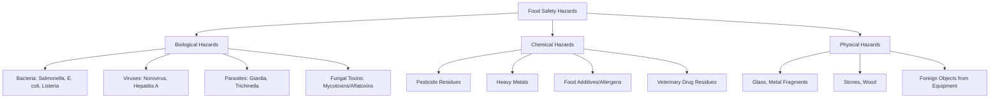
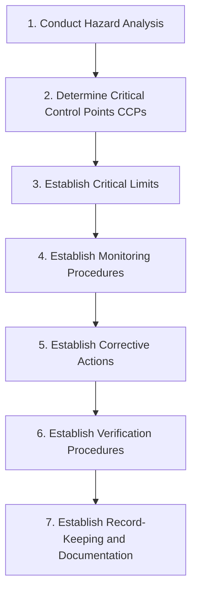

## Food Safety and Sanitation Standards


### Overview

Food safety and sanitation standards comprise the regulatory frameworks, scientific principles, and operational practices designed to prevent foodborne illness and contamination throughout the agricultural and food supply chain — from farm production through processing, distribution, and consumption. These standards integrate microbiology, toxicology, and quality management systems to control biological, chemical, and physical hazards.

### Categories of Food Hazards



### Biological Hazards

- **Key Points**
  - **Bacterial pathogens**: *Salmonella*, *Escherichia coli* O157:H7, *Listeria monocytogenes*, *Campylobacter*, *Clostridium botulinum* — cause infections or intoxications
  - **Viruses**: *Norovirus* and *Hepatitis A* commonly transmitted via contaminated water or infected food handlers
  - **Parasites**: *Giardia*, *Trichinella*, and helminths transmitted through contaminated water, soil, or undercooked meat
  - **Mycotoxins**: toxic secondary metabolites (e.g., aflatoxins from *Aspergillus flavus*) produced by molds on improperly stored grains, nuts, and dried commodities; are heat-stable and not destroyed by normal cooking

[Inference] Specific infectious dose thresholds and toxin action mechanisms vary by pathogen strain and host susceptibility, so quantitative risk figures should be checked against current epidemiological references.

### Chemical Hazards

- Pesticide and herbicide residues exceeding maximum residue limits (MRLs)
- Heavy metal contamination (lead, cadmium, mercury, arsenic) from soil, water, or processing equipment
- Veterinary drug residues (antibiotics, hormones) in animal-derived products
- Unauthorized or excessive food additives
- Allergen cross-contamination (the "Big 8/9" allergens: milk, eggs, fish, shellfish, tree nuts, peanuts, wheat, soybeans, and sesame in some jurisdictions)

### Physical Hazards

Foreign objects (glass, metal, plastic, stones, bone fragments) that can cause injury; typically controlled through metal detectors, X-ray screening, and visual inspection during processing.

### Water Activity, pH, and Microbial Growth Control

Food safety hinges on controlling the environmental conditions that support pathogen growth.

$$a_w = \frac{p}{p_0}$$

- Most bacterial pathogens require $a_w > 0.85$–0.90 and near-neutral pH to proliferate
- The "Danger Zone" for bacterial growth is generally defined as 5°C to 60°C (41°F to 140°F); food should not remain in this range for extended periods
- Low-acid foods (pH > 4.6) require more rigorous thermal processing (canning) due to *C. botulinum* risk; high-acid foods (pH < 4.6) are inherently more resistant to this specific hazard

### HACCP: Hazard Analysis and Critical Control Points

HACCP is the internationally recognized systematic framework for identifying, evaluating, and controlling food safety hazards, originally developed for NASA space food programs and now foundational to global food safety regulation.

**The Seven Principles of HACCP**



| Principle | Description |
| --- | --- |
| Hazard Analysis | Identify potential biological, chemical, physical hazards at each process step |
| Critical Control Points (CCPs) | Points where control can be applied to prevent/eliminate/reduce a hazard to acceptable levels |
| Critical Limits | Measurable boundaries (e.g., minimum cooking temperature) that must be met at each CCP |
| Monitoring | Scheduled observation/measurement to ensure CCPs remain within limits |
| Corrective Actions | Predefined steps taken when monitoring shows a CCP is out of control |
| Verification | Activities (audits, testing) confirming the HACCP system functions as intended |
| Record-Keeping | Documentation of the entire HACCP plan and its ongoing implementation |

- **Example**
  - In poultry processing, the chilling step may be a CCP with a critical limit of reducing carcass temperature to below 4°C within a specified time to prevent *Salmonella* growth

### Good Agricultural Practices (GAP) and Good Manufacturing Practices (GMP)

**GAP** applies food safety principles at the farm level:

- Water quality management for irrigation and washing
- Worker hygiene training and sanitary facilities in the field
- Proper use and withdrawal periods for pesticides and fertilizers
- Field sanitation to prevent contamination from animals and adjacent land use

**GMP** applies to processing and manufacturing facilities:

- Facility design preventing cross-contamination (proper flow from raw to finished product areas)
- Personnel hygiene practices (handwashing, protective clothing)
- Equipment cleaning and sanitation schedules
- Pest control programs

### Sanitation Standard Operating Procedures (SSOPs)

SSOPs are written procedures that a facility follows to prevent direct contamination of food products, typically addressing:

- **Key Points**
  - Safety of water/ice that contacts food or food-contact surfaces
  - Condition and cleanliness of food-contact surfaces
  - Prevention of cross-contamination from unsanitary objects to food
  - Maintenance of handwashing, hand-sanitizing, and toilet facilities
  - Protection of food from adulterants (lubricants, condensate, pest contaminants)
  - Proper labeling, storage, and use of toxic compounds
  - Employee health conditions that could contaminate food
  - Exclusion of pests from the food plant

### International and National Regulatory Frameworks

- **Codex Alimentarius**: joint FAO/WHO international standards providing a reference framework for food safety and trade
- **ISO 22000**: global food safety management system standard integrating HACCP with broader quality management
- **National regulatory bodies**: examples include the FDA and USDA (United States), the Philippine FDA and Bureau of Agriculture and Fisheries Standards (Philippines), and equivalent agencies in other countries, each enforcing locally adapted standards often harmonized with Codex guidelines

[Unverified] Specific regulatory thresholds, labeling requirements, and enforcement mechanisms differ by jurisdiction and are periodically revised, so current compliance requirements should be verified against the applicable national regulatory authority.

### Sanitation Practices Across the Supply Chain

<svg xmlns="http://www.w3.org/2000/svg" viewBox="0 0 900 240">
<text x="450" y="20" font-size="14" text-anchor="middle" font-family="sans-serif" font-weight="bold">Sanitation Control Points Across the Supply Chain (svg_diagram)</text>
<g font-family="sans-serif" font-size="11">
<rect x="10" y="60" width="120" height="55" rx="6" fill="#E8DAEF" stroke="#6C3483" />
<text x="70" y="85" text-anchor="middle">Farm</text>
<text x="70" y="100" text-anchor="middle">(GAP)</text>



```
<rect x="160" y="60" width="120" height="55" rx="6" fill="#E8DAEF" stroke="#6C3483" />
<text x="220" y="85" text-anchor="middle">Harvest &amp;</text>
<text x="220" y="100" text-anchor="middle">Transport</text>

<rect x="310" y="60" width="120" height="55" rx="6" fill="#E8DAEF" stroke="#6C3483" />
<text x="370" y="85" text-anchor="middle">Processing</text>
<text x="370" y="100" text-anchor="middle">(GMP/HACCP)</text>

<rect x="460" y="60" width="120" height="55" rx="6" fill="#E8DAEF" stroke="#6C3483" />
<text x="520" y="85" text-anchor="middle">Packaging &amp;</text>
<text x="520" y="100" text-anchor="middle">Labeling</text>

<rect x="610" y="60" width="120" height="55" rx="6" fill="#E8DAEF" stroke="#6C3483" />
<text x="670" y="85" text-anchor="middle">Distribution</text>
<text x="670" y="100" text-anchor="middle">(Cold Chain)</text>

<rect x="760" y="60" width="120" height="55" rx="6" fill="#E8DAEF" stroke="#6C3483" />
<text x="820" y="85" text-anchor="middle">Retail &amp;</text>
<text x="820" y="100" text-anchor="middle">Consumer</text>

<line x1="130" y1="87" x2="160" y2="87" stroke="#6C3483" stroke-width="2" marker-end="url(#arrow3)" />
<line x1="280" y1="87" x2="310" y2="87" stroke="#6C3483" stroke-width="2" marker-end="url(#arrow3)" />
<line x1="430" y1="87" x2="460" y2="87" stroke="#6C3483" stroke-width="2" marker-end="url(#arrow3)" />
<line x1="580" y1="87" x2="610" y2="87" stroke="#6C3483" stroke-width="2" marker-end="url(#arrow3)" />
<line x1="730" y1="87" x2="760" y2="87" stroke="#6C3483" stroke-width="2" marker-end="url(#arrow3)" />

<text x="450" y="165" text-anchor="middle" font-size="12" fill="#555">"Farm-to-fork" traceability requires sanitation controls</text>
<text x="450" y="183" text-anchor="middle" font-size="12" fill="#555">and documentation at every stage of the chain.</text>
```

</g>
</svg>

### Cleaning and Disinfection Principles

- **Key Points**
  - **Cleaning**: physical removal of visible soil, food residue, and organic matter (typically using detergents)
  - **Sanitizing/Disinfection**: reduction of microbial load to safe levels using chemical agents (chlorine, quaternary ammonium compounds, peracetic acid) or heat
  - Cleaning must always precede sanitizing, since organic residue can shield microorganisms from disinfectant action and inactivate certain sanitizers
  - Common sanitizer concentrations and contact times are specified by manufacturer instructions and regulatory guidance and must be verified for the specific chemical and surface used

### Traceability and Recall Systems

- **Example**
  - Lot coding and batch tracking allow rapid identification and recall of contaminated product
  - "One step forward, one step back" traceability principle: each facility in the supply chain must be able to identify its immediate supplier and immediate customer
  - Recall classifications (e.g., Class I, II, III in many regulatory systems) reflect the severity of health risk posed by the affected product

### Common Foodborne Illness Prevention Practices

- **Next Steps** (core prevention actions applicable across the supply chain)
  - Maintain the cold chain to keep perishable food out of the microbial "danger zone"
  - Enforce handwashing and personal hygiene protocols for all food handlers
  - Prevent cross-contamination between raw and ready-to-eat foods (separate equipment, storage, and workflow)
  - Cook foods to verified safe internal temperatures appropriate to the specific product
  - Implement and regularly audit a facility-specific HACCP plan
  - Conduct routine water quality testing for irrigation, washing, and processing water sources

### Related Topics

- HACCP plan development and CCP determination methodology
- Good Agricultural Practices (GAP) certification standards
- Cold chain management and temperature monitoring systems
- Mycotoxin detection and control in stored grains
- Food allergen management and labeling regulations
- Codex Alimentarius standards and international trade compliance
- Water quality standards for agricultural and food processing use
- Food recall and traceability system design