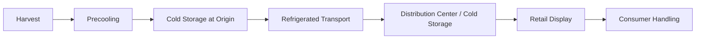

## Cold Chain Management

### Overview

Cold chain management is the coordinated system of temperature-controlled production, storage, transportation, and distribution processes used to maintain product quality and safety for perishable goods from the point of harvest or production to final consumption. It integrates postharvest physiology, refrigeration engineering, logistics, and monitoring technology to minimize temperature abuse and its cumulative, irreversible quality impacts.

### Core Principles

- **Key Points**
  - Temperature control must be continuous and unbroken; any gap ("cold chain break") allows cumulative, irreversible quality loss
  - Each commodity has an optimal temperature and relative humidity range based on its physiological characteristics (chilling sensitivity, respiration rate, freezing point)
  - Rapid removal of field heat immediately after harvest ("precooling") is the foundation of an effective cold chain
  - Time and temperature effects are cumulative across every link in the chain, not just the final storage step

### The Cold Chain Sequence



### Precooling Methods

Precooling removes field heat rapidly before extended storage or transport, slowing respiration and senescence at the earliest possible stage.

| Method | Mechanism | Typical Use Cases |
| --- | --- | --- |
| Hydrocooling | Direct contact with chilled water | Sweet corn, celery, root vegetables |
| Forced-air cooling | Refrigerated air forced through ventilated containers | Berries, leafy greens, most fruits/vegetables |
| Vacuum cooling | Rapid evaporative cooling under reduced pressure | Leafy vegetables (lettuce, spinach) with high surface area |
| Room cooling | Static cooling in a refrigerated room (slowest method) | Commodities tolerant of slower cooling rates |
| Package/liquid icing | Direct application of ice | Broccoli, corn (also provides humidity) |

$$t_{7/8} \approx 3 \times t_{1/2}$$

where $t_{1/2}$ is the half-cooling time (time to remove half the difference between initial product temperature and cooling medium temperature) and $t_{7/8}$ is the time to achieve seven-eighths cooling; this approximation is commonly used to estimate total precooling time based on the half-cooling time characteristic of a given method and commodity. [Inference] The exact multiplier relating half-cooling time to further cooling stages can vary somewhat with cooling method and load configuration, so this relationship should be treated as a practical estimation tool rather than an exact physical law.

### Refrigerated Storage

Cold storage facilities must be designed to match the physiological requirements of stored commodities.

- **Key Points**
  - Chilling-sensitive tropical/subtropical commodities require storage above their chilling injury threshold (commonly 10–13°C for items like banana, mango, cucumber)
  - Non-chilling-sensitive temperate commodities can typically be stored near 0°C
  - Relative humidity is maintained at 85–95% for most fresh produce to minimize water loss and shriveling
  - Controlled atmosphere (CA) storage combines temperature control with regulated $O_2$/$CO_2$ levels for extended storage of commodities like apples

### Refrigerated Transport

Refrigerated transport ("reefer" systems) extends temperature control across trucks, containers, rail cars, and ships.

- **Key Points**
  - Proper air circulation within loaded vehicles is essential; overpacking or blocking air channels creates uneven temperatures and hot spots
  - Pre-cooling the transport vehicle itself before loading prevents the cargo from absorbing residual heat
  - Product must be precooled before loading — reefer units are designed to maintain temperature, not to remove significant field heat
  - Temperature data loggers and real-time GPS-linked monitoring systems are increasingly used to verify compliance during transit

### The Cold Chain Illustrated

<svg xmlns="http://www.w3.org/2000/svg" viewBox="0 0 900 260">
<text x="450" y="20" font-size="14" text-anchor="middle" font-family="sans-serif" font-weight="bold">Cold Chain from Harvest to Consumer (svg_diagram)</text>
<g font-family="sans-serif" font-size="11">
<rect x="10" y="70" width="110" height="55" rx="6" fill="#D6EAF8" stroke="#1A5276" />
<text x="65" y="95" text-anchor="middle">Harvest</text>
<text x="65" y="110" text-anchor="middle">(Ambient Temp)</text>



```
<rect x="150" y="70" width="110" height="55" rx="6" fill="#D6EAF8" stroke="#1A5276" />
<text x="205" y="95" text-anchor="middle">Precooling</text>
<text x="205" y="110" text-anchor="middle">(Field Heat Removal)</text>

<rect x="290" y="70" width="110" height="55" rx="6" fill="#D6EAF8" stroke="#1A5276" />
<text x="345" y="95" text-anchor="middle">Cold Storage</text>
<text x="345" y="110" text-anchor="middle">(Origin)</text>

<rect x="430" y="70" width="110" height="55" rx="6" fill="#D6EAF8" stroke="#1A5276" />
<text x="485" y="95" text-anchor="middle">Refrigerated</text>
<text x="485" y="110" text-anchor="middle">Transport</text>

<rect x="570" y="70" width="110" height="55" rx="6" fill="#D6EAF8" stroke="#1A5276" />
<text x="625" y="95" text-anchor="middle">Distribution</text>
<text x="625" y="110" text-anchor="middle">Center</text>

<rect x="710" y="70" width="170" height="55" rx="6" fill="#D6EAF8" stroke="#1A5276" />
<text x="795" y="95" text-anchor="middle">Retail Display /</text>
<text x="795" y="110" text-anchor="middle">Consumer</text>

<line x1="120" y1="97" x2="150" y2="97" stroke="#1A5276" stroke-width="2" marker-end="url(#arrow4)" />
<line x1="260" y1="97" x2="290" y2="97" stroke="#1A5276" stroke-width="2" marker-end="url(#arrow4)" />
<line x1="400" y1="97" x2="430" y2="97" stroke="#1A5276" stroke-width="2" marker-end="url(#arrow4)" />
<line x1="540" y1="97" x2="570" y2="97" stroke="#1A5276" stroke-width="2" marker-end="url(#arrow4)" />
<line x1="680" y1="97" x2="710" y2="97" stroke="#1A5276" stroke-width="2" marker-end="url(#arrow4)" />

<text x="450" y="175" text-anchor="middle" font-size="12" fill="#555">A single unrefrigerated gap ("cold chain break") at any link</text>
<text x="450" y="193" text-anchor="middle" font-size="12" fill="#555">can accelerate quality loss for the remainder of the chain.</text>
```

</g>
</svg>

### Temperature Monitoring and Data Logging

Modern cold chains rely on continuous monitoring technologies to detect and document temperature excursions.

- **Key Points**
  - **Data loggers**: standalone devices recording temperature (and sometimes humidity) at set intervals throughout transport and storage
  - **Time-Temperature Indicators (TTIs)**: color-changing labels that provide a visual, cumulative indication of temperature abuse exposure
  - **IoT-enabled sensors**: wireless sensors transmitting real-time temperature data via cellular or satellite networks, often integrated with GPS for location tracking
  - **Blockchain and traceability platforms**: increasingly used to create tamper-evident records linking temperature data to specific shipment lots for supply chain accountability

[Unverified] The specific adoption rate and standardization of IoT- and blockchain-based cold chain monitoring platforms vary considerably by region and market segment, and should be evaluated against current vendor and industry adoption data.

### Cold Chain Losses and Their Causes

| Failure Point | Common Cause | Consequence |
| --- | --- | --- |
| Delayed precooling | Harvest-to-cooling gap too long | Accelerated respiration and senescence before storage even begins |
| Loading dock exposure | Product left on uncooled docks | Partial rewarming, condensation risk |
| Poor vehicle loading | Blocked airflow, overpacking | Uneven temperatures, localized hot spots |
| Equipment failure | Refrigeration unit malfunction | Temperature excursion, potential total loss |
| Retail display abuse | Inadequate display case temperature control | Reduced shelf life at point of sale |

### Cold Chain Requirements by Commodity Type

| Commodity Category | Storage/Transport Temp | Relative Humidity | Chilling Sensitivity |
| --- | --- | --- | --- |
| Leafy vegetables | 0–2°C | 95–100% | Low (not chilling-sensitive) |
| Citrus fruits | 3–10°C | 85–90% | Low–moderate |
| Tropical fruits (banana, mango, papaya) | 10–13°C | 85–95% | High (chilling-sensitive) |
| Dairy products | 0–4°C | N/A | Not applicable (non-plant) |
| Frozen products | −18°C or below | N/A | Not applicable |

[Inference] Optimal ranges are commonly cited reference values; actual operational setpoints are frequently adjusted based on cultivar, ripeness stage, and specific handling protocols.

### Infrastructure and Technology Components

- **Refrigeration systems**: mechanical vapor-compression systems, evaporative cooling (for humid climates), and increasingly, solar-powered cold storage for off-grid rural areas
- **Insulated packaging**: insulated boxes, gel packs, and phase-change materials for last-mile delivery where mechanical refrigeration is impractical
- **Cold storage warehouses**: multi-temperature zone facilities accommodating different commodity requirements simultaneously
- **Reefer containers**: intermodal refrigerated containers enabling temperature-controlled long-distance and international shipping

### Challenges in Cold Chain Management (Developing Agricultural Contexts)

- **Key Points**
  - High capital and energy costs for refrigeration infrastructure limit adoption among smallholder farmers
  - Inconsistent or unreliable electricity supply in rural areas disrupts cold storage continuity
  - Fragmented supply chains with multiple handoffs increase the risk of cold chain breaks
  - Lack of precooling facilities near production sites forces delayed cooling, undermining downstream cold chain effectiveness

[Speculation] Emerging solutions such as solar-powered cold storage hubs and mobile precooling units are frequently proposed to address these infrastructure gaps in developing agricultural regions, though widespread commercial viability and adoption outcomes are still being evaluated in the field.

### Strengthening Cold Chain Performance

- **Next Steps** (practical measures for improving cold chain integrity)
  - Minimize the harvest-to-precooling interval as much as logistically possible
  - Standardize temperature monitoring with data loggers or TTIs at every transfer point
  - Design vehicle loading patterns to preserve adequate airflow around product
  - Establish clear corrective action protocols for detected temperature excursions
  - Invest in precooling infrastructure close to production areas to prevent delays
  - Train personnel at every link in the chain on proper handling and temperature control practices

### Related Topics

- Postharvest physiology of crops (foundational biological basis for cold chain requirements)
- Storage and preservation methods (broader preservation technology context)
- Controlled atmosphere (CA) storage system design
- Solar-powered and off-grid cold storage solutions for rural agriculture
- IoT and blockchain-based supply chain traceability systems
- Refrigerated transport (reefer) logistics and route planning
- Chilling injury thresholds and commodity-specific storage guides
- Last-mile cold chain solutions for smallholder and rural markets