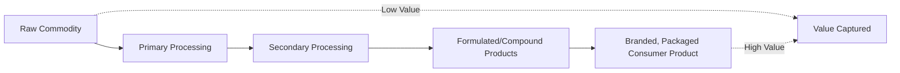
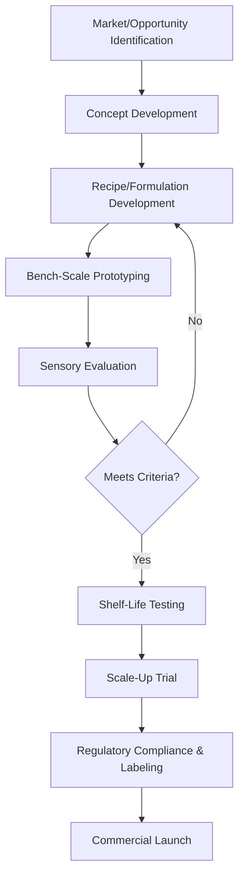

## Value-Added Product Development


### Overview

Value-added product development is the process of transforming raw or minimally processed agricultural commodities into products with enhanced market value, extended shelf life, improved convenience, or differentiated positioning. It bridges primary agricultural production and consumer markets by applying food science, processing technology, packaging, and marketing principles to capture greater economic returns from raw materials, particularly for surplus, off-grade, or perishable commodities that would otherwise incur significant postharvest losses.

### Concept and Rationale of Value Addition

- **Key Points**
  - Value addition increases the economic worth of a raw commodity beyond its farm-gate price
  - Converts perishable surplus into shelf-stable products, reducing postharvest losses
  - Enables product differentiation and access to new market segments (convenience, premium, export)
  - Captures a larger share of the value chain for producers/processors rather than selling raw commodities alone
  - Can utilize off-grade or cosmetically imperfect produce that would otherwise be rejected by fresh markets

### The Value Addition Continuum



| Stage | Description | Example |
| --- | --- | --- |
| Raw commodity | Minimal transformation | Fresh mango |
| Primary processing | Cleaning, cutting, basic preservation | Sliced, frozen mango |
| Secondary processing | Significant transformation | Mango puree, dried mango |
| Formulated product | Combined with other ingredients | Mango juice blend, mango jam |
| Branded consumer product | Packaged, labeled, marketed | Retail-ready mango juice with brand identity |

### Categories of Value-Added Products

**Minimally Processed / Fresh-Cut Products**

- Washing, trimming, cutting, and packaging fresh produce for convenience (e.g., pre-cut salad mixes, peeled fruit)
- Requires stringent sanitation control since cutting increases surface area exposed to microbial contamination and accelerates respiration and enzymatic browning

**Preserved and Shelf-Stable Products**

- Dried products (dried fruits, vegetable chips, dehydrated herbs)
- Canned or bottled products (fruit preserves, vegetable pickles, sauces)
- Fermented products (yogurt, vinegar, fermented vegetables)

**Extracted and Concentrated Products**

- Juices, purees, concentrates, and extracts
- Oils extracted from oilseeds or fruit (e.g., coconut oil, olive oil)
- Essential oils and flavor extracts

**Formulated and Composite Products**

- Jams, jellies, and marmalades
- Sauces, condiments, and dressings
- Baked goods incorporating agricultural raw materials (e.g., flour-based products)
- Functional and fortified foods (nutrient-enriched products)

**By-Product Utilization**

- Converting processing waste/by-products into secondary value-added items (e.g., fruit peels into pectin, animal feed, or compost; rice hulls into biochar or briquettes)
- **Example**
  - Surplus or off-grade tomatoes converted into tomato paste, sauce, or sun-dried tomatoes
  - Cassava processed into flour, chips, or starch for industrial use
  - Coconut processed into copra, virgin coconut oil, coconut milk, and coconut flour from residual meal

### Product Development Process



**Key Stages Explained**

- **Market/opportunity identification**: assessing consumer demand, surplus commodity availability, and competitive landscape
- **Formulation development**: determining ingredient ratios, processing parameters, and desired sensory/functional properties
- **Sensory evaluation**: structured taste panels assessing appearance, aroma, texture, flavor, and overall acceptability
- **Shelf-life testing**: accelerated and real-time storage studies to establish safe and quality-acceptable shelf life
- **Scale-up trial**: transitioning from bench/pilot scale to production-scale equipment, addressing process parameter changes at larger volumes
- **Regulatory compliance**: ensuring the product meets food safety standards, labeling requirements, and any required certifications before market launch

### Formulation Considerations

- **Key Points**
  - **Ingredient functionality**: understanding how each ingredient contributes to texture, flavor, stability, and shelf life (e.g., pectin for gelling in jams, acid for preservation and flavor balance)
  - **Water activity and pH control**: critical for both safety (see food safety standards) and shelf-life targets
  - **Cost formulation**: balancing ingredient costs against target price point and margin requirements
  - **Nutritional profile**: maintaining or enhancing nutritional value, especially important for fortified or "healthy" positioned products

$$\text{Product Cost} = \sum (\text{Ingredient Quantity}_i \times \text{Unit Cost}_i) + \text{Processing Cost} + \text{Packaging Cost}$$

### Packaging as a Value-Adding Component

Packaging serves both functional (protection, shelf-life extension) and marketing (branding, differentiation) roles.

- **Key Points**
  - Barrier properties (moisture, oxygen, light) must match the product's preservation requirements
  - Package format influences perceived value (e.g., portion-controlled packs, resealable pouches)
  - Labeling must comply with regulatory requirements (nutrition facts, ingredient lists, allergen declarations, net weight)
  - Branding and visual design differentiate the product in competitive retail environments

### Shelf-Life Determination

Shelf life is established through storage studies tracking quality attributes and safety parameters over time under defined conditions.

- **Accelerated shelf-life testing (ASLT)**: uses elevated temperatures to predict shelf life more quickly, based on the principle that reaction rates (including spoilage) increase predictably with temperature (see $Q_{10}$ relationship)
- **Real-time shelf-life testing**: monitors the product under actual intended storage conditions until failure criteria are reached; provides the most reliable results but requires longer testing periods

[Inference] Accelerated shelf-life predictions rely on the assumption that the dominant degradation mechanism follows consistent kinetics across the tested temperature range; this assumption should be validated against real-time data before finalizing shelf-life claims, since some degradation pathways do not scale linearly with temperature.

### Value-Added Product Development Pathway (Illustration)

<svg xmlns="http://www.w3.org/2000/svg" viewBox="0 0 900 240">
<text x="450" y="20" font-size="14" text-anchor="middle" font-family="sans-serif" font-weight="bold">From Raw Commodity to Market-Ready Product (svg_diagram)</text>
<g font-family="sans-serif" font-size="11">
<rect x="10" y="60" width="120" height="55" rx="6" fill="#FCF3CF" stroke="#B7950B" />
<text x="70" y="90" text-anchor="middle">Raw/Surplus</text>
<text x="70" y="105" text-anchor="middle">Commodity</text>



```
<rect x="160" y="60" width="120" height="55" rx="6" fill="#FCF3CF" stroke="#B7950B" />
<text x="220" y="90" text-anchor="middle">Formulation &amp;</text>
<text x="220" y="105" text-anchor="middle">Prototyping</text>

<rect x="310" y="60" width="120" height="55" rx="6" fill="#FCF3CF" stroke="#B7950B" />
<text x="370" y="90" text-anchor="middle">Sensory &amp;</text>
<text x="370" y="105" text-anchor="middle">Shelf-Life Testing</text>

<rect x="460" y="60" width="120" height="55" rx="6" fill="#FCF3CF" stroke="#B7950B" />
<text x="520" y="90" text-anchor="middle">Scale-Up &amp;</text>
<text x="520" y="105" text-anchor="middle">Compliance</text>

<rect x="610" y="60" width="120" height="55" rx="6" fill="#FCF3CF" stroke="#B7950B" />
<text x="670" y="90" text-anchor="middle">Packaging &amp;</text>
<text x="670" y="105" text-anchor="middle">Branding</text>

<rect x="760" y="60" width="120" height="55" rx="6" fill="#FCF3CF" stroke="#B7950B" />
<text x="820" y="90" text-anchor="middle">Market</text>
<text x="820" y="105" text-anchor="middle">Launch</text>

<line x1="130" y1="87" x2="160" y2="87" stroke="#B7950B" stroke-width="2" marker-end="url(#arrow5)" />
<line x1="280" y1="87" x2="310" y2="87" stroke="#B7950B" stroke-width="2" marker-end="url(#arrow5)" />
<line x1="430" y1="87" x2="460" y2="87" stroke="#B7950B" stroke-width="2" marker-end="url(#arrow5)" />
<line x1="580" y1="87" x2="610" y2="87" stroke="#B7950B" stroke-width="2" marker-end="url(#arrow5)" />
<line x1="730" y1="87" x2="760" y2="87" stroke="#B7950B" stroke-width="2" marker-end="url(#arrow5)" />

<text x="450" y="160" text-anchor="middle" font-size="12" fill="#555">Each stage adds cost but also adds market value —</text>
<text x="450" y="178" text-anchor="middle" font-size="12" fill="#555">the goal is ensuring value added exceeds cost added.</text>
```

</g>
</svg>

### Economic and Market Considerations

- **Key Points**
  - **Cost-benefit analysis**: processing and packaging costs must be offset by the price premium the value-added product commands
  - **Market positioning**: value-added products can target premium, mainstream, or export markets depending on quality standards and branding
  - **Scale considerations**: small-scale/artisanal production versus industrial-scale production involves different equipment investment, regulatory pathways, and distribution channels
  - **Supply chain linkages**: reliable access to raw material supply (often from smallholder farmers or cooperatives) is essential for consistent production

### Role in Reducing Postharvest Losses

Value-added processing provides an outlet for commodities that would otherwise be lost due to:

- Overproduction during peak harvest seasons
- Cosmetic imperfections that exclude produce from fresh markets
- Short shelf life of highly perishable commodities
- Distance from fresh markets making fresh sale logistically difficult
- **Example**
  - A cooperative processing surplus bananas (unsuitable for fresh export due to size/blemishes) into banana chips or banana flour, generating income that would otherwise be lost to spoilage

### Regulatory and Quality Considerations

- Compliance with food safety standards (HACCP, GMP) appropriate to the processing scale
- Accurate nutritional labeling and ingredient declaration
- Certification requirements for specific market claims (organic, fair trade, halal, export certification) where applicable
- Intellectual property considerations for unique formulations or branding

### Key Success Factors in Value-Added Product Development

- **Next Steps** (considerations for developing a viable value-added product)
  - Validate genuine consumer demand before significant investment in formulation and equipment
  - Ensure consistent, reliable access to raw material supply at appropriate quality and cost
  - Conduct rigorous sensory and shelf-life testing before scale-up
  - Design packaging and branding aligned with the target market segment
  - Confirm regulatory compliance pathways early in development to avoid costly late-stage reformulation
  - Build in cost controls to ensure the value added economically justifies the processing investment

### Related Topics

- Food processing fundamentals (foundational unit operations underlying value addition)
- Storage and preservation methods (specific techniques applied in value-added products)
- Food safety and sanitation standards (compliance requirements for market-ready products)
- Postharvest physiology of crops (informs which surplus/off-grade commodities suit value addition)
- Sensory evaluation methodology and consumer testing design
- Food packaging technology and shelf-life extension
- Agribusiness and market linkage development for smallholder producers
- By-product and waste valorization in agricultural processing