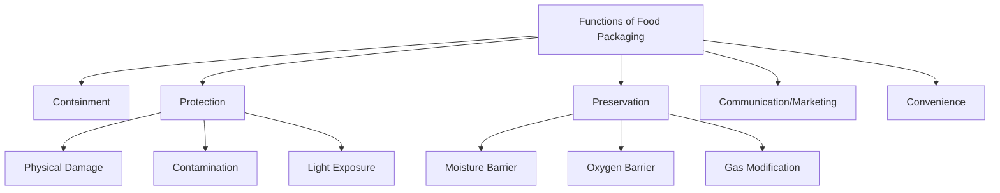
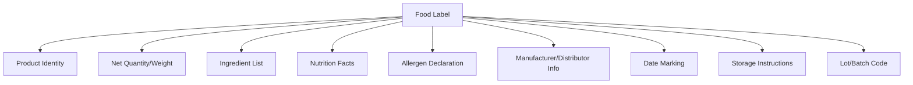
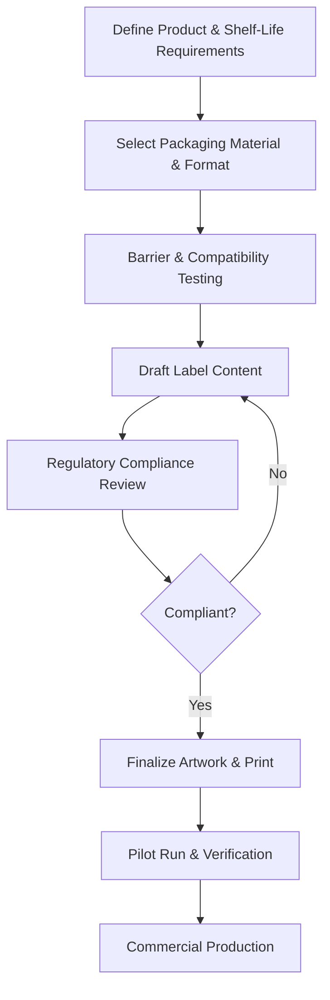

## Packaging and Labeling Requirements

### Overview

Packaging and labeling requirements encompass the functional design of food containers and the mandatory informational content applied to them, governed by both technical food science principles and regulatory compliance standards. Packaging protects product quality and safety throughout distribution, while labeling communicates essential product, safety, and nutritional information to regulators, retailers, and consumers.

### Functions of Food Packaging

- **Key Points**
  - **Containment**: holds product in a defined quantity and form for handling and sale
  - **Protection**: shields against physical damage, contamination, pests, and environmental exposure
  - **Preservation**: controls moisture, oxygen, and light transmission to slow spoilage reactions
  - **Communication**: conveys mandatory regulatory information and marketing/branding messages
  - **Convenience**: facilitates handling, storage, portioning, and use by consumers

### Packaging Materials

| Material Type | Key Properties | Common Applications |
| --- | --- | --- |
| Glass | Excellent barrier, inert, reusable, fragile, heavy | Jams, sauces, beverages, baby food |
| Metal (cans, foil) | Excellent barrier, heat-processable, opaque | Canned vegetables, fruit, meat |
| Rigid plastics (PET, HDPE, PP) | Lightweight, moldable, variable barrier properties | Bottles, tubs, trays |
| Flexible plastics/films (LDPE, PP, laminates) | Lightweight, low cost, customizable barrier | Pouches, bags, wraps |
| Paper/paperboard | Renewable, printable, limited barrier alone | Cartons, boxes, secondary packaging |
| Multilayer laminates | Combines properties of multiple materials | Juice cartons (paperboard-foil-plastic) |

- **Key Points**
  - Barrier properties (moisture vapor transmission rate, oxygen transmission rate) must be matched to the specific product's sensitivity to those factors
  - Food-contact materials must be assessed for chemical migration risk into the food product
  - Material selection balances cost, barrier performance, environmental sustainability, and processing compatibility (e.g., retort-stable pouches for thermal processing)

### Packaging Technologies for Preservation

**Modified Atmosphere Packaging (MAP)**

Gas composition inside the package is adjusted at the time of packaging (commonly using $N_2$, $CO_2$, and reduced $O_2$ mixtures) to slow respiration, oxidation, and microbial growth.

**Vacuum Packaging**

Removes air from the package prior to sealing, minimizing oxidative degradation and inhibiting aerobic microbial growth; commonly used for meats and cheeses.

**Active and Intelligent Packaging**

- **Active packaging**: incorporates components that interact with the product or headspace, such as oxygen scavengers, ethylene absorbers, or moisture-control sachets
- **Intelligent packaging**: monitors and communicates product condition, such as time-temperature indicators (TTIs) or freshness indicator labels that change color in response to spoilage-related gas production

[Unverified] Adoption rates and specific regulatory approval status of active and intelligent packaging technologies vary by region and continue to develop, and should be checked against current market and regulatory sources for a specific application.

### Regulatory Frameworks for Food Labeling

Food labeling is governed by national and international regulatory bodies to ensure consumer safety and informed choice.

- **Codex Alimentarius**: joint FAO/WHO standards providing internationally referenced labeling guidelines used as a baseline for many national regulations
- **National regulatory authorities**: examples include the FDA (United States, under the Fair Packaging and Labeling Act and Nutrition Labeling and Education Act) and the Philippine FDA (under Republic Act 10611, the Food Safety Act, and related labeling issuances), each with jurisdiction-specific requirements
- Requirements are periodically revised, so current mandatory content and formatting rules should always be verified against the applicable national regulatory authority for the target market

### Mandatory Label Elements (General Framework)

While specific requirements vary by country, most food labeling regulations require some combination of the following elements:

| Element | Purpose |
| --- | --- |
| Product name/identity | Clearly identifies what the product is |
| Net quantity/weight | States the amount of product contained, in standardized units |
| Ingredient list | Lists ingredients typically in descending order by weight |
| Nutrition facts panel | Discloses caloric and nutrient content per serving |
| Allergen declaration | Highlights presence of major allergens |
| Manufacturer/distributor information | Identifies the responsible party and contact/address |
| Date marking | Indicates expiration, best-before, or use-by date |
| Storage instructions | Specifies conditions needed to maintain product safety/quality |
| Lot/batch code | Enables traceability and recall management |

[Inference] The exact mandatory elements, their required format, font size, and placement are jurisdiction-specific and subject to periodic regulatory revision; the list above reflects commonly required categories rather than a definitive checklist for any single country.

### Allergen Labeling

Allergen declarations are among the most safety-critical labeling requirements, since undeclared allergens can pose serious or life-threatening risk to sensitive consumers.

- **Key Points**
  - Commonly regulated major allergens include milk, eggs, fish, crustacean shellfish, tree nuts, peanuts, wheat, soybeans, and (in an increasing number of jurisdictions) sesame
  - "May contain" or precautionary allergen labeling addresses cross-contact risk during shared-facility production
  - Allergen labeling requirements and the specific list of regulated allergens differ by country and should be verified for the target market

### Date Marking Terminology

- **"Best before" / "Best if used by"**: indicates quality/peak freshness date; product may remain safe to consume after this date, though quality may decline
- **"Use by" / "Expiration date"**: indicates the date after which the product should not be consumed for safety reasons, typically applied to perishable, safety-sensitive products
- **"Sell by"**: primarily a retailer inventory management date, not necessarily a consumer safety indicator

[Inference] The precise legal distinctions and required usage of these date-marking terms vary by jurisdiction, and some countries mandate specific terminology while others allow more flexibility.

### Packaging and Labeling Development Workflow

### Package Design Considerations Beyond Compliance

- **Key Points**
  - **Shelf appeal**: visual design, color, and branding influence consumer purchase decisions at point of sale
  - **Functional convenience**: resealability, portion control, and ease of opening affect consumer satisfaction
  - **Sustainability**: recyclability, biodegradability, and reduced material use are increasingly significant market and regulatory considerations
  - **Tamper evidence**: features indicating whether a package has been opened or altered, important for consumer trust and safety

### Packaging Testing and Quality Control

- **Example**
  - Seal integrity testing to confirm hermetic closure in canned or pouched products
  - Drop and compression testing to verify package durability during distribution
  - Migration testing to confirm food-contact materials do not transfer harmful substances into the product
  - Shelf-life validation studies confirming that packaging maintains product quality for the labeled duration under intended storage conditions

### Common Compliance Pitfalls

- **Next Steps** (practical considerations for ensuring compliant packaging and labeling)
  - Verify current mandatory label elements and formatting rules with the specific national regulatory authority before finalizing artwork
  - Confirm allergen declarations against the complete ingredient and processing-line cross-contact profile
  - Validate net weight declarations account for normal fill variability within legal tolerances
  - Ensure nutrition facts panel values are based on validated laboratory analysis or accepted calculation methods
  - Coordinate packaging barrier properties with actual shelf-life testing results rather than assumed performance
  - Review labeling requirements separately for each target export market, since requirements are not uniform internationally

### Related Topics

- Food safety and sanitation standards (regulatory foundation intersecting with labeling compliance)
- Value-added product development (packaging as a value-adding and market-differentiating component)
- Storage and preservation methods (packaging technologies supporting preservation)
- Modified atmosphere packaging (MAP) system design
- Nutrition labeling calculation and regulatory submission processes
- Sustainable and biodegradable packaging materials
- International food export labeling compliance (Codex Alimentarius alignment)
- Active and intelligent packaging technologies