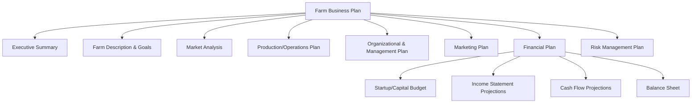
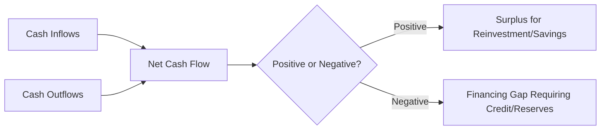
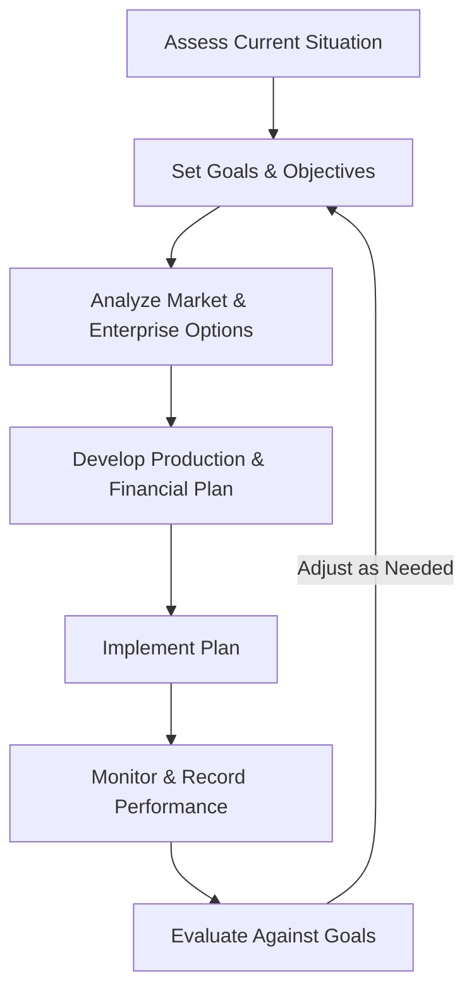

## Farm Business Planning

### Overview

Farm business planning is the systematic process of defining a farm operation's goals, resources, strategies, and financial projections to guide decision-making and improve the likelihood of profitability and sustainability. It integrates agronomic, operational, financial, and market considerations into a structured document (a farm business plan) that serves both as an internal management tool and as a communication tool for lenders, investors, and partners.

### Purpose and Functions of a Farm Business Plan

- **Key Points**
  - Clarifies the farm's mission, vision, and specific measurable goals
  - Provides a framework for resource allocation (land, labor, capital, equipment)
  - Serves as a basis for securing financing, grants, or investment
  - Establishes benchmarks for monitoring performance and making corrective decisions
  - Reduces risk by anticipating challenges (market, production, financial, climatic) before they occur

### Core Components of a Farm Business Plan

| Component | Purpose |
| --- | --- |
| Executive summary | Concise overview of the entire plan, written last but placed first |
| Farm description & goals | Background, mission, vision, and specific SMART objectives |
| Market analysis | Target market, demand trends, competitor assessment |
| Production/operations plan | Crop/livestock enterprise details, inputs, timelines, infrastructure |
| Organizational & management plan | Business structure, labor, roles, responsibilities |
| Marketing plan | Pricing, promotion, distribution channels |
| Financial plan | Budgets, projected statements, funding requirements |
| Risk management plan | Identification and mitigation of production, market, and financial risks |

### Setting Farm Goals and Objectives

Effective farm goals are commonly structured using the SMART framework:

- **Specific**: clearly defined outcome (e.g., "increase rice yield")
- **Measurable**: quantifiable target (e.g., "by 15%")
- **Achievable**: realistic given available resources
- **Relevant**: aligned with overall farm mission
- **Time-bound**: defined timeframe (e.g., "within two cropping seasons")
- **Example**
  - "Increase net farm income by 20% within three years by diversifying into a value-added product line while maintaining current staple crop production."

### Situational (SWOT) Analysis

A structured assessment of internal and external factors informs realistic goal-setting and strategy development.

| Factor | Internal/External | Description |
| --- | --- | --- |
| Strengths | Internal | Resources or capabilities giving the farm an advantage (e.g., fertile soil, established market relationships) |
| Weaknesses | Internal | Limitations constraining performance (e.g., limited capital, aging equipment) |
| Opportunities | External | Favorable external conditions (e.g., growing demand for a crop, new government support program) |
| Threats | External | External risks (e.g., climate variability, price volatility, pest outbreaks) |

### Enterprise Selection and Resource Assessment

- **Key Points**
  - **Land resources**: soil type, topography, water availability, and existing land use inform crop/livestock suitability
  - **Labor resources**: availability of family labor, hired labor, and seasonal labor needs across the production calendar
  - **Capital resources**: available cash, credit access, and asset base determine feasible scale of operations
  - **Enterprise selection**: choosing crop/livestock combinations based on resource fit, market demand, risk tolerance, and comparative profitability

### Production/Operations Planning

The operations plan translates enterprise choices into a concrete production schedule and resource requirement map.

- **Key Points**
  - Cropping/production calendar aligned with agroclimatic conditions and market timing
  - Input requirements (seed, fertilizer, feed, labor) quantified per production cycle
  - Infrastructure and equipment needs identified against current farm assets
  - Production targets (yield, quality standards) established as performance benchmarks

### Financial Planning Fundamentals

**Enterprise Budgeting**

An enterprise budget estimates the costs and returns associated with a specific farm enterprise (a crop or livestock activity) over a defined production period.

$$\text{Net Return} = \text{Total Revenue} - (\text{Variable Costs} + \text{Fixed Costs})$$

| Cost Category | Examples |
| --- | --- |
| Variable costs | Seed, fertilizer, pesticides, fuel, hired labor for specific operations |
| Fixed costs | Land rent/tax, equipment depreciation, insurance, loan interest |

**Break-Even Analysis**

Break-even analysis determines the production level or price at which total revenue equals total costs.

$$\text{Break-Even Yield} = \frac{\text{Total Costs}}{\text{Price per Unit}}$$

$$\text{Break-Even Price} = \frac{\text{Total Costs}}{\text{Expected Yield}}$$

- **Example**
  - If total production costs for a rice crop are ₱80,000 per hectare and the expected selling price is ₱16 per kilogram, the break-even yield is approximately 5,000 kg/hectare — any yield above this level generates a profit at that price.

**Cash Flow Projection**

A cash flow statement projects the timing of cash inflows (sales, loans) and outflows (input purchases, labor, debt repayment) across the planning period, revealing periods of potential cash shortfall before they occur.

**Balance Sheet**

A balance sheet provides a snapshot of the farm's financial position at a point in time.

$$\text{Owner's Equity} = \text{Total Assets} - \text{Total Liabilities}$$

### Farm Business Planning Cycle

### Risk Management in Farm Planning

- **Key Points**
  - **Production risk**: weather variability, pest/disease outbreaks, input quality issues — mitigated through diversification, crop insurance, and good agricultural practices
  - **Market risk**: price volatility and demand shifts — mitigated through contract farming, forward pricing agreements, or market diversification
  - **Financial risk**: debt servicing capacity and interest rate exposure — mitigated through conservative leverage and maintaining cash reserves
  - **Institutional/legal risk**: changes in regulation, land tenure issues, or policy shifts affecting farm operations

[Inference] The relative importance of each risk category depends heavily on the specific enterprise, region, and market context, so risk prioritization should be tailored to the individual farm's situation rather than applied generically.

### Farm Business Structures

| Structure | Characteristics |
| --- | --- |
| Sole proprietorship | Single owner, full control, unlimited personal liability |
| Partnership | Shared ownership and management among partners, shared liability |
| Cooperative | Member-owned and controlled, shared resources and marketing power |
| Corporation | Separate legal entity, limited liability, more complex regulatory requirements |

[Unverified] Specific legal, tax, and registration requirements for each farm business structure vary by country and should be verified against local regulatory and tax authorities before formal registration.

### Monitoring and Evaluation

- **Key Points**
  - Regular record-keeping (production records, financial transactions, input usage) enables performance tracking against plan targets
  - Key performance indicators (yield per hectare, net profit margin, return on investment) provide quantifiable benchmarks
  - Periodic plan review allows adjustment in response to actual performance, changing market conditions, or new opportunities

### Common Pitfalls in Farm Business Planning

- **Next Steps** (practical guidance for developing a robust farm business plan)
  - Base yield and price assumptions on realistic historical data or credible market research rather than optimistic estimates
  - Include a contingency margin in financial projections to account for production and price variability
  - Separate personal/household expenses from farm business financial records for clearer performance assessment
  - Revisit and update the plan regularly rather than treating it as a static, one-time document
  - Seek input from agricultural extension services, financial advisors, or experienced producers when developing projections

### Related Topics

- Farm financial management and record-keeping systems
- Agricultural marketing and value chain analysis
- Farm risk management and crop insurance mechanisms
- Cooperative and farmer organization development
- Agricultural credit and financing sources
- Enterprise budgeting and cost-of-production analysis
- Value-added product development (as a diversification strategy)
- Agricultural policy and land tenure considerations