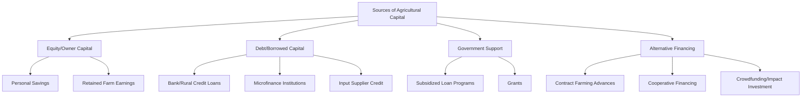
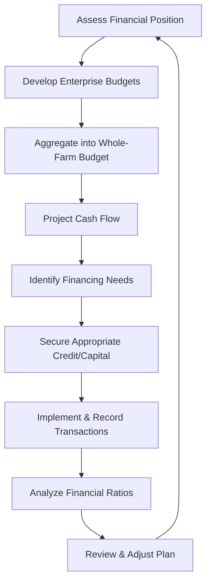

## Agricultural Finance and Budgeting

### Overview

Agricultural finance and budgeting encompasses the principles and tools used to manage capital, credit, and financial resources within farm operations. It covers sourcing and structuring funds for agricultural investment, systematically planning income and expenditure, and evaluating financial performance to support sound decision-making across production cycles that are often characterized by seasonal cash flow patterns and production risk.

### The Scope of Agricultural Finance

- **Key Points**
  - **Farm finance**: managing internal financial resources — budgeting, capital allocation, working capital management
  - **Agricultural credit**: sourcing external funds through loans, credit lines, and financing instruments
  - **Investment analysis**: evaluating the financial viability of capital investments (equipment, land, infrastructure)
  - **Risk and insurance**: managing financial exposure to production, price, and climatic risks

### Sources of Agricultural Capital

| Source Type | Characteristics |
| --- | --- |
| Equity capital | Owner's own funds; no repayment obligation but limits scale to available savings |
| Debt capital | Borrowed funds requiring repayment with interest; enables larger investment but adds financial risk |
| Government/institutional support | Subsidized credit, grants, or guarantee programs aimed at agricultural development |
| Cooperative/group financing | Pooled resources among farmer groups, often with more favorable terms |
| Alternative financing | Contract farming advances, value chain financing, and emerging digital lending platforms |

[Unverified] Specific loan terms, interest rate subsidies, and eligibility criteria for government agricultural credit programs vary considerably by country and change over time, and should be verified against the relevant national agricultural credit agency.

### Types of Agricultural Loans

- **Short-term (operating) loans**: cover input costs (seed, fertilizer, labor) within a single production cycle, typically repaid after harvest sale
- **Intermediate-term loans**: finance equipment, livestock, or improvements with useful life of 1–7 years
- **Long-term loans**: finance land purchase or major infrastructure, typically repaid over many years

### Farm Budgeting Fundamentals

**Enterprise Budget**

An enterprise budget itemizes the expected costs and returns for a single production activity (a specific crop or livestock enterprise) over one production cycle.

$$\text{Net Return per Unit} = \text{Revenue per Unit} - \text{Total Cost per Unit}$$

| Component | Examples |
| --- | --- |
| Gross revenue | Yield × price per unit |
| Variable (operating) costs | Seed, fertilizer, agrochemicals, fuel, hired labor |
| Fixed (ownership) costs | Depreciation, land charge/rent, insurance, taxes |
| Net return | Gross revenue minus total costs |

**Whole-Farm Budget**

A whole-farm budget aggregates all enterprise budgets along with overhead costs to project total farm-level profitability.

$$\text{Whole-Farm Net Income} = \sum \text{Enterprise Net Returns} - \text{Farm Overhead Costs}$$

**Partial Budget**

A partial budget evaluates the financial impact of a specific proposed change (e.g., switching part of the farm to a new crop) by comparing only the costs and returns that would change, rather than reconstructing the entire farm budget.

$$\text{Partial Budget} = (\text{Added Revenue} + \text{Reduced Costs}) - (\text{Added Costs} + \text{Reduced Revenue})$$

- **Example**
  - A farmer considering converting 2 hectares from corn to a vegetable crop would use a partial budget to compare only the added vegetable revenue and costs against the corn revenue and costs that would be foregone — not the entire farm's finances.

### Cash Flow Budgeting

A cash flow budget projects the timing of cash inflows and outflows on a periodic basis (monthly or seasonal), which is critical in agriculture due to the pronounced seasonality of income (concentrated at harvest) versus expenses (spread across the production cycle).

$$\text{Ending Cash Balance} = \text{Beginning Balance} + \text{Cash Inflows} - \text{Cash Outflows}$$

- **Key Points**
  - Identifies periods of projected cash shortfall before they occur, allowing proactive arrangement of credit lines
  - Distinguishes cash transactions from accrual accounting entries (e.g., depreciation is a cost but not a cash outflow)
  - Essential for timing loan drawdowns and repayments around expected harvest income

### Key Financial Statements

| Statement | Purpose |
| --- | --- |
| Income statement (profit and loss) | Reports revenue, expenses, and net income over a period |
| Balance sheet | Reports assets, liabilities, and owner's equity at a point in time |
| Cash flow statement | Reports actual or projected cash inflows and outflows over a period |
| Statement of owner's equity | Reports changes in owner's equity over a period |

$$\text{Owner's Equity} = \text{Total Assets} - \text{Total Liabilities}$$

### Financial Ratio Analysis

Financial ratios provide standardized measures for assessing farm financial health and enabling comparison across time periods or against benchmarks.

| Ratio Category | Example Ratio | Formula | Interpretation |
| --- | --- | --- | --- |
| Liquidity | Current ratio | Current Assets ÷ Current Liabilities | Ability to meet short-term obligations |
| Solvency | Debt-to-asset ratio | Total Liabilities ÷ Total Assets | Degree of leverage/financial risk |
| Profitability | Return on assets (ROA) | Net Farm Income ÷ Total Assets | Efficiency of asset use in generating income |
| Efficiency | Operating expense ratio | Operating Expenses ÷ Gross Revenue | Proportion of revenue consumed by operating costs |
| Repayment capacity | Debt service coverage ratio | Net Farm Income Available for Debt Service ÷ Total Debt Service | Ability to meet loan repayment obligations |

[Inference] Benchmark values for "healthy" ratio ranges vary by farm type, region, and prevailing credit market conditions, so ratio results are best interpreted relative to trend over time and comparable farm operations rather than against a single universal standard.

### Capital Investment Analysis

For major investment decisions (equipment purchase, irrigation infrastructure, land acquisition), time-value-of-money techniques evaluate long-term financial viability.

**Net Present Value (NPV)**

$$NPV = \sum_{t=0}^{n} \frac{CF_t}{(1 + r)^t}$$

where $CF_t$ is the net cash flow in period $t$, $r$ is the discount rate, and $n$ is the number of periods. A positive NPV indicates the investment is expected to add value beyond the required return rate.

**Payback Period**

$$\text{Payback Period} = \frac{\text{Initial Investment}}{\text{Annual Net Cash Flow}}$$

A simpler measure indicating how long it takes for an investment to recover its initial cost, though it does not account for the time value of money or cash flows beyond the payback point.

### Depreciation of Farm Assets

Depreciation allocates the cost of a durable asset (machinery, buildings, irrigation systems) over its useful life, reflecting the gradual consumption of its value.

$$\text{Straight-Line Depreciation} = \frac{\text{Purchase Cost} - \text{Salvage Value}}{\text{Useful Life (years)}}$$

- **Example**
  - A tractor purchased for ₱1,200,000 with an estimated salvage value of ₱200,000 and a useful life of 10 years would be depreciated at ₱100,000 per year under the straight-line method.

### Managing Financial Risk

- **Key Points**
  - **Crop/agricultural insurance**: transfers production and sometimes price risk to an insurer in exchange for a premium
  - **Diversification**: spreading production across multiple enterprises reduces dependence on a single commodity's price or yield performance
  - **Forward contracts and marketing agreements**: lock in prices ahead of harvest, reducing exposure to price volatility
  - **Maintaining liquidity reserves**: cash or readily convertible assets provide a buffer against unexpected shortfalls

### Agricultural Finance and Budgeting Workflow

### Common Financial Management Challenges

- **Key Points**
  - Seasonal income concentration creates cash flow gaps requiring careful timing of credit and expenditure
  - Limited collateral or credit history can restrict smallholder access to formal financing
  - Price and yield volatility complicate accurate financial forecasting
  - Informal or incomplete record-keeping undermines the accuracy of financial analysis and loan applications

### Practical Guidance for Sound Agricultural Financial Management

- **Next Steps** (practical measures for strengthening farm financial management)
  - Maintain consistent, organized financial records to support accurate budgeting and loan applications
  - Prepare enterprise budgets before each production cycle to inform crop/enterprise selection decisions
  - Build a cash flow projection covering at least one full production cycle to anticipate financing needs
  - Compare financing options (formal credit, cooperative financing, input supplier credit) for cost and terms before borrowing
  - Regularly calculate and monitor key financial ratios to track farm financial health over time
  - Incorporate insurance or diversification strategies appropriate to the farm's specific risk exposure

### Related Topics

- Farm business planning (broader strategic framework incorporating financial planning)
- Agricultural credit systems and microfinance institutions
- Crop insurance and agricultural risk transfer mechanisms
- Cost of production analysis and enterprise budgeting
- Capital investment appraisal for farm machinery and infrastructure
- Farm record-keeping systems and financial statement preparation
- Value chain financing and contract farming arrangements
- Cooperative-based agricultural financing models