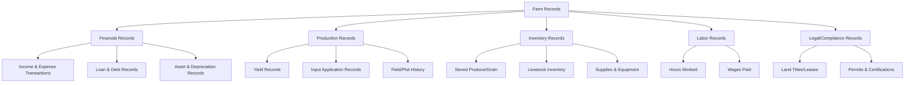
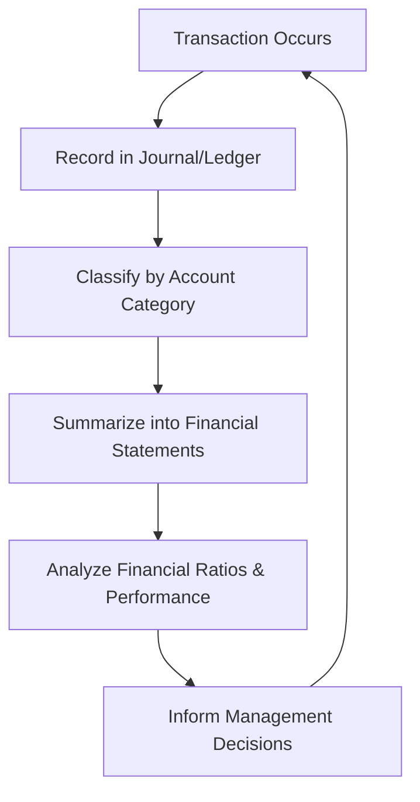
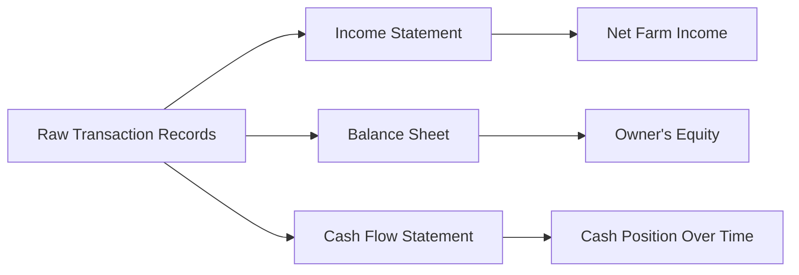

## Farm Record Keeping and Accounting

### Overview

Farm record keeping and accounting is the systematic collection, organization, and analysis of production, financial, and operational data generated by a farm business. Reliable records form the foundation for informed decision-making, financial statement preparation, credit access, tax compliance, and performance evaluation. Without accurate records, budgeting, financial ratio analysis, and business planning all rest on estimates rather than verified data.

### Purpose and Importance of Farm Records

- **Key Points**
  - Provides the factual basis for preparing financial statements (income statement, balance sheet, cash flow statement)
  - Supports loan applications by demonstrating financial history and repayment capacity to lenders
  - Enables accurate tax reporting and compliance with regulatory requirements
  - Facilitates performance analysis (enterprise profitability, cost efficiency, yield trends) over time
  - Assists in identifying problems early (declining yields, rising input costs, cash flow gaps)
  - Supports succession planning and farm transfer by documenting asset history and business performance

### Types of Farm Records

| Record Type | Examples | Primary Use |
| --- | --- | --- |
| Financial records | Sales receipts, expense invoices, bank statements, loan documents | Financial statement preparation, tax filing |
| Production records | Planting dates, yields, input applications, harvest data | Enterprise performance analysis, agronomic decisions |
| Inventory records | Grain/produce stocks, livestock counts, input supplies | Asset valuation, planning input purchases |
| Labor records | Hours worked, wages paid, task assignments | Labor cost analysis, payroll compliance |
| Legal/compliance records | Land titles, leases, permits, certifications | Regulatory compliance, asset verification |

### Accounting Methods

**Cash Accounting**

Records income and expenses at the time cash is actually received or paid, regardless of when the underlying economic activity occurred.

- **Key Points**
  - Simpler to maintain and commonly used by smaller farm operations
  - Can distort the picture of true profitability in a given period since income and related expenses may fall in different accounting periods
  - Often used for tax reporting purposes in many jurisdictions due to its simplicity

**Accrual Accounting**

Records income when earned and expenses when incurred, regardless of when cash actually changes hands, providing a more accurate matching of revenue and related costs within a given period.

- **Key Points**
  - Provides a more accurate assessment of true enterprise profitability for a given production period
  - Requires tracking of accounts receivable, accounts payable, and inventory changes in addition to cash transactions
  - Generally preferred for internal management analysis and by larger or more complex farm operations

[Inference] The choice between cash and accrual accounting, and any regulatory requirement to use one or the other for tax purposes, depends on farm size, legal structure, and jurisdiction-specific tax rules, and should be confirmed with a qualified accountant or the relevant tax authority.

### The Farm Accounting Cycle

### Chart of Accounts for Farm Enterprises

A chart of accounts organizes financial transactions into standardized categories, enabling consistent tracking and reporting.

| Category | Examples |
| --- | --- |
| Income accounts | Crop sales, livestock sales, government payments, custom work income |
| Expense accounts | Seed, fertilizer, fuel, hired labor, repairs, insurance, interest |
| Asset accounts | Cash, accounts receivable, inventory, land, machinery, buildings |
| Liability accounts | Accounts payable, short-term loans, long-term debt |
| Equity accounts | Owner's contributions, retained earnings |

### Enterprise Cost Allocation

Where a farm operates multiple enterprises (e.g., separate crop and livestock activities), costs should be allocated to the specific enterprise that incurs them to enable accurate enterprise-level profitability analysis.

- **Direct costs**: costs clearly attributable to a single enterprise (e.g., seed for a specific crop)
- **Shared/overhead costs**: costs benefiting multiple enterprises (e.g., general farm labor, land taxes) that require an allocation method (per hectare, per unit of output, or time-based allocation) to distribute fairly across enterprises

$$\text{Allocated Overhead}_i = \text{Total Overhead} \times \frac{\text{Allocation Base}_i}{\sum \text{Allocation Base}}$$

where $\text{Allocation Base}_i$ represents the chosen basis (e.g., hectares farmed) attributable to enterprise $i$.

### Production Record Keeping

- **Key Points**
  - **Field/plot records**: track crop history, input applications, and yield by field to identify performance trends and inform rotation planning
  - **Yield monitoring**: recorded yields enable comparison against budgeted targets and historical performance
  - **Input application logs**: document what, when, and how much fertilizer, pesticide, or other inputs were applied, supporting both agronomic decisions and regulatory/certification compliance (e.g., organic certification, pesticide use records)
- **Example**
  - A field record showing declining yield over consecutive seasons despite consistent input application may prompt soil testing to investigate underlying fertility or drainage issues

### Depreciation Record Keeping

Depreciation records track the allocation of a durable asset's cost over its useful life, important both for accurate financial statements and tax reporting.

$$\text{Annual Straight-Line Depreciation} = \frac{\text{Purchase Cost} - \text{Salvage Value}}{\text{Useful Life (years)}}$$

Depreciation schedules should record, for each asset: purchase date, purchase cost, depreciation method, useful life, accumulated depreciation, and current book value.

### Record-Keeping Tools and Systems

| Tool Type | Characteristics |
| --- | --- |
| Manual/paper records | Low cost, simple, but higher risk of loss and error, harder to analyze in aggregate |
| Spreadsheet software | Flexible, accessible, moderate learning curve, suitable for small-to-medium operations |
| Dedicated farm accounting/management software | Purpose-built for agricultural enterprises, may include production and financial modules together |
| Mobile/cloud-based farm management apps | Enable real-time field data entry, often with GPS/mapping integration |

[Unverified] The specific features, pricing, and regional availability of dedicated farm accounting and mobile farm management software vary considerably and change frequently, so current options should be evaluated against up-to-date vendor information for the applicable market.

### Financial Statement Preparation from Records

Accurate, well-organized records are the direct input for the financial statements and ratio analyses used in farm business planning and financial management (see related topics).

### Record Retention and Compliance

- **Key Points**
  - Tax authorities typically specify minimum record retention periods (commonly several years, varying by jurisdiction) for supporting documentation
  - Certification programs (organic, fair trade, GAP) often impose specific record-keeping requirements as a condition of certification
  - Loan agreements may require ongoing financial reporting to lenders as a condition of credit

[Unverified] Specific record retention periods and certification-related record-keeping requirements differ by country and certifying body, and should be verified against the applicable tax authority or certification standard.

### Common Record-Keeping Challenges

- **Key Points**
  - Inconsistent or delayed data entry leads to incomplete or inaccurate records
  - Mixing personal/household and farm business transactions obscures true farm profitability
  - Lack of enterprise-level cost allocation prevents identification of which activities are actually profitable
  - Limited digital literacy or infrastructure can hinder adoption of software-based record systems in some farming contexts

### Best Practices for Effective Farm Record Keeping

- **Next Steps** (practical measures for establishing a reliable record-keeping system)
  - Maintain separate accounts and records for farm business and personal/household finances
  - Record transactions promptly rather than relying on memory or delayed batch entry
  - Choose a record-keeping method (manual, spreadsheet, or software) appropriate to farm complexity and available resources
  - Allocate shared costs to individual enterprises consistently to enable meaningful profitability comparisons
  - Reconcile records regularly (e.g., monthly) against bank statements and physical inventory counts
  - Retain supporting documentation (receipts, invoices, contracts) according to applicable tax and certification requirements

### Related Topics

- Farm business planning (uses record-keeping data as planning input)
- Agricultural finance and budgeting (relies on accurate records for ratio analysis and budgeting)
- Enterprise budgeting and cost-of-production analysis
- Farm management information systems and digital tools
- Tax compliance for agricultural enterprises
- Certification and compliance record requirements (organic, GAP)
- Depreciation methods and fixed asset management
- Farm succession planning and asset documentation