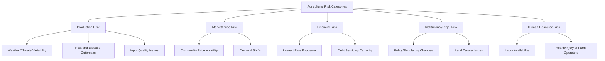
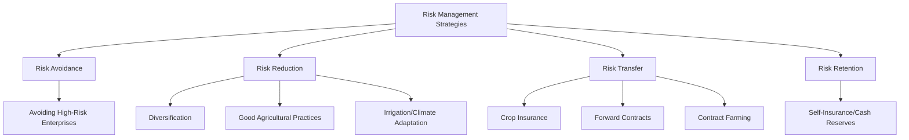
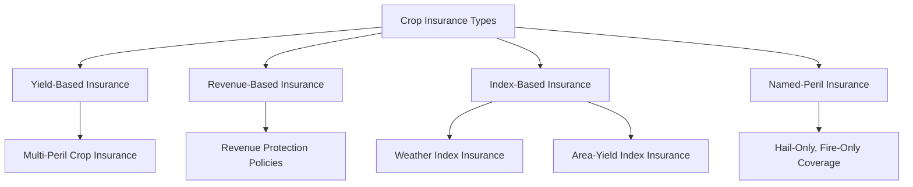
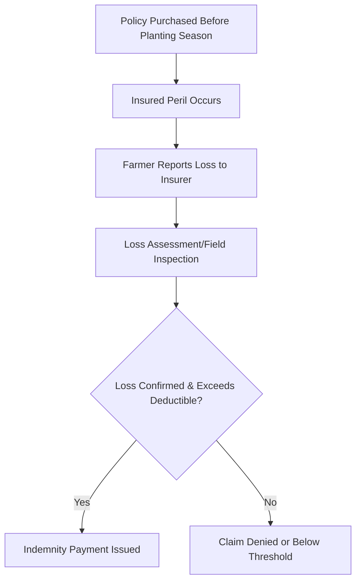

## Risk Management and Crop Insurance

### Overview

Risk management in agriculture refers to the systematic identification, assessment, and mitigation of uncertainties that threaten farm production, income, and financial stability. Crop insurance is one of the principal financial tools within this framework, transferring specific production or revenue risks from the farmer to an insurer in exchange for a premium. Together, these practices help farm operations maintain viability despite exposure to weather variability, pest and disease outbreaks, price volatility, and other uncontrollable factors.

### Categories of Agricultural Risk

| Risk Category | Description | Example |
| --- | --- | --- |
| Production risk | Uncertainty in yield or output quality | Drought reducing corn yield |
| Market/price risk | Uncertainty in prices received or paid | Sudden drop in commodity price at harvest |
| Financial risk | Uncertainty related to debt and capital structure | Rising interest rates increasing loan repayment burden |
| Institutional/legal risk | Uncertainty from policy, regulation, or legal environment | Changes in land use regulation or export policy |
| Human resource risk | Uncertainty related to labor and management capacity | Illness or injury of a key farm operator |

### Risk Management Strategies Framework

- **Key Points**
  - **Avoidance**: forgoing an activity carrying unacceptable risk (e.g., not planting a crop highly vulnerable to local pest pressure)
  - **Reduction**: lowering the probability or severity of a risk through practices such as diversification, integrated pest management, or improved irrigation
  - **Transfer**: shifting risk to another party, typically through insurance, forward contracts, or contract farming arrangements
  - **Retention**: consciously accepting a risk, often financed through cash reserves, when transfer costs exceed the expected benefit or coverage is unavailable

### Diversification as a Risk Management Tool

Diversification spreads risk exposure across multiple enterprises, crop varieties, markets, or income sources so that a negative event affecting one does not compromise the entire farm operation.

- **Key Points**
  - **Enterprise diversification**: growing multiple crops or combining crop and livestock production
  - **Varietal diversification**: planting multiple varieties with differing maturity dates or pest/disease resistance profiles
  - **Market diversification**: selling to multiple buyers or through multiple channels to reduce dependence on a single market
  - **Income diversification**: supplementing farm income with off-farm income sources

### Crop Insurance: Concept and Rationale

Crop insurance provides financial compensation to farmers when losses occur due to insured perils, stabilizing farm income and supporting continued investment in production despite inherent agricultural uncertainty.

- **Key Points**
  - Reduces the financial impact of catastrophic production losses
  - Can improve access to credit, since lenders view insured farms as lower-risk borrowers
  - Encourages continued investment in inputs and technology by reducing downside risk
  - Often supported or subsidized by government programs given the broader food security and rural stability benefits

### Types of Crop Insurance Products

| Insurance Type | Basis for Payout | Key Characteristic |
| --- | --- | --- |
| Multi-peril crop insurance (MPCI) | Actual yield loss against a guaranteed yield | Covers multiple perils (drought, flood, pest, disease) |
| Revenue protection insurance | Shortfall in revenue (yield × price) against a guaranteed revenue level | Protects against combined yield and price risk |
| Named-peril insurance | Loss from a specifically listed peril only | Narrower coverage, often lower premium (e.g., hail insurance) |
| Weather index insurance | Deviation of a weather parameter (rainfall, temperature) from a defined threshold | Payout based on index trigger rather than verified individual farm loss |
| Area-yield index insurance | Average yield loss for a defined geographic area rather than the individual farm | Reduces individual verification costs, but may not match an individual farm's actual loss (basis risk) |

- **Example**
  - A weather index insurance product might trigger a payout automatically when cumulative rainfall during a critical growth period falls below a predetermined threshold, without requiring an on-farm loss assessment

### Key Insurance Concepts and Terminology

- **Premium**: the amount paid by the insured party for coverage, typically calculated based on risk level, coverage amount, and historical loss data
- **Deductible**: the portion of a loss the insured party bears before insurance compensation applies
- **Sum insured / coverage level**: the maximum amount payable under the policy, often expressed as a percentage of expected yield or revenue
- **Indemnity**: the compensation paid to the insured party following a covered loss
- **Basis risk**: the risk that an index-based insurance payout does not accurately reflect the actual loss experienced by an individual farm, since the index (area yield or weather station data) may diverge from the specific farm's actual conditions

$$\text{Indemnity Payment} = (\text{Guaranteed Yield} - \text{Actual Yield}) \times \text{Price Election} \times \text{Insured Area}$$

(applicable to yield-based multi-peril crop insurance; specific formulas vary by insurance product and regulatory jurisdiction)

[Inference] Exact indemnity calculation formulas, coverage percentages, and premium-setting methodologies differ across insurance providers and national crop insurance programs, so the formula above illustrates the general concept rather than a universal standard.

### The Crop Insurance Claims Process

### Government Role in Agricultural Risk Management

- **Key Points**
  - Many governments subsidize crop insurance premiums to improve affordability and encourage widespread adoption
  - Public reinsurance or guarantee schemes may backstop private insurers against catastrophic, widespread losses
  - Disaster assistance programs sometimes supplement or substitute for formal insurance in regions with limited insurance market development
  - Agricultural extension services often support farmer education on risk management and insurance products

[Unverified] The specific structure, subsidy levels, and availability of government-supported crop insurance programs vary substantially by country and are subject to policy change, and should be verified against the relevant national department of agriculture or insurance regulatory body.

### Non-Insurance Risk Management Tools

- **Forward contracts**: lock in a sale price ahead of harvest, reducing exposure to price decline
- **Contract farming**: an agreement with a buyer specifying price, quality, and quantity terms in advance, transferring some market risk to the contracting party
- **Futures and options (where accessible)**: financial instruments used to hedge against commodity price movements, more commonly accessible to larger commercial operations
- **Cash reserves and savings**: self-insurance through maintained liquidity to absorb shocks without external financing
- **Cooperative risk pooling**: farmer groups collectively bearing and managing risk through shared resources or mutual aid arrangements

### Integrating Risk Management into Farm Planning

- **Key Points**
  - Risk management should be assessed alongside enterprise selection during farm business planning, not treated as an afterthought
  - The cost of risk transfer (insurance premiums, contract terms) should be weighed against the farm's specific risk exposure and financial capacity to absorb losses
  - A combination of strategies (diversification plus targeted insurance for catastrophic risk) is often more cost-effective than relying on a single approach

### Evaluating Whether to Purchase Crop Insurance

- **Next Steps** (practical considerations for risk management and insurance decisions)
  - Assess the farm's specific exposure to production and price risk based on historical yield and price variability
  - Compare available insurance products (yield-based, revenue-based, index-based) for fit with the farm's dominant risk type
  - Evaluate premium costs against the farm's financial capacity to self-insure through cash reserves
  - Consider basis risk when evaluating index-based insurance products, particularly for farms in areas with high within-region yield variability
  - Combine insurance with complementary risk reduction strategies such as diversification and improved agronomic practices
  - Consult local agricultural extension services or insurance providers for details on locally available and subsidized insurance programs

### Related Topics

- Farm business planning (risk management as an integrated planning component)
- Agricultural finance and budgeting (financial risk and liquidity management)
- Farm record keeping and accounting (loss documentation and claims support)
- Contract farming and value chain risk-sharing arrangements
- Weather index insurance design and basis risk mitigation
- Government agricultural support and disaster assistance programs
- Integrated pest management as a production risk reduction strategy
- Commodity futures and hedging instruments for agricultural markets