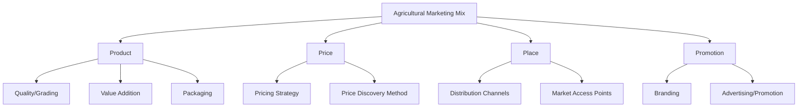
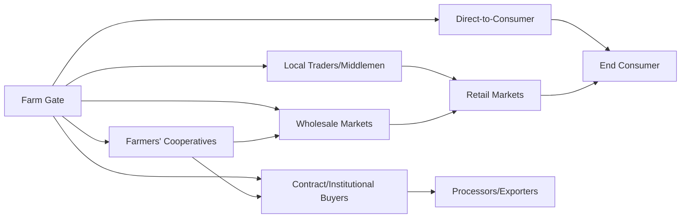
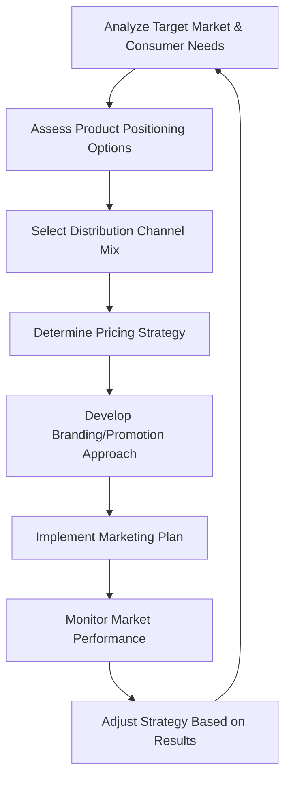

## Agricultural Marketing Strategies

### Overview

Agricultural marketing strategies encompass the planning and execution of activities that move agricultural products from producers to end consumers while maximizing value capture, market access, and competitive positioning. This includes decisions about pricing, product differentiation, distribution channels, promotion, and market timing, all informed by an understanding of agricultural commodity markets, consumer demand, and the unique characteristics of perishable and seasonal production.

### Distinctive Characteristics of Agricultural Marketing

- **Key Points**
  - **Seasonality**: production is often concentrated in specific harvest periods, creating price volatility and storage/timing challenges
  - **Perishability**: many agricultural products have limited shelf life, constraining marketing timing and distribution options
  - **Bulk and variable quality**: raw commodities often require grading, sorting, and standardization before reaching consumer markets
  - **Geographic dispersion**: production is often spread across many small-scale producers, complicating aggregation and market coordination
  - **Price inelasticity of demand**: demand for many staple agricultural products changes relatively little in response to price changes, amplifying price volatility from supply shifts

### The Marketing Mix (4 Ps) Applied to Agriculture

| Element | Agricultural Application |
| --- | --- |
| Product | Quality grading, variety selection, value addition, packaging format |
| Price | Cost-based, market-based, or contract-based pricing; timing of sale |
| Place | Choice of distribution channel and market access points |
| Promotion | Branding, certification labeling, advertising, direct engagement with buyers |

### Market Channel Options

| Channel | Characteristics | Trade-offs |
| --- | --- | --- |
| Local traders/middlemen | Immediate sale, low transaction effort | Often lower price share for producer, limited price transparency |
| Farmers' cooperatives | Collective bargaining power, shared resources | Requires coordination and member commitment |
| Wholesale markets | Access to larger buyers, price discovery through bidding/auction | Requires transport and volume aggregation |
| Direct-to-consumer (farmers' markets, farm stands, online direct sales) | Higher price share, direct customer relationship | Higher time/labor investment, limited scale |
| Contract/institutional buyers | Price and volume certainty, potential technical support | Requires meeting specific quality/volume/delivery terms |

### Pricing Strategies

- **Key Points**
  - **Cost-plus pricing**: setting price based on production cost plus a target margin
  - **Market-based pricing**: setting price according to prevailing market rates, often via auction or negotiation
  - **Contract pricing**: price fixed or formula-based, agreed in advance with a buyer before or during production
  - **Value-based pricing**: pricing based on perceived value to the buyer, often applicable to differentiated or premium/certified products
  - **Seasonal/timing strategy**: staggering sales or utilizing storage to sell during periods of higher price rather than immediately at harvest when supply (and price pressure) is highest

$$\text{Marketing Margin} = \text{Retail Price} - \text{Farm-Gate Price}$$

The marketing margin reflects the combined costs and profits of intermediaries (transport, storage, processing, retailing) between the farm and final consumer; understanding this margin helps producers evaluate whether vertical integration or alternative channels could capture more value.

### Market Information and Price Discovery

- **Key Points**
  - Access to timely, accurate market price information allows producers to negotiate more effectively and choose optimal selling times/channels
  - Market information systems (government agricultural market bulletins, mobile-based price information services, commodity exchanges) reduce information asymmetry between producers and buyers
  - Auction and exchange mechanisms provide transparent price discovery in wholesale and commodity markets

[Unverified] The specific availability, coverage, and reliability of market information services vary considerably by region and continue to evolve with mobile and digital technology adoption, and should be checked against current locally available services.

### Product Differentiation and Branding

Differentiation strategies allow producers to move away from commodity pricing (where products are largely interchangeable and price-driven) toward capturing premium value.

- **Key Points**
  - **Quality grading and standardization**: consistent quality signals build buyer trust and can command premium pricing
  - **Certification labeling**: organic, fair trade, geographic indication (GI), or other certifications differentiate products for specific market segments
  - **Branding**: establishing a recognizable identity that communicates quality, origin, or values to consumers
  - **Value addition**: processing raw commodities into higher-value products (see value-added product development) as a differentiation and margin-capture strategy
- **Example**
  - A cooperative branding its coffee with a specific regional geographic indication and organic certification can access premium specialty coffee markets rather than competing solely on commodity coffee pricing

### Market Segmentation and Targeting

- **Key Points**
  - **Mass/commodity markets**: large volume, price-competitive, minimal differentiation
  - **Premium/niche markets**: smaller volume, higher price tolerance, driven by specific attributes (organic, local, specialty variety)
  - **Institutional markets**: schools, hospitals, food service — often require consistent volume, food safety certification, and reliable delivery schedules
  - **Export markets**: require compliance with importing country regulations, quality standards, and often specific certification or traceability requirements

### Collective Marketing Through Cooperatives and Farmer Groups

Aggregating production through cooperatives or farmer groups can improve smallholder market access and bargaining power.

- **Key Points**
  - Enables achievement of the volume thresholds required by larger buyers or export markets
  - Distributes the cost of quality certification, transport, and market information access across members
  - Strengthens negotiating position relative to individual smallholder sales to traders
  - Requires effective governance and member coordination to function sustainably

### Digital and E-Commerce Marketing Channels

Emerging digital platforms are increasingly used to connect agricultural producers directly with buyers, bypassing traditional intermediary layers.

- **Key Points**
  - Online marketplaces and mobile apps facilitate direct producer-to-consumer or producer-to-institutional-buyer sales
  - Social media platforms enable low-cost promotion and brand-building for differentiated or value-added products
  - Digital payment integration supports transaction completion in e-commerce agricultural sales
  - Adoption is influenced by internet/mobile infrastructure access and digital literacy among both producers and target buyers

[Unverified] The specific digital agricultural marketing platforms available, their market penetration, and their effectiveness vary significantly by region and are rapidly evolving, so current options should be evaluated against up-to-date regional market information.

### Agricultural Marketing Strategy Development Process

### Risks and Challenges in Agricultural Marketing

- **Key Points**
  - Price volatility driven by production shocks, seasonal gluts, or external market forces
  - High transaction costs for smallholder producers accessing distant or formal markets
  - Quality and food safety compliance barriers, particularly for export and institutional markets
  - Limited market information access constraining producers' bargaining position
  - Post-harvest losses reducing marketable volume before products even reach the point of sale

### Building an Effective Agricultural Marketing Strategy

- **Next Steps** (practical guidance for developing a marketing strategy)
  - Identify the specific target market segment(s) and their quality, volume, and delivery requirements before committing resources
  - Evaluate multiple distribution channels for their price capture potential versus transaction cost and effort
  - Consider collective marketing through cooperatives where individual scale is insufficient for target buyers
  - Invest in quality grading, certification, or branding where premium market access justifies the additional cost
  - Monitor market price information consistently to inform timing of sales and channel selection
  - Build direct buyer relationships (contract farming, institutional buyers) where price and volume certainty are prioritized over spot-market flexibility

### Related Topics

- Farm business planning (marketing strategy as a core plan component)
- Value-added product development (differentiation through processing)
- Agricultural finance and budgeting (revenue projection based on marketing strategy)
- Cooperative and farmer organization development
- Contract farming arrangements and institutional buyer relationships
- Export market compliance and certification requirements
- Digital agricultural marketplaces and e-commerce platforms
- Supply chain and value chain analysis in agribusiness