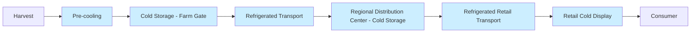
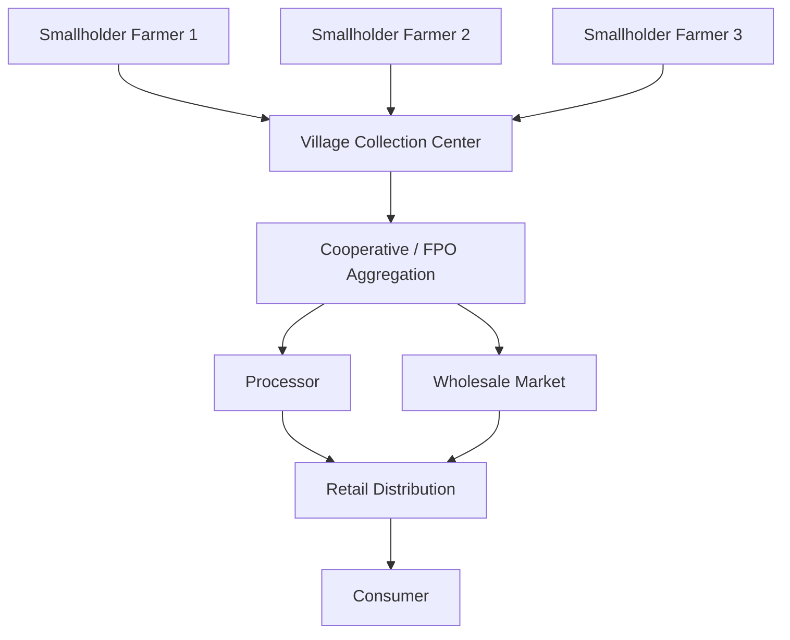

## Supply Chain and Logistics in Agriculture

### Overview

Agricultural supply chain and logistics encompasses the coordinated flow of agricultural products, information, and finances from input suppliers through producers, processors, distributors, and retailers to final consumers. Unlike generic industrial supply chains, agricultural supply chains must contend with biological variability, perishability, seasonality, weather dependency, and geographically dispersed, often smallholder-dominated production bases.

**Key Points**

- Agricultural supply chains are typically longer and more fragmented than manufacturing supply chains due to the number of intermediaries (input dealers, farmers, aggregators, processors, wholesalers, retailers).
- Product quality is time-decaying, meaning logistics decisions directly affect the value of the product, not merely its availability.
- Supply chains in agriculture are simultaneously physical (product flow), informational (data flow), and financial (payment/credit flow).

### Structure of the Agricultural Supply Chain

#### Upstream Segment (Input Supply)

Covers seed, fertilizer, agrochemical, machinery, and credit provision to farmers. Logistics here focuses on timely delivery ahead of planting windows, since delayed input delivery can shift planting dates and depress yields.

#### Production Segment (Farm Level)

The farm is the point of biological transformation. Logistics considerations include:

- On-farm storage capacity and conditions
- Harvest timing and labor/equipment scheduling
- First-mile transport from field to farm-gate or aggregation point

#### Midstream Segment (Aggregation, Processing, Storage)

- **Aggregation**: Consolidation of small lots from many farmers into commercially viable volumes, often via cooperatives, farmer producer organizations (FPOs), or traders.
- **Processing**: Transformation (milling, drying, canning, freezing) that often stabilizes the product and extends shelf life, reducing subsequent logistics urgency.
- **Storage**: Silos, cold storage, and warehouses that buffer supply against demand fluctuations and seasonal gluts.

#### Downstream Segment (Distribution and Retail)

Movement from processors/wholesalers to retail outlets, food service, or export terminals, ending with the final consumer.

**Example**

A wheat supply chain: farmer harvests → transport to local mandi/aggregation center → miller purchases and mills into flour → flour packaged and sent to a regional distribution center → distributed to retail stores → purchased by consumer. Each transition point ("node") introduces a potential delay, quality loss, or cost addition.

### The Perishability Factor

Perishability is the defining constraint that differentiates agri-logistics from other sectors.

| Category | Approximate Shelf Life (Ambient) | Logistics Implication |
| --- | --- | --- |
| Leafy vegetables | 1–3 days | Requires same-day or next-day movement; cold chain critical |
| Soft fruits (berries, tomatoes) | 3–7 days | Refrigerated transport strongly recommended |
| Root vegetables/tubers | Weeks to months | Tolerant of ambient storage if ventilated |
| Grains (properly dried) | Months to years | Bulk storage feasible; moisture control is the main risk |
| Dairy (fluid milk) | 1–2 days (unprocessed) | Continuous cold chain mandatory |
| Processed/canned goods | Months to years | Standard ambient logistics apply |

Shelf life is governed largely by respiration rate (for produce) and microbial activity, both of which are temperature-dependent. The relationship is often approximated by the $Q_{10}$ temperature coefficient:

$$Q_{10} = \left(\frac{R_2}{R_1}\right)^{\frac{10}{T_2 - T_1}}$$

where $R_1$ and $R_2$ are respiration (or spoilage) rates at temperatures $T_1$ and $T_2$ respectively. A $Q_{10}$ of 2–3 is typical for fresh produce, meaning spoilage roughly doubles or triples for every $10°C$ rise in temperature — this is the quantitative basis for cold chain investment.

### Cold Chain Logistics

A cold chain is an unbroken, temperature-controlled supply chain from harvest/production to consumption.

#### Core Components

- **Pre-cooling**: Rapid removal of field heat immediately post-harvest (forced-air cooling, hydro-cooling, vacuum cooling)
- **Cold storage**: Fixed refrigerated warehouses at the farm-gate, aggregation, or distribution level
- **Refrigerated transport**: Reefer trucks, railcars, or containers maintaining set-point temperatures in transit
- **Cold retail display**: Refrigerated display cases at the point of sale

#### Common Failure Points

- Gaps at loading/unloading docks ("dock-to-dock" temperature spikes)
- Inadequate pre-cooling before loading
- Mixed loads with incompatible temperature/humidity/ethylene sensitivity requirements
- Power outages at storage nodes in regions with unreliable electricity

### Post-Harvest Loss

Post-harvest loss (PHL) refers to the measurable reduction in quantity and quality of agricultural products between harvest and consumption.

#### Causes

- Mechanical damage during handling and transport
- Inadequate storage (moisture, pests, temperature)
- Delays at aggregation points
- Poor packaging
- Lack of processing infrastructure to stabilize perishables

#### Measurement Approaches

- **Weight-based loss**: Percentage reduction in physical mass
- **Quality-based loss**: Downgrading of product to lower value classes without necessarily losing mass
- **Economic loss**: Monetary value of the loss, factoring in both quantity and quality/price degradation

[Unverified] Commonly cited estimates place post-harvest losses for fruits and vegetables in developing regions at 20–40%, though figures vary considerably by crop, region, and measurement methodology, and should be treated as context-specific rather than universal constants.

### Transportation Modes in Agri-Logistics

| Mode | Typical Use Case | Advantages | Constraints |
| --- | --- | --- | --- |
| Road (truck) | Farm-to-market, last mile | Flexible, door-to-door | Road quality, fuel cost, limited bulk capacity |
| Rail | Bulk grain, long-haul | Low cost per ton-mile, high volume | Requires siding infrastructure, less flexible |
| Water (barge/ship) | Bulk export commodities | Lowest cost per ton-mile for bulk | Slow, requires port infrastructure |
| Air | High-value perishables (flowers, exotic fruit) | Fastest | Highest cost, limited capacity |

### Inventory and Storage Management

#### Storage Structures

- **On-farm storage**: Bins, cribs, bags — reduces immediate post-harvest pressure to sell
- **Warehouses**: Ambient, ventilated storage typically for grains and non-perishables
- **Silos**: Bulk vertical storage for grains, often with aeration and temperature monitoring
- **Cold stores**: Temperature and humidity-controlled for perishables

#### Inventory Principles Applied to Agriculture

- **FIFO (First-In, First-Out)**: Standard practice for perishables to minimize spoilage of older stock
- **Economic Order Quantity (EOQ)** adapted for agri-inputs (seed, fertilizer), balancing ordering costs against holding costs:

$$EOQ = \sqrt{\frac{2DS}{H}}$$

where $D$ is annual demand, $S$ is ordering cost per order, and $H$ is holding cost per unit per year. [Inference] Direct EOQ application to fresh produce is limited by perishability constraints that are not captured in the classical model; it is more directly applicable to durable inputs like seed and fertilizer.

#### Safety Stock and Buffer Stock

Given yield variability from weather and pest pressure, buffer stocks are commonly held at aggregation and processing nodes to smooth supply variability. Buffer sizing typically accounts for demand variability, lead-time variability, and desired service level, often modeled as:

$$SS = Z \cdot \sigma_{LT} \cdot \bar{D}$$

where $Z$ is the service-level factor (from the standard normal distribution), $\sigma_{LT}$ is the standard deviation of lead time, and $\bar{D}$ is average demand.

### Traceability and Food Safety

Traceability is the ability to track a product's movement and transformation history through the supply chain, from origin to point of sale.

#### Traceability Models

- **One-step-back, one-step-forward**: Each actor records who supplied them and who they supplied to; minimal but widely mandated baseline
- **Full-chain (farm-to-fork) traceability**: Continuous record of the product's journey, often supported by lot/batch coding
- **Digital traceability**: Use of barcodes, QR codes, RFID tags, and increasingly blockchain-based ledgers to create tamper-resistant records

#### Regulatory Drivers

- Food safety regulations (e.g., HACCP — Hazard Analysis and Critical Control Points — frameworks) that require documented control points
- Export market requirements (phytosanitary certification, residue testing documentation)
- Certification schemes (organic, Fair Trade, GlobalG.A.P.) requiring chain-of-custody documentation

**Example**

A mango export consignment may carry: farm plot GPS coordinates and harvest date (production record), pack-house lot number and grading data (processing record), cold-store entry/exit timestamps (storage record), and container temperature logs (transport record) — collectively forming the traceability file required by the importing country's phytosanitary authority.

### Technology in Agricultural Logistics

#### Warehouse and Fleet Management Systems

Software systems (Warehouse Management Systems/WMS, Transportation Management Systems/TMS) that optimize storage slotting, picking routes, and delivery routing. In agriculture, these are increasingly adapted to account for perishability-based prioritization rather than pure cost minimization.

#### IoT Sensors

- Temperature and humidity loggers in cold chain vehicles and storage
- GPS tracking for real-time shipment visibility
- Ethylene sensors for climacteric fruit ripening management

#### Blockchain for Traceability

[Inference] Blockchain-based traceability systems (e.g., permissioned ledgers used by some large retailers for produce tracking) are positioned to reduce trace-back time from days to seconds by providing a shared, tamper-evident record across supply chain actors; actual performance depends heavily on the completeness of data entered by each participant, since blockchain guarantees record integrity but not input accuracy.

#### Market Information Systems

Digital platforms providing real-time price information to farmers (via SMS, apps, or call centers), intended to reduce information asymmetry between farmers and traders and improve farmers' bargaining position.

### Cooperative and Aggregation Models

Given fragmented, smallholder-dominated production in much of global agriculture, aggregation structures are central to functional supply chains.

- **Farmer Producer Organizations (FPOs) / Cooperatives**: Pool produce from many small farms to achieve transportable volumes and negotiating leverage
- **Contract Farming**: Buyers (processors, exporters) contract directly with farmers, often providing inputs and guaranteed off-take, which stabilizes both supply planning and farmer income
- **Village-Level Collection Centers**: Physical aggregation points reducing the distance smallholders must individually transport produce

### Risk Factors in Agricultural Supply Chains

| Risk Category | Examples | Mitigation Approaches |
| --- | --- | --- |
| Weather/Climate | Drought, flooding, frost | Diversified sourcing, weather-indexed insurance, buffer stock |
| Biological | Pest outbreaks, disease, spoilage | IPM practices, cold chain investment, phytosanitary controls |
| Price Volatility | Commodity price swings | Forward contracts, hedging, price information systems |
| Infrastructure | Poor roads, unreliable power | Investment in rural infrastructure, decentralized storage/processing |
| Policy/Trade | Export bans, tariff changes | Market diversification, compliance monitoring |
| Logistics Disruption | Fuel shortages, transport strikes | Multi-modal contingency planning |

### Supply Chain Performance Metrics

- **Order fill rate**: Percentage of demand met from available stock without stockout
- **Lead time**: Time elapsed from order placement (or harvest) to delivery
- **Post-harvest loss percentage**: Quantity/value lost relative to total harvested
- **Cold chain compliance rate**: Percentage of shipment time within specified temperature range
- **Traceability coverage**: Percentage of product volume with complete chain-of-custody records
- **Cost per ton-kilometer**: Standard logistics efficiency metric for comparing transport modes

[Behavior/context disclaimer] Actual metric values and their acceptable thresholds vary significantly by crop, region, infrastructure maturity, and buyer specification; benchmarks should be validated against local or sector-specific data rather than applied uniformly.

### Illustrative Node-and-Flow Diagram

<svg xmlns="http://www.w3.org/2000/svg" viewBox="0 0 900 320" font-family="Arial, sans-serif">
<text x="450" y="24" font-size="16" text-anchor="middle" font-weight="bold">Agricultural Supply Chain Flow (svg_diagram)</text>
<rect x="20" y="60" width="120" height="60" rx="6" fill="#e8f5e9" stroke="#2e7d32" />
<text x="80" y="95" font-size="12" text-anchor="middle">Farm</text>
<rect x="180" y="60" width="120" height="60" rx="6" fill="#e3f2fd" stroke="#1565c0" />
<text x="240" y="90" font-size="12" text-anchor="middle">Aggregation</text>
<text x="240" y="105" font-size="12" text-anchor="middle">Center</text>
<rect x="340" y="60" width="120" height="60" rx="6" fill="#fff3e0" stroke="#e65100" />
<text x="400" y="90" font-size="12" text-anchor="middle">Processing</text>
<text x="400" y="105" font-size="12" text-anchor="middle">Facility</text>
<rect x="500" y="60" width="120" height="60" rx="6" fill="#f3e5f5" stroke="#6a1b9a" />
<text x="560" y="90" font-size="12" text-anchor="middle">Distribution</text>
<text x="560" y="105" font-size="12" text-anchor="middle">Center</text>
<rect x="660" y="60" width="100" height="60" rx="6" fill="#fce4ec" stroke="#ad1457" />
<text x="710" y="90" font-size="12" text-anchor="middle">Retail</text>
<rect x="800" y="60" width="80" height="60" rx="6" fill="#eeeeee" stroke="#424242" />
<text x="840" y="95" font-size="12" text-anchor="middle">Consumer</text>
<line x1="140" y1="90" x2="180" y2="90" stroke="#333" stroke-width="2" marker-end="url(#arrow)" />
<line x1="300" y1="90" x2="340" y2="90" stroke="#333" stroke-width="2" marker-end="url(#arrow)" />
<line x1="460" y1="90" x2="500" y2="90" stroke="#333" stroke-width="2" marker-end="url(#arrow)" />
<line x1="620" y1="90" x2="660" y2="90" stroke="#333" stroke-width="2" marker-end="url(#arrow)" />
<line x1="760" y1="90" x2="800" y2="90" stroke="#333" stroke-width="2" marker-end="url(#arrow)" />
<rect x="20" y="180" width="860" height="90" rx="6" fill="#fafafa" stroke="#9e9e9e" stroke-dasharray="4" />
<text x="450" y="200" font-size="12" text-anchor="middle" font-weight="bold">Parallel Flows Across All Nodes</text>
<text x="450" y="222" font-size="11" text-anchor="middle">Information Flow: price data, order data, quality certificates, traceability records</text>
<text x="450" y="242" font-size="11" text-anchor="middle">Financial Flow: payments, credit, insurance settlements</text>
<text x="450" y="262" font-size="11" text-anchor="middle">Physical Flow: product movement (illustrated above)</text>
</svg>

### Sustainability Considerations

- **Food loss and waste reduction**: Logistics improvements (cold chain, better packaging, improved roads) are among the most direct levers for reducing food loss, distinct from consumer-side food waste
- **Carbon footprint of transport**: Mode selection (rail/water vs. road/air) significantly affects the carbon intensity of moving agricultural goods
- **Packaging waste**: Balancing protective packaging (which reduces spoilage) against plastic/material waste generation
- **Local/short supply chains**: Farm-to-consumer and regional distribution models that reduce transport distance, often trading off scale efficiency for reduced logistics footprint and fresher product

### Conclusion

Agricultural supply chain and logistics management is fundamentally about managing time-sensitive, biologically variable products across fragmented production bases while coordinating physical, informational, and financial flows. Effective systems integrate infrastructure investment (cold chain, storage, roads), organizational structures (cooperatives, contract farming), and increasingly digital technologies (traceability systems, market information platforms, IoT monitoring) to minimize post-harvest loss, ensure food safety, and improve value capture for producers.

**Related Topics**

- Cold chain design and refrigeration engineering fundamentals
- Post-harvest handling and storage technologies
- Food safety standards and HACCP implementation
- Agricultural cooperatives and farmer producer organizations
- Contract farming and vertical integration models
- Agricultural commodity trading and price risk management
- Blockchain applications in food traceability
- Rural infrastructure development and its economic impact
- Warehouse receipt systems and commodity financing
- Export logistics and phytosanitary compliance
- Food loss and waste measurement methodologies
- IoT and precision monitoring in cold chain logistics