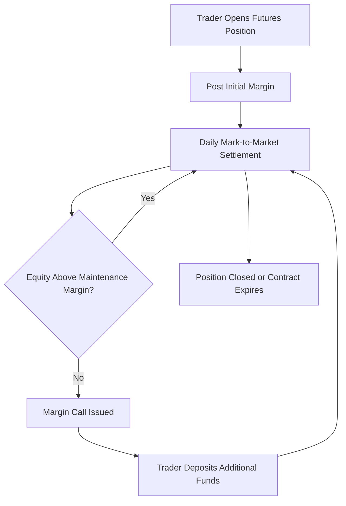
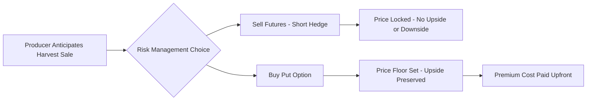

## Commodity Markets and Futures Trading

### Overview

Commodity markets are venues — physical or electronic — where raw agricultural products (grains, oilseeds, livestock, softs like coffee and cotton) are bought and sold. Futures trading is a derivative mechanism layered on top of these physical markets, allowing participants to buy or sell a standardized quantity of a commodity for delivery at a specified future date and price. In agriculture, these markets serve two intertwined functions: **price discovery** (revealing the market's consensus expectation of future value) and **risk transfer** (allowing producers, processors, and merchandisers to hedge against adverse price movements).

**Key Points**

- Agricultural commodity prices are driven by biological production cycles, making supply comparatively inelastic in the short run relative to industrial goods.
- Futures markets allow price risk to be separated from the physical transaction, transferring risk from those who don't want it (farmers, processors) to those willing to bear it (speculators).
- Cash (spot) markets and futures markets are linked by the concept of basis, which is central to practical hedging.

### Structure of Agricultural Commodity Markets

#### Cash (Spot) Market

The market for immediate purchase and delivery of the physical commodity. Prices here reflect local supply/demand conditions, transportation costs, and quality/grade differentials.

#### Forward Market

A private, customized (non-standardized) agreement between two parties to buy/sell a commodity at a future date at a price agreed upon today. Forwards are traded over-the-counter (OTC) and carry counterparty risk since there is no clearinghouse guarantee.

#### Futures Market

A standardized, exchange-traded contract for future delivery, with terms (quantity, quality/grade, delivery location, delivery month) fixed by the exchange. Futures are guaranteed by a clearinghouse, which substantially reduces counterparty risk relative to forwards.

#### Options on Futures

A contract that gives the holder the right, but not the obligation, to buy (call option) or sell (put option) a futures contract at a specified price (strike price) before expiration. Options provide asymmetric risk protection: the buyer's maximum loss is limited to the premium paid.

### Major Agricultural Commodity Exchanges

| Exchange | Region | Key Agricultural Contracts |
| --- | --- | --- |
| Chicago Board of Trade (CBOT), part of CME Group | United States | Corn, soybeans, wheat, soybean oil, soybean meal |
| Chicago Mercantile Exchange (CME) | United States | Live cattle, feeder cattle, lean hogs, dairy |
| Intercontinental Exchange (ICE) | United States/global | Coffee, cocoa, cotton, sugar, orange juice |
| National Commodity and Derivatives Exchange (NCDEX) | India | Guar seed, spices, castor seed, cotton |
| Multi Commodity Exchange (MCX) | India | Primarily bullion/energy, some agri contracts |
| Dalian Commodity Exchange (DCE) | China | Soybeans, corn, palm oil |
| Euronext (formerly MATIF) | Europe | Milling wheat, rapeseed, corn |

[Unverified] Exact contract specifications, active contract lists, and trading volumes change periodically; current specifications should be verified directly against the relevant exchange's contract documentation before use in any actual trading or hedging decision.

### Anatomy of a Futures Contract

A standardized futures contract specifies:

- **Underlying commodity** and acceptable grade/quality range
- **Contract size** (e.g., 5,000 bushels for CBOT corn)
- **Delivery months** (contract expiration cycle, e.g., March, May, July, September, December for corn)
- **Delivery location(s)** or par delivery points
- **Price quotation unit** (e.g., cents per bushel)
- **Tick size** (minimum price fluctuation) and **daily price limits** (maximum allowable price movement in a session, where applicable)
- **Settlement method**: physical delivery or cash settlement

**Example**

A CBOT corn futures contract represents 5,000 bushels. If the futures price moves from $4.50 to $4.55 per bushel (a 5-cent move), the value change per contract is:

$$\Delta V = 5{,}000 \times \$0.05 = \$250$$

This illustrates why futures are described as leveraged instruments — a trader controls a large notional quantity while posting only a fraction of that value as margin.

### Margin Mechanics

Unlike buying a physical commodity outright, futures trading requires only a margin deposit, not full contract value.

- **Initial margin**: Good-faith deposit required to open a futures position, set by the exchange/clearinghouse
- **Maintenance margin**: Minimum account balance that must be maintained; if equity falls below this level, a margin call requires the trader to top up funds
- **Mark-to-market**: Futures accounts are settled daily — gains and losses are credited/debited to the account each day based on the day's settlement price, rather than only at contract expiration

### Hedging with Futures

Hedging uses a futures position to offset price risk on an anticipated cash market transaction.

#### Short Hedge (Selling Hedge)

Used by producers who will sell a physical commodity in the future and want to lock in a price today, protecting against price declines. The producer sells futures contracts now and buys them back (offsets) when the physical crop is sold.

#### Long Hedge (Buying Hedge)

Used by processors, feedlot operators, or merchandisers who will need to purchase a commodity in the future and want to lock in a purchase price, protecting against price increases. The buyer purchases futures contracts now and offsets them when the physical purchase is made.

**Example**

A corn farmer expects to harvest 50,000 bushels in October and is concerned about falling prices. In June, with December corn futures trading at $4.60/bushel, the farmer sells 10 futures contracts (10 × 5,000 bushels = 50,000 bushels). Two outcomes at harvest:

1. **Cash price falls to $4.20**: The farmer sells the physical crop at $4.20 (a loss versus June expectations) but the short futures position gains approximately $0.40/bushel as futures prices fell too, offsetting the cash market loss.
2. **Cash price rises to $4.90**: The farmer sells the physical crop at $4.90 (a gain) but the short futures position loses approximately $0.30/bushel, offsetting the cash market gain.

In both cases, the hedge locks in an effective price close to the original $4.60 futures price, adjusted for basis (see below). [Behavior/context disclaimer] The actual effective price achieved depends on how basis behaves between the hedge placement and offset dates, which is not perfectly predictable.

### Basis

Basis is the difference between the local cash price and the futures price for a given commodity:

$$\text{Basis} = \text{Cash Price} - \text{Futures Price}$$

Basis reflects local supply/demand conditions, transportation costs to/from the futures delivery point, storage costs, and local quality premiums or discounts. Basis is generally far more stable and predictable than either the cash or futures price alone, which is why hedging — even though it does not eliminate price risk entirely — substantially reduces it by converting outright price risk into the comparatively smaller basis risk.

#### Basis Patterns

- **Normal (carrying charge) market**: Futures price for later delivery months exceeds nearby prices, reflecting storage, interest, and insurance costs of carrying inventory forward — basis is typically negative (cash below futures) in this environment for storable commodities before harvest
- **Inverted market**: Nearby futures prices exceed deferred prices, often reflecting tight current supply and strong immediate demand

### Speculation and Market Liquidity

Speculators do not intend to make or take physical delivery; they take on price risk in pursuit of profit from price movement, and in doing so provide the liquidity that allows hedgers to enter and exit positions efficiently.

| Participant Type | Market Role | Typical Position Motivation |
| --- | --- | --- |
| Commercial hedgers (farmers, elevators, processors) | Risk transfer | Lock in price for a physical transaction |
| Speculators (individual traders, hedge funds) | Liquidity provision, price discovery | Profit from anticipated price movement |
| Commodity trading advisors (CTAs) / managed futures funds | Large-scale speculative/trend positions | Systematic or discretionary trading strategies |
| Arbitrageurs | Price alignment across markets/contracts | Profit from temporary price discrepancies |

[Inference] Regulatory position-limit rules in most major exchanges are designed to prevent excessive speculative concentration from distorting price discovery, though the precise effectiveness of any given limit structure in preventing distortion is a matter of ongoing debate among market analysts and regulators.

### Options on Agricultural Futures

#### Call Option

Gives the buyer the right to purchase (go long) a futures contract at the strike price. Buyers of calls profit if the futures price rises above the strike plus premium paid.

#### Put Option

Gives the buyer the right to sell (go short) a futures contract at the strike price. Buyers of puts profit if the futures price falls below the strike minus premium paid.

#### Why Producers Use Options Rather Than Futures Alone

A futures hedge locks in a price and removes both downside risk and upside opportunity. A put option purchased by a producer establishes a price floor while preserving the ability to benefit if prices rise — the cost of this flexibility is the option premium, paid regardless of outcome.

$$\text{Put Option Payoff (buyer)} = \max(K - S_T, 0) - \text{Premium}$$

where $K$ is the strike price and $S_T$ is the futures price at expiration.

### Price Discovery Function

Futures markets aggregate the expectations of a large, diverse set of participants (producers, consumers, speculators, analysts) into a single publicly observable price. Because futures prices are formed continuously through competitive trading (open outcry historically, now predominantly electronic order-matching), they are widely used as reference prices for:

- Cash contract pricing formulas ("futures plus/minus basis")
- Loan valuation and crop insurance price elections
- International trade contract benchmarks

### Delivery and Contract Settlement

Most futures contracts are **offset** (closed out by an equal and opposite transaction) before expiration rather than settled by physical delivery; delivery serves primarily as a convergence mechanism that keeps futures and cash prices aligned as expiration approaches, rather than as the primary mode of contract resolution for most participants.

#### Physical Delivery Process (where applicable)

1. Short position holder issues a delivery notice to the clearinghouse
2. Clearinghouse assigns the notice to a long position holder (often the oldest open long position, per exchange rules)
3. Commodity is delivered to an exchange-approved delivery point/warehouse, accompanied by a warehouse receipt
4. Payment is exchanged based on the futures settlement price, adjusted for any grade/location differentials

#### Cash Settlement (where applicable)

Some contracts (e.g., certain livestock and index-based contracts) settle in cash based on a reference price index at expiration, with no physical delivery occurring.

### Fundamental and Technical Analysis in Agricultural Commodities

#### Fundamental Analysis

Focuses on supply/demand drivers specific to agricultural production:

- Planted area and yield estimates (e.g., USDA WASDE — World Agricultural Supply and Demand Estimates — reports)
- Weather conditions during critical growth stages
- Global stocks-to-use ratios
- Export sales and shipment data
- Competing crop economics (acreage competition between corn, soybeans, wheat, etc.)

#### Technical Analysis

Focuses on price and volume patterns rather than underlying fundamentals, using tools such as moving averages, support/resistance levels, and momentum oscillators. [Inference] Technical analysis is widely used by short-term traders in agricultural futures, though its predictive validity is contested in the broader financial literature and should not be treated as a reliable standalone basis for hedging decisions by producers.

### Risk Management Considerations for Producers

| Risk | Description | Mitigation Tool |
| --- | --- | --- |
| Price risk | Adverse movement in commodity price before sale | Futures hedge, options, forward contracts |
| Basis risk | Local cash price does not move in line with futures | Understanding local basis patterns, basis contracts |
| Margin/liquidity risk | Adverse mark-to-market moves require cash to meet margin calls | Adequate operating credit lines, options instead of futures |
| Production risk | Yield shortfall means hedged futures quantity exceeds actual harvest | Conservative hedge ratios, crop insurance combined with hedging |
| Counterparty risk | Default by the other party (forwards/OTC only) | Use exchange-cleared futures instead of uncleared forwards |

### Regulatory Framework

Agricultural futures markets are typically overseen by a dedicated financial regulator (e.g., the Commodity Futures Trading Commission, CFTC, in the United States; SEBI in India). Core regulatory functions generally include:

- Setting and enforcing position limits to curb excessive speculation
- Requiring registration of brokers, dealers, and large traders
- Mandating reporting of large trader positions (e.g., Commitments of Traders reports)
- Overseeing exchange rule compliance and market surveillance for manipulation

### Practical Example: Basis Contract

Rather than a fixed-price forward contract, many elevators offer farmers a **basis contract**: the farmer locks in the basis now (e.g., "$0.20 under December futures") but leaves the futures price component unset, to be fixed later (a "hedge-to-arrive" or HTA structure in some markets). This separates basis risk management from futures price risk management, allowing the farmer to speculate on or later lock the futures leg independently.

### Conclusion

Commodity futures and options markets provide agricultural producers, processors, and merchandisers with standardized, exchange-cleared instruments for transferring price risk away from those directly exposed to physical production and consumption decisions. Effective use of these markets requires understanding not just the mechanics of contracts and margining, but the behavior of basis, the distinction between eliminating and transforming risk, and how fundamental supply/demand data feeds into price discovery. These tools do not guarantee profitability or eliminate all risk — they reshape risk exposure, converting outright price uncertainty into the generally smaller and more predictable uncertainty of basis.

**Related Topics**

- Basis trading and hedge-to-arrive (HTA) contracts
- Crop insurance and its interaction with futures hedging
- USDA WASDE reports and agricultural market fundamentals analysis
- Options strategies for agricultural risk management (spreads, collars)
- Forward contracting versus futures hedging trade-offs
- Commodity price volatility and its drivers
- Agricultural marketing plans and pricing strategy design
- Warehouse receipts and delivery mechanics
- Global grain trade and export logistics
- Regulatory frameworks for derivatives markets (CFTC, SEBI, etc.)
- Value-at-risk (VaR) and risk quantification in agribusiness finance
- Contract farming versus open-market commodity sales