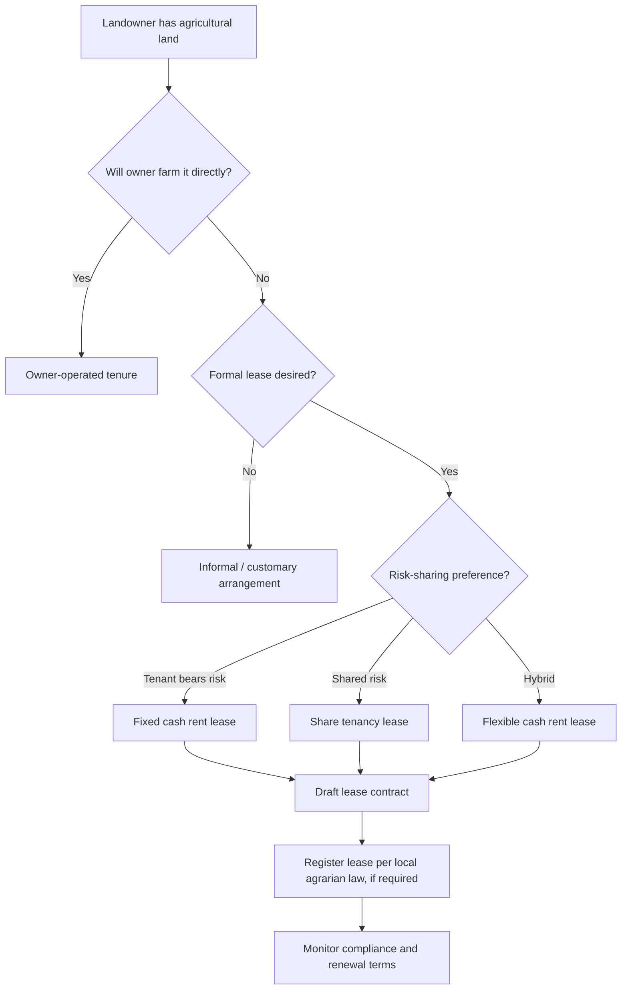

## Land Tenure and Lease Agreements

### Overview

Land tenure refers to the legal and customary rules that define how agricultural land is owned, held, used, and transferred, along with the rights, restrictions, and responsibilities attached to that land. Lease agreements are contractual arrangements through which a landowner (lessor) grants a tenant (lessee) the right to use land for agricultural production in exchange for rent, a share of output, or other consideration. Together, these institutions shape farm investment decisions, credit access, productivity incentives, and long-term land stewardship.

### Key Points

- Land tenure systems determine who can use, control, transfer, and benefit from land, directly influencing farmer incentives to invest in soil conservation, irrigation, and long-term improvements.
- Tenure security (the confidence that rights will be recognized and protected against arbitrary loss) is generally considered more important for investment behavior than the specific form of tenure itself. [Inference]
- Lease agreements convert land access into a time-bound, negotiated relationship, and the terms of that agreement (duration, rent type, renewal conditions) determine how much of the productivity gain accrues to the tenant versus the landowner.
- Tenure and lease structures vary significantly by country and jurisdiction; farmers and advisors should always verify agrarian reform laws, civil codes, and local registry practices applicable to their location.

### Classification of Land Tenure Systems

#### Private Freehold Ownership

The landholder possesses full ownership rights (subject to national law), including the right to use, lease, sell, mortgage, and bequeath the land. This is the most secure tenure form in most legal systems because the bundle of rights is complete and transferable.

#### Leasehold Tenure

The tenant holds a time-limited right to use land owned by another party, under terms defined in a lease contract. Leasehold arrangements are common where land is expensive relative to farm income, where owners lack the capacity or interest to farm directly, or where agrarian reform programs have redistributed use rights without transferring full title.

#### Customary and Communal Tenure

Land rights are governed by local custom, kinship structures, or community institutions rather than statutory title. Rights are often held collectively, with individual or household use-rights allocated within the community. This system is widespread in parts of Sub-Saharan Africa, Southeast Asia, and among indigenous communities elsewhere, and it can coexist with, or be gradually formalized into, statutory tenure. [Unverified — prevalence figures vary substantially by country and source]

#### State or Public Land Tenure

The state retains ownership, and farmers are granted use rights, concessions, or long-term leases (e.g., state land leased to agribusiness concessionaires, or public land allocated under agrarian reform programs).

#### Tenancy Arrangements (Share Tenancy and Fixed-Rent Tenancy)

- **Share tenancy (sharecropping):** The tenant pays a portion of the harvest (commonly one-third to one-half, depending on inputs supplied) instead of, or in addition to, cash rent. Risk is shared between landowner and tenant.
- **Fixed-rent tenancy:** The tenant pays a predetermined cash or in-kind amount regardless of harvest outcome. The tenant bears full production risk but retains any surplus above the fixed rent, which tends to create stronger incentives for productivity-enhancing effort. [Inference]

#### Agrarian Reform Beneficiary Tenure

In many countries with land reform histories (e.g., the Philippines under the Comprehensive Agrarian Reform Program, or Certificate of Land Ownership Award holders), beneficiaries receive use and inheritance rights, often with restrictions on sale, lease, or mortgage during an initial retention period. These restrictions aim to prevent reconcentration of land but can also constrain beneficiaries' access to formal credit, since the land cannot always serve as full collateral. [Unverified — specific restriction periods and rules vary by country and by statute amendments over time]

### Tenure Security and Its Economic Effects

Tenure security has several components that interact:

1. **Breadth** — how many rights are included in the bundle (use, exclusion, transfer, alienation).
2. **Duration** — how long the rights are guaranteed to last.
3. **Assurance** — the degree of legal or social certainty that rights will be enforced and not arbitrarily revoked.

**Effects commonly associated with weak tenure security:**

- Reduced incentive to invest in soil fertility management, drainage, terracing, tree planting, or irrigation infrastructure, since the investor may not capture the long-term return. [Inference]
- Limited access to formal credit, because land without clear title cannot easily serve as loan collateral.
- Underinvestment in perennial crops (e.g., orchards, plantation crops) that require multi-year horizons to pay off, since tenants on short or insecure leases have shorter effective planning horizons. [Inference]

**Effects commonly associated with strong tenure security:**

- Greater willingness to adopt long-term conservation practices and capital-intensive technologies.
- Improved access to formal lending markets where land titles are accepted as collateral.
- Higher likelihood of land-improving investment being reflected in eventual land value or sale price, reinforcing the incentive further. [Inference]

Behavior may vary by region, crop type, credit market structure, and enforcement quality of local institutions; the relationships above describe general tendencies documented in agricultural economics literature rather than universal laws.

### Anatomy of a Farm Lease Agreement

A well-constructed agricultural lease typically specifies the following elements:

#### 1. Parties and Property Description

Legal names of lessor and lessee, and a precise description of the parcel (survey/lot number, boundaries, total area, and any exclusions such as existing structures or right-of-way easements).

#### 2. Lease Term

- **Fixed term:** A specific start and end date (e.g., one cropping season, one year, five years).
- **Periodic tenancy:** Automatically renews at defined intervals (e.g., year-to-year) until either party gives notice.
- **Multi-year leases** are generally more conducive to soil-improving investment than season-to-season arrangements, since the tenant has a longer horizon to recoup costs. [Inference]

#### 3. Rent Structure

- **Cash rent:** Fixed payment per unit area or lump sum, paid on a defined schedule.
- **Crop-share rent:** A percentage of output or gross revenue, often paired with agreed input-cost sharing.
- **Flexible/variable cash rent:** Base rent adjusted according to a formula tied to yield or commodity price, blending features of cash and share rent to redistribute risk.

#### 4. Input and Cost-Sharing Provisions

Specifies who supplies seed, fertilizer, pesticides, machinery, and labor, and in what proportion costs and outputs are shared — critical in share-tenancy arrangements to avoid disputes.

#### 5. Permitted Use and Cropping Restrictions

Defines allowable land use (e.g., specific crops, rotation requirements, prohibition on certain practices such as continuous monocropping or unauthorized land conversion).

#### 6. Maintenance and Improvement Clauses

Addresses responsibility for maintaining drainage, fences, irrigation systems, and access roads, and specifies how the tenant will be compensated (or not) for improvements made during the tenancy if the lease ends.

#### 7. Termination and Renewal Conditions

Notice periods required for termination or non-renewal, conditions constituting breach (e.g., non-payment, land abandonment, unauthorized subleasing), and any right of first refusal for renewal or purchase.

#### 8. Dispute Resolution Mechanism

Reference to mediation, arbitration, or the relevant agrarian or civil court/tribunal with jurisdiction, since agricultural tenancy disputes are frequently governed by specialized agrarian law rather than general contract law in many jurisdictions.

#### 9. Compliance with Statutory Tenancy Law

Many jurisdictions impose mandatory minimum protections for agricultural tenants (e.g., security of tenure provisions, ceilings on share-rent percentages, required registration of tenancy). A lease that contradicts mandatory statutory provisions may be partially or wholly unenforceable, so contract terms should be checked against applicable agrarian statutes. [Unverified — specific statutory protections differ by country and must be confirmed against current local law]

### Comparison of Common Lease Types

| Feature | Cash Rent | Share Tenancy | Flexible Cash Rent |
| --- | --- | --- | --- |
| Who bears production risk | Tenant | Shared (lessor and lessee) | Shared, via formula |
| Who bears price risk | Tenant | Shared | Shared, if tied to price |
| Landowner involvement in decisions | Typically low | Often higher (co-invests in inputs) | Low to moderate |
| Tenant's incentive to maximize yield | High (keeps full surplus above fixed rent) | Moderate (shares surplus with landowner) | Moderate to high |
| Administrative complexity | Low | Higher (requires harvest verification, input accounting) | Moderate (requires agreed price/yield reference) |
| Suitability for volatile markets | Riskier for tenant | More stable for tenant | Balances stability and incentive |

### Worked Example: Comparing Rent Structures

Assume a one-hectare rice plot with expected gross output value of ₱120,000 per season, and total variable production costs of ₱60,000, all borne by the tenant.

**Cash rent scenario:**

Fixed rent = ₱30,000 per season.

$$\text{Tenant net return} = \text{Gross output} - \text{Costs} - \text{Rent}$$

$$\text{Tenant net return} = 120{,}000 - 60{,}000 - 30{,}000 = 30{,}000$$

If a drought reduces gross output to ₱80,000, the tenant's net return becomes:

$$80{,}000 - 60{,}000 - 30{,}000 = -10{,}000$$

The tenant absorbs the entire shortfall; the landowner still receives ₱30,000.

**Share tenancy scenario (50/50 share, costs split evenly):**

$$\text{Tenant net return} = 0.5 \times \text{Gross output} - 0.5 \times \text{Costs}$$

Normal season:

$$0.5 \times 120{,}000 - 0.5 \times 60{,}000 = 60{,}000 - 30{,}000 = 30{,}000$$

Drought season:

$$0.5 \times 80{,}000 - 0.5 \times 60{,}000 = 40{,}000 - 30{,}000 = 10{,}000$$

Under the share arrangement, both parties absorb part of the drought loss, and the tenant's downside is smaller. This illustrates why risk-averse tenants — particularly smallholders with limited savings or credit access — may prefer share tenancy even though its expected return-sharing reduces upside in good years. [Inference]

### Land Tenure Decision Flow

### Bundle of Rights Diagram (svg_diagram)

<svg xmlns="http://www.w3.org/2000/svg" viewBox="0 0 720 380">
<text x="360" y="30" text-anchor="middle" font-size="18" font-weight="bold" fill="#1a1a1a">Bundle of Land Rights (svg_diagram)</text>
<circle cx="360" cy="200" r="150" fill="none" stroke="#2c6e49" stroke-width="3" />
<text x="360" y="200" text-anchor="middle" font-size="14" fill="#1a1a1a" font-weight="bold">Full Ownership</text>
<circle cx="360" cy="200" r="110" fill="none" stroke="#4c956c" stroke-width="2" stroke-dasharray="6,4" />
<text x="360" y="150" text-anchor="middle" font-size="12" fill="#1a1a1a">Right to Transfer / Sell</text>
<circle cx="360" cy="200" r="75" fill="none" stroke="#82c09a" stroke-width="2" stroke-dasharray="6,4" />
<text x="360" y="175" text-anchor="middle" font-size="12" fill="#1a1a1a">Right to Mortgage</text>
<circle cx="360" cy="200" r="40" fill="#d9f2e6" stroke="#2c6e49" stroke-width="2" />
<text x="360" y="200" text-anchor="middle" font-size="11" fill="#1a1a1a">Right to</text>
<text x="360" y="215" text-anchor="middle" font-size="11" fill="#1a1a1a">Use / Farm</text>

<text x="360" y="260" text-anchor="middle" font-size="12" fill="`#555555`">Leasehold tenant typically holds only the innermost right (use)</text>

<text x="360" y="280" text-anchor="middle" font-size="12" fill="`#555555`">Freehold owner holds the full bundle</text>

<rect x="40" y="320" width="20" height="14" fill="#d9f2e6" stroke="#2c6e49" />
<text x="70" y="332" font-size="12" fill="#1a1a1a">Use rights (tenant-held under lease)</text>
<rect x="400" y="320" width="20" height="14" fill="none" stroke="#2c6e49" stroke-width="2" />
<text x="430" y="332" font-size="12" fill="#1a1a1a">Ownership rights (retained by lessor)</text>
</svg>

### Common Pitfalls and Dispute Sources

- **Undefined harvest-verification procedures** in share tenancy, leading to disputes over the actual yield used to calculate the landowner's share.
- **Verbal-only agreements**, which are difficult to enforce and often fail to specify notice periods, leaving tenants vulnerable to abrupt eviction and landowners vulnerable to non-payment.
- **Ambiguous improvement clauses**, where a tenant invests in irrigation or land leveling but the lease is silent on compensation upon termination, discouraging future investment by other tenants who observe the outcome. [Inference]
- **Non-compliance with statutory tenancy protections**, such as omitting mandatory security-of-tenure clauses, which can render parts of the lease void even if both parties initially agreed to them.
- **Subleasing without consent**, which many leases and statutes prohibit or restrict, creating legal exposure for the original tenant.

### Policy and Institutional Context

- **Land registration and cadastral systems** (formal surveys and title registries) underpin tenure security by making rights verifiable and transferable; incomplete or outdated cadastral coverage is a persistent constraint in many developing agricultural economies. [Unverified — coverage gaps vary widely by country]
- **Agrarian reform programs** redistribute land or use-rights from large landholders to smallholder farmers or farmworkers, often with tenure restrictions during a retention period to prevent reconcentration.
- **Land consolidation and land banking mechanisms** in some countries aim to counteract fragmentation from repeated inheritance division, which can reduce farm-level economies of scale over generations. [Inference]
- **Digital land registries and blockchain-based title pilots** have been explored in various countries to reduce fraud and improve transaction transparency, though adoption at scale remains limited and evidence of long-term impact is still emerging. [Unverified]

### Related Topics

- Agricultural credit and land as loan collateral
- Farm succession and inheritance planning
- Cadastral survey and land titling systems
- Agrarian reform laws (e.g., CARP/CARPER in the Philippines, land reform models elsewhere)
- Cost-benefit analysis of farm capital investments
- Water rights and irrigation easements
- Farm business organization structures (sole proprietorship, cooperative, corporate farming)
- Risk management and crop insurance in tenancy arrangements
- Land use zoning and agricultural land conversion regulations
- Contract farming and outgrower schemes