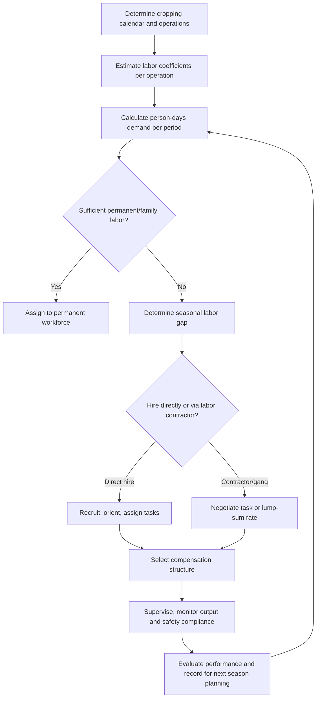

## Labor Management on Farms

### Overview

Farm labor management is the planning, organization, supervision, and evaluation of human work inputs required to carry out agricultural production and post-harvest activities. It spans workforce planning, recruitment, scheduling, compensation, supervision, compliance with labor regulations, and productivity optimization. Because agricultural labor demand is highly seasonal and task-dependent (e.g., peak requirements at planting and harvest versus low requirements during fallow periods), effective labor management is central to controlling production costs and meeting time-sensitive operations such as harvesting perishable crops.

### Key Points

- Farm labor management must reconcile seasonal demand peaks with the fixed or semi-fixed costs of maintaining a workforce, which is a structurally different challenge than labor planning in most non-agricultural industries.
- Labor productivity on farms is influenced by task design, supervision quality, compensation structure, worker skill and experience, and working conditions (heat exposure, ergonomics, tool quality).
- Compliance with labor law (minimum wage, working hours, occupational safety, and — where applicable — child labor prohibitions) is a legal requirement, not merely good practice, and specific thresholds vary by country and by farm size/employee count. [Unverified — verify against current national and local labor statutes]
- The optimal mix of permanent, seasonal, and contract labor depends on the farm's cropping calendar, mechanization level, and financial capacity to smooth labor costs across the year.

### Categories of Farm Labor

#### Family Labor

Unpaid or informally compensated labor supplied by household members. Common on smallholder and subsistence farms. Its "cost" is typically measured as an opportunity cost (the value of the best alternative use of that labor time) rather than a cash wage, which can make family-labor-intensive operations appear more profitable in cash-flow terms even when the true economic cost is comparable to hired labor. [Inference]

#### Permanent (Year-Round) Hired Labor

Workers employed continuously, often for supervisory roles, livestock care, or machinery operation that requires year-round attention. Typically entitled to the fullest set of statutory employment benefits (social security contributions, leave entitlements, termination protections) under most labor codes. [Unverified — specific entitlements vary by jurisdiction]

#### Seasonal/Casual Labor

Workers hired for specific periods aligned with peak operations (planting, transplanting, weeding, harvesting). Often paid daily wages or piece rates. This is the dominant form of hired labor in many labor-intensive cropping systems (e.g., rice, vegetables, fruit orchards). [Inference]

#### Contract Labor and Labor Gangs

Groups of workers supplied by a labor contractor (sometimes called a "cabo" or gang leader in various regions) who negotiates a lump-sum or piece-rate payment for a defined task (e.g., harvesting one hectare), then distributes payment among gang members. This reduces the farm's direct supervisory burden but can create accountability gaps regarding wage fairness and working conditions for individual workers. [Inference]

#### Exchange Labor / Communal Labor Systems

Traditional reciprocal labor-sharing arrangements among neighboring farmers (known by various local names, such as *bayanihan*-style cooperation in parts of the Philippines, or *gadugi* and similar traditions elsewhere), where labor is exchanged rather than paid in cash. [Unverified — terminology and prevalence vary by region and may have declined with mechanization]

### Labor Demand Planning

#### Estimating Labor Requirements

Labor requirement is typically estimated using **person-days per hectare per operation**, derived from historical farm records, agricultural extension recommendations, or regional benchmarks.

$$\text{Total labor requirement (person-days)} = \sum_{i=1}^{n} (\text{Area}_i \times \text{Labor coefficient}_i)$$

Where $\text{Area}_i$ is the area under operation $i$ (e.g., transplanting, weeding, harvesting) and $\text{Labor coefficient}_i$ is the person-days required per hectare for that operation.

#### Worked Example

A 5-hectare rice farm has the following labor coefficients (person-days per hectare):

| Operation | Labor coefficient (person-days/ha) | Area (ha) | Person-days required |
| --- | --- | --- | --- |
| Land preparation | 4 | 5 | 20 |
| Transplanting | 15 | 5 | 75 |
| Weeding (2 rounds) | 10 | 5 | 50 |
| Fertilizer/pesticide application | 3 | 5 | 15 |
| Harvesting and threshing | 20 | 5 | 100 |
| **Total** |  |  | **260** |

If the farm has 2 permanent workers available year-round, and the peak transplanting period requires completion within 7 days:

$$\text{Workers needed for transplanting} = \frac{75 \text{ person-days}}{7 \text{ days}} \approx 10.7 \Rightarrow 11 \text{ workers}$$

Since only 2 permanent workers are available, the farm must hire approximately 9 additional seasonal workers for that 7-day window. This calculation, repeated across each labor-intensive operation, produces a **labor demand calendar** showing where seasonal hiring gaps occur.

### Labor Demand Calendar (Illustrative)

```mermaid
gantt
    title Labor Demand Across a Rice Cropping Season (plaintext, not rendered)
    dateFormat  X
    axisFormat %s
    section Land Prep
    Low labor demand      :0, 10
    section Transplanting
    Peak labor demand     :10, 17
    section Vegetative/Weeding
    Moderate labor demand :17, 45
    section Reproductive/Maintenance
    Low labor demand      :45, 75
    section Harvest/Threshing
    Peak labor demand     :75, 90
```

*(Note: rendered here strictly as unformatted plaintext per output requirements; treat as a conceptual timeline, not a rendered Gantt chart.)*

### Compensation Systems

#### Time-Rate (Daily Wage)

A fixed wage per day worked, regardless of output. Simple to administer and predictable for workers, but provides weaker direct incentive for output per hour compared to piece-rate systems. [Inference]

#### Piece-Rate (Output-Based) Pay

Payment based on quantity completed (e.g., per sack harvested, per row weeded, per tree pruned). Tends to increase output per worker-hour but can incentivize speed over quality (e.g., harvest damage, incomplete weeding) if not paired with quality checks. [Inference]

#### Task-Rate / Contract Rate

A lump sum agreed for completing a defined task regardless of the time taken, often used with contracted labor gangs.

#### Share-Based Compensation

Workers (often permanent farmhands on livestock or plantation operations) receive a share of output or profit in addition to or instead of a fixed wage, aligning incentives with farm performance but also exposing the worker to production risk.

#### Comparison Table

| Compensation Type | Incentive Alignment | Administrative Complexity | Worker Income Stability | Quality Risk |
| --- | --- | --- | --- | --- |
| Time-rate (daily wage) | Low-moderate | Low | High | Low |
| Piece-rate | High (speed/output) | Moderate (requires measurement) | Low-moderate | Higher, unless monitored |
| Task/contract rate | High | Low for farm, higher for gang leader | Moderate | Moderate |
| Share-based | High (aligned with outcome) | Moderate-high | Low | Low (worker self-monitors quality) |

### Supervision and Productivity Management

- **Task specialization and sequencing:** Assigning workers to tasks matching skill and physical suitability (e.g., experienced workers to quality-sensitive tasks like grafting or selective harvesting) generally improves output quality. [Inference]
- **Work measurement and standards:** Establishing expected output benchmarks per worker-hour (e.g., kilograms harvested per hour) allows managers to identify underperformance or systemic bottlenecks.
- **Span of control:** The number of workers one supervisor can effectively oversee depends on task complexity and dispersion of work areas; wider spans are feasible for simple, uniform tasks (e.g., weeding a contiguous field) than for complex or safety-sensitive tasks (e.g., pesticide application, machinery operation).
- **Training and skill development:** Reduces error rates, improves safety compliance, and can raise piece-rate earnings for workers as speed and accuracy improve. [Inference]

### Occupational Health and Safety Considerations

- **Pesticide and agrochemical handling:** Requires protective equipment, restricted re-entry intervals after spraying, and training on safe mixing/application procedures.
- **Heat stress management:** Scheduling strenuous tasks during cooler parts of the day, providing shaded rest areas, and ensuring drinking water access are standard mitigation practices in most tropical and subtropical farm operations. [Inference]
- **Machinery safety:** Training and protective protocols for tractor operation, mechanical harvesters, and threshers, where entanglement and rollover are common injury sources. [Unverified — injury statistics vary by country and reporting system]
- **Manual handling and ergonomics:** Repetitive bending (e.g., transplanting, harvesting low-growing crops) is associated with musculoskeletal strain; rotating tasks and providing ergonomic tools can mitigate this. [Inference]

### Legal and Regulatory Compliance

Labor management must account for applicable statutory requirements, which commonly include (subject to significant variation by country):

- Minimum wage rates, which may differ for agricultural versus non-agricultural sectors in some jurisdictions.
- Maximum working hours and mandated rest periods/overtime pay.
- Social security, health insurance, or equivalent statutory contributions for regular employees.
- Restrictions or prohibitions on child labor in hazardous agricultural tasks.
- Occupational safety and health standards specific to agriculture (e.g., pesticide handling certification requirements).
- Registration and reporting obligations for employers above certain employee-count thresholds.

Farm managers should consult current national labor codes and any specific agricultural labor regulations for their jurisdiction, as thresholds, exemptions, and enforcement mechanisms are subject to legislative change. [Unverified — always verify against current local statutes]

### Labor Management Decision Process

### Common Pitfalls

- **Underestimating peak-period labor needs**, leading to delayed harvesting or planting that reduces yield or quality (e.g., overripe produce, missed optimal transplanting window).
- **Relying solely on piece-rate pay without quality checks**, resulting in rushed, damage-prone harvesting.
- **Informal verbal hiring arrangements** that create disputes over wage rates, working hours, or payment timing, particularly with contracted labor gangs.
- **Neglecting safety training** for pesticide handling and machinery operation, increasing injury risk and potential legal liability.
- **Ignoring statutory minimum wage or benefits obligations**, exposing the farm operation to legal penalties and back-payment claims.

### Related Topics

- Farm mechanization and labor-saving technology adoption
- Cost of production analysis and enterprise budgeting
- Occupational safety and health standards in agriculture
- Agricultural cooperatives and collective labor arrangements
- Migrant and seasonal agricultural worker policy
- Postharvest handling labor and quality control
- Farm business record-keeping systems
- Contract farming and outgrower labor arrangements
- Gender roles and labor division in smallholder farming systems
- Agricultural extension and farmer training programs