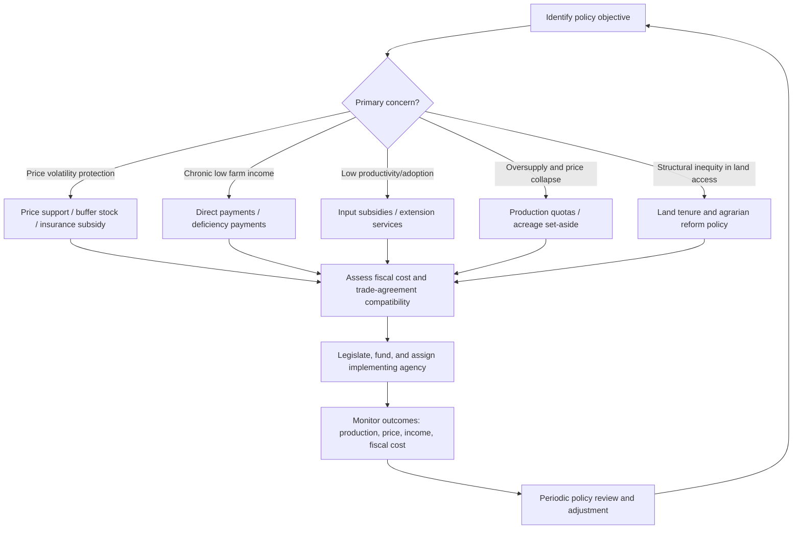

## Domestic Agricultural Policy Frameworks

### Overview

Domestic agricultural policy frameworks are the sets of laws, regulations, institutional arrangements, and government interventions that a country uses to influence agricultural production, input and output markets, farm incomes, food security, and rural development. These frameworks typically combine price and income support mechanisms, input subsidies, trade instruments, land and credit policy, research and extension services, and food safety/quality regulation into a coordinated (though not always fully consistent) national strategy.

### Key Points

- Domestic agricultural policy operates at the intersection of multiple, sometimes competing, objectives: farmer income support, consumer food affordability, food security, fiscal sustainability, and environmental sustainability.
- Policy instruments can be broadly classified as **price-based** (affecting the prices farmers receive or pay), **income-based** (direct payments decoupled from production decisions), **quantity-based** (quotas, planting restrictions), and **structural/institutional** (land reform, credit access, research systems).
- The specific mix, magnitude, and legal basis of these instruments vary enormously by country, income level, and political economy context; general categories are described here, but current provisions must always be verified against the specific national law or program guidelines. [Unverified — jurisdiction-specific]
- Agricultural policy frameworks are frequently revised in response to budget cycles, trade agreement obligations, and political administrations, making structural categories more durable as an analytical framework than any specific numeric parameter (e.g., support prices, subsidy rates).

### Core Objectives of Domestic Agricultural Policy

1. **Food security and self-sufficiency** — ensuring adequate, stable, and accessible food supply for the population, often with particular emphasis on staple crops.
2. **Farm income stabilization and support** — protecting farmers from price volatility, weather shocks, and structural income gaps relative to non-farm sectors.
3. **Productivity and competitiveness growth** — funding research, extension, irrigation, and infrastructure to raise output and lower unit costs.
4. **Rural development and poverty reduction** — using agriculture as a vehicle for broader rural livelihoods, employment, and infrastructure improvement.
5. **Environmental sustainability and resource management** — regulating water use, promoting conservation practices, and managing the environmental footprint of intensification.
6. **Consumer protection and food safety** — regulating quality standards, food safety inspection, and reasonable consumer prices.

These objectives frequently involve trade-offs — for instance, price supports that raise farmer income can simultaneously raise consumer food costs, and self-sufficiency goals can conflict with comparative-advantage-based trade liberalization. [Inference]

### Classification of Policy Instruments

#### Price Support Mechanisms

- **Minimum support price / guaranteed price schemes:** Government commits to purchasing a commodity (commonly staple grains) at a floor price if market prices fall below it, insulating farmers from downside price risk.
- **Price stabilization funds/buffer stocks:** Government or a designated agency buys during surplus periods and releases stock during shortages to smooth price volatility.
- **Marketing boards or state trading enterprises:** A designated body holds exclusive or dominant rights to purchase, store, and/or export a given commodity, historically used for crops such as cotton, cocoa, and grains in various countries. [Unverified — many marketing boards have been reformed or dismantled since the late 20th century; current status is country-specific]

#### Income Support Mechanisms

- **Direct payments (decoupled support):** Cash transfers to farmers based on historical production or land area rather than current output, intended to support income while minimizing production-distorting effects.
- **Deficiency payments:** Government pays the difference between a target price and the actual market price, without the government physically purchasing the commodity.
- **Crop insurance subsidies:** Government subsidizes premiums for crop or revenue insurance products, reducing farmers' exposure to yield and price shocks.

#### Input Subsidy Programs

- **Fertilizer, seed, and fuel subsidies:** Reduce the effective cost of key inputs to encourage adoption of yield-enhancing technology, commonly justified on food security or smallholder equity grounds.
- **Credit subsidies and directed lending:** Below-market interest rates or mandated minimum agricultural lending quotas for financial institutions.
- **Irrigation and infrastructure subsidies:** Public investment in irrigation systems, farm-to-market roads, and storage/cold-chain facilities, often justified by their public-good characteristics.

#### Quantity and Supply Management Instruments

- **Production quotas:** Legal limits on output for a specific commodity, historically used in some dairy and sugar sectors to manage supply and support prices. [Unverified — many such quota systems have been reformed in recent decades]
- **Acreage/planting restrictions or set-aside programs:** Payments to farmers for taking land out of production, used historically to manage surplus and, in some more recent iterations, to achieve conservation objectives (e.g., land retirement for habitat or soil conservation).
- **Import quotas and tariff-rate quotas:** While primarily trade instruments, these interact closely with domestic price support by controlling how much foreign competition domestic prices are exposed to.

#### Structural and Institutional Policy

- **Land tenure and agrarian reform policy:** Governs land redistribution, tenancy regulation, and titling systems (see related topic on land tenure).
- **Agricultural research and extension systems:** Public funding for crop breeding, agronomic research, and farmer advisory services, generally considered a public good due to the difficulty of private actors capturing full returns on basic agricultural research. [Inference]
- **Cooperative and farmer organization policy:** Legal frameworks enabling farmer cooperatives, associations, and producer organizations to aggregate bargaining power, inputs procurement, and marketing.
- **Food safety and quality standards regulation:** Institutions responsible for setting and enforcing sanitary and phytosanitary standards, grading systems, and labeling requirements.

### Comparative Framework of Instrument Types

| Instrument Type | Primary Beneficiary Focus | Market Distortion Potential | Fiscal Cost Pattern | Typical Justification |
| --- | --- | --- | --- | --- |
| Price floor/support price | Producers | High (can cause surplus) | Variable, tied to market conditions | Income stabilization, food security |
| Decoupled direct payment | Producers | Low-moderate | Predictable, budgeted | Income support with fewer market distortions |
| Input subsidy | Producers (especially smallholders) | Moderate (can distort input use choices) | High if uncapped | Productivity growth, equity |
| Production quota | Producers within quota | High (restricts supply response) | Low direct fiscal cost | Supply management, price stability |
| Crop insurance subsidy | Producers | Low-moderate | Moderate, contingent on claims | Risk management |
| Extension/research funding | Producers and sector-wide | Low | Ongoing public investment | Long-term productivity and public good provision |

### Policy Design Trade-offs

#### Efficiency vs. Equity

Broad-based price supports can benefit large commercial producers disproportionately (since payment often scales with output volume), while targeted input subsidies or smallholder-specific programs aim to address equity concerns but may carry higher administrative cost per beneficiary reached. [Inference]

#### Market Distortion vs. Risk Protection

Price and quantity interventions can stabilize farmer income but risk distorting planting decisions away from market signals, potentially causing chronic surplus or misallocation relative to comparative advantage. Decoupled payments and insurance-based approaches are often favored in trade-policy contexts (e.g., WTO domestic support classifications) specifically because they are considered less production- and trade-distorting. [Unverified — classification rules and specific country notifications should be checked against current WTO Agreement on Agriculture documentation]

#### Fiscal Sustainability vs. Program Scope

Universal input subsidies can become large and difficult-to-reduce fiscal commitments once farmers adjust their input-use and cost expectations around them, creating political economy lock-in even when program efficiency is questioned. [Inference]

### Illustrative Policy Instrument Selection Process

### Institutional Architecture (Typical National Structure)

Most national agricultural policy frameworks rely on an institutional architecture broadly resembling the following, though specific agency names, mandates, and hierarchies differ by country:

- **Ministry/Department of Agriculture:** Central policy formulation, budget allocation, and program implementation oversight.
- **Specialized commodity authorities/boards:** Oversight of specific sectors (e.g., rice, sugar, coconut, dairy) where such boards exist.
- **Agricultural research institutes and state universities:** Conduct applied and basic research, often linked to extension delivery.
- **Regulatory/standards agencies:** Food safety, seed certification, pesticide registration, and quality grading bodies.
- **Agricultural credit and insurance institutions:** State-owned or state-guaranteed banks and insurance corporations providing subsidized or guaranteed agricultural finance products.
- **Local government/regional implementing units:** Often responsible for on-the-ground program delivery, extension services, and data collection.

### Policy Evaluation Metrics

Common indicators used to assess domestic agricultural policy performance include:

- **Producer Support Estimate (PSE):** An OECD-developed indicator measuring the annual monetary value of gross transfers from consumers and taxpayers to agricultural producers, arising from policy measures, regardless of their nature, objectives, or impacts on farm production or income. [Unverified — refer to current OECD methodology documentation for precise calculation details, as methodology has been periodically updated]
- **Consumer Support Estimate (CSE):** The corresponding measure of transfers to or from consumers due to agricultural policies.
- **Nominal Rate of Assistance/Protection:** Compares domestic producer prices to a reference world price to gauge the degree of price distortion caused by policy.
- **Self-sufficiency ratio:** Domestic production as a percentage of domestic consumption for a given commodity, commonly tracked for staple food security monitoring.

$$\text{Self-sufficiency ratio} = \frac{\text{Domestic Production}}{\text{Domestic Consumption}} \times 100\%$$

### Common Pitfalls in Policy Design and Implementation

- **Poor targeting of subsidies**, where benefits accrue disproportionately to larger or better-connected farmers rather than the smallholders the program intends to support. [Inference]
- **Fiscal unsustainability** from open-ended price support or input subsidy commitments that expand faster than budget capacity, particularly under rising global input costs.
- **Policy incoherence**, where instruments across ministries (e.g., trade liberalization commitments versus domestic price support programs) work at cross-purposes.
- **Weak monitoring and evaluation systems**, making it difficult to assess whether stated objectives (income support, productivity growth) are actually being achieved relative to program cost.
- **Political economy lock-in**, where politically popular but economically inefficient instruments (e.g., broad fertilizer subsidies) persist despite evidence favoring more targeted alternatives, due to the concentrated benefits and diffuse costs typical of such programs. [Inference]

### Related Topics

- International trade agreements and agricultural market access
- WTO Agreement on Agriculture and domestic support classification (Amber, Blue, Green Box)
- Land tenure and agrarian reform policy
- Agricultural credit systems and rural finance
- Crop insurance and risk management programs
- Food security policy and strategic grain reserves
- Agricultural research and extension system design
- Producer cooperatives and farmer organization policy
- Environmental regulation and agri-environmental payment schemes
- Political economy of agricultural subsidy reform