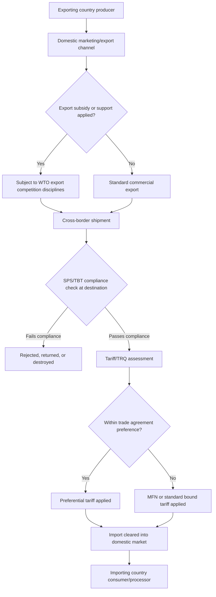

## International Agricultural Trade

### Overview

International agricultural trade refers to the cross-border exchange of agricultural commodities, processed food products, and agricultural inputs, governed by a combination of multilateral trade rules, regional and bilateral trade agreements, national trade policy, and market forces of comparative advantage. It encompasses exports, imports, tariff and non-tariff measures, sanitary and phytosanitary (SPS) regulation, and the institutional frameworks — chiefly the World Trade Organization (WTO) — that discipline how countries can support and protect their domestic agricultural sectors while trading internationally.

### Key Points

- International agricultural trade is shaped by comparative advantage (differences in relative production costs across countries) but is also heavily influenced by domestic policy choices, trade barriers, and non-market factors such as food security concerns.
- Agricultural trade is one of the most politically sensitive and historically protected areas of international trade, due to its links to rural livelihoods, food security, and cultural/political significance of farming in many countries.
- The WTO Agreement on Agriculture (AoA) is the principal multilateral framework disciplining agricultural trade policy, covering market access, domestic support, and export competition, though specific country commitments and ongoing negotiation status should be verified against current WTO documentation. [Unverified — negotiation status evolves]
- Non-tariff measures (particularly sanitary and phytosanitary standards) have become increasingly significant relative to tariffs as barriers to agricultural trade in recent decades. [Inference]

### Theoretical Basis: Comparative Advantage in Agriculture

The principle of comparative advantage holds that countries benefit from specializing in and exporting goods they can produce at a relatively lower opportunity cost, even if they are not the most efficient producer in absolute terms, and importing goods where their relative production cost is higher.

**Illustrative example:**

| Country | Rice (tons/labor-day) | Wheat (tons/labor-day) |
| --- | --- | --- |
| Country A | 4 | 2 |
| Country B | 1 | 2 |

Country A has an absolute advantage in both crops, but its comparative advantage lies in rice (opportunity cost of 0.5 tons of wheat per ton of rice) versus wheat (opportunity cost of 2 tons of rice per ton of wheat). Country B's opportunity cost of wheat (0.5 tons of rice per ton of wheat) is lower than Country A's. Under free trade, Country A should specialize in rice and Country B in wheat, with both countries able to consume more of both goods after trade than they could in isolation. [Inference — standard theoretical model; real-world outcomes are also shaped by trade barriers, transport costs, and policy distortions]

### The Three Pillars of the WTO Agreement on Agriculture

#### 1. Market Access

Governs tariffs and tariff-rate quotas (TRQs) applied to agricultural imports. Key elements include:

- **Tariffication:** Conversion of prior non-tariff barriers (quotas, variable levies) into bound tariff equivalents.
- **Tariff-rate quotas:** A specified quantity may enter at a lower ("in-quota") tariff rate, with a higher ("over-quota") tariff applied beyond that volume.
- **Special safeguard provisions:** Allow additional duties in response to import surges or price drops under specific, predefined conditions.

#### 2. Domestic Support

Classifies domestic farm support measures into categories based on their trade-distorting potential:

- **Amber Box:** Support considered trade- and production-distorting (e.g., price supports, input subsidies tied to production), subject to reduction commitments.
- **Blue Box:** Production-limiting support (e.g., payments based on fixed area/yields or a fixed number of livestock) considered less distorting and generally exempt from reduction commitments.
- **Green Box:** Support considered minimally or non-trade-distorting (e.g., decoupled income support, agricultural research, environmental programs, food security stockholding under certain conditions), exempt from reduction commitments.
- **De minimis provisions:** Allow a small percentage of production value in trade-distorting support without counting toward reduction commitments.

[Unverified — specific box classifications, thresholds, and current country-level commitments should be verified against current WTO Agreement on Agriculture text and country notification schedules, as detailed rules and ongoing negotiations (e.g., regarding public stockholding for food security) continue to evolve]

#### 3. Export Competition

Disciplines export subsidies and other measures that artificially boost export competitiveness, including rules on export credits, food aid, and state trading enterprises' export activities. Multilateral commitments in this area have moved toward the elimination of agricultural export subsidies, though implementation and exceptions are subject to ongoing negotiation and country-specific circumstances. [Unverified — verify current status]

### Non-Tariff Measures in Agricultural Trade

#### Sanitary and Phytosanitary (SPS) Measures

Regulations protecting human, animal, and plant health/life from risks arising from pests, diseases, or food contaminants. Governed under the WTO SPS Agreement, which requires that such measures be based on scientific evidence and risk assessment rather than serving as disguised trade protection.

#### Technical Barriers to Trade (TBT)

Product standards, labeling requirements, and certification procedures (e.g., organic certification, geographic indication labeling) that, while often legitimately consumer-protective, can also function as market access barriers if disproportionately burdensome for foreign producers to meet.

#### Rules of Origin

Criteria determining the "nationality" of a traded good, relevant for applying preferential tariff rates under trade agreements and for country-of-origin labeling requirements.

### Regional and Bilateral Trade Agreements

Beyond the multilateral WTO framework, countries negotiate:

- **Free trade agreements (FTAs):** Bilateral or regional agreements reducing or eliminating tariffs and some non-tariff barriers between signatory countries (e.g., regional blocs common in various parts of the world).
- **Customs unions:** FTAs combined with a common external tariff toward non-member countries.
- **Preferential trade arrangements:** Non-reciprocal tariff preferences, often extended by developed to developing countries for specific product categories.

Agricultural products are frequently treated as sensitive categories within these agreements, often subject to longer tariff phase-out periods, specific safeguard mechanisms, or exclusion from full liberalization. [Inference]

### Comparative Overview of Trade Policy Instruments

| Instrument | Mechanism | Primary Effect | WTO Treatment |
| --- | --- | --- | --- |
| Ad valorem tariff | Percentage tax on import value | Raises domestic price, protects import-competing producers | Bound under market access commitments |
| Tariff-rate quota | Lower tariff within quota, higher beyond | Manages import volume while allowing some access | Explicitly provided for under AoA |
| Import quota (non-tariff) | Absolute limit on import quantity | Restricts supply, historically converted to tariffs under AoA | Generally prohibited except under specific provisions |
| SPS measure | Health/safety-based technical requirement | Can restrict trade if not science-based | Disciplined under SPS Agreement |
| Export subsidy | Payment/incentive to exporters | Artificially lowers export price, distorts world markets | Subject to elimination commitments |
| Domestic support (Amber Box) | Price/input support tied to production | Indirectly distorts trade via production incentives | Subject to reduction commitments |

### Agricultural Trade Flow and Institutional Framework

### Key Determinants of Agricultural Trade Patterns

- **Resource endowments:** Land, water, and climate suitability strongly determine comparative advantage in specific commodities (e.g., tropical fruit, temperate grains, livestock products).
- **Exchange rate movements:** Currency depreciation can improve export competitiveness by lowering the foreign-currency price of a country's agricultural exports, and vice versa. [Inference]
- **Transport and logistics infrastructure:** Port capacity, cold-chain availability, and shipping costs significantly affect the competitiveness of perishable agricultural exports.
- **Domestic policy distortions:** Input subsidies, price supports, and export restrictions in major producing/exporting countries can shift world prices and trade patterns independent of underlying comparative advantage. [Inference]
- **Food security policy of importing countries:** Strategic stockholding, import restrictions during shortages, or self-sufficiency targets can reduce reliance on trade even where comparative advantage would favor importing. [Inference]

### Common Pitfalls and Analytical Considerations

- **Conflating tariff liberalization with full market access**, when non-tariff measures (SPS/TBT) may remain the binding constraint on actual trade flows even after tariffs are reduced. [Inference]
- **Overlooking domestic support classification nuances**, since a support measure's trade-distorting classification (Amber/Blue/Green Box) depends on specific design features, not just its stated policy goal.
- **Ignoring rules-of-origin complexity** in preferential trade agreements, which can significantly limit the practical utility of a tariff preference if compliance costs are high.
- **Assuming static comparative advantage**, when in practice technology, climate change, and infrastructure investment can shift comparative advantage over time. [Inference]
- **Underestimating the political economy of agricultural protection**, since agriculture remains one of the most heavily protected sectors globally relative to its share of GDP in many economies, reflecting non-economic policy objectives (food security, rural political constituencies) alongside economic ones. [Inference]

### Related Topics

- WTO Agreement on Agriculture and domestic support boxes (Amber, Blue, Green)
- Sanitary and phytosanitary (SPS) standards and compliance
- Regional trade blocs and agricultural provisions
- Exchange rate effects on agricultural competitiveness
- Global value chains in food and agribusiness
- Food security and strategic commodity reserves
- Export bans and their market impact during shortages
- Geographic indications and agricultural product branding
- Agricultural commodity price volatility and futures markets
- Domestic agricultural policy frameworks