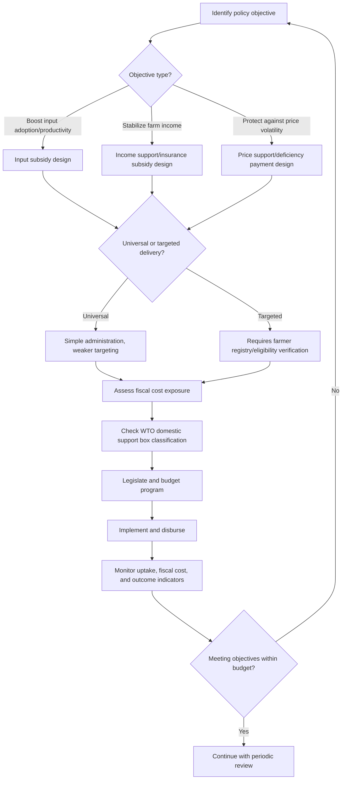

## Subsidies and Support Programs

### Overview

Agricultural subsidies and support programs are government interventions that transfer financial benefits to farmers, agribusinesses, or the agricultural sector, either directly (payments, price guarantees) or indirectly (input cost reduction, subsidized credit, insurance premium support). These programs are used to pursue objectives such as farm income stabilization, food security, productivity growth, rural development, and — increasingly — environmental stewardship, but they also carry significant fiscal costs and potential market-distorting effects that shape how they are designed, targeted, and disciplined under international trade rules.

### Key Points

- Subsidies can be classified along multiple dimensions: what is subsidized (output, input, income), how support is delivered (price, payment, in-kind), and how production-distorting the measure is considered under trade rules (notably the WTO's Amber/Blue/Green Box classification).
- Input subsidies (fertilizer, seed, fuel, credit) directly affect farmers' production cost structure and input-use decisions, while income and price supports affect farmers' revenue with more variable effects on planting decisions depending on design.
- Subsidy programs face a persistent design trade-off between effectively targeting intended beneficiaries (e.g., smallholders) and controlling program leakage, administrative cost, and fiscal sustainability. [Inference]
- Specific subsidy rates, eligibility rules, and budget allocations change frequently with legislative and budget cycles; general categories and design principles are more durable reference points than specific numeric parameters, which must be verified against current program guidelines. [Unverified — jurisdiction- and program-specific]

### Classification by Subsidy Object

#### Output/Price-Based Subsidies

- **Price supports/guaranteed minimum prices:** Government commits to a floor price, purchasing surplus if market price falls below it.
- **Deficiency payments:** Government pays farmers the gap between a target price and actual market price without physically purchasing the commodity.
- **Export subsidies:** Payments or incentives to exporters to make domestic products more competitive abroad, generally disciplined and being phased down under WTO export competition rules. [Unverified — verify current WTO commitments]

#### Input-Based Subsidies

- **Fertilizer subsidies:** Reduce farmer-facing fertilizer prices, often justified on yield-improvement and food security grounds, but frequently criticized for high fiscal cost and potential for overuse/environmental externalities if not well-designed. [Inference]
- **Seed subsidies:** Reduced-cost or free distribution of improved/certified seed varieties to encourage adoption of higher-yielding or climate-resilient cultivars.
- **Fuel and irrigation subsidies:** Reduced-cost diesel/electricity for irrigation pumping or reduced water tariffs.
- **Credit subsidies:** Below-market interest rates on agricultural loans, or mandated minimum agricultural lending quotas imposed on financial institutions.

#### Income-Based Support

- **Direct/decoupled payments:** Fixed payments based on historical production, land area, or farm size, not tied to current output decisions, designed to support income while minimizing production distortions.
- **Insurance premium subsidies:** Government covers part of the premium cost for crop or livestock insurance, encouraging farmer uptake and reducing income volatility from weather and yield shocks.
- **Disaster relief and ad hoc payments:** One-time or emergency payments following natural disasters, pest outbreaks, or market shocks.

#### Structural and Public Good Support

- **Research and development funding:** Public investment in crop breeding, agronomic research, and technology development.
- **Extension service funding:** Subsidized or free farmer advisory and training services.
- **Infrastructure investment:** Irrigation systems, farm-to-market roads, storage, and cold-chain facilities.

### WTO Classification of Domestic Support (Trade-Distortion Lens)

| Box | Characteristics | Examples | Trade Discipline |
| --- | --- | --- | --- |
| Amber Box | Directly tied to production/prices; considered trade-distorting | Price supports, input subsidies linked to output | Subject to reduction commitments |
| Blue Box | Production-limiting programs (tied to fixed area/yield or headage) | Payments requiring farmers to limit production | Generally exempt from reduction commitments |
| Green Box | Minimally/non-trade-distorting; decoupled from production | Decoupled income support, research funding, environmental payments, food security stockholding (under conditions) | Exempt from reduction commitments |
| De minimis | Small percentage of production value, exempted regardless of category | Minor product-specific or non-product-specific support below threshold | Excluded from reduction calculations |

[Unverified — specific thresholds, percentage caps, and classification nuances should be verified against current WTO Agreement on Agriculture text and country notification schedules, as this remains an area of ongoing multilateral negotiation, particularly regarding public stockholding for food security purposes]

### Worked Example: Fertilizer Subsidy Fiscal Cost Estimation

Assume a national fertilizer subsidy program reduces the farmer-facing price of urea from ₱50/kg to ₱30/kg (a ₱20/kg subsidy), and 2,000,000 farmers each use an average of 150 kg per season.

$$\text{Total subsidy cost} = \text{Subsidy per kg} \times \text{Average usage per farmer} \times \text{Number of farmers}$$

$$\text{Total subsidy cost} = 20 \times 150 \times 2{,}000{,}000 = ₱6{,}000{,}000{,}000 \text{ per season}$$

If usage increases by 10% due to the lower effective price (a plausible demand response, though the actual elasticity varies by context) [Inference]:

$$\text{New usage per farmer} = 150 \times 1.10 = 165 \text{ kg}$$

$$\text{New total subsidy cost} = 20 \times 165 \times 2{,}000{,}000 = ₱6{,}600{,}000{,}000 \text{ per season}$$

This illustrates a common fiscal risk in input subsidy design: induced demand response can cause program costs to exceed initial budget projections, particularly when the subsidy is uncapped per farmer or per hectare.

### Decoupled Payment Calculation Example

A decoupled area-based payment program pays a fixed rate per hectare based on a farmer's historical (base period) planted area, regardless of current cropping decisions.

$$\text{Payment} = \text{Base area (ha)} \times \text{Payment rate per ha}$$

If a farmer's base area is 3 hectares and the payment rate is ₱5,000/ha:

$$\text{Payment} = 3 \times 5{,}000 = ₱15{,}000 \text{ per season}$$

Because the payment is calculated on historical rather than current area, the farmer's current-season planting decision (which crop, how much area) is not directly incentivized by the payment amount, which is the design feature that gives decoupled payments their lower trade-distortion classification. [Inference]

### Comparison of Subsidy Delivery Mechanisms

| Delivery Mechanism | Farmer-Facing Effect | Targeting Precision | Fiscal Predictability | Distortion Potential |
| --- | --- | --- | --- | --- |
| Universal input price subsidy | Lowers input cost for all users | Low (benefits scale with usage/farm size) | Low (cost varies with usage and market prices) | Moderate-high |
| Targeted/voucher-based input subsidy | Lowers cost for eligible beneficiaries only | Higher (if eligibility well-verified) | Moderate | Moderate |
| Decoupled direct payment | Fixed transfer independent of current production | High (if based on verified historical records) | High | Low |
| Insurance premium subsidy | Reduces cost of risk protection | Moderate (uptake-dependent) | Moderate (contingent on claims experience) | Low |
| Price/deficiency payment | Raises effective price received | Low-moderate | Low (variable with market price gaps) | High |

### Program Design and Targeting Considerations

#### Universal vs. Targeted Subsidies

Universal subsidies (available to all farmers regardless of farm size or income) are administratively simpler but tend to allocate a disproportionate share of total benefit to larger farms, since benefit scales with input volume or output. Targeted subsidies (e.g., capped per smallholder, means-tested) aim to improve equity but require reliable farmer registries and verification systems, raising administrative cost and creating exclusion-error risk if registries are incomplete. [Inference]

#### In-Kind vs. Cash Transfer

In-kind subsidies (direct provision of subsidized fertilizer, seed) ensure the support is used for the intended input but can suffer from logistical inefficiencies, leakage, or mismatched timing relative to planting calendars. Cash transfers or vouchers preserve farmer choice and can be more easily audited financially but rely on functioning local input markets and may be used for non-agricultural purposes if not conditioned. [Inference]

#### Conditionality and Cross-Compliance

Some support programs attach environmental or conservation conditions (e.g., adopting soil conservation practices, restricting pesticide use near waterways) as a prerequisite for receiving payments — an approach often referred to as cross-compliance, increasingly used to align income support with environmental objectives. [Unverified — specific cross-compliance frameworks vary substantially by country]

### Subsidy Program Design and Evaluation Flow

### Measuring Subsidy Impact

- **Producer Support Estimate (PSE):** OECD indicator aggregating the value of policy transfers to producers from consumers and taxpayers, used for cross-country comparison of support levels. [Unverified — refer to current OECD methodology]
- **Effective rate of protection:** Measures how much a subsidy or trade measure raises value-added in a sector relative to a free-market baseline.
- **Benefit-cost ratio and fiscal incidence analysis:** Used to assess how much of subsidy spending reaches intended beneficiaries relative to total program cost, including administrative overhead and leakage.
- **Input-use elasticity studies:** Estimate how much input demand responds to subsidized price changes, informing fiscal cost projections.

### Common Pitfalls

- **Elite capture and poor targeting**, where subsidy benefits accrue disproportionately to larger, better-connected, or politically influential farmers rather than the intended smallholder beneficiaries. [Inference]
- **Fiscal overrun from open-ended commitments**, particularly with uncapped price supports or universal input subsidies exposed to global commodity price swings.
- **Input overuse and environmental externalities**, such as excessive fertilizer application when heavily subsidized, contributing to soil degradation or water quality issues. [Inference]
- **Program leakage and diversion**, where subsidized inputs are resold at market rates rather than used as intended, undermining program cost-effectiveness.
- **Political economy lock-in**, where subsidies become difficult to reform or phase out once farmers' cost structures and expectations adjust around them, even when evidence favors alternative designs. [Inference]
- **Trade compliance risk**, where poorly classified or excessive Amber Box support exposes a country to WTO dispute settlement challenges from trading partners. [Unverified — dispute outcomes are case-specific]

### Related Topics

- Domestic agricultural policy frameworks
- WTO Agreement on Agriculture and domestic support boxes
- Crop insurance and agricultural risk management
- Agricultural credit systems and rural finance
- Input use efficiency and environmental externalities of fertilizer subsidies
- Land tenure and eligibility for support program targeting
- Political economy of agricultural subsidy reform
- Food security policy and strategic reserves
- Farm income diversification and off-farm livelihoods
- International agricultural trade