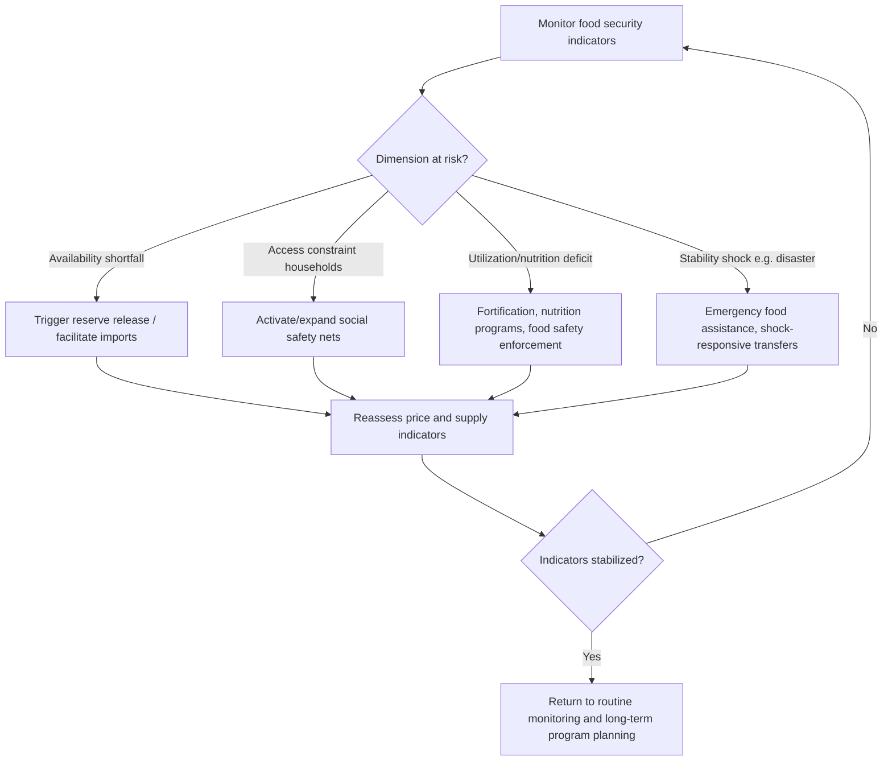

## Food Security Policy

### Overview

Food security policy encompasses the strategies, institutions, and instruments a government uses to ensure that all people, at all times, have physical and economic access to sufficient, safe, and nutritious food to meet their dietary needs for an active and healthy life. Policy frameworks typically address the four widely referenced dimensions of food security — **availability**, **access**, **utilization**, and **stability** — through a mix of production support, trade policy, social protection, strategic reserves, and nutrition programs.

### Key Points

- Food security is a multidimensional concept; a country can be food-secure in aggregate availability terms (sufficient national supply) while still having significant household-level food insecurity due to access constraints (poverty, distribution, affordability).
- Policy instruments generally address one or more of the four dimensions: availability (production, imports), access (income, prices, safety nets), utilization (nutrition, food safety, sanitation), and stability (buffer stocks, price stabilization, resilience to shocks).
- Strategic food reserves and self-sufficiency targets are among the most visible and politically salient food security instruments, but they carry significant fiscal and storage costs and can create market distortions if not carefully managed. [Inference]
- Food security policy increasingly intersects with climate change adaptation, given the vulnerability of agricultural production to weather variability and extreme events. [Inference]

### The Four Dimensions of Food Security

#### 1. Availability

Whether sufficient quantities of food are physically present, through domestic production, commercial imports, or food aid. Policy levers include agricultural productivity support, trade policy, and production planning for staple crops.

#### 2. Access

Whether households have adequate resources (income, entitlements, market access) to obtain sufficient food. Policy levers include income support, minimum wage policy, food subsidies, social safety nets, and rural infrastructure that reduces transaction costs to reach markets.

#### 3. Utilization

Whether food is used effectively by the body, encompassing food safety, dietary diversity, and health/sanitation conditions that affect nutrient absorption. Policy levers include food safety regulation, nutrition education, fortification programs, and water/sanitation infrastructure.

#### 4. Stability

Whether the other three dimensions are maintained over time despite shocks (weather, price volatility, conflict, economic downturns). Policy levers include buffer stocks, early warning systems, crop insurance, and social protection systems with shock-responsive design.

### Policy Instrument Classification by Dimension

| Dimension | Instrument Examples | Primary Mechanism |
| --- | --- | --- |
| Availability | Production subsidies, research/extension, irrigation investment, import facilitation | Increases physical food supply |
| Access | Cash transfers, food price subsidies, minimum wage policy, rural roads | Increases purchasing power or reduces access cost |
| Utilization | Food fortification mandates, food safety inspection, nutrition education | Improves nutritional and safety quality of consumed food |
| Stability | Strategic grain reserves, price stabilization funds, crop insurance, early warning systems | Buffers against shocks over time |

### Strategic Food Reserves

#### Purpose and Mechanism

Governments maintain physical stockpiles of staple commodities (commonly rice, wheat, or maize) to:

- Stabilize domestic prices by releasing stock during shortages and procuring during surpluses.
- Provide emergency food supply during natural disasters, conflict, or supply chain disruptions.
- Support minimum price guarantees to producers by serving as the buyer of last resort.

#### Design Considerations

- **Reserve size:** Typically expressed as a target number of months of national consumption; larger reserves provide greater shock-buffering capacity but incur higher storage, financing, and spoilage costs. [Inference]
- **Release triggers:** Rules-based triggers (e.g., price exceeding a defined threshold) versus discretionary release decisions; rules-based systems offer more predictability but less flexibility for context-specific judgment. [Inference]
- **Storage and quality management:** Post-harvest losses in storage (pest damage, moisture spoilage) can be substantial without adequate storage infrastructure, undermining the reserve's effective availability when needed. [Unverified — loss rates vary widely by facility quality and grain type]

### Worked Example: Strategic Reserve Sizing

A country consumes 24 million metric tons of rice annually and wants to maintain a reserve equivalent to 2 months of consumption as a buffer against supply disruption.

$$\text{Target reserve} = \text{Annual consumption} \times \frac{\text{Target months}}{12}$$

$$\text{Target reserve} = 24{,}000{,}000 \times \frac{2}{12} = 4{,}000{,}000 \text{ metric tons}$$

If current reserve stock is 2.5 million metric tons, the procurement gap is:

$$\text{Procurement needed} = 4{,}000{,}000 - 2{,}500{,}000 = 1{,}500{,}000 \text{ metric tons}$$

If domestic procurement at the guaranteed floor price costs ₱22,000 per metric ton:

$$\text{Estimated procurement cost} = 1{,}500{,}000 \times 22{,}000 = ₱33{,}000{,}000{,}000$$

This calculation illustrates why reserve-building commitments interact directly with price support programs and fiscal budgeting, since procurement volume and floor price jointly determine cost exposure.

### Social Protection and Access-Oriented Programs

- **Conditional and unconditional cash transfers:** Direct income support to vulnerable households, sometimes conditioned on behaviors such as school attendance or health check-ups, improving food access through increased purchasing power.
- **Food subsidy/ration programs:** Subsidized or free distribution of staple foods to targeted populations (e.g., public distribution systems), directly addressing access but requiring significant logistics and targeting infrastructure.
- **School feeding programs:** Provide meals to students, simultaneously addressing child nutrition, education incentives, and — in some designs — local agricultural demand if sourced from local producers.
- **Emergency/humanitarian food assistance:** Rapid-response distribution during acute crises (disasters, conflict, displacement), often coordinated with international humanitarian agencies.

### Nutrition and Utilization Policy

- **Food fortification programs:** Mandating or incentivizing the addition of micronutrients (iron, iodine, vitamin A) to staple foods to address widespread deficiencies without requiring dietary behavior change.
- **Food safety regulation and inspection systems:** Ensuring food products meet safety standards to prevent foodborne illness, which affects the body's ability to utilize nutrients even when sufficient food is available.
- **Nutrition education and behavior change communication:** Public health campaigns promoting dietary diversity and appropriate infant/young child feeding practices.

### Early Warning and Shock-Responsive Systems

- **Agricultural monitoring systems:** Combine weather data, crop condition assessments, and market price monitoring to detect emerging food security risks before they become crises.
- **Famine early warning classification systems:** Multi-partner frameworks (used in various international contexts) that classify food insecurity severity by geographic area to guide humanitarian response prioritization. [Unverified — specific classification systems and their governance vary; verify current framework details if referencing a specific system]
- **Shock-responsive social protection:** Social protection systems designed to scale up rapidly (e.g., temporary benefit increases or expanded coverage) in response to detected shocks, rather than requiring entirely new emergency program creation.

### Food Security Policy Response Framework

### Self-Sufficiency vs. Trade-Based Food Security Strategies

#### Self-Sufficiency Approach

Prioritizes domestic production capacity for staple foods, often via price supports, input subsidies, and import restrictions. Reduces exposure to international market volatility and supply disruptions but may forgo comparative-advantage gains and can be costly if domestic production conditions (climate, land, water) are not well-suited to the targeted commodity. [Inference]

#### Trade-Based (Food Self-Reliance) Approach

Relies on a combination of domestic production where comparatively advantageous and stable trade relationships/foreign exchange capacity to import the remainder, sometimes termed "food self-reliance" as distinct from strict self-sufficiency. Can achieve food security more cost-effectively in aggregate but exposes the country to global price volatility, export restrictions by trading partners during shortages, and exchange rate risk. [Inference]

Most national policy frameworks in practice combine elements of both approaches, applying different strategies to different commodities based on strategic importance and comparative production advantage. [Inference]

### Measuring Food Security

- **Food Insecurity Experience Scale (FIES):** Survey-based indicator measuring self-reported food access difficulty at the household or individual level.
- **Prevalence of undernourishment:** Estimates the proportion of the population whose habitual food consumption is insufficient to provide the dietary energy levels required for an active and healthy life.
- **Dietary diversity scores:** Measure the variety of food groups consumed, used as a proxy for nutritional adequacy.
- **Global Food Security Index and similar composite indices:** Combine affordability, availability, quality/safety, and natural resource/resilience indicators into a comparative national ranking. [Unverified — methodology and index composition are periodically revised by publishers]

### Common Pitfalls

- **Conflating national food availability with household food security**, overlooking that aggregate supply sufficiency does not guarantee equitable access. [Inference]
- **Over-reliance on strategic reserves without addressing access constraints**, leaving vulnerable households food-insecure even when national stocks are adequate.
- **Inadequate storage infrastructure**, leading to significant post-harvest losses that undermine the effective size of strategic reserves. [Unverified — loss magnitude is context-dependent]
- **Poorly targeted subsidy or ration programs**, resulting in benefits reaching non-vulnerable populations while under-covering the intended target group. [Inference]
- **Neglecting the stability dimension**, designing programs for steady-state conditions without shock-responsive mechanisms, leaving systems slow to react during disasters or price spikes.
- **Underinvesting in early warning systems**, delaying crisis response until food insecurity has already become acute and more costly to address. [Inference]

### Related Topics

- Domestic agricultural policy frameworks
- Strategic grain reserves and buffer stock management
- Social protection and cash transfer program design
- International agricultural trade and food self-reliance strategies
- Climate change adaptation in agriculture
- Post-harvest loss reduction and storage infrastructure
- Nutrition policy and food fortification programs
- Agricultural early warning and monitoring systems
- Humanitarian food assistance coordination
- Subsidies and support programs