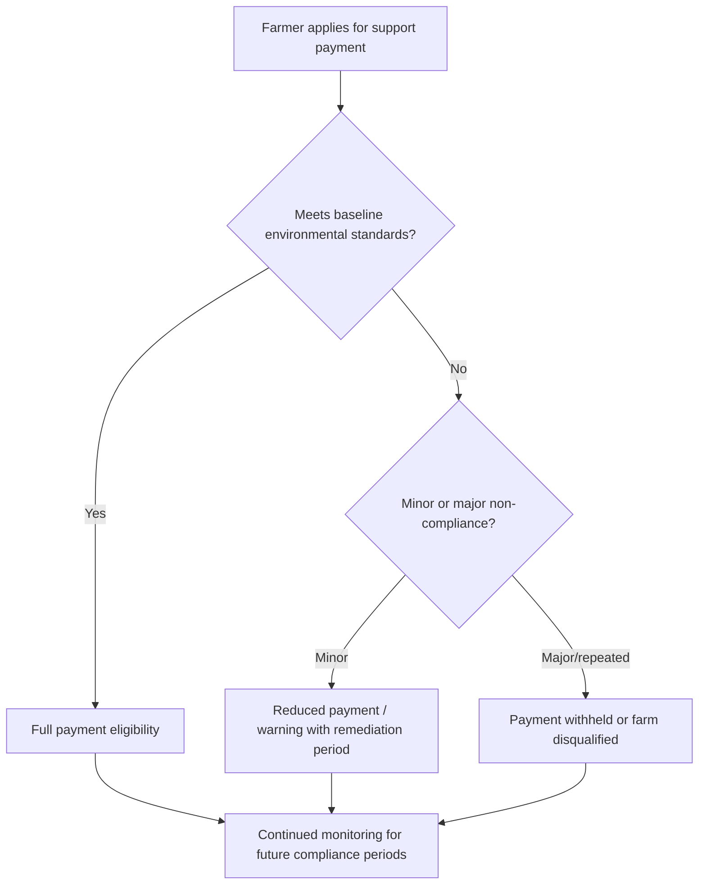
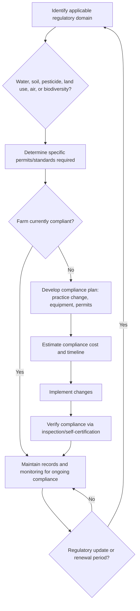

## Environmental Regulations Affecting Agriculture

### Overview

Environmental regulations affecting agriculture comprise the body of laws, standards, and compliance mechanisms that govern how farming activities interact with natural resources — soil, water, air, biodiversity, and climate — to limit negative externalities from production practices while attempting to preserve agricultural productivity and rural livelihoods. These regulations span water use and quality, pesticide and fertilizer management, land use and conversion, air emissions, biodiversity protection, and increasingly, greenhouse gas emissions and climate adaptation requirements.

### Key Points

- Agricultural environmental regulation addresses classic externality problems: farming activities can impose costs on third parties (downstream water users, neighboring ecosystems, future generations) that are not reflected in market prices for agricultural inputs or outputs. [Inference]
- Regulatory approaches range from command-and-control standards (mandatory limits, prohibited practices) to market-based instruments (taxes, tradable permits) to voluntary/incentive-based programs (payments for ecosystem services, certification schemes).
- Compliance costs and administrative burden of environmental regulation often fall disproportionately on smallholder farmers relative to large commercial operations, raising equity considerations in regulatory design. [Inference]
- Specific regulatory thresholds, permitted substances, and enforcement mechanisms vary significantly across jurisdictions and are subject to frequent revision; general regulatory categories are more durable as a reference framework than specific numeric standards, which must be verified against current national/local law. [Unverified — jurisdiction-specific]

### Major Regulatory Domains

#### Water Resource Regulation

- **Water abstraction/withdrawal permits:** Limits or licensing requirements on the volume of surface or groundwater farmers may extract for irrigation, intended to prevent aquifer depletion and protect downstream users.
- **Water quality standards:** Regulations limiting agricultural runoff (nutrients, sediment, agrochemical residues) into surface water and groundwater, often including buffer zone requirements along waterways.
- **Wetland and riparian protection:** Restrictions on drainage or conversion of wetlands and riparian zones due to their water filtration and habitat functions.

#### Soil Conservation Regulation

- **Erosion control requirements:** Mandated practices such as contour farming, terracing, or cover cropping on sloped or erosion-prone land, sometimes tied to eligibility for government support payments (cross-compliance).
- **Soil health/organic matter standards:** Some jurisdictions have introduced minimum soil management standards as a condition for accessing certain subsidies, though this remains a less universally established regulatory area. [Unverified — regulatory maturity varies significantly by country]

#### Pesticide and Agrochemical Regulation

- **Registration and approval systems:** Pesticides and agrochemicals must typically be registered and approved by a national regulatory authority before legal sale or use, based on toxicological and environmental risk assessment.
- **Restricted-use and banned substance lists:** Certain highly hazardous pesticides may be restricted to certified applicators or banned outright based on health or environmental risk findings.
- **Maximum residue limits (MRLs):** Regulatory thresholds for pesticide residue in food products, relevant both domestically and for export market access compliance.
- **Application buffer zones and re-entry intervals:** Rules governing minimum distances from water bodies/residential areas for spraying, and mandatory waiting periods before workers may re-enter treated fields.

#### Fertilizer and Nutrient Management Regulation

- **Nutrient management plans:** Some jurisdictions require farmers (particularly livestock operations above certain size thresholds) to develop and follow documented plans for manure and fertilizer application rates to prevent nutrient runoff.
- **Nitrate-vulnerable zone designations:** Areas identified as having elevated risk of nitrate contamination may face additional restrictions on fertilizer/manure application timing and quantity. [Unverified — this specific regulatory mechanism and terminology originated in certain regions and may not have direct equivalents elsewhere]

#### Land Use and Conversion Regulation

- **Agricultural land conversion restrictions:** Rules governing or restricting the conversion of agricultural land to non-agricultural uses (e.g., residential, industrial development), often intended to preserve food production capacity.
- **Forest and habitat conversion restrictions:** Prohibitions or permitting requirements for converting forested or high-conservation-value land to agricultural use, addressing deforestation and biodiversity loss concerns.
- **Environmental impact assessment (EIA) requirements:** Mandatory environmental review processes for large-scale agricultural developments (e.g., large plantations, livestock facilities) before project approval.

#### Air Quality and Emissions Regulation

- **Open burning restrictions:** Prohibitions or permitting requirements on agricultural residue burning (e.g., post-harvest crop residue burning), addressing air quality and, in some regions, regional haze concerns.
- **Livestock emissions standards:** Regulations addressing ammonia and particulate emissions from concentrated livestock operations, though comprehensive greenhouse gas regulation specific to livestock remains an emerging and unevenly developed regulatory area globally. [Unverified — regulatory maturity and scope vary substantially by jurisdiction]

#### Biodiversity and Habitat Protection

- **Protected area buffer restrictions:** Limitations on agricultural activity adjacent to protected areas, national parks, or critical habitats.
- **Endangered species protection provisions:** Restrictions on practices that could harm protected species, which can affect land management decisions near known habitats.

### Regulatory Approach Comparison

| Approach Type | Mechanism | Example | Strengths | Limitations |
| --- | --- | --- | --- | --- |
| Command-and-control | Mandatory standards/prohibitions | Pesticide bans, buffer zone requirements | Clear compliance benchmark, enforceable | Can be inflexible, uniform cost regardless of farm-specific abatement cost |
| Market-based (Pigouvian) | Taxes/charges on externality-generating activity | Fertilizer or water-use taxes | Economically efficient in theory (aligns private cost with social cost) | Politically difficult, administratively complex to calibrate |
| Tradable permits | Cap-and-trade for a resource or pollutant | Water abstraction permit trading (where implemented) | Allows abatement to occur where cheapest | Requires robust monitoring and enforcement infrastructure |
| Voluntary/incentive-based | Payments for adopting beneficial practices | Payments for ecosystem services, conservation easements | Farmer buy-in, positive incentive rather than penalty | Relies on continued funding, may attract farmers already planning to adopt (additionality concern) [Inference] |
| Certification/labeling | Market-based signaling of compliance | Organic certification, sustainable sourcing labels | Consumer-driven demand can reward compliance | Coverage limited to participating farmers/buyers, verification cost |

### Cross-Compliance Mechanism

Cross-compliance links eligibility for government subsidies or support payments to compliance with specified environmental (and sometimes other) standards, effectively using the subsidy system as an enforcement lever rather than relying solely on direct regulatory penalties.

[Unverified — cross-compliance frameworks, thresholds, and penalty structures vary substantially by country and program; verify against current national program rules]

### Worked Example: Nutrient Application Compliance Cost

A dairy operation is required to reduce nitrogen application from 250 kg N/ha to a regulatory limit of 170 kg N/ha to comply with a nutrient management regulation in a designated sensitive watershed.

$$\text{Reduction required} = 250 - 170 = 80 \text{ kg N/ha}$$

If the farm has 40 hectares under this requirement, and compliance requires substituting reduced synthetic fertilizer with a nutrient management plan involving soil testing and precision application (estimated additional cost of ₱3,500/ha for planning, testing, and equipment amortization):

$$\text{Total estimated compliance cost} = 40 \times 3{,}500 = ₱140{,}000 \text{ per season}$$

This type of calculation is central to regulatory impact assessments, which compare compliance costs against the estimated environmental benefit (e.g., reduced nitrate loading into a water body) to evaluate whether a proposed regulation is proportionate. [Inference — methodology description; actual benefit valuation requires environmental economics techniques such as contingent valuation or damage cost avoided, which are beyond a simple compliance-cost calculation]

### Interaction with Trade and Export Markets

Environmental and food-safety-adjacent regulations increasingly function as de facto trade requirements, since importing countries' maximum residue limits, traceability requirements, and (in some markets) deforestation-free sourcing requirements can determine market access for exporting farmers, independent of the exporting country's own domestic regulatory stringency. [Unverified — specific import-market requirements change; verify against current destination-market regulations, e.g., evolving deforestation-related due diligence regulations in certain markets]

### Regulatory Compliance Decision Flow for Farm Operations

### Common Pitfalls

- **Regulatory fragmentation across agencies**, where water, agriculture, and environment ministries impose overlapping or inconsistent requirements, increasing farmer compliance confusion and cost. [Inference]
- **Disproportionate burden on smallholders**, since fixed compliance costs (testing, documentation, certification) represent a larger share of revenue for small operations than for large commercial farms. [Inference]
- **Weak monitoring and enforcement capacity**, undermining the credibility and effectiveness of formally strong regulations if violations are rarely detected or penalized. [Unverified — enforcement capacity varies widely by country and agency resourcing]
- **Regulatory lag behind emerging risks**, such as slower regulatory adaptation to new agrochemical formulations, emerging pests, or climate-driven shifts in resource availability. [Inference]
- **Overlooking transition support**, where regulations mandate practice changes without accompanying technical assistance or financing support, reducing farmer compliance capacity and potentially increasing informal non-compliance. [Inference]
- **Trade-driven regulatory misalignment**, where export-market environmental requirements exceed domestic regulatory standards, creating a two-tier compliance burden for export-oriented versus domestic-market farmers. [Inference]

### Related Topics

- Water rights and irrigation management
- Pesticide regulation and integrated pest management
- Land tenure and agricultural land conversion policy
- Climate change adaptation and mitigation in agriculture
- Payments for ecosystem services and conservation programs
- Organic and sustainability certification systems
- Domestic agricultural policy frameworks
- International agricultural trade and non-tariff measures
- Soil health and conservation agriculture practices
- Environmental impact assessment for agribusiness projects