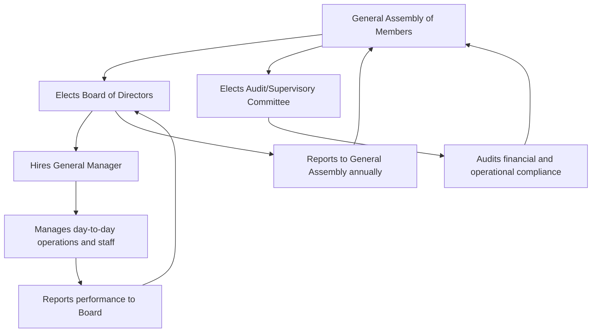
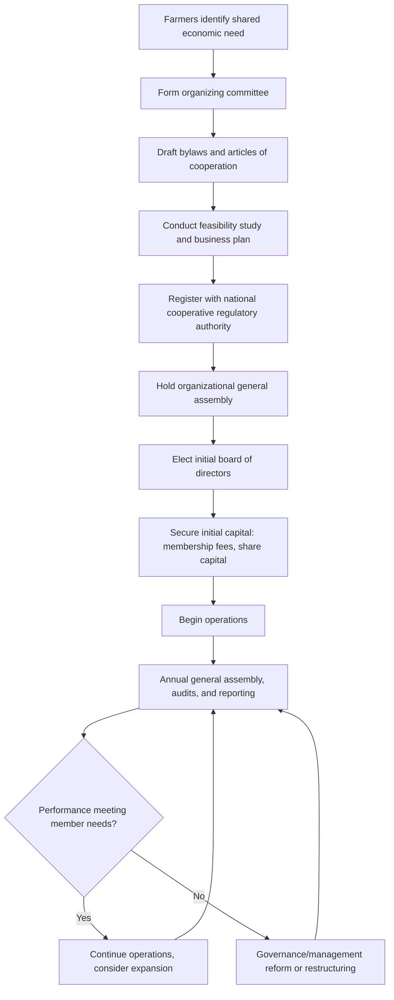

## Agricultural Cooperatives and Organizations

### Overview

Agricultural cooperatives and farmer organizations are member-owned and member-controlled entities that farmers form to collectively achieve economic, social, or political objectives that would be difficult or costly to achieve individually. These include aggregating bargaining power in input and output markets, sharing infrastructure and services, accessing credit and technical assistance, and representing farmer interests in policy processes. Cooperatives operate under distinct legal and governance structures compared to investor-owned firms, with membership, control, and benefit distribution typically tied to patronage (use of the cooperative) rather than capital investment alone.

### Key Points

- The defining features of a cooperative are member ownership, democratic member control (commonly one-member-one-vote regardless of capital contribution), and distribution of benefits based on use/patronage rather than purely on capital invested — collectively known as cooperative principles.
- Agricultural cooperatives can operate across the value chain: input supply, production services, marketing/processing, credit provision, and consumer-facing retail.
- Cooperative success is strongly influenced by governance quality, member commitment, management professionalism, and the specific economic function being addressed (e.g., input aggregation is generally easier to sustain than complex value-added processing). [Inference]
- Legal frameworks for cooperative registration, governance, and taxation vary substantially by country, and specific regulatory requirements should be verified against current national cooperative law. [Unverified — jurisdiction-specific]

### Cooperative Principles (International Co-operative Alliance Framework)

The internationally referenced cooperative principles, commonly associated with the International Co-operative Alliance (ICA), include:

1. Voluntary and open membership
2. Democratic member control
3. Member economic participation
4. Autonomy and independence
5. Education, training, and information
6. Cooperation among cooperatives
7. Concern for community

[Unverified — the specific wording and numbering of these principles has been periodically revised by the ICA; verify current official statement of cooperative identity if precise citation is required]

### Types of Agricultural Cooperatives by Function

#### Marketing Cooperatives

Aggregate members' output for collective sale, enabling smallholders to achieve economies of scale in transportation, storage, quality grading, and price negotiation that would be unavailable to individual small-volume sellers. Common in commodities such as coffee, dairy, and grains.

#### Input Supply Cooperatives

Bulk-purchase seed, fertilizer, and other inputs on behalf of members, securing volume discounts and more reliable input access, particularly valuable in areas with thin or unreliable private input markets.

#### Processing Cooperatives

Own and operate processing facilities (e.g., dairy processing plants, rice mills, sugar mills) collectively, allowing members to capture value-added margins that would otherwise accrue to a separate processing intermediary.

#### Credit and Savings Cooperatives (Agricultural Credit Unions)

Provide savings and credit services tailored to agricultural cash-flow cycles, often more accessible to smallholders than formal commercial banks due to lower collateral requirements and localized trust-based lending models. [Inference]

#### Service Cooperatives

Provide shared machinery (e.g., tractor pools, harvesters), irrigation management, or extension/technical services that individual smallholders could not economically own or access alone.

#### Multipurpose Cooperatives

Combine several of the above functions (input supply, marketing, credit) within a single organizational structure, common where administrative capacity favors consolidation over multiple specialized entities.

### Comparative Overview by Function

| Cooperative Type | Primary Economic Benefit | Capital Intensity | Governance Complexity | Common Risk Factors |
| --- | --- | --- | --- | --- |
| Marketing | Bargaining power, economies of scale in sale | Low-moderate | Moderate | Price/quality disputes among members, side-selling |
| Input supply | Bulk purchase discounts, input access reliability | Low-moderate | Low-moderate | Cash flow/credit management for bulk purchase |
| Processing | Captures value-added margin | High | High | Requires significant capital, technical, and market expertise |
| Credit/savings | Access to tailored agricultural finance | Moderate | Moderate-high (financial regulation) | Loan default risk, liquidity management |
| Service (machinery/irrigation) | Access to otherwise unaffordable capital equipment | Moderate-high | Moderate | Equipment maintenance funding, usage scheduling conflicts |
| Multipurpose | Combined benefits, administrative consolidation | Variable | High (multiple business lines to govern) | Risk of overextension beyond core competency |

### Governance Structure

A typical agricultural cooperative governance structure includes:

- **General Assembly of Members:** The highest governing body, typically meeting annually, responsible for major decisions (bylaw amendments, board elections, profit/surplus distribution policy).
- **Board of Directors:** Elected by and from the membership, responsible for strategic oversight and hiring professional management.
- **General Manager/Management Team:** Handles day-to-day operations, often hired specifically for professional business management expertise rather than drawn exclusively from the farmer membership.
- **Audit/Supervisory Committee:** An internal oversight body (structure varies by jurisdiction) responsible for financial and compliance auditing on behalf of members.

### Patronage-Based Benefit Distribution

Unlike investor-owned firms where dividends are distributed based on shares owned, cooperatives typically distribute surplus (net income after expenses) based on **patronage** — the extent to which each member used the cooperative's services (e.g., volume of produce marketed through the cooperative, or value of inputs purchased).

$$\text{Member's patronage refund} = \text{Total distributable surplus} \times \frac{\text{Member's patronage volume}}{\text{Total cooperative patronage volume}}$$

**Worked example:** A marketing cooperative has ₱2,000,000 in distributable surplus for the year, with total marketed volume of 10,000 metric tons across all members. A member who marketed 150 metric tons through the cooperative receives:

$$\text{Refund} = 2{,}000{,}000 \times \frac{150}{10{,}000} = ₱30{,}000$$

This patronage-based distribution is a defining structural difference from investor-owned firms and reinforces the cooperative's alignment with member usage rather than capital ownership. [Inference]

### Formation and Legal Structuring Process

[Unverified — specific registration requirements, minimum capital thresholds, and regulatory authority names vary by country; verify against current national cooperative code]

### Economic Rationale for Cooperative Formation

- **Economies of scale:** Aggregating volume reduces per-unit transaction, transport, and storage costs that would be prohibitive for individual smallholders. [Inference]
- **Market power/bargaining position:** Collective bargaining can offset buyer concentration in input or output markets, addressing situations where individual farmers face monopsonistic (single-buyer-dominated) local markets. [Inference]
- **Risk pooling:** Shared infrastructure and services can spread fixed costs and certain risks across the membership base.
- **Information and technical assistance access:** Cooperatives can serve as an efficient channel for extension services, market information, and training, reducing the per-farmer cost of service delivery.
- **Addressing missing/thin markets:** In areas where private input suppliers, processors, or lenders are absent or unreliable, cooperatives can fill the institutional gap. [Inference]

### Comparison: Cooperative vs. Investor-Owned Firm

| Feature | Agricultural Cooperative | Investor-Owned Firm |
| --- | --- | --- |
| Ownership | Member-farmers | Shareholders (may or may not be farmers) |
| Control | One-member-one-vote (typically) | Voting power proportional to shares held |
| Benefit distribution | Patronage-based (usage) | Dividend based on share ownership |
| Primary objective | Maximize member benefit/service value | Maximize shareholder return |
| Capital raising | Often constrained (limited external equity appeal) | Broader access to external equity/capital markets |
| Decision-making speed | Can be slower (democratic process, member consultation) | Often faster (concentrated authority) |

### Common Governance and Operational Pitfalls

- **Free-rider and side-selling problems:** Members may sell to non-cooperative buyers when spot prices are favorable while still expecting to benefit from cooperative services during less favorable periods, undermining the cooperative's aggregation and bargaining function. [Inference]
- **Weak management capacity:** Cooperatives led primarily by farmer-elected boards without professional management expertise can struggle with complex financial or operational decisions, particularly in processing cooperatives requiring technical and market expertise. [Inference]
- **Capital constraints:** Because cooperative ownership structures often limit outside equity investment to preserve member control, cooperatives may face more limited access to growth capital compared to investor-owned competitors. [Inference]
- **Elite capture of leadership positions**, where cooperative benefits become concentrated among a subset of better-resourced or better-connected members rather than benefiting the broader membership. [Inference]
- **Member apathy and low participation**, reducing the effectiveness of democratic governance mechanisms if members do not actively engage in general assemblies and oversight.
- **Undercapitalized processing ventures**, where cooperatives attempt vertical integration into processing without sufficient capital or technical readiness, risking financial distress. [Inference]

### Related Topics

- Contract farming and outgrower schemes
- Agricultural credit systems and rural finance
- Value chain development and vertical integration in agribusiness
- Farmer field schools and agricultural extension delivery
- Collective bargaining and market power in agricultural value chains
- Land tenure and cooperative land arrangements
- Rural development policy
- Agribusiness enterprise governance and management
- Producer organizations and policy advocacy
- Subsidies and support programs