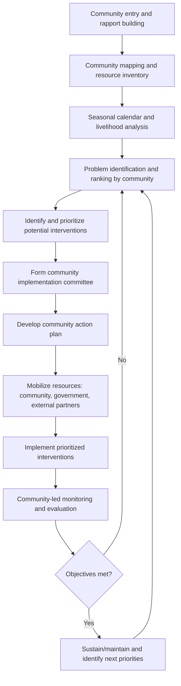
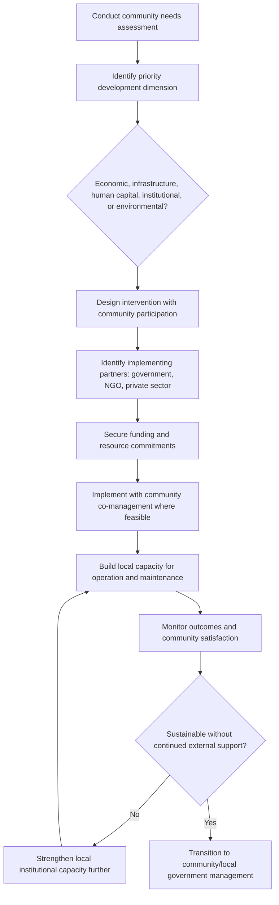

## Rural Community Development

### Overview

Rural community development is the process of improving the economic, social, and physical wellbeing of people living in rural areas through coordinated interventions in infrastructure, livelihoods, institutions, human capital, and governance. It draws on rural sociology, economics, and extension practice to address the structural conditions — geographic isolation, limited market access, thin service provision, and often lower human capital investment — that distinguish rural development challenges from urban development challenges.

### Key Points

- Rural community development is inherently multi-sectoral, spanning agriculture, infrastructure, education, health, financial inclusion, and local governance, rather than being a single-sector intervention.
- Approaches range along a spectrum from **top-down, government/agency-led** planning to **bottom-up, community-driven** development, with participatory approaches increasingly favored in contemporary practice for improving relevance and sustainability of interventions. [Inference]
- Social capital — networks of trust, reciprocity, and collective action capacity within a community — is widely regarded in rural sociology as a key determinant of a community's ability to sustain development gains after external project support ends. [Inference]
- Rural development outcomes are highly context-dependent; general frameworks and instruments are described here, but effective interventions require adaptation to local socioeconomic, cultural, and institutional conditions. [Inference]

### Core Dimensions of Rural Community Development

#### Economic Development

Diversifying and strengthening rural livelihoods beyond primary agricultural production, including agro-processing, rural non-farm enterprises, tourism, and off-farm employment linkages, to reduce vulnerability to agricultural income volatility.

#### Infrastructure Development

Physical infrastructure — roads, electrification, water and sanitation systems, telecommunications/connectivity, and market/storage facilities — that reduces transaction costs and enables both economic activity and service delivery.

#### Human Capital Development

Education, health services, and skills training that build the capacity of rural residents to participate in and benefit from economic opportunities, both within and beyond the agricultural sector.

#### Social and Institutional Development

Strengthening local governance structures, community organizations, and social cohesion mechanisms that enable communities to plan, implement, and sustain development initiatives collectively.

#### Environmental and Resource Management

Sustainable management of the natural resource base (land, water, forests) that underpins rural livelihoods, recognizing that resource degradation can undermine long-term development gains. [Inference]

### Development Approach Spectrum

| Approach | Decision Locus | Typical Use Case | Strengths | Limitations |
| --- | --- | --- | --- | --- |
| Top-down/centralized planning | National/regional government agency | Large infrastructure requiring technical expertise and scale (e.g., regional road networks) | Technical capacity, economies of scale, coordinated resource allocation | Risk of poor fit to local needs, lower community ownership [Inference] |
| Community-driven development (CDD) | Local community, often via elected committees | Small-to-medium local infrastructure and service prioritization | Higher relevance to local needs, builds local capacity and ownership | Can face elite capture risk, variable technical quality without support [Inference] |
| Participatory rural appraisal (PRA)-based planning | Joint community-facilitator process | Needs assessment and program design phase | Combines community knowledge with technical facilitation | Time- and facilitation-intensive |
| Public-private partnership | Government, private sector, and community jointly | Market-linked infrastructure (e.g., cold storage, processing facilities) | Leverages private capital/expertise alongside public objectives | Requires careful risk/benefit allocation to avoid capture by private partner [Inference] |

### Social Capital in Rural Development

Rural sociology commonly distinguishes between:

- **Bonding social capital:** Strong ties within a homogeneous group (e.g., extended family, close-knit village network), useful for mutual support and resource pooling within the group.
- **Bridging social capital:** Weaker ties connecting different groups (e.g., across villages, ethnic groups, or socioeconomic classes), important for accessing information, markets, and resources beyond the immediate community.
- **Linking social capital:** Vertical ties connecting community members to formal institutions and power structures (e.g., local government, financial institutions), important for accessing external resources and policy influence.

[Inference — this tripartite framework is a commonly referenced conceptual model in social capital literature; specific empirical measurement approaches vary by researcher and context]

Communities with a strong balance of all three forms of social capital are generally considered better positioned to identify needs, mobilize resources, and sustain development interventions after external project funding ends, though empirical results vary by context and intervention type. [Inference]

### Participatory Rural Appraisal (PRA) Process

### Rural Livelihood Diversification

A central strategy in rural development is reducing dependence on a single income source (typically primary crop production) by diversifying into complementary activities:

- **On-farm diversification:** Adding value-added agricultural activities (e.g., small-scale processing, agro-tourism on the farm) to a primary cropping enterprise.
- **Off-farm rural employment:** Non-agricultural rural enterprises (small trade, artisanal production, rural services) that provide income independent of agricultural seasonality.
- **Migration and remittances:** Temporary or permanent labor migration (domestic or international) generating remittance income that supplements or substitutes for local agricultural earnings. [Inference — a well-documented rural livelihood strategy in many contexts, though its net community development effect is debated in the literature, given potential labor-force effects on local agriculture alongside capital inflow benefits]

### Worked Example: Community Infrastructure Prioritization Using Cost-Benefit Scoring

A rural community is prioritizing among three potential infrastructure projects with a limited budget of ₱2,000,000, using a simple weighted scoring approach combining estimated beneficiary reach and estimated cost:

| Project | Estimated Cost (₱) | Households Benefiting | Cost per Household (₱) |
| --- | --- | --- | --- |
| Farm-to-market road segment | 1,800,000 | 300 | 6,000 |
| Communal irrigation canal repair | 1,200,000 | 150 | 8,000 |
| Potable water system | 900,000 | 400 | 2,250 |

$$\text{Cost per household} = \frac{\text{Total project cost}}{\text{Number of benefiting households}}$$

Using cost-per-household as one screening criterion (lower being more cost-effective on this single dimension), the potable water system scores most favorably, though a complete prioritization process would also weigh factors such as urgency, complementarity with existing infrastructure, and community-expressed priority ranking rather than cost-effectiveness alone. [Inference — illustrates one input to a multi-criteria decision process, not a complete prioritization methodology]

### Local Governance and Institutional Structures

Rural community development interventions commonly work through or alongside:

- **Local government units:** The formal administrative tier (municipal, village, or barangay-level, depending on country) responsible for local public service delivery and, in many decentralized systems, significant development planning authority.
- **Community-based organizations (CBOs):** Locally formed groups (farmer associations, women's groups, youth organizations) that mobilize collective action around specific development priorities.
- **Non-governmental organizations (NGOs) and development agencies:** External organizations providing technical assistance, funding, or capacity-building support, ideally in coordination with local government and community structures rather than in parallel to them. [Inference]
- **Traditional/customary authorities:** In many rural contexts, traditional leadership structures retain significant influence over land allocation, dispute resolution, and community mobilization, and effective development practice typically engages rather than bypasses these structures. [Inference]

### Rural Development Program Design Flow

### Common Pitfalls

- **Top-down project design without genuine community consultation**, resulting in infrastructure or programs that do not match actual community priorities and receive weak community buy-in or maintenance commitment. [Inference]
- **Elite capture in community-driven development**, where local power structures disproportionately direct project benefits toward already-advantaged households or groups. [Inference]
- **Neglecting operation and maintenance planning**, where infrastructure is built but no sustainable mechanism (funding, local capacity) exists for its upkeep, leading to premature deterioration. [Inference]
- **Fragmented, uncoordinated external interventions**, where multiple NGOs or agencies implement overlapping or conflicting programs in the same community without coordination, diluting impact and confusing community expectations. [Inference]
- **Underestimating the time required for genuine participatory processes**, leading to rushed consultations that fail to surface real community priorities or build lasting local ownership. [Inference]
- **Overlooking heterogeneity within "the community,"** treating rural communities as homogeneous when internal differences (wealth, gender, ethnicity, land tenure status) shape who benefits from and participates in development interventions. [Inference]

### Related Topics

- Agricultural extension systems and delivery models
- Land tenure and agrarian reform policy
- Rural infrastructure planning and financing
- Agricultural cooperatives and farmer organizations
- Rural financial inclusion and microfinance
- Gender and social inclusion in rural development
- Decentralization and local governance in rural areas
- Rural-urban migration and remittance economies
- Community-based natural resource management
- Monitoring and evaluation of development programs