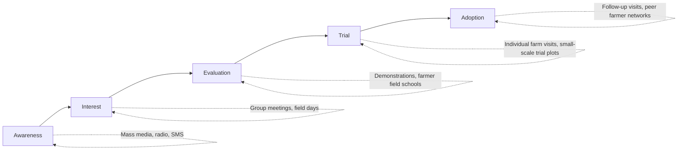
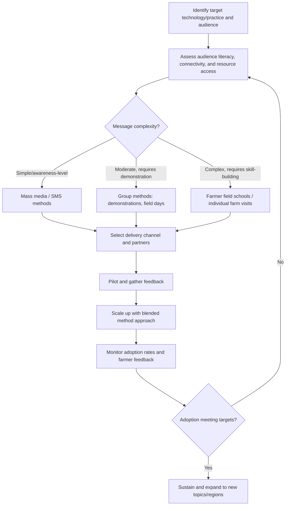

## Agricultural Extension Methods

### Overview

Agricultural extension methods are the systematic approaches used to transfer agricultural knowledge, technology, and skills between researchers, extension agents, and farmers, with the aim of improving farm productivity, sustainability, and livelihoods. Extension methods span individual, group, and mass communication approaches, and have evolved historically from linear "transfer of technology" models toward more participatory, farmer-centered, and increasingly digitally enabled approaches that treat farmers as active co-generators of knowledge rather than passive recipients.

### Key Points

- Extension methods are typically classified by the number of farmers reached per contact: **individual methods** (highest personalization, lowest reach), **group methods** (moderate personalization and reach), and **mass media methods** (lowest personalization, highest reach).
- The choice of extension method depends on the complexity of the information being conveyed, the target audience's literacy and resource access, the extension budget, and the desired depth of behavior change (awareness versus skill adoption). [Inference]
- Extension approaches have evolved through several paradigms: linear technology transfer, farming systems research and extension, participatory extension (e.g., farmer field schools), and — more recently — digital/ICT-enabled extension and market-driven private extension models. [Inference]
- No single extension method is universally superior; effective extension programs typically combine multiple methods to address different stages of the adoption process (awareness, interest, trial, adoption) and different farmer segments. [Inference]

### Classification by Reach and Personalization

| Method Category | Contact Type | Reach | Personalization | Cost per Farmer Reached | Best Suited For |
| --- | --- | --- | --- | --- | --- |
| Individual methods | One-on-one | Low | Very high | High | Complex problem diagnosis, farm-specific advice |
| Group methods | Small-to-medium group | Moderate | Moderate-high | Moderate | Skill-building, peer learning, demonstration |
| Mass media methods | Broadcast/print | Very high | Low | Low | Awareness-raising, simple message dissemination |
| Digital/ICT methods | Individual or group via device | High (scalable) | Variable (can be personalized via data) | Low-moderate (after initial infrastructure investment) | Timely, location-specific information at scale |

### Individual Extension Methods

#### Farm and Home Visits

Extension agents visit farmers on-site to diagnose specific problems, provide tailored advice, and build a trust-based relationship. Highly effective for personalized, complex, or farm-specific issues but constrained by the number of farmers a single agent can visit within a given period. [Inference]

#### Office/Clinic Calls

Farmers visit an extension office or agricultural clinic to seek advice, often for specific problems (pest identification, soil test interpretation). Lower cost per contact than farm visits since it does not require agent travel, but relies on the farmer's initiative to seek out the service.

#### Result and Method Demonstrations on Individual Farms

A specific practice is demonstrated on a cooperating (host) farmer's field, serving as both an individual method (for the host farmer) and, when other farmers are invited to observe, a bridge to group methods.

### Group Extension Methods

#### Farmer Field Schools (FFS)

A season-long, participatory, experiential learning approach where farmer groups meet regularly (often weekly) at a designated field to conduct hands-on agro-ecosystem observation, experimentation, and group analysis, guided by a trained facilitator rather than through top-down lecturing. Originally developed for integrated pest management, the FFS model has since been adapted to numerous agricultural topics.

**Key structural elements:**

- Season-long curriculum aligned with the crop cycle, so learning occurs at the relevant growth stage.
- Small group experimentation plots for direct comparison of practices (e.g., farmer practice vs. recommended practice).
- Facilitator role emphasizes guided discovery over direct instruction.
- Group presentations and peer discussion of field observations.

[Inference — general FFS methodology description based on widely documented practice; specific curricula and session structures vary by implementing program and crop]

#### Demonstration Plots (Group-Observed)

A technique or variety is demonstrated on a plot, with farmer groups invited to observe results at key stages (planting, mid-season, harvest), allowing visual, experiential learning about a new practice's comparative performance.

#### Farmer Group Meetings and Discussions

Structured group meetings led by an extension agent to disseminate information, facilitate group problem-solving, or organize collective action (e.g., coordinated pest management timing).

#### Study Tours and Cross-Visits

Farmer groups visit other farms, research stations, or exemplary operations to observe practices in a different context, leveraging peer credibility and real-world demonstration.

#### Agricultural Shows and Field Days

Larger, often one-time events where multiple technologies, varieties, or practices are showcased, combined with opportunities for farmer-to-farmer and farmer-to-researcher interaction.

### Mass Media Extension Methods

#### Radio and Television Programs

Broadcast agricultural information, including market prices, weather forecasts, and seasonal advisories, reaching large and geographically dispersed audiences at low marginal cost per listener/viewer, though limited to one-way communication and generalized (non-farm-specific) content. [Inference]

#### Print Media (Bulletins, Leaflets, Newsletters)

Written material distributed to farmers, useful for detailed technical reference material farmers can retain and revisit, but requiring adequate literacy levels and effective distribution channels.

#### Mobile/SMS-Based Advisory Services

Text message or voice-based agricultural advisories (weather alerts, pest warnings, market prices) sent to farmers' mobile phones, combining relatively low cost per message with the ability to deliver timely, sometimes semi-personalized content based on farmer-registered crop and location data. [Inference]

### Digital and ICT-Enabled Extension (Emerging Approaches)

Digital extension has expanded substantially with mobile phone penetration and data connectivity in rural areas, encompassing:

- **Farmer helpline/call center services:** Farmers call a hotline staffed by agronomists for on-demand advice.
- **Mobile applications for diagnostics and advisory:** Apps that use farmer-submitted photos (e.g., of pest damage or plant symptoms) combined with image-recognition or expert-review systems to provide diagnostic feedback and recommendations.
- **Digital platforms integrating multiple data sources:** Combining weather forecasts, satellite/remote-sensing crop monitoring, market price data, and localized agronomic recommendations into a single farmer-facing platform or app.
- **Video-based extension:** Short instructional videos, often distributed via mobile phone or community video screenings, used to demonstrate practices visually where literacy constraints limit the effectiveness of print materials.

[Unverified — specific digital extension platforms, their current features, and adoption/effectiveness evidence should be verified via current sources, as this is a rapidly evolving area with frequent new tool entrants; where a specific named platform or tool is under discussion, current documentation should be consulted directly]

### Adoption Process Alignment with Extension Methods

Classical diffusion-of-innovation theory identifies stages a farmer typically passes through before adopting a new practice: **awareness → interest → evaluation → trial → adoption**. Different extension methods tend to align differently with these stages: [Inference]

### Worked Example: Extension Method Cost-Effectiveness Comparison

An extension program has a budget of ₱500,000 to reach farmers in a district with a new drought-tolerant maize variety.

| Method | Cost per Farmer Reached (₱) | Farmers Reachable with ₱500,000 | Expected Depth of Understanding |
| --- | --- | --- | --- |
| Individual farm visits | 500 | 1,000 | High |
| Farmer field school (season-long group) | 200 | 2,500 | High (experiential) |
| Radio program series | 10 | 50,000 | Low (awareness only) |
| SMS advisory | 25 | 20,000 | Low-moderate |

$$\text{Farmers reachable} = \frac{\text{Total budget}}{\text{Cost per farmer reached}}$$

A common program design response to this trade-off is a **blended/sequential approach**: use low-cost mass media (radio, SMS) to build broad awareness of the new variety, then deploy higher-cost group methods (farmer field schools, demonstrations) for a subset of farmers to build deeper skill and confidence, leveraging those trained farmers as peer disseminators to extend reach further at low marginal cost. [Inference]

### Extension Delivery Model Comparison

| Delivery Model | Provider | Funding Source | Strengths | Limitations |
| --- | --- | --- | --- | --- |
| Public extension service | Government agency | Public budget | Broad geographic mandate, public-good orientation | Often understaffed relative to farmer population; budget-constrained [Inference] |
| Private/commercial extension | Input companies, agribusiness firms | Embedded in product/service sales | Well-resourced, technically current on promoted products | Potential conflict of interest (advice tied to product sales) [Inference] |
| NGO-led extension | Non-governmental organizations | Donor/grant funding | Often participatory, community-focused | Funding sustainability and geographic coverage limitations [Inference] |
| Farmer-to-farmer extension | Trained lead/model farmers | Variable (program or self-sustaining) | High peer credibility, low marginal cost | Quality control and consistency of information transmitted [Inference] |
| Digital/ICT platforms | Technology providers, public-private partnerships | Variable (subscription, public subsidy, advertising) | Scalable, timely, potentially personalized | Requires connectivity/device access; digital literacy barriers [Inference] |

### Extension Program Design Process

### Common Pitfalls

- **One-size-fits-all method selection**, applying a single extension method regardless of message complexity or audience characteristics, reducing overall program effectiveness. [Inference]
- **Overreliance on one-way mass media for complex skill transfer**, since broadcast methods are generally poorly suited to conveying practices requiring hands-on skill development or troubleshooting. [Inference]
- **Neglecting local language and literacy considerations**, particularly in print-based or text-based digital extension, which can systematically exclude lower-literacy farmer segments. [Inference]
- **Insufficient follow-up after initial training or demonstration**, since one-time exposure (e.g., a single field day) without reinforcement or troubleshooting support often fails to translate into sustained adoption. [Inference]
- **Gender and inclusion gaps in extension access**, where extension contact historically favors male household heads, potentially underserving women farmers who may have different information needs, decision-making roles, or access constraints. [Inference]
- **Conflating information dissemination with behavior change**, assuming that message delivery alone (without addressing complementary constraints such as input access, credit, or labor availability) will result in practice adoption. [Inference]

### Related Topics

- Diffusion of innovation theory in agricultural technology adoption
- Farmer field schools and integrated pest management
- Digital agriculture and ICT-based advisory services
- Rural community development
- Gender and social inclusion in agricultural extension
- Agricultural cooperatives and farmer organizations
- Monitoring and evaluation of extension program effectiveness
- Public vs. private agricultural extension service models
- Farmer-to-farmer knowledge transfer networks
- Agricultural research and technology development systems