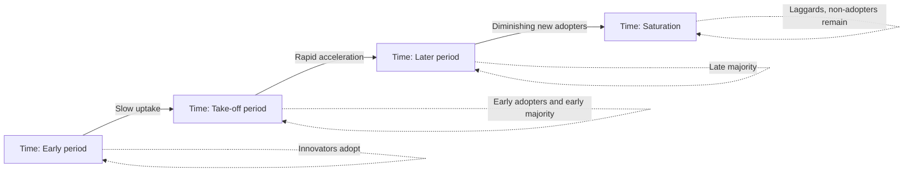
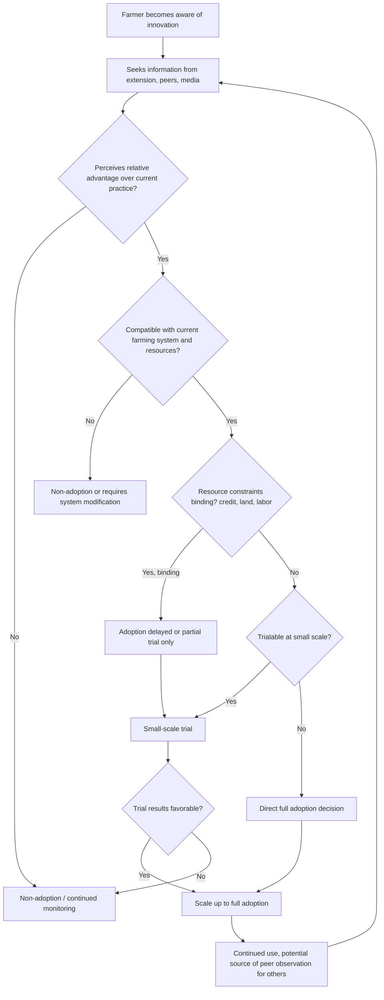

## Technology Adoption and Diffusion

### Overview

Technology adoption and diffusion is the study of how new agricultural practices, inputs, and innovations spread among farmers over time, and the individual, social, economic, and institutional factors that determine whether and how quickly a farmer moves from awareness of an innovation to sustained use. This field draws heavily on Everett Rogers' diffusion of innovations theory alongside agricultural economics models of adoption decision-making, and is central to understanding why technically superior innovations sometimes diffuse slowly or fail to reach intended beneficiaries despite extension and subsidy efforts.

### Key Points

- Diffusion of innovations theory (most closely associated with Everett Rogers) describes adoption as a process occurring over time through communication channels within a social system, typically producing an S-shaped cumulative adoption curve rather than instantaneous uptake. [Unverified — attributed to Rogers' foundational work; specific edition/publication details should be verified if precise citation is required]
- Adopter categories (innovators, early adopters, early majority, late majority, laggards) describe the *relative timing* of adoption within a population, not fixed personality types, and are typically defined statistically relative to the adoption curve of a specific innovation in a specific population. [Inference]
- Agricultural technology adoption decisions are shaped by perceived characteristics of the innovation itself (relative advantage, compatibility, complexity, trialability, observability), as well as farmer-specific factors (risk aversion, resource endowment, information access) and structural factors (credit access, input market functioning, land tenure security).
- Low adoption of a technically sound innovation is often attributable to structural or informational barriers rather than farmer irrationality or lack of interest, a distinction with significant implications for policy design. [Inference]

### The Diffusion of Innovations Framework

#### Rate of Adoption and the S-Curve

Cumulative adoption of a successful innovation within a population typically follows an S-shaped curve over time: slow initial uptake among a small number of early adopters, followed by rapid acceleration as social influence and observed success drive broader uptake, and finally a plateau as the population approaches saturation.

#### Adopter Categories

| Category | Approximate Share of Eventual Adopters | Characteristics |
| --- | --- | --- |
| Innovators | Smallest segment, first to adopt | Higher risk tolerance, often greater resource cushion to absorb potential losses, seek out novel information |
| Early Adopters | Small-moderate segment | Often opinion leaders within the community, respected sources of advice for others considering adoption |
| Early Majority | Large segment | Adopt after observing early adopters' experience; more risk-averse than early adopters but not the most cautious |
| Late Majority | Large segment | Adopt due to social/economic pressure or necessity once the innovation becomes normative; often more resource-constrained |
| Laggards | Smallest-to-moderate segment | Most resistant to change, often due to resource constraints, risk aversion, or limited access to information/credit rather than mere reluctance |

[Unverified — proportions and precise category boundaries vary by innovation and population; the categories are analytical constructs rather than fixed universal percentages]

#### Perceived Attributes Affecting Adoption Rate

Rogers' framework identifies five innovation characteristics that influence adoption speed:

1. **Relative advantage:** The degree to which the innovation is perceived as better than the practice it supersedes (e.g., higher yield, lower cost, reduced labor).
2. **Compatibility:** Consistency with existing values, past experiences, and needs of potential adopters (e.g., fit with existing cropping systems or cultural food preferences).
3. **Complexity:** The degree of difficulty in understanding and using the innovation; higher complexity generally slows adoption.
4. **Trialability:** The degree to which the innovation can be experimented with on a limited basis before full commitment (e.g., trying a new variety on a small plot before full-farm adoption).
5. **Observability:** The degree to which the results of the innovation are visible to others, enabling social learning and peer influence.

[Inference — this is a widely referenced conceptual framework in diffusion literature; specific empirical weighting of each factor varies by innovation type and context]

### Agricultural Economics Models of Adoption Decision-Making

#### Threshold/Expected Utility Models

Farmers are modeled as adopting an innovation when the expected utility (accounting for both expected returns and risk) of adoption exceeds that of the current practice, given the farmer's specific risk preferences, resource constraints, and information set. [Inference]

$$E[U(\text{Adopt})] > E[U(\text{Status Quo})]$$

This framework helps explain why technically higher-expected-return innovations may still see low adoption among risk-averse farmers if the variance of returns is also higher, since risk-averse decision-makers discount expected gains against potential downside variability. [Inference]

#### Farm Household Constraint Models

Adoption is modeled as constrained not only by preferences but by binding resource constraints — land, labor, capital/credit access, and information — such that even a farmer who would benefit from and wants to adopt an innovation may be unable to do so due to a binding constraint (e.g., lack of credit to purchase an improved seed-fertilizer package). [Inference]

### Key Determinants of Agricultural Technology Adoption

| Determinant Category | Specific Factors | Typical Effect on Adoption |
| --- | --- | --- |
| Farmer characteristics | Age, education, risk preference, farming experience | Mixed/context-dependent effects; e.g., education often positively associated with adoption of information-intensive technologies [Inference] |
| Farm characteristics | Farm size, land tenure security, soil quality | Larger farms and secure tenure often associated with higher adoption of capital-intensive or long-horizon investments [Inference] |
| Economic factors | Access to credit, input/output price ratios, labor availability | Credit access frequently identified as a binding constraint for capital-requiring innovations [Inference] |
| Information factors | Extension contact, social network exposure, mass media access | Greater information access generally associated with faster awareness and adoption [Inference] |
| Institutional factors | Input market functioning, output market access, subsidy availability | Well-functioning input/output markets reduce transaction costs of adoption [Inference] |
| Innovation characteristics | Relative advantage, complexity, trialability, compatibility | As per Rogers' framework above |

### Worked Example: Adoption Rate Estimation Using a Logistic Growth Model

Diffusion researchers often model the cumulative proportion of adopters over time using a logistic (S-curve) function:

$$P(t) = \frac{K}{1 + e^{-r(t - t_0)}}$$

Where $P(t)$ is the cumulative proportion of adopters at time $t$, $K$ is the maximum eventual adoption ceiling (saturation level, often less than 100% of the population), $r$ is the rate parameter governing how quickly adoption accelerates, and $t_0$ is the inflection point (the time of most rapid adoption growth).

**Illustrative example:** Suppose a drought-tolerant maize variety has an estimated ceiling adoption of $K = 0.70$ (70% of farmers, reflecting that some farmers may never adopt due to persistent constraints), a rate parameter $r = 0.8$, and an inflection point at $t_0 = 5$ years after introduction.

At $t = 5$ (the inflection point):

$$P(5) = \frac{0.70}{1 + e^{-0.8(5-5)}} = \frac{0.70}{1 + e^{0}} = \frac{0.70}{2} = 0.35$$

At the inflection point, adoption reaches exactly half of its eventual ceiling (35% of all farmers), consistent with the defining property of the logistic curve's midpoint. [Inference — standard mathematical property of the logistic function]

At $t = 8$ years:

$$P(8) = \frac{0.70}{1 + e^{-0.8(8-5)}} = \frac{0.70}{1 + e^{-2.4}} = \frac{0.70}{1 + 0.0907} \approx \frac{0.70}{1.0907} \approx 0.642$$

This illustrates how logistic diffusion models can be fitted to observed adoption data to project future adoption trajectories and estimate the eventual ceiling, a common technique in agricultural technology impact evaluation. [Inference]

### Adoption Decision Process (Individual Farmer Level)

### Barriers to Adoption: Structural vs. Behavioral

A key analytical distinction in adoption research is between:

- **Structural/constraint-based barriers:** Credit unavailability, input market failures, insecure land tenure discouraging long-horizon investment, labor shortages at critical periods, or lack of complementary infrastructure (e.g., irrigation for a drought-tolerant but water-responsive variety).
- **Information/behavioral barriers:** Lack of awareness, misperception of the innovation's relative advantage or risk profile, or social/cultural incompatibility.

Distinguishing between these barrier types matters significantly for policy design: information barriers are addressed through extension and communication strategies, while structural barriers require complementary interventions (credit access, market development, tenure security) that extension messaging alone cannot resolve. [Inference]

### Common Pitfalls in Adoption Analysis and Policy

- **Attributing low adoption solely to farmer risk aversion or conservatism**, when structural constraints (credit, input access) may be the actual binding barrier, leading to misdirected policy responses (e.g., more extension messaging when the real constraint is credit access). [Inference]
- **Treating adopter categories as fixed farmer types** rather than innovation- and context-specific classifications, since a farmer who is an "early adopter" for one technology may be a "late majority" adopter for another, depending on fit with their specific circumstances. [Inference]
- **Overlooking disadoption**, where farmers who initially adopt later abandon a technology due to unforeseen problems (e.g., pest resistance, unexpected input costs, or poor fit with local conditions), which is often undercounted if studies only measure adoption at a single point in time. [Inference]
- **Ignoring social network heterogeneity**, assuming uniform information flow across a community when in practice information and influence often flow along specific social ties (kinship, cooperative membership, ethnicity) that can create adoption disparities across sub-groups. [Inference]
- **Confusing awareness with adoption in program evaluation**, overstating program success by measuring how many farmers heard about an innovation rather than how many sustainably adopted it. [Inference]

### Related Topics

- Agricultural extension methods
- Diffusion of innovations theory (Everett Rogers)
- Agricultural credit systems and rural finance
- Land tenure and lease agreements
- Risk management and farmer decision-making under uncertainty
- Farmer field schools and experiential learning
- Impact evaluation methods for agricultural interventions
- Social network analysis in rural communities
- Input and output market development
- Rural community development