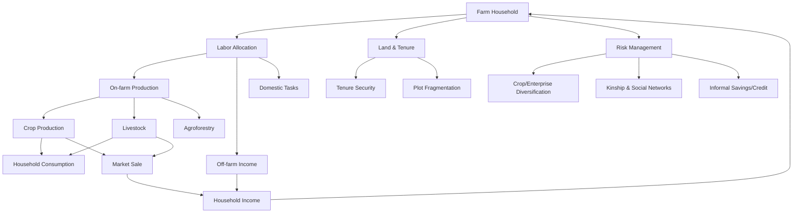

## Smallholder Farming Systems

### Definition and Scope

Smallholder farming systems refer to agricultural production units operated by farm households that rely predominantly on family labor, cultivate relatively small landholdings (typically under 2 hectares, though thresholds vary by region and agroecological context), and manage diversified enterprises combining crops, livestock, and sometimes off-farm income sources. These systems dominate agricultural production across Sub-Saharan Africa, South and Southeast Asia, and parts of Latin America, and account for a substantial share of global food production despite occupying a smaller share of cultivated land compared to large commercial operations.

Smallholder systems are distinguished less by farm size alone and more by a cluster of structural features: limited access to capital, land, and formal credit; reliance on household labor rather than hired labor; multiple, often interlocking objectives (subsistence, income generation, risk management); and embeddedness within local social, cultural, and institutional structures.

### Key Structural Characteristics

**Key Points**

- **Land constraints**: Fragmented, often non-contiguous plots; insecure or customary tenure arrangements in many regions
- **Labor structure**: Family-based labor with gendered division of tasks; peak-season labor bottlenecks are common
- **Resource base**: Limited access to credit, insurance, and mechanization; higher reliance on rain-fed agriculture
- **Diversification**: Multiple crops, livestock integration, and non-farm income as risk-spreading strategies
- **Market orientation**: Mixed subsistence-market orientation; many smallholders sell surplus rather than producing primarily for markets
- **Institutional embeddedness**: Strong reliance on kinship networks, local cooperatives, and informal institutions for labor exchange, credit, and risk-sharing

### Typology of Smallholder Systems

Smallholder systems are commonly classified along several axes relevant to rural sociology and extension planning:

1. **By farming orientation**
   - Subsistence-oriented systems (production primarily for household consumption)
   - Semi-commercial systems (mixed subsistence and market sale)
   - Commercially integrated smallholders (contract farming, value chain participants)
2. **By agroecological base**
   - Rain-fed mixed crop-livestock systems
   - Irrigated smallholder systems
   - Agroforestry-based systems
   - Pastoral and agro-pastoral systems (livestock-dominant)
3. **By degree of market integration**
   - Autarkic/isolated systems with minimal market linkage
   - Loosely integrated systems selling occasional surplus
   - Value-chain embedded systems (e.g., contract out-growers for agribusiness)

### The Household as a Socio-Economic Unit

A core concept in rural sociology applied to smallholder analysis is the **farm household model**, which treats the household simultaneously as a production unit, consumption unit, and labor-supplying unit. Unlike purely commercial firms, smallholder households make joint decisions about labor allocation between farm work, off-farm employment, and domestic tasks, with these decisions shaped by intra-household bargaining, gender roles, and life-cycle stage (e.g., presence of young children, elderly dependents).

$$U = f(C, L, Q)$$

Where $U$ represents household utility, $C$ is consumption, $L$ is leisure, and $Q$ is a preference for farm-produced goods (own consumption). This simplified household utility framework — adapted from agricultural household economics — illustrates why smallholders may respond differently to price signals than purely profit-maximizing commercial farms; a smallholder may retain production even when market prices suggest a shift would be profitable, due to non-market values placed on food security or land stewardship. [Inference: the precise functional form varies substantially by model specification and empirical context]

### Diagram: Smallholder Household System Interactions

### Social and Institutional Dimensions

Rural sociology emphasizes that smallholder behavior cannot be understood through economic variables alone. Several institutional and social factors shape production decisions and adoption behavior:

- **Social networks and information flow**: Farmer-to-farmer communication is often the primary channel for technology diffusion, following patterns described in diffusion of innovation theory (early adopters, early majority, late majority, laggards)
- **Gender roles**: Women frequently perform the majority of labor in food-crop production, post-harvest processing, and livestock care, yet often have restricted access to land titles, credit, and extension services
- **Customary land tenure**: In many regions, land is governed by customary or communal tenure systems that coexist with, and sometimes conflict with, statutory law, affecting investment incentives and collateralization for credit
- **Cooperative and group structures**: Farmer groups, cooperatives, and self-help groups serve as conduits for extension messaging, input aggregation, and collective bargaining power in markets
- **Intergenerational dynamics**: Land inheritance practices and youth out-migration significantly affect farm succession and system continuity

### Livelihood Strategies and Risk Management

Smallholder households typically pursue **diversified livelihood portfolios** as a risk-management strategy rather than pure income maximization. Common strategies include:

**Example**

- A smallholder household in a semi-arid region might allocate land to a drought-tolerant staple (e.g., sorghum) for food security, a cash crop (e.g., groundnuts) for income, keep small ruminants as a liquid savings mechanism, and send one household member to seasonal urban wage labor — spreading risk across climate-sensitive and climate-independent income streams.

This diversification logic aligns with the **sustainable livelihoods framework**, which analyzes household assets across five capital types:

| Capital Type | Examples in Smallholder Context |
| --- | --- |
| Natural capital | Land, water access, soil fertility |
| Human capital | Labor, skills, health, education |
| Social capital | Kinship networks, cooperative membership, trust |
| Physical capital | Tools, irrigation infrastructure, storage |
| Financial capital | Savings, credit access, remittances |

### Constraints Facing Smallholder Systems

- **Limited access to formal credit** due to lack of collateralizable assets and high transaction costs for lenders
- **Weak extension coverage**, particularly reaching women and remote households
- **Market access barriers**: poor rural roads, limited storage infrastructure, and thin local markets that depress farm-gate prices
- **Climate vulnerability**: heavy reliance on rain-fed production increases exposure to rainfall variability and extreme weather events
- **Input access and cost**: fertilizer, improved seed, and crop protection products are often costly or unavailable in remote areas
- **Land fragmentation and insecurity**: undermines long-term investment in soil conservation or perennial crops
- **Post-harvest losses**: inadequate storage and processing infrastructure reduces effective yield and income

### Extension Approaches for Smallholder Systems

Effective extension for smallholder farmers has evolved through several paradigms:

1. **Transfer-of-technology (ToT) model** — top-down dissemination of research station findings; criticized for low adoption rates and poor fit to local conditions
2. **Training and Visit (T&V) system** — structured, regular contact between extension agents and contact farmers, historically used in World Bank-supported programs
3. **Farmer Field School (FFS)** approach — participatory, experiential learning emphasizing farmer experimentation and agroecosystem analysis
4. **Participatory extension / farmer-to-farmer models** — leveraging social networks and lead farmers as change agents
5. **Digital and ICT-based extension** — SMS advisories, mobile apps, and remote sensing-based advisories; increasingly used to overcome extension agent-to-farmer ratio constraints

**Key Points**

- Extension effectiveness for smallholders depends heavily on message relevance to local agroecological and socio-economic conditions
- Trust in the extension source (peer farmer vs. government agent vs. NGO) significantly affects adoption behavior
- Extension messages must account for gendered labor and decision-making roles to reach women farmers effectively

### Technology Adoption Dynamics

Adoption of new technologies (improved seed varieties, fertilizer, conservation agriculture practices) among smallholders is shaped by a combination of factors studied extensively in rural sociology and agricultural economics:

- **Perceived relative advantage** of the technology over existing practice
- **Compatibility** with existing farming systems and cultural values
- **Complexity** of the technology (simpler technologies diffuse faster)
- **Trialability** — ability to test on a small scale before full adoption
- **Observability** of results by neighboring farmers
- **Risk aversion**, which is often elevated among resource-poor households operating near subsistence thresholds

[Inference: adoption rates for any specific technology are highly context-dependent and should not be generalized across regions without local evidence]

### Diagram: Technology Adoption Decision Process

<svg xmlns="http://www.w3.org/2000/svg" viewBox="0 0 800 420" font-family="sans-serif">
<text x="400" y="25" text-anchor="middle" font-size="16" font-weight="bold">Smallholder Technology Adoption Pathway (svg_diagram)</text>
<rect x="30" y="60" width="160" height="60" rx="8" fill="#dbeafe" stroke="#1e3a8a" />
<text x="110" y="85" text-anchor="middle" font-size="12">Awareness via</text>
<text x="110" y="102" text-anchor="middle" font-size="12">extension/peers</text>
<rect x="230" y="60" width="160" height="60" rx="8" fill="#dbeafe" stroke="#1e3a8a" />
<text x="310" y="85" text-anchor="middle" font-size="12">Evaluation against</text>
<text x="310" y="102" text-anchor="middle" font-size="12">household resources</text>
<rect x="430" y="60" width="160" height="60" rx="8" fill="#dbeafe" stroke="#1e3a8a" />
<text x="510" y="85" text-anchor="middle" font-size="12">Small-scale trial</text>
<text x="510" y="102" text-anchor="middle" font-size="12">(risk-limited plot)</text>
<rect x="630" y="60" width="140" height="60" rx="8" fill="#dbeafe" stroke="#1e3a8a" />
<text x="700" y="85" text-anchor="middle" font-size="12">Observation of</text>
<text x="700" y="102" text-anchor="middle" font-size="12">outcomes</text>
<line x1="190" y1="90" x2="230" y2="90" stroke="#334155" stroke-width="2" marker-end="url(#arrow)" />
<line x1="390" y1="90" x2="430" y2="90" stroke="#334155" stroke-width="2" marker-end="url(#arrow)" />
<line x1="590" y1="90" x2="630" y2="90" stroke="#334155" stroke-width="2" marker-end="url(#arrow)" />
<rect x="330" y="200" width="160" height="60" rx="8" fill="#dcfce7" stroke="#166534" />
<text x="410" y="225" text-anchor="middle" font-size="12">Full adoption /</text>
<text x="410" y="242" text-anchor="middle" font-size="12">scale-up</text>
<rect x="130" y="200" width="160" height="60" rx="8" fill="#fee2e2" stroke="#991b1b" />
<text x="210" y="225" text-anchor="middle" font-size="12">Rejection or</text>
<text x="210" y="242" text-anchor="middle" font-size="12">modification</text>
<line x1="700" y1="120" x2="410" y2="200" stroke="#166534" stroke-width="2" marker-end="url(#arrow)" />
<line x1="700" y1="120" x2="210" y2="200" stroke="#991b1b" stroke-width="2" marker-end="url(#arrow)" />

<text x="560" y="155" font-size="11" fill="`#166534`">positive result</text>

<text x="450" y="175" font-size="11" fill="`#991b1b`">negative/mixed result</text>

<rect x="130" y="320" width="360" height="70" rx="8" fill="#fef9c3" stroke="#854d0e" />
<text x="310" y="345" text-anchor="middle" font-size="12" font-weight="bold">Feedback loop</text>
<text x="310" y="365" text-anchor="middle" font-size="11">Rejected/modified practices reshape future</text>
<text x="310" y="380" text-anchor="middle" font-size="11">evaluation criteria and peer communication</text>
<line x1="210" y1="260" x2="270" y2="320" stroke="#854d0e" stroke-width="1.5" marker-end="url(#arrow)" />
<line x1="310" y1="320" x2="150" y2="90" stroke="#854d0e" stroke-width="1.5" stroke-dasharray="4,3" marker-end="url(#arrow)" />
</svg>

### Policy and Development Interventions

Common policy instruments targeting smallholder systems include:

- **Input subsidy programs** (fertilizer, seed vouchers) to reduce cost barriers
- **Contract farming and out-grower schemes** linking smallholders to agribusiness value chains, providing input credit and guaranteed markets in exchange for delivery contracts
- **Land tenure reform** aimed at formalizing customary rights to improve investment incentives and creditworthiness
- **Rural finance and microfinance programs**, including group-lending models designed around social collateral
- **Producer organizations and cooperatives**, which aggregate smallholder output to achieve economies of scale in marketing and input purchase
- **Climate-smart agriculture programs** promoting practices such as conservation tillage, agroforestry, and drought-tolerant varieties

[Inference: the effectiveness of any given policy intervention is highly dependent on local implementation quality, institutional capacity, and context, and should not be assumed to generalize uniformly]

### Measurement and Analytical Frameworks

Researchers and extension planners commonly use the following frameworks to analyze smallholder systems:

- **Farming Systems Research (FSR)**: characterizes farm typologies based on resource endowments and enterprise combinations to target extension recommendations
- **Sustainable Livelihoods Framework (SLF)**: assesses household asset portfolios and vulnerability context
- **Value chain analysis**: maps smallholder position within input supply, production, aggregation, processing, and retail stages
- **Gender analysis frameworks** (e.g., Harvard Analytical Framework, Moser Framework): examine intra-household labor and resource allocation by gender

### Related Topics

- Farming systems research (FSR) methodology
- Diffusion of innovation theory in agricultural extension
- Farmer Field Schools and participatory extension methods
- Gender roles in agricultural production and extension access
- Land tenure systems and customary law in agrarian contexts
- Contract farming and value chain integration
- Sustainable livelihoods framework
- Agricultural cooperatives and producer organizations
- Climate-smart agriculture and smallholder adaptation strategies
- Rural credit systems and microfinance models
- Household decision-making models in agricultural economics
- ICT-based agricultural extension and digital advisory services