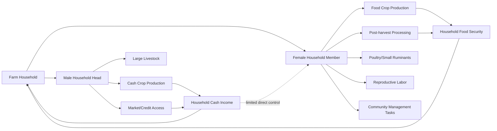

## Gender and Equity in Agriculture


### Definition and Conceptual Scope

Gender and equity in agriculture refers to the study and practice of addressing differential roles, access to resources, decision-making power, and outcomes experienced by men, women, and other gender groups within agricultural production systems, rural institutions, and extension services. It is distinguished from a narrower focus on "women in agriculture" by examining relational dynamics — how gender norms shape the division of labor, control over assets, and access to services for all household and community members, not women in isolation.

Within rural sociology, gender is treated as a socially constructed set of roles, responsibilities, and power relations (distinct from biological sex) that varies across cultures, is negotiated within households, and interacts with other axes of social differentiation such as age, class, ethnicity, and marital status.

### Key Conceptual Distinctions

**Key Points**

- **Sex vs. gender**: Sex refers to biological characteristics; gender refers to socially constructed roles, behaviors, and norms attributed to men and women
- **Gender roles**: Productive (income/food-generating), reproductive (household maintenance, childcare), and community-management roles — women in agrarian societies frequently perform all three ("triple burden")
- **Gender equality vs. gender equity**: Equality refers to equal rights and opportunities; equity refers to fairness in outcomes, which may require differentiated treatment to correct existing disadvantages
- **Practical vs. strategic gender needs**: Practical needs address immediate living conditions (e.g., water access); strategic needs address structural power imbalances (e.g., land ownership rights, political representation)

### Gendered Division of Labor in Agriculture

Agricultural labor is rarely gender-neutral. Empirically documented patterns (which vary substantially by region, crop, and culture) include:

- Women often perform the majority of labor in food-crop production, weeding, and post-harvest processing (threshing, drying, storage)
- Men more frequently control cash-crop production and are more likely to interact with formal markets, extension agents, and financial institutions
- Livestock responsibilities are often gender-differentiated by species: women frequently manage poultry and small ruminants, while men manage larger livestock (cattle) tied to household wealth and status
- Time-use studies across multiple regions consistently show women carrying a disproportionate reproductive labor burden (childcare, cooking, water/fuel collection) in addition to farm labor [Inference: precise magnitudes vary widely by country and should not be treated as universal figures]

### Diagram: Gendered Labor and Resource Flows in a Smallholder Household



### Access to and Control Over Resources

A central concern in gender and equity analysis is the distinction between **access** (the ability to use a resource) and **control** (the authority to make decisions about a resource, including sale or transfer). Women frequently have access to land, credit, or livestock without corresponding control.

| Resource | Common Pattern | Equity Implication |
| --- | --- | --- |
| Land | Women often farm land they do not own or hold title to | Limits collateral for credit; weak investment incentive; vulnerability upon divorce/widowhood |
| Credit | Formal credit often requires collateral (land title) that women lack | Restricts access to inputs, mechanization, and enterprise expansion |
| Extension services | Historically male-biased contact patterns (male extension agents, male-headed household assumptions) | Information and technology gaps for women farmers |
| Labor (hired) | Male-headed households more likely to hire labor | Time constraints for female farm managers, especially female-headed households |
| Farm inputs | Fertilizer, improved seed often allocated by male decision-makers | Yield gaps between plots managed by women vs. men |

### The Gender Gap in Agricultural Productivity

Empirical research across multiple countries has documented a **gender productivity gap**, where plots managed by women show lower yields per hectare than those managed by men. Analyses attribute this gap primarily to differential access to inputs, labor, and extension — not to differences in farming ability.

$$\text{Yield Gap} = \frac{Y_m - Y_f}{Y_m} \times 100$$

Where $Y_m$ is average yield on male-managed plots and $Y_f$ is average yield on female-managed plots. Studies commonly attribute the majority of this gap to resource access differentials rather than managerial capacity [Inference: exact percentage attributions vary by study methodology and country context and should not be generalized without reference to the specific study].

### Intra-Household Bargaining and Decision-Making

Rural sociology draws on **household bargaining models** (an alternative to the unitary household model) to analyze how resources and decisions are negotiated between spouses. Key concepts include:

- **Cooperative bargaining models**: Household outcomes reflect negotiated agreements shaped by each member's "fallback position" (their welfare outside the household)
- **Separate spheres/non-cooperative models**: Recognize that household members may control separate income streams and make independent decisions in some domains
- **Bargaining power determinants**: Land ownership, independent income, education, and social/legal support for divorce or inheritance rights all strengthen a woman's bargaining position

**Example**

A woman who owns land in her own name and has an independent income stream from poultry sales typically has greater influence over household expenditure decisions (e.g., school fees, healthcare) than one who is entirely dependent on a spouse's cash crop income — illustrating how asset ownership functions as a source of intra-household bargaining power.

### Female-Headed Households

Female-headed households (de jure, through widowhood/divorce/never-married status, or de facto, through male out-migration) represent a growing share of rural households in many regions and face distinct constraints:

- Often smaller landholdings and greater land tenure insecurity
- Labor constraints due to smaller household labor pool, particularly for peak-season tasks
- Reduced access to extension contact, as agents historically prioritized (often male) household heads
- Frequently higher dependency ratios (more dependents per working-age adult)
- De facto female-headed households (spouse working elsewhere) may retain access to remittance income, partially offsetting labor constraints, but often lack decision-making authority over major asset transactions

### Gender-Responsive Extension Approaches

Extension systems have historically under-served women farmers due to structural and cultural barriers. Gender-responsive extension approaches include:

1. **Recruiting and training female extension agents** to improve access for women farmers in contexts where cross-gender interaction is culturally restricted
2. **Scheduling and locating training events** to accommodate women's time constraints (reproductive labor burden, childcare)
3. **Targeting messaging content** to crops and enterprises women actually manage, rather than assuming male-crop priorities
4. **Using women's groups and networks** as entry points for information diffusion
5. **Household methodologies (e.g., Gender Action Learning System - GALS)**: participatory tools engaging both spouses in joint visioning and planning to shift intra-household gender dynamics rather than targeting women in isolation
6. **Disaggregating extension data by sex** of plot manager/farmer to monitor reach and outcomes

### Analytical Frameworks for Gender Analysis

- **Harvard Analytical Framework**: Maps the gendered division of labor, access to and control over resources, and influencing factors, using an activity profile, access-and-control profile, and analysis of influencing factors
- **Moser Framework**: Distinguishes practical vs. strategic gender needs and introduces the triple role concept (productive, reproductive, community management)
- **Social Relations Approach**: Examines gender within broader institutional relations (state, market, community, family) rather than isolating the household
- **Women's Empowerment in Agriculture Index (WEAI)**: A composite index (developed by IFPRI, OPHI, and USAID) measuring empowerment across domains including production decisions, resource access, income control, leadership, and time allocation

### Diagram: WEAI Domains of Empowerment (svg_diagram)

<svg viewBox="0 0 750 380" xmlns="http://www.w3.org/2000/svg" font-family="sans-serif">
<text x="375" y="25" text-anchor="middle" font-size="16" font-weight="bold">Women's Empowerment in Agriculture Index — Domains (svg_diagram)</text>
<circle cx="375" cy="200" r="55" fill="#f3e8ff" stroke="#6b21a8"/>
<text x="375" y="196" text-anchor="middle" font-size="12" font-weight="bold">WEAI</text>
<text x="375" y="212" text-anchor="middle" font-size="10">Composite</text>
<g font-size="11">
<rect x="60" y="60" width="150" height="50" rx="6" fill="#dbeafe" stroke="#1e3a8a"/>
<text x="135" y="80" text-anchor="middle">Production</text>
<text x="135" y="95" text-anchor="middle">Decisions</text>
<line x1="200" y1="100" x2="330" y2="170" stroke="#64748b"/>



```
<rect x="60" y="150" width="150" height="50" rx="6" fill="#dcfce7" stroke="#166534"/>
<text x="135" y="170" text-anchor="middle">Resource Access</text>
<text x="135" y="185" text-anchor="middle">& Ownership</text>
<line x1="210" y1="175" x2="320" y2="195" stroke="#64748b"/>

<rect x="60" y="240" width="150" height="50" rx="6" fill="#fef9c3" stroke="#854d0e"/>
<text x="135" y="260" text-anchor="middle">Control over</text>
<text x="135" y="275" text-anchor="middle">Income</text>
<line x1="210" y1="265" x2="330" y2="220" stroke="#64748b"/>

<rect x="540" y="60" width="150" height="50" rx="6" fill="#fee2e2" stroke="#991b1b"/>
<text x="615" y="80" text-anchor="middle">Community</text>
<text x="615" y="95" text-anchor="middle">Leadership</text>
<line x1="540" y1="100" x2="420" y2="170" stroke="#64748b"/>

<rect x="540" y="150" width="150" height="50" rx="6" fill="#e0e7ff" stroke="#3730a3"/>
<text x="615" y="170" text-anchor="middle">Time Use &</text>
<text x="615" y="185" text-anchor="middle">Workload Balance</text>
<line x1="540" y1="175" x2="430" y2="195" stroke="#64748b"/>

<rect x="290" y="310" width="170" height="50" rx="6" fill="#ffe4e6" stroke="#9f1239"/>
<text x="375" y="330" text-anchor="middle">Group Membership</text>
<text x="375" y="345" text-anchor="middle">& Social Capital</text>
<line x1="375" y1="310" x2="375" y2="255" stroke="#64748b"/>
```

</g>
</svg>

### Policy and Legal Dimensions

- **Land rights legislation**: Statutory reforms recognizing joint titling (both spouses named on land certificates) aim to strengthen women's tenure security, though implementation gaps between formal law and customary practice persist in many contexts
- **Inheritance law**: Discrepancies between statutory inheritance rights and customary practice frequently disadvantage widows and daughters
- **Labor law and agricultural wage equity**: Gender wage gaps in agricultural wage labor remain documented in multiple contexts
- **International frameworks**: CEDAW (Convention on the Elimination of All Forms of Discrimination Against Women) and the Sustainable Development Goals (notably SDG 5 - Gender Equality, and SDG 2 - Zero Hunger) provide normative frameworks referenced in national agricultural gender policies

### Measurement and Monitoring Considerations

**Key Points**

- Sex-disaggregated data collection (at minimum, distinguishing male- and female-managed plots or male- and female-headed households) is a baseline requirement for gender-responsive agricultural monitoring
- Intra-household data collection is methodologically challenging, since single-respondent household surveys often reflect only the (typically male) household head's perspective
- Composite indices like the WEAI require multi-respondent survey instruments (interviewing both a primary male and female decision-maker within the same household) to capture intra-household variation

### Common Pitfalls in Gender-Blind Agricultural Programming

- Assuming household-level adoption data reflects the preferences and needs of all household members equally
- Targeting extension and credit programs solely at "household heads," which systematically excludes women in male-headed households
- Designing technologies (e.g., mechanization) around male labor tasks while ignoring women's labor-intensive tasks (e.g., processing, weeding) where efficiency gains might have greater impact
- Overlooking women's unpaid reproductive labor when calculating the true time cost of adopting new practices

### Related Topics

- Women's Empowerment in Agriculture Index (WEAI) methodology
- Land tenure reform and joint titling programs
- Household bargaining models in agricultural economics
- Farmer Field Schools and gender-responsive extension design
- Sustainable Development Goals and gender-agriculture linkages
- Time-use surveys and reproductive labor measurement
- Value chain gender analysis
- Youth and gender intersections in rural out-migration
- Climate change vulnerability and gendered adaptive capacity
- Cooperative membership and women's collective action in agriculture