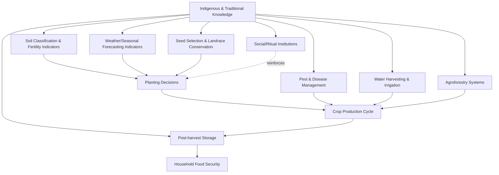

## Indigenous and Traditional Agricultural Knowledge

### Definition and Conceptual Scope

Indigenous and traditional agricultural knowledge (often abbreviated ITK, or referred to as Indigenous Knowledge Systems/IKS, Traditional Ecological Knowledge/TEK, or local knowledge) refers to the cumulative body of practices, beliefs, and understandings developed by communities over generations through direct experience with local agroecological conditions. This knowledge is typically transmitted orally and through practice rather than codified in formal written scientific literature, and it is embedded within broader cultural, spiritual, and social systems specific to a community and place.

In rural sociology and extension, ITK is studied both as a subject of academic documentation and as a practical resource that can complement, and sometimes challenge, formal agricultural science and extension recommendations.

### Key Distinguishing Characteristics

**Key Points**

- **Place-based**: Developed in response to specific local soils, climate, biodiversity, and socio-cultural conditions; not necessarily transferable across contexts without adaptation
- **Holistic**: Integrates agricultural practice with spiritual beliefs, social organization, and resource management rather than treating farming as an isolated technical activity
- **Orally transmitted and experiential**: Passed through generations via observation, apprenticeship, and oral tradition rather than formal documentation
- **Dynamic, not static**: Continuously adapted and modified in response to changing conditions, rather than a fixed, unchanging body of practice
- **Collectively held**: Often embedded in community institutions and social structures rather than being individual proprietary knowledge

### Distinguishing ITK from Formal Scientific Knowledge

| Dimension | Indigenous/Traditional Knowledge | Formal Scientific Knowledge |
| --- | --- | --- |
| Validation method | Generational experience, trial-and-error, oral consensus | Controlled experimentation, peer review, statistical inference |
| Transmission | Oral tradition, apprenticeship, ritual practice | Written literature, formal education |
| Scope | Localized, context-specific | Aims for generalizability across contexts |
| Integration | Embedded in cultural/spiritual/social systems | Typically separated from cultural context |
| Documentation | Often undocumented or documented externally by researchers | Systematically documented and archived |

[Inference: this table presents a simplified analytical contrast; in practice, many farming communities draw on both systems simultaneously and the boundary between them is often blurred]

### Domains of Indigenous Agricultural Knowledge

1. **Soil and land classification**: Local taxonomies for soil types, fertility indicators, and suitability for specific crops, often more nuanced for local conditions than generic soil surveys
2. **Crop and seed selection**: Landrace conservation, seed selection criteria based on observed multi-season performance, and in-situ conservation of genetic diversity
3. **Weather and seasonal forecasting**: Indicators such as flowering patterns of specific plants, animal behavior, or celestial observations used to predict rainfall onset and inform planting decisions
4. **Pest and disease management**: Botanical pesticides, companion planting, and cultural control practices developed through observed effectiveness over generations
5. **Water management**: Traditional irrigation systems (e.g., terracing, water harvesting structures) adapted to local topography
6. **Agroforestry and land-use systems**: Integrated tree-crop-livestock systems reflecting long-term ecological understanding of nutrient cycling and microclimate management
7. **Post-harvest handling and storage**: Traditional storage structures and techniques for preservation under local climatic conditions

### Diagram: Integration of ITK Domains within a Farming System

### Examples of Documented Traditional Practices

**Example**

- **Terrace farming systems** (e.g., in mountainous regions of Southeast Asia and the Andes) reflect sophisticated indigenous engineering for soil and water conservation on steep slopes, developed and refined over centuries without formal engineering documentation
- **Intercropping systems** (e.g., the "Three Sisters" system of maize, beans, and squash practiced by various Indigenous peoples of the Americas) exploit complementary nutrient cycling (nitrogen fixation by legumes), physical structure (maize as a climbing support for beans), and ground-cover pest/weed suppression (squash) — a system whose agroecological logic has since been validated through formal agronomic research
- **Chitemene and other shifting cultivation systems** in parts of Sub-Saharan Africa use fallow cycles and controlled burning calibrated through generations of observed soil fertility recovery patterns
- **Traditional seed banks and farmer seed exchange networks** maintain crop genetic diversity and resilience to localized stresses, often exceeding the diversity found in formal breeding programs for specific traits like drought or pest tolerance in marginal environments

### ITK and Formal Science: Complementarity and Tension

Rural sociology examines both convergence and conflict between ITK and formal agricultural science:

**Areas of complementarity**

- ITK can provide baseline data on local conditions (soil variability, microclimates, pest cycles) that inform where and how formal research should be targeted
- Combining ITK-based risk management strategies (diversification, staggered planting) with formal scientific tools (improved varieties, weather forecasting) can improve resilience outcomes
- Participatory plant breeding programs increasingly incorporate farmer selection criteria alongside formal breeding objectives

**Areas of tension**

- Formal extension systems have historically dismissed or overridden ITK, promoting standardized "modern" packages that may be poorly suited to local conditions
- Power asymmetries between scientific institutions and indigenous communities can lead to extraction of knowledge (e.g., in bioprospecting) without adequate recognition, consent, or benefit-sharing
- Formal validation processes (requiring quantifiable, replicable evidence) can struggle to capture holistic, context-embedded knowledge, leading to undervaluation of ITK in policy processes

### Frameworks for Engaging with ITK in Extension

1. **Participatory Rural Appraisal (PRA) / Participatory Learning and Action (PLA)**: Methods (e.g., seasonal calendars, resource mapping, wealth ranking) used to elicit and document local knowledge collaboratively with communities
2. **Farmer Field Schools (FFS)**: Experiential learning platforms where farmer knowledge is treated as a starting point, tested and adapted alongside introduced practices via participatory experimentation
3. **Co-production of knowledge**: Research approaches involving farmers as active partners in generating and validating new knowledge, rather than passive recipients of externally generated recommendations
4. **Ethnopedology and ethnobotany**: Academic disciplines specifically dedicated to documenting indigenous soil and plant knowledge systems using formal ethnographic methods

### Ethical and Institutional Considerations

**Key Points**

- **Intellectual property and benefit-sharing**: Instruments such as the Nagoya Protocol under the Convention on Biological Diversity establish frameworks for access to genetic resources and associated traditional knowledge, requiring prior informed consent and fair benefit-sharing with knowledge-holding communities
- **Free, Prior, and Informed Consent (FPIC)**: A principle requiring that indigenous communities consent to research, documentation, or commercial use of their knowledge before it proceeds
- **Risk of knowledge erosion**: Out-migration of youth, formal education systems that do not value ITK, and declining oral transmission pathways threaten the continuity of traditional knowledge in many communities
- **Documentation risks**: Written or digital documentation of ITK, while useful for preservation, can also decontextualize knowledge from the practices and relationships that give it meaning, and may enable external appropriation without community control

### Diagram: Pathways of ITK Erosion and Preservation

<svg xmlns="http://www.w3.org/2000/svg" viewBox="0 0 780 360" font-family="sans-serif">
<text x="390" y="25" text-anchor="middle" font-size="16" font-weight="bold">ITK Continuity: Erosion Pressures and Preservation Pathways (svg_diagram)</text>
<rect x="40" y="60" width="200" height="220" rx="8" fill="#fee2e2" stroke="#991b1b" />
<text x="140" y="85" text-anchor="middle" font-size="13" font-weight="bold">Erosion Pressures</text>
<text x="140" y="115" text-anchor="middle" font-size="11">Youth out-migration</text>
<text x="140" y="140" text-anchor="middle" font-size="11">Formal schooling displacing</text>
<text x="140" y="155" text-anchor="middle" font-size="11">oral transmission</text>
<text x="140" y="180" text-anchor="middle" font-size="11">Land dispossession</text>
<text x="140" y="205" text-anchor="middle" font-size="11">Market pressure toward</text>
<text x="140" y="220" text-anchor="middle" font-size="11">standardized inputs</text>
<text x="140" y="245" text-anchor="middle" font-size="11">Loss of elder knowledge-</text>
<text x="140" y="260" text-anchor="middle" font-size="11">holders</text>
<rect x="540" y="60" width="200" height="220" rx="8" fill="#dcfce7" stroke="#166534" />
<text x="640" y="85" text-anchor="middle" font-size="13" font-weight="bold">Preservation Pathways</text>
<text x="640" y="115" text-anchor="middle" font-size="11">Community seed banks</text>
<text x="640" y="140" text-anchor="middle" font-size="11">Participatory documentation</text>
<text x="640" y="155" text-anchor="middle" font-size="11">(PRA/PLA methods)</text>
<text x="640" y="180" text-anchor="middle" font-size="11">Intergenerational</text>
<text x="640" y="195" text-anchor="middle" font-size="11">apprenticeship programs</text>
<text x="640" y="220" text-anchor="middle" font-size="11">Integration into school</text>
<text x="640" y="235" text-anchor="middle" font-size="11">curricula</text>
<text x="640" y="260" text-anchor="middle" font-size="11">Legal recognition (FPIC,</text>
<text x="640" y="275" text-anchor="middle" font-size="11">Nagoya Protocol)</text>
<ellipse cx="390" cy="170" rx="90" ry="55" fill="#fef9c3" stroke="#854d0e" />
<text x="390" y="165" text-anchor="middle" font-size="12" font-weight="bold">ITK Continuity</text>
<text x="390" y="182" text-anchor="middle" font-size="11">(community-held)</text>
<line x1="240" y1="170" x2="300" y2="170" stroke="#991b1b" stroke-width="2" marker-end="url(#arrowR)" />
<line x1="540" y1="170" x2="480" y2="170" stroke="#166534" stroke-width="2" marker-end="url(#arrowG)" />
</svg>

### Relevance to Climate Change Adaptation

Indigenous knowledge systems are increasingly recognized within climate adaptation policy discourse (including references in IPCC assessment reports) as a source of locally validated adaptive strategies:

- Traditional drought-coping mechanisms (crop diversification, mobility strategies in pastoral systems, staggered planting) offer templates for climate resilience planning
- Local weather-indicator knowledge can complement, though not necessarily replace, meteorological forecasting, particularly in areas with sparse weather station coverage
- Traditional agroforestry and water-harvesting techniques are increasingly incorporated into formal climate-smart agriculture programming as low-cost, locally adapted resilience measures

[Inference: the extent to which any specific traditional practice provides measurable climate resilience benefits requires locally validated evidence and should not be assumed uniformly effective across all contexts]

### Related Topics

- Participatory Rural Appraisal (PRA) and Participatory Learning and Action (PLA) methods
- Farmer Field Schools and experiential extension learning
- Ethnobotany and ethnopedology
- Nagoya Protocol and access/benefit-sharing frameworks
- Agrobiodiversity conservation and farmer seed systems
- Climate-smart agriculture and traditional adaptation strategies
- Smallholder farming systems
- Participatory plant breeding
- Intellectual property rights and traditional knowledge protection
- Oral history and knowledge transmission methodologies in rural communities