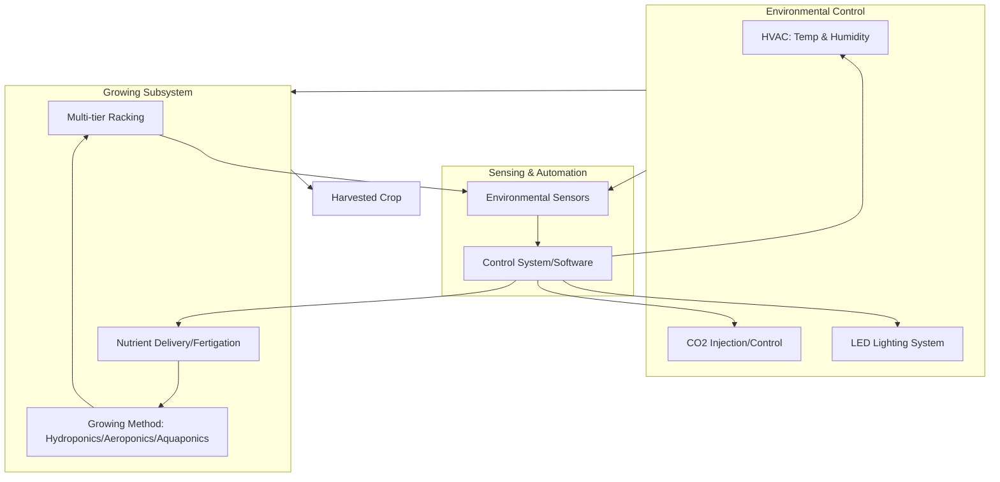

## Vertical Farming Systems

### Definition and Scope

Vertical farming refers to the practice of growing crops in vertically stacked layers, typically within controlled or semi-controlled indoor environments, using soilless growing methods to maximize production per unit of floor area. Vertical farming is a subset of **Controlled Environment Agriculture (CEA)**, distinguished from conventional greenhouse production by its emphasis on stacked, multi-tier growing systems that decouple crop yield from land footprint.

The core value proposition is spatial intensification: by growing upward rather than outward, vertical farms aim to achieve substantially higher yield per square meter of ground area than field agriculture, while enabling year-round production independent of external climate and seasonality.

### Core System Architecture

A vertical farm integrates several interdependent subsystems that must be engineered together, since altering one (e.g., lighting intensity) has cascading effects on others (e.g., cooling load, transpiration, nutrient uptake).

**Key Points**

- **Structural/racking system**: Multi-tier shelving or rack structures housing growing trays, optimized for vertical density and light penetration between layers
- **Growing method**: Soilless cultivation, predominantly hydroponics, aeroponics, or aquaponics
- **Lighting system**: Artificial lighting (predominantly LED) providing photosynthetically active radiation (PAR) in the absence of, or supplementing, natural sunlight
- **Climate control**: HVAC systems managing temperature, humidity, and CO2 concentration within tightly controlled ranges
- **Nutrient delivery**: Automated fertigation systems delivering precisely formulated nutrient solutions
- **Sensing and automation**: Environmental sensors (temperature, humidity, pH, EC, CO2, light intensity) feeding data to control systems, often integrated with software platforms for monitoring and automated adjustment

### Diagram: Vertical Farm System Architecture

### Growing Methods Used in Vertical Farming

1. **Hydroponics**: Plant roots suspended in or periodically flooded with nutrient-rich water solution, with no soil medium; common sub-types include:
   - **Nutrient Film Technique (NFT)**: A thin film of nutrient solution continuously flows past root systems in sloped channels
   - **Deep Water Culture (DWC)**: Roots suspended directly in an aerated nutrient solution reservoir
   - **Ebb-and-flow (flood and drain)**: Growing trays periodically flooded with nutrient solution, then drained
2. **Aeroponics**: Roots suspended in air within an enclosed chamber and periodically misted with nutrient solution; offers higher oxygenation to roots and generally uses less water than hydroponics, though systems are more sensitive to mechanical/pump failure since roots have no water reservoir buffer
3. **Aquaponics**: Integrates hydroponic plant production with aquaculture (fish farming), where fish waste provides a nitrogen source for plants via bacterial conversion (nitrification), and plants filter water returned to fish tanks — a closed-loop nutrient cycling system

$$EC = \frac{\sigma}{k}$$

Where $EC$ is electrical conductivity (a proxy for nutrient concentration in solution), $\sigma$ is measured conductivity, and $k$ is the cell constant of the sensor — EC and pH are the two most commonly monitored chemical parameters in hydroponic/aeroponic nutrient management, since they directly affect nutrient availability and uptake efficiency.

### Lighting Systems and Design Considerations

LED lighting is the dominant technology in modern vertical farms due to its high energy efficiency, tunable spectral output, and low heat generation relative to legacy technologies (e.g., high-pressure sodium or metal halide lamps).

**Key Points**

- **Photosynthetically Active Radiation (PAR)**: The 400–700nm wavelength range plants use for photosynthesis; LED spectra can be tuned to emphasize red and blue wavelengths, which correspond closely to chlorophyll absorption peaks
- **Daily Light Integral (DLI)**: Cumulative photosynthetic light received over a 24-hour period, calculated as:

$$DLI = PPFD \times \text{photoperiod (s)} \times 10^{-6}$$

Where $PPFD$ is Photosynthetic Photon Flux Density (μmol/m²/s) and the photoperiod is expressed in seconds; DLI is a key design parameter used to determine lighting schedules and intensity for target crops

- **Photoperiod management**: Programmable light cycles allow manipulation of flowering/vegetative growth stages independent of natural day length, and can be tuned per crop
- **Spectral tuning**: Some systems adjust red:blue:far-red ratios across growth stages to influence plant morphology, though the magnitude of yield/quality benefit from advanced spectral tuning (versus simpler white-light LED fixtures) remains an active area of ongoing horticultural research [Inference: benefits are crop-specific and not uniformly established across all species]

### Climate Control and Energy Considerations

Energy consumption is one of the most significant operating cost and sustainability factors in vertical farming, since lighting, HVAC, and dehumidification collectively account for the majority of energy use in fully enclosed (non-daylight-supplemented) systems.

- **Heat load management**: LED fixtures, while more efficient than older lighting technologies, still generate heat that must be actively removed via HVAC, particularly in densely stacked, high-light-intensity setups
- **Humidity control**: Plant transpiration in enclosed, high-density growing environments raises ambient humidity, requiring dehumidification to prevent fungal disease and condensation-related equipment issues
- **CO2 enrichment**: Some systems inject supplemental CO2 (elevated above ambient ~420 ppm levels) to boost photosynthetic rates, since CO2 can become a limiting factor in sealed environments with active plant uptake
- **Energy-yield tradeoff**: Because vertical farms substitute purchased energy (electricity for lighting/climate control) for free solar energy used in field agriculture, their economic viability is highly sensitive to local electricity costs and the availability of low-carbon or subsidized power [Inference: profitability thresholds vary substantially by region, crop, and energy market conditions]

### Comparison: Vertical Farming vs. Conventional Field Agriculture vs. Greenhouse Production

| Factor | Field Agriculture | Greenhouse (CEA) | Vertical Farming |
| --- | --- | --- | --- |
| Land use efficiency | Low (single layer, open field) | Moderate (single layer, enclosed) | High (multi-layer stacking) |
| Water use | High (evapotranspiration, runoff losses) | Moderate (recirculation possible) | Low (highly recirculated in hydroponic/aeroponic systems) |
| Climate dependency | High (weather, season dependent) | Moderate (partial climate buffering) | Low (fully controlled environment) |
| Energy input | Low (relies on sunlight) | Moderate (some supplemental lighting/heating) | High (full artificial lighting and climate control in most designs) |
| Capital cost | Lower per unit area | Moderate | High (racking, lighting, automation infrastructure) |
| Crop suitability | Broad range, including staple grains | Broad, including fruiting crops | Currently concentrated in leafy greens, herbs, microgreens; limited for staple/calorie crops |

### Crop Suitability

Vertical farming is currently most economically viable for high-value, fast-cycling, low-biomass crops:

- Leafy greens (lettuce, spinach, kale)
- Culinary herbs (basil, cilantro, mint)
- Microgreens and sprouts
- Some fruiting crops (strawberries, certain tomato varieties) in more advanced or hybrid systems

Staple calorie crops (grains, tubers) remain largely uneconomical for vertical production at present due to their lower value per unit of growing area and energy relative to the substantial energy inputs required, though this is an area of ongoing research and technological development. [Inference: economic thresholds shift over time with energy costs, LED efficiency improvements, and automation costs, so current crop-suitability limits should not be treated as permanent]

### Automation and Digital Integration

Modern vertical farms increasingly integrate digital technologies for monitoring and control:

- **IoT sensor networks**: Distributed sensors monitoring temperature, humidity, CO2, pH, and EC in real time across racking systems
- **Climate control software/building management systems**: Automated adjustment of HVAC, lighting schedules, and irrigation based on sensor feedback and pre-programmed crop-specific recipes ("grow recipes")
- **Robotics**: Automated seeding, transplanting, and harvesting systems in more capital-intensive commercial operations, reducing labor cost per unit of output
- **Data-driven crop optimization**: Historical yield and environmental data used to refine grow recipes iteratively, sometimes incorporating machine learning models to predict optimal environmental parameter adjustments [Inference: the maturity and reliability of ML-based optimization varies significantly across commercial vertical farming operators, and specific vendor claims should be independently verified]

### Diagram: Vertical Farm Automated Control Loop

<svg xmlns="http://www.w3.org/2000/svg" viewBox="0 0 760 340" font-family="sans-serif">
<text x="380" y="25" text-anchor="middle" font-size="16" font-weight="bold">Vertical Farm Closed-Loop Environmental Control (svg_diagram)</text>
<rect x="60" y="140" width="150" height="60" rx="8" fill="#dcfce7" stroke="#166534" />
<text x="135" y="165" text-anchor="middle" font-size="12">Crop/Growing</text>
<text x="135" y="182" text-anchor="middle" font-size="12">Environment</text>
<rect x="300" y="140" width="150" height="60" rx="8" fill="#dbeafe" stroke="#1e3a8a" />
<text x="375" y="165" text-anchor="middle" font-size="12">Sensors</text>
<text x="375" y="182" text-anchor="middle" font-size="12">(Temp/RH/CO2/EC/pH)</text>
<rect x="540" y="140" width="160" height="60" rx="8" fill="#fef9c3" stroke="#854d0e" />
<text x="620" y="165" text-anchor="middle" font-size="12">Control System</text>
<text x="620" y="182" text-anchor="middle" font-size="12">(Software/Logic)</text>
<line x1="210" y1="170" x2="300" y2="170" stroke="#334155" stroke-width="2" marker-end="url(#a1)" />
<line x1="450" y1="170" x2="540" y2="170" stroke="#334155" stroke-width="2" marker-end="url(#a1)" />
<path d="M620,140 C620,80 135,80 135,140" fill="none" stroke="#991b1b" stroke-width="2" marker-end="url(#a2)" />
<text x="375" y="65" text-anchor="middle" font-size="11" fill="#991b1b">Actuator commands: lighting, HVAC, fertigation, CO2</text>
</svg>

### Economic and Operational Challenges

**Key Points**

- **High capital expenditure**: Racking, LED fixtures, HVAC, and automation infrastructure require substantial upfront investment compared to field agriculture
- **Energy cost sensitivity**: Operating margins are highly sensitive to electricity pricing, making location selection (proximity to low-cost or renewable power) a critical business factor
- **Limited crop portfolio**: Current economic viability is concentrated in a narrow range of high-value crops, constraining revenue diversification
- **Technical skill requirements**: Operations require expertise spanning horticulture, engineering, and software systems, differing substantially from traditional farming skill sets
- **Market competition**: Vertical farm produce often competes directly with conventionally grown produce on price, despite higher production costs, requiring differentiation through freshness, local sourcing, pesticide-free claims, or premium branding

### Environmental and Sustainability Considerations

- **Water use reduction**: Recirculating hydroponic/aeroponic systems can reduce water consumption substantially compared to field irrigation, since water lost to evapotranspiration or soil percolation in open fields is largely eliminated
- **Land use reduction**: Enables food production on non-arable land, including urban infill sites, reducing land conversion pressure in some contexts
- **Reduced pesticide use**: Enclosed environments limit pest and pathogen entry, often reducing or eliminating the need for chemical pesticides
- **Carbon footprint tradeoffs**: While transportation-related emissions can be reduced through urban/peri-urban siting (shortening supply chains), the energy intensity of artificial lighting and climate control can offset these gains unless powered by low-carbon electricity sources [Inference: net lifecycle carbon impact depends heavily on local grid carbon intensity and is not uniformly favorable or unfavorable across all vertical farming operations]

### Notable System Types and Commercial Models

- **Container farms**: Modular vertical farming systems built within shipping containers, offering standardized, relocatable production units, often used for research, small-scale commercial production, or remote/urban locations with limited space
- **Warehouse-scale vertical farms**: Large-scale conversions of industrial buildings into multi-tier growing facilities, representing the dominant model for commercial-scale leafy green production
- **Building-integrated vertical farming**: Growing systems integrated into building facades or dedicated floors within mixed-use structures, sometimes combined with aesthetic/architectural objectives alongside food production
- **Plant factories with artificial lighting (PFAL)**: A term (particularly used in Japanese and broader Asian vertical farming literature) referring to fully enclosed, artificially lit vertical farming facilities with no reliance on natural sunlight

### Related Topics

- Controlled Environment Agriculture (CEA) principles
- Hydroponics, aeroponics, and aquaponics system design
- LED horticultural lighting and spectral optimization
- IoT and sensor-based precision agriculture
- Urban agriculture and peri-urban food systems
- Renewable energy integration for controlled environment agriculture
- Nutrient solution management and fertigation systems
- Plant factory (PFAL) design in Asian vertical farming models
- Crop-specific grow recipe development
- Robotics and automation in indoor farming operations