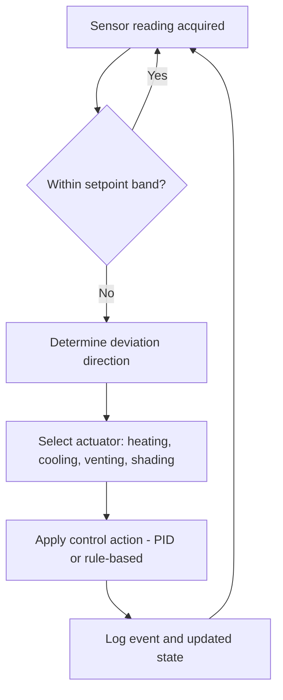

## Controlled Environment Agriculture

### Definition and Scope

Controlled Environment Agriculture (CEA) is a technology-based approach to crop production in which environmental conditions—light, temperature, humidity, $CO_2$ concentration, and often the root-zone nutrient/water supply—are monitored and actively regulated to optimize plant growth regardless of external climate. CEA spans a spectrum of structures and intensities, ranging from low-tech shade nets and high tunnels to fully automated indoor vertical farms with no reliance on sunlight or native soil.

CEA systems are typically classified along two axes:

- **Degree of enclosure**: open-field with modification (mulches, row covers) → high tunnels → greenhouses → fully enclosed indoor facilities (plant factories)
- **Degree of automation and control**: manual/passive control → semi-automated (thermostats, timers) → fully automated closed-loop systems with sensor-actuator feedback

### Core Environmental Parameters

**Key Points**

- **Light**: Photosynthetic Photon Flux Density (PPFD), measured in $\mu mol \cdot m^{-2} \cdot s^{-1}$, and Daily Light Integral (DLI), the cumulative photon count per day, are the primary metrics. DLI is calculated as:

$$DLI = PPFD \times \text{photoperiod (s)} \times 10^{-6}$$

where DLI is expressed in $mol \cdot m^{-2} \cdot day^{-1}$.

- **Temperature**: Managed as both day/night set points and Growing Degree Days (GDD) for crop scheduling. Most CEA crops perform optimally between 18–28°C, with species-specific tolerances.
- **Relative Humidity (RH)**: Regulated to control transpiration rate and disease pressure. Often expressed via Vapor Pressure Deficit (VPD) rather than RH alone, since VPD better predicts plant water stress:

$$VPD = SVP \times (1 - \frac{RH}{100})$$

where SVP (Saturated Vapor Pressure) is a function of air temperature.

- **$CO_2$ enrichment**: Ambient $CO_2$ is approximately 420 ppm; enclosed CEA systems often enrich to 800–1200 ppm to boost photosynthetic rate under high light, provided stomatal conductance and other factors are not limiting.
- **Root-zone parameters**: Electrical Conductivity (EC, in $mS/cm$) and pH of the nutrient solution or substrate, monitored continuously in hydroponic and fertigated systems.

### System Types

**Greenhouses**

Semi-controlled structures using transparent glazing (glass or polyethylene film) to admit natural sunlight while providing partial climate control via ventilation, shading, heating, and sometimes supplemental lighting. Subcategories include:

- **Passive/naturally ventilated** greenhouses (low capital cost, climate-dependent)
- **Climate-controlled greenhouses** with fan-pad cooling, heating systems, and computer-based climate controllers (e.g., Priva, Hoogendoorn platforms)
- **Semi-closed greenhouses** that recirculate air to conserve $CO_2$ and reduce pathogen ingress

**Plant Factories / Vertical Farms**

Fully enclosed, insulated buildings using exclusively artificial lighting (typically LED), multi-tier racking to maximize growing area per unit floor space, and closed-loop HVAC and irrigation systems. These offer the highest degree of control and the highest capital and energy costs.

**Hydroponic, Aeroponic, and Aquaponic Subsystems**

- **Hydroponics**: Plants grown in nutrient solution with or without an inert substrate (rockwool, coco coir, perlite). Common configurations: Nutrient Film Technique (NFT), Deep Water Culture (DWC), and ebb-and-flow.
- **Aeroponics**: Roots suspended in air and misted intermittently with nutrient solution; offers high oxygenation but requires precise mist-cycle timing to avoid desiccation.
- **Aquaponics**: Integrates fish (aquaculture) with hydroponic plant production; fish waste (ammonia) is nitrified by bacteria into nitrates used as plant nutrients, forming a semi-closed nutrient loop.

### System Architecture (svg_diagram)

<svg xmlns="http://www.w3.org/2000/svg" viewBox="0 0 800 460" font-family="Arial, sans-serif">
<rect x="0" y="0" width="800" height="460" fill="#fafafa" />
<text x="400" y="28" text-anchor="middle" font-size="18" font-weight="bold" fill="#1a1a1a">CEA Control Loop Architecture (svg_diagram)</text>

<rect x="30" y="70" width="150" height="90" rx="8" fill="#e3f2fd" stroke="#1565c0" stroke-width="1.5" />
<text x="105" y="95" text-anchor="middle" font-size="13" font-weight="bold" fill="#0d47a1">Sensors</text>
<text x="105" y="115" text-anchor="middle" font-size="11" fill="#0d47a1">Temp / RH / CO2</text>
<text x="105" y="132" text-anchor="middle" font-size="11" fill="#0d47a1">PPFD / EC / pH</text>
<text x="105" y="149" text-anchor="middle" font-size="11" fill="#0d47a1">Substrate moisture</text>

<rect x="325" y="70" width="150" height="90" rx="8" fill="#fff3e0" stroke="#e65100" stroke-width="1.5" />
<text x="400" y="95" text-anchor="middle" font-size="13" font-weight="bold" fill="#bf360c">Controller / PLC</text>
<text x="400" y="115" text-anchor="middle" font-size="11" fill="#bf360c">Setpoint logic</text>
<text x="400" y="132" text-anchor="middle" font-size="11" fill="#bf360c">PID / rule-based</text>
<text x="400" y="149" text-anchor="middle" font-size="11" fill="#bf360c">Data logging</text>

<rect x="620" y="70" width="150" height="90" rx="8" fill="#e8f5e9" stroke="#2e7d32" stroke-width="1.5" />
<text x="695" y="95" text-anchor="middle" font-size="13" font-weight="bold" fill="#1b5e20">Actuators</text>
<text x="695" y="115" text-anchor="middle" font-size="11" fill="#1b5e20">LEDs / vents / fans</text>
<text x="695" y="132" text-anchor="middle" font-size="11" fill="#1b5e20">Heaters / chillers</text>
<text x="695" y="149" text-anchor="middle" font-size="11" fill="#1b5e20">Dosing pumps</text>

<line x1="180" y1="115" x2="320" y2="115" stroke="#333" stroke-width="2" marker-end="url(#arrow)" />
<line x1="475" y1="115" x2="615" y2="115" stroke="#333" stroke-width="2" marker-end="url(#arrow)" />

<rect x="325" y="230" width="150" height="90" rx="8" fill="#f3e5f5" stroke="#6a1b9a" stroke-width="1.5" />
<text x="400" y="255" text-anchor="middle" font-size="13" font-weight="bold" fill="#4a148c">Crop &amp; Zone</text>
<text x="400" y="275" text-anchor="middle" font-size="11" fill="#4a148c">Air / root environment</text>
<text x="400" y="292" text-anchor="middle" font-size="11" fill="#4a148c">Physiological response</text>
<line x1="695" y1="160" x2="695" y2="275" stroke="#333" stroke-width="2" />
<line x1="695" y1="275" x2="480" y2="275" stroke="#333" stroke-width="2" marker-end="url(#arrow)" />
<line x1="105" y1="160" x2="105" y2="275" stroke="#333" stroke-width="2" />
<line x1="105" y1="275" x2="320" y2="275" stroke="#333" stroke-width="2" marker-end="url(#arrow)" />

<line x1="400" y1="230" x2="400" y2="200" stroke="#999" stroke-width="1.5" stroke-dasharray="4,3" />
<text x="500" y="360" text-anchor="middle" font-size="11" fill="#555">Feedback: sensors continuously re-measure the</text>
<text x="500" y="378" text-anchor="middle" font-size="11" fill="#555">crop zone, closing the control loop</text>
</svg>

### Lighting Technology

LED lighting has largely displaced High-Pressure Sodium (HPS) and fluorescent fixtures in modern CEA due to superior energy efficiency (higher $\mu mol/J$), spectral tunability, and lower heat output at the canopy. Key design considerations:

- **Spectral quality**: Red (620–700 nm) and blue (400–500 nm) wavelengths drive the bulk of photosynthetic activity per the McCree action spectrum; far-red (700–750 nm) influences morphology via phytochrome response and can be used to manage stem elongation and flowering time in photoperiod-sensitive crops.
- **Photoperiod control**: Enables manipulation of flowering (e.g., short-day vs. long-day crop responses) independent of season.
- **Light uniformity**: Fixture spacing and canopy distance are engineered to minimize PPFD variance across the growing area, typically targeting a uniformity ratio (min:max or min:avg) above 0.7–0.8.
- **Photosynthetic efficiency**: Modern horticultural LEDs typically achieve 2.5–3.5 $\mu mol/J$ photon efficacy [Unverified, as figures vary by manufacturer and fixture generation].

### Climate and Fertigation Control Systems

**Example**

A typical automated greenhouse control sequence:

1. Temperature sensor reports zone temperature exceeding the upper setpoint.
2. Controller logic triggers, in sequence: roof vents open → exhaust fans activate → evaporative (pad-and-fan) cooling engages if temperature remains above threshold.
3. If $CO_2$ enrichment is active, the controller may suppress venting temporarily to conserve injected $CO_2$, creating a trade-off the control algorithm must resolve (commonly by prioritizing temperature limits above a critical threshold).

Fertigation systems combine irrigation and nutrient delivery, dosing concentrated stock solutions (typically Stock A containing calcium nitrate, and Stock B containing other macro/micronutrients, kept separate to avoid precipitation) into irrigation water to achieve target EC and pH before delivery to the crop.

### Control Strategies

Two dominant control paradigms are used:

- **Rule-based / threshold control**: Simple if-then logic tied to setpoint bands; low computational cost, widely used in commercial greenhouse controllers.
- **PID (Proportional-Integral-Derivative) control**: Continuously adjusts actuator output proportional to the error, its integral, and its rate of change, producing smoother regulation than on/off thresholding; commonly used for temperature and $CO_2$ control loops.
- **Model Predictive Control (MPC)** and machine-learning-based control: Emerging approaches that use crop growth models or historical data to proactively adjust setpoints for energy optimization; these remain largely in research and pilot deployment [Inference, based on current CEA research trends rather than universal commercial adoption].

### Crop Suitability and Selection

CEA is economically favorable for high-value, fast-cycling, and/or climate-sensitive crops. Common categories:

- **Leafy greens and herbs**: lettuce, basil, kale — short crop cycles (25–45 days), well-suited to NFT and DWC hydroponics.
- **Vine crops**: tomatoes, cucumbers, peppers — typically grown in greenhouses on substrate (rockwool, coco coir) with drip fertigation; longer cycles (60–120+ days to first harvest).
- **Strawberries and small fruit**: increasingly grown in vertical or tabletop hydroponic systems within greenhouses.
- **Ornamentals and propagation/nursery stock**: benefit from precise photoperiod and temperature control for flowering time management.

Staple grain and row crops (rice, wheat, maize) are generally not economically viable in CEA at present due to low value density relative to energy and space costs [Inference, based on current economic analyses of CEA operating costs versus crop market value].

### Energy and Resource Considerations

**Key Points**

- Indoor plant factories are energy-intensive, with lighting typically representing the largest single operating cost, followed by HVAC (dehumidification and cooling to offset heat generated by lighting and transpiration).
- Water use efficiency is substantially higher than open-field agriculture, since hydroponic recirculating systems can reclaim and reuse a large fraction of irrigation water rather than losing it to soil infiltration and evaporation. [Inference, exact reclamation percentages vary widely by system design and are highly operation-specific.]
- Renewable energy integration (solar PV, combined heat and power) and heat-recovery systems are increasingly used to offset operating costs in energy-intensive CEA facilities.
- Life-cycle assessments of CEA versus open-field production show trade-offs: CEA typically reduces land and water footprint per unit yield but can increase carbon footprint per unit yield where grid electricity is not low-carbon. [Inference, findings are highly dependent on local energy mix and system boundaries used in the assessment.]

### Pest and Disease Management

Enclosed CEA systems reduce (but do not eliminate) pest and pathogen pressure by limiting vectors of entry. Common approaches:

- **Biosecurity protocols**: sanitation zones, filtered air intake, insect screening on vents.
- **Integrated Pest Management (IPM)**: biological control agents (predatory mites, parasitoid wasps) are often preferred over broad-spectrum chemical pesticides in enclosed environments, both for worker safety and because enclosed spaces amplify pesticide exposure risk.
- **Pathogen risks specific to hydroponics**: recirculating nutrient solution can rapidly spread root pathogens (e.g., *Pythium*, *Fusarium*) throughout a system if not managed via UV sterilization, ozonation, or slow-sand filtration of the return solution.

### Sensor and Automation Technologies

**Key Points**

- **IoT sensor networks**: distributed wireless sensors (temperature, humidity, $CO_2$, PPFD, substrate moisture/EC) reporting to a central controller or cloud dashboard.
- **Machine vision**: camera-based systems for crop health monitoring, growth-stage detection, and early pest/disease identification, increasingly paired with convolutional neural network models for automated classification. [Inference, adoption varies significantly by operation scale; large-scale commercial deployment is more common than small-farm adoption.]
- **Data historians and SCADA-like platforms**: log environmental and crop performance data over time to support yield prediction and process optimization.
- **Robotics**: automated seeding, transplanting, and harvesting systems are commercially available for select crops (notably leafy greens) but remain less mature for crops with irregular harvest morphology.

### Economic and Business Model Considerations

CEA ventures face a distinct cost structure compared to open-field agriculture: high capital expenditure (structure, lighting, climate systems) and high energy operating costs, offset by higher yield density (yield per unit land area, often expressed per square meter per year), reduced weather risk, and the ability to site production near urban demand centers to reduce transport costs and improve produce freshness. Profitability is highly sensitive to local energy prices, crop selection, and achieved yield/quality consistency [Inference, based on general CEA economic literature rather than a specific operation's data].

### Comparison of CEA System Types

| System Type | Light Source | Control Level | Typical Crops | Relative CapEx | Relative Energy Use |
| --- | --- | --- | --- | --- | --- |
| High tunnel | Sunlight | Low | Vegetables, cut flowers | Low | Low |
| Greenhouse (passive) | Sunlight | Moderate | Tomatoes, peppers, leafy greens | Moderate | Moderate |
| Greenhouse (climate-controlled) | Sunlight + supplemental LED/HPS | High | High-value fruiting crops | High | High |
| Plant factory / vertical farm | Fully artificial (LED) | Very high | Leafy greens, herbs, microgreens | Very high | Very high |

### Related Topics

- Hydroponic nutrient solution formulation and Steiner/Hoagland recipes
- Greenhouse glazing materials and light transmission properties
- LED horticultural lighting spectral design
- Vapor Pressure Deficit management for disease and transpiration control
- Precision fertigation and closed-loop nutrient recycling
- Aquaponics system design and nitrogen cycle balancing
- Machine vision for automated crop health monitoring
- Vertical farming economics and yield-per-area optimization
- Integrated Pest Management in enclosed cropping systems
- Renewable energy integration for CEA facilities (solar PV, combined heat and power)