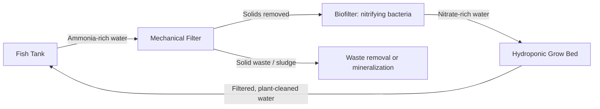

## Aquaponics and Hydroponics

### Definition and Comparative Overview

**Hydroponics** is the cultivation of plants in a soilless medium, with nutrients supplied via a mineral nutrient solution dissolved in water. **Aquaponics** integrates hydroponic plant production with recirculating aquaculture (fish or other aquatic animal farming), using fish waste as the primary nutrient input for plants, which in turn filter and condition the water returned to the fish.

| Attribute | Hydroponics | Aquaponics |
| --- | --- | --- |
| Nutrient source | Synthetic/mineral salts | Fish waste (mineralized by bacteria) |
| Nutrient control | Precise, directly adjustable | Indirect, buffered by biological process |
| Biological complexity | Low (plant + solution) | High (plant + fish + bacteria) |
| Startup cost | Moderate | Higher (fish stock, biofiltration) |
| Output | Plants only | Plants + fish/animal protein |
| System stability | Fast to correct via dosing | Slower to correct; must protect fish health |

### Hydroponic System Types

**Nutrient Film Technique (NFT)**

A thin film of nutrient solution flows continuously along a sloped channel over bare plant roots. Low water volume in the system means rapid response to pump or power failure is critical (root desiccation can occur within hours). Best suited to fast-growing, shallow-rooted crops such as lettuce and leafy herbs.

**Deep Water Culture (DWC)**

Plant roots are suspended directly in an aerated, oxygenated nutrient solution reservoir, with the plant supported by a floating raft. Simpler mechanically than NFT (no thin-film flow to maintain) but requires reliable aeration, since dissolved oxygen (DO) is the primary limiting factor for root health.

**Ebb-and-Flow (Flood and Drain)**

A growing tray containing an inert substrate (perlite, expanded clay, rockwool) is periodically flooded with nutrient solution from a reservoir, then drained back, cycling on a timer. Provides good oxygenation during the drain phase as air is drawn into the substrate.

**Drip Systems**

Nutrient solution is delivered via emitters directly to the base of each plant, typically growing in a substrate (coco coir, rockwool, perlite). This is the dominant method for larger fruiting crops (tomatoes, peppers, cucumbers) in commercial greenhouse hydroponics due to precise per-plant dosing control.

**Aeroponics**

Roots are suspended in air within an enclosed chamber and misted intermittently with nutrient solution, achieving very high root-zone oxygenation. Requires precise mist-cycle timing (typically seconds on, minutes off) since roots have no buffering reservoir and will desiccate quickly on system failure.

### Hydroponic Nutrient Solution Management

**Key Points**

- **Electrical Conductivity (EC)**, measured in $mS/cm$ or $\mu S/cm$, is a proxy for total dissolved salt concentration and is used as the primary day-to-day nutrient strength indicator. Target EC varies by crop and growth stage, commonly in the range of 1.5–3.5 $mS/cm$ for many vegetable crops [Inference, exact optimal EC is species- and cultivar-specific].
- **pH** governs nutrient availability; most hydroponic crops are managed within pH 5.5–6.5, since deviations outside this band reduce the solubility and plant uptake of specific micronutrients (e.g., iron becomes less available at higher pH).
- **Standard nutrient solution formulations** (e.g., Hoagland's solution, Steiner's solution) specify macro- and micronutrient ratios and are commonly used as reference recipes, adjusted for crop-specific requirements.
- **Two-part (A/B) stock solutions** are standard practice: calcium nitrate is kept separate from sulfate and phosphate sources (Stock B) to prevent calcium sulfate/phosphate precipitation before dilution into the working reservoir.
- **Dissolved oxygen (DO)** in the root zone is critical; air stones, venturi injectors, or oxygenation via cascading return flow are used to maintain DO levels that support aerobic root respiration.

### Nutrient Solution Delivery Architecture (svg_diagram)

<svg xmlns="http://www.w3.org/2000/svg" viewBox="0 0 800 420" font-family="Arial, sans-serif">
<rect x="0" y="0" width="800" height="420" fill="#fafafa" />
<text x="400" y="28" text-anchor="middle" font-size="18" font-weight="bold" fill="#1a1a1a">Recirculating Hydroponic Loop (svg_diagram)</text>
<rect x="40" y="70" width="160" height="80" rx="8" fill="#e3f2fd" stroke="#1565c0" stroke-width="1.5" />
<text x="120" y="100" text-anchor="middle" font-size="13" font-weight="bold" fill="#0d47a1">Nutrient Reservoir</text>
<text x="120" y="120" text-anchor="middle" font-size="11" fill="#0d47a1">EC / pH sensors</text>
<text x="120" y="137" text-anchor="middle" font-size="11" fill="#0d47a1">Dosing pumps A/B/pH</text>
<rect x="320" y="70" width="160" height="80" rx="8" fill="#fff3e0" stroke="#e65100" stroke-width="1.5" />
<text x="400" y="100" text-anchor="middle" font-size="13" font-weight="bold" fill="#bf360c">Delivery System</text>
<text x="400" y="120" text-anchor="middle" font-size="11" fill="#bf360c">Pump + drip/NFT/DWC</text>
<text x="400" y="137" text-anchor="middle" font-size="11" fill="#bf360c">Timer or flow control</text>
<rect x="600" y="70" width="160" height="80" rx="8" fill="#e8f5e9" stroke="#2e7d32" stroke-width="1.5" />
<text x="680" y="100" text-anchor="middle" font-size="13" font-weight="bold" fill="#1b5e20">Growing Zone</text>
<text x="680" y="120" text-anchor="middle" font-size="11" fill="#1b5e20">Root uptake</text>
<text x="680" y="137" text-anchor="middle" font-size="11" fill="#1b5e20">Transpiration</text>
<line x1="200" y1="110" x2="315" y2="110" stroke="#333" stroke-width="2" marker-end="url(#arrow2)" />
<line x1="480" y1="110" x2="595" y2="110" stroke="#333" stroke-width="2" marker-end="url(#arrow2)" />
<line x1="680" y1="150" x2="680" y2="260" stroke="#333" stroke-width="2" />
<line x1="680" y1="260" x2="120" y2="260" stroke="#333" stroke-width="2" />
<line x1="120" y1="260" x2="120" y2="155" stroke="#333" stroke-width="2" marker-end="url(#arrow2)" />
<text x="400" y="285" text-anchor="middle" font-size="11" fill="#555">Return flow: unused solution drains back to reservoir for recirculation</text>
</svg>

### Aquaponics: The Nitrogen Cycle

Aquaponics relies on a three-part biological loop:

1. **Fish** excrete ammonia ($NH_3$/$NH_4^+$) as a metabolic waste product, primarily through the gills.
2. **Nitrifying bacteria** in the biofilter convert ammonia in two sequential steps:

$$NH_4^+ + 1.5\,O_2 \xrightarrow{\textit{Nitrosomonas}} NO_2^- + H_2O + 2H^+$$

$$NO_2^- + 0.5\,O_2 \xrightarrow{\textit{Nitrobacter}} NO_3^-$$

3. **Plants** absorb the resulting nitrate ($NO_3^-$), along with other dissolved nutrients from fish waste, as their primary nitrogen source, and in doing so filter and detoxify the water before it returns to the fish tank.

**Key Points**

- Ammonia and nitrite are both toxic to fish at relatively low concentrations, whereas nitrate is far less toxic; a properly cycled biofilter is essential before introducing fish at production density.
- "Cycling" a new system (establishing a stable nitrifying bacteria population) typically takes several weeks and is a critical, non-skippable startup phase.
- The bacterial nitrification process consumes dissolved oxygen and alkalinity (buffering capacity), so both must be actively monitored and, if needed, supplemented (e.g., via aeration and controlled addition of a buffering agent such as potassium bicarbonate).

### Aquaponics System Architecture

**Standard component functions:**

- **Fish tank**: houses the aquaculture stock; requires temperature control, aeration, and stocking-density management appropriate to species.
- **Mechanical filter**: removes solid waste (uneaten feed, fish excreta) before water reaches the biofilter, preventing clogging and anaerobic conditions.
- **Biofilter**: provides high-surface-area media (bio-balls, lava rock, plastic bio-media) for nitrifying bacteria colonization; sized based on fish feeding rate and total ammonia production.
- **Hydroponic component**: commonly implemented as media beds (gravel/expanded clay, which also provide additional biofiltration surface), DWC rafts, or NFT channels, depending on scale and crop type.
- **Sump/return**: collects water from the grow bed before pumping back to the fish tank, often the lowest point in the system to allow gravity-fed flow.

### Aquaponics Design Ratios

**Key Points**

- **Fish-to-plant ratio** is typically expressed as a feeding-rate ratio (grams of fish feed input per day per unit of grow bed area), since feed input drives the ammonia (and therefore nutrient) load. Commonly cited starting ranges are on the order of 40–100 g feed/day per m² of grow area for media-bed systems, though this varies with fish species, plant crop, and system design. [Inference, published ratios vary considerably across sources and are typically presented as starting guidelines rather than fixed values.]
- **Fish species commonly used**: tilapia (tolerant of variable water quality, widely used in warm-climate and indoor systems), koi and goldfish (ornamental, non-food systems), catfish, and trout (cold-water systems).
- **Common crop choices**: leafy greens and herbs are most common due to lower nutrient demand relative to fruiting crops; fruiting crops (tomatoes, peppers) can be grown but generally require nutrient supplementation (particularly potassium and iron) beyond what fish waste alone provides, since fish feed is not formulated to match plant nutrient ratios.

### Water Quality Monitoring Parameters

| Parameter | Hydroponics Target Range | Aquaponics Target Range | Notes |
| --- | --- | --- | --- |
| pH | 5.5–6.5 | 6.8–7.2 | Aquaponics pH is a compromise between fish, bacteria, and plant optima |
| Dissolved Oxygen | >5 mg/L | >5 mg/L (fish-dependent) | Critical for both root and fish health |
| Ammonia (NH₃/NH₄⁺) | N/A (directly dosed as nitrate) | Near 0 mg/L in cycled system | Toxic to fish above low thresholds |
| Nitrite (NO₂⁻) | N/A | Near 0 mg/L in cycled system | Intermediate nitrification product, toxic to fish |
| Nitrate (NO₃⁻) | Component of dosed solution | Monitored, plant-consumed | Primary plant N source in aquaponics |
| Water Temperature | Crop-dependent, 18–24°C typical | Fish-species-dependent | Aquaponics must balance fish and plant optima |

The pH compromise in aquaponics is a defining design constraint: nitrifying bacteria perform optimally near neutral-to-slightly-alkaline pH, while hydroponic nutrient uptake (particularly of iron and other micronutrients) is more efficient at slightly acidic pH. Most aquaponic systems are operated in the 6.8–7.2 range as a practical middle ground [Inference, exact optimal compromise varies by system and species combination].

### Comparison: When to Use Which System

**Key Points**

- **Choose hydroponics** when precise nutrient control is required, when only plant production (not fish/animal protein) is the goal, when faster system response and correction is needed, or when regulatory/food-safety complexity around live animal husbandry is undesirable.
- **Choose aquaponics** when diversified output (fish + plants) is desired, when a lower-input, more circular nutrient model is prioritized, or in educational/demonstration contexts illustrating closed-loop ecological cycling.
- **Trade-off**: aquaponics generally requires more space, more monitoring complexity (three biological systems instead of one), and offers less direct control over plant nutrient ratios compared to hydroponics, since nutrient composition is a downstream product of fish feed rather than a directly formulated input.

### Common Failure Modes and Troubleshooting

**Example**

A sudden fish die-off following a large water change or filter cleaning is a classic aquaponics failure pattern: removing too much biofilter media or too much system water at once can crash the nitrifying bacteria population, causing an ammonia spike that poisons the fish before the bacterial colony recovers. Standard mitigation is to change no more than roughly 10–20% of system water at a time and to never fully clean or replace biofilter media in a single event. [Inference, specific safe percentages vary by system size and bacterial colony robustness.]

Other common issues:

- **Nutrient deficiency in aquaponic fruiting crops** (commonly potassium and iron): addressed via targeted supplementation that does not disrupt fish-safe water chemistry (e.g., chelated iron, potassium bicarbonate used for both pH buffering and K supply).
- **Root rot in hydroponics** (often *Pythium*): associated with low dissolved oxygen and elevated solution temperature; mitigated via chilling, aeration, and solution sterilization (UV or ozone).
- **Pump or power failure**: catastrophic for low-buffer systems (NFT, aeroponics) within hours; commercial installations typically include backup power and/or failure alarms.

### Related Topics

- Nitrogen cycle biofiltration sizing and biofilter media selection
- Hoagland's and Steiner's nutrient solution formulations
- Recirculating Aquaculture System (RAS) design principles
- Fish species selection for aquaponics (tilapia, koi, trout, catfish)
- EC/pH sensor calibration and automated dosing control
- Media-bed vs. raft (DWC) aquaponics design trade-offs
- UV sterilization and ozonation for recirculating water treatment
- Vertical farming integration with hydroponic subsystems
- Decoupled aquaponics (separated fish and plant loops with independent optimization)
- Food safety and regulatory considerations for aquaponic produce and fish