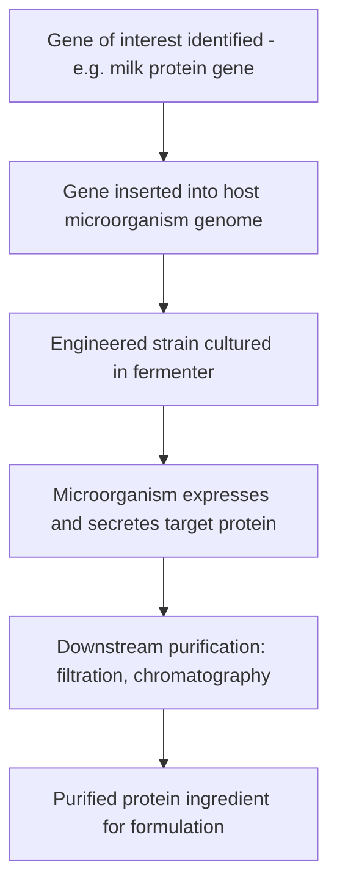

## Cellular Agriculture and Alternative Proteins

### Definition and Scope

Cellular agriculture is the production of agricultural products—primarily animal proteins and fats—directly from cell cultures rather than from whole raised animals. It sits within the broader category of **alternative proteins**, which also includes plant-based proteins and fermentation-derived proteins that do not involve animal cell culture at all. These three pillars are frequently discussed together because they address overlapping goals (reducing land, water, and greenhouse gas footprint of protein production; addressing animal welfare concerns; improving supply chain resilience) but rely on fundamentally different production technologies.

### The Three Pillars of Alternative Proteins

| Category | Core Technology | Example Products | Cellular Agriculture? |
| --- | --- | --- | --- |
| Plant-based | Extrusion, formulation of plant proteins (soy, pea, wheat) into meat-like textures | Plant-based burgers, milk alternatives | No |
| Fermentation-derived | Microorganisms (yeast, fungi, bacteria) engineered or selected to produce specific proteins or biomass | Mycoprotein, precision-fermented dairy proteins (e.g., whey/casein without cows) | Partially (see below) |
| Cultivated (cell-cultured) | Animal cells grown directly in bioreactors | Cultivated meat, cultivated seafood, cultivated fat | Yes — this is cellular agriculture proper |

**Fermentation** is further split into two sub-types relevant to this classification:

- **Biomass fermentation**: growing a microorganism itself as the protein source (e.g., mycoprotein from filamentous fungi); the organism's own cells are the product.
- **Precision fermentation**: engineering microorganisms (commonly yeast) to express and secrete a specific target protein (e.g., a milk protein or egg protein) which is then purified out; the microorganism is a production host, not the product itself.

### Cultivated Meat Production Process

**Key Points**

Cultivated meat production generally follows a sequence of stages:

1. **Cell sourcing**: Cells are obtained via a small, minimally invasive biopsy from a live animal (or from an existing cell bank/line). Common starting cell types include muscle satellite cells (myosatellite cells), which are naturally responsible for muscle repair and regeneration, and various stem cell types.
2. **Cell line development**: Selected cells are characterized and, in many processes, immortalized or otherwise adapted to proliferate stably over many population doublings, since primary cells typically have a limited natural division capacity (the Hayflick limit).
3. **Proliferation phase**: Cells are expanded in bioreactors in a growth medium formulated to maximize division rate, using conditions (temperature, pH, dissolved oxygen, agitation) analogous to but distinct from standard biopharmaceutical cell culture.
4. **Differentiation phase**: Once sufficient cell mass is achieved, culture conditions are shifted to trigger differentiation—for muscle applications, myoblasts fuse into multinucleated myotubes and begin expressing muscle-specific proteins (myosin, actin).
5. **Scaffolding (for structured products)**: For products intended to have meat-like texture (as opposed to unstructured product like ground meat analogs), cells are seeded onto or within an edible scaffold (often plant-protein-based, such as textured soy or mycelium) that provides physical structure and can guide cell alignment.
6. **Harvest and processing**: Cell/tissue mass is harvested from the bioreactor, combined with the scaffold (if used) and other formulation ingredients (fats, flavorings, binders), and processed into a final product format.

### Cultivated Meat Production Pipeline (svg_diagram)

<svg xmlns="http://www.w3.org/2000/svg" viewBox="0 0 820 320" font-family="Arial, sans-serif">
<rect x="0" y="0" width="820" height="320" fill="#fafafa" />
<text x="410" y="28" text-anchor="middle" font-size="18" font-weight="bold" fill="#1a1a1a">Cultivated Meat Production Pipeline (svg_diagram)</text>
<rect x="20" y="70" width="130" height="80" rx="8" fill="#e3f2fd" stroke="#1565c0" stroke-width="1.5" />
<text x="85" y="100" text-anchor="middle" font-size="12" font-weight="bold" fill="#0d47a1">Cell Sourcing</text>
<text x="85" y="120" text-anchor="middle" font-size="10" fill="#0d47a1">Biopsy or</text>
<text x="85" y="135" text-anchor="middle" font-size="10" fill="#0d47a1">cell bank</text>
<rect x="185" y="70" width="130" height="80" rx="8" fill="#fff3e0" stroke="#e65100" stroke-width="1.5" />
<text x="250" y="100" text-anchor="middle" font-size="12" font-weight="bold" fill="#bf360c">Cell Line Dev.</text>
<text x="250" y="120" text-anchor="middle" font-size="10" fill="#bf360c">Selection &amp;</text>
<text x="250" y="135" text-anchor="middle" font-size="10" fill="#bf360c">stabilization</text>
<rect x="350" y="70" width="130" height="80" rx="8" fill="#e8f5e9" stroke="#2e7d32" stroke-width="1.5" />
<text x="415" y="100" text-anchor="middle" font-size="12" font-weight="bold" fill="#1b5e20">Proliferation</text>
<text x="415" y="120" text-anchor="middle" font-size="10" fill="#1b5e20">Bioreactor</text>
<text x="415" y="135" text-anchor="middle" font-size="10" fill="#1b5e20">expansion</text>
<rect x="515" y="70" width="130" height="80" rx="8" fill="#f3e5f5" stroke="#6a1b9a" stroke-width="1.5" />
<text x="580" y="100" text-anchor="middle" font-size="12" font-weight="bold" fill="#4a148c">Differentiation</text>
<text x="580" y="120" text-anchor="middle" font-size="10" fill="#4a148c">Myotube</text>
<text x="580" y="135" text-anchor="middle" font-size="10" fill="#4a148c">formation</text>
<rect x="680" y="70" width="120" height="80" rx="8" fill="#fce4ec" stroke="#ad1457" stroke-width="1.5" />
<text x="740" y="100" text-anchor="middle" font-size="12" font-weight="bold" fill="#880e4f">Harvest &amp;</text>
<text x="740" y="117" text-anchor="middle" font-size="12" font-weight="bold" fill="#880e4f">Format</text>
<text x="740" y="135" text-anchor="middle" font-size="10" fill="#880e4f">Scaffold + process</text>
<line x1="150" y1="110" x2="180" y2="110" stroke="#333" stroke-width="2" marker-end="url(#arrowc)" />
<line x1="315" y1="110" x2="345" y2="110" stroke="#333" stroke-width="2" marker-end="url(#arrowc)" />
<line x1="480" y1="110" x2="510" y2="110" stroke="#333" stroke-width="2" marker-end="url(#arrowc)" />
<line x1="645" y1="110" x2="675" y2="110" stroke="#333" stroke-width="2" marker-end="url(#arrowc)" />

<text x="410" y="200" text-anchor="middle" font-size="11" fill="#555">Growth medium (amino acids, glucose, growth factors,</text>

<text x="410" y="218" text-anchor="middle" font-size="11" fill="#555">vitamins, salts) feeds the proliferation and differentiation stages</text>

</svg>

### Growth Medium Composition

**Key Points**

Cell culture growth medium is one of the most technically demanding and cost-sensitive components of cultivated meat production. A standard formulation includes:

- **Basal medium**: provides amino acids, glucose (as the primary carbon/energy source), vitamins, and inorganic salts.
- **Growth factors**: signaling proteins (e.g., fibroblast growth factor, insulin-like growth factor) that stimulate proliferation; historically sourced from **Fetal Bovine Serum (FBS)**, an expensive and ethically contested animal-derived input that the industry is actively working to eliminate.
- **Serum-free / animal-component-free (ACF) media**: an active area of development, using recombinant growth factors (often produced via precision fermentation) instead of FBS, both to reduce cost (FBS is a major cost driver at scale) and to remove animal inputs, which also addresses food-safety and supply-chain concerns associated with serum sourcing.
- **pH buffering and osmolality control**: maintained within narrow ranges appropriate to the specific cell type, monitored continuously in bioreactor-scale production.

[Inference] Growth medium cost has historically been cited as the single largest cost driver in cultivated meat production economics, though exact cost breakdowns vary significantly by company, cell line, and process maturity, and published figures should be treated as illustrative rather than universal.

### Bioreactor Systems

Bioreactor design for cultivated meat draws heavily on biopharmaceutical and industrial fermentation engineering, adapted for the specific requirements of animal cell culture:

- **Stirred-tank bioreactors**: the most common format, using an impeller to keep cells suspended and homogenize nutrient/oxygen distribution; must balance adequate mixing against shear stress, since many animal cell types (unlike robust microbial cells) are shear-sensitive and can be damaged by aggressive agitation.
- **Microcarrier-based culture**: for anchorage-dependent cell types (many animal cells require a surface to attach to and cannot proliferate purely in suspension), small beads (microcarriers) suspended in the bioreactor provide attachment surface area, substantially increasing achievable cell density per unit reactor volume compared to static flask culture.
- **Perfusion systems**: continuously feed fresh medium while removing spent medium and waste products, allowing sustained high-density culture beyond what a single batch of medium could support.
- **Scale-up challenge**: Maintaining uniform oxygen, nutrient, and shear conditions becomes progressively harder as bioreactor volume increases (from benchtop liters to industrial-scale thousands of liters), a well-documented bioprocess engineering challenge sometimes referred to as the scale-up or "valley of death" problem for cultivated meat specifically. [Inference, framed as a widely discussed industry challenge; specific technical solutions and their maturity vary by company and are largely proprietary/unpublished.]

### Fermentation-Based Alternative Proteins

**Biomass Fermentation**

Filamentous fungi (e.g., *Fusarium venenatum*, used in commercial mycoprotein products) are grown in large-scale fermenters on a carbohydrate feedstock (typically glucose), producing a fibrous fungal biomass that is harvested, heat-treated to reduce RNA content (necessary for food safety at scale, since high RNA intake can affect uric acid metabolism in humans), and processed into a meat-analog texture.

**Precision Fermentation**

Microorganisms (commonly *Komagataella phaffii*, formerly *Pichia pastoris*, or engineered yeast/bacteria strains) are genetically modified to express a gene encoding a specific target protein (e.g., bovine milk proteins such as beta-lactoglobulin, or egg albumin). The organism is cultured in standard industrial fermentation infrastructure, the target protein is secreted or extracted, then purified via downstream processing (filtration, chromatography) to yield an isolated, functionally identical protein without any animal involvement in the production step itself.

### Regulatory Landscape

**Key Points**

- Cultivated meat regulatory approval generally requires review by both a food-safety authority and, in some jurisdictions, a separate agricultural product labeling/inspection authority, reflecting its status as a genuinely novel food category.
- As of early 2026 several markets, including the United States and Singapore, have granted market approval to specific cultivated meat products from specific companies, while regulatory frameworks in other major markets remain under development or are more restrictive. [Unverified — regulatory status changes frequently and varies by product, company, and jurisdiction; current status should be verified against the relevant national food safety authority.]
- Labeling terminology ("cultivated," "cultured," "lab-grown," "cell-based") remains a contested and evolving area across jurisdictions, with some regions imposing specific requirements or restrictions on how such products may be marketed relative to conventional meat.

### Comparative Environmental and Resource Claims

**Key Points**

- Alternative protein production methods are frequently promoted on the basis of reduced land use, water use, and greenhouse gas emissions relative to conventional livestock production, particularly ruminant (beef/lamb) production, which has comparatively high land and methane-related emissions footprints per unit protein.
- Published life-cycle assessments (LCAs) of cultivated meat specifically show a wide range of outcomes depending on assumptions about energy source (grid electricity carbon intensity in particular has a large effect on modeled footprint), medium formulation, and bioreactor energy efficiency at commercial scale; because commercial-scale cultivated meat production data remains limited, many published LCAs rely substantially on projected rather than measured process parameters. [Inference/Unverified — this is an active area of academic and industry debate, and figures should be treated as scenario-dependent rather than settled.]
- Plant-based and fermentation-derived proteins generally have more mature and consistent LCA data given longer production history at commercial scale, typically showing lower land, water, and emissions footprints than conventional animal agriculture, though results vary by specific product and production method.

### Technical and Commercial Challenges

- **Cost parity**: Achieving production costs competitive with conventional meat at scale remains a central industry challenge, driven primarily by growth medium cost, bioreactor capital expenditure, and achievable cell density/production efficiency.
- **Texture and sensory replication**: Replicating the complex fibrous structure, marbling, and mouthfeel of whole-muscle cuts (as opposed to ground/processed formats) is technically more difficult than producing unstructured product, and remains an active area of scaffold and tissue-engineering research.
- **Cell line stability and food safety**: Ensuring genomic stability of proliferating cell lines over extended culture periods, and validating the food safety of both the cells and any novel medium components, are core technical and regulatory requirements.
- **Consumer acceptance**: Distinct from the underlying technology, market adoption depends heavily on consumer perception, pricing, labeling, and taste/texture parity with conventional products; survey-based acceptance data varies considerably by market and demographic. [Inference, based on general consumer-acceptance literature patterns rather than a specific universal figure.]

### Related Topics

- Bioreactor design and scale-up engineering for animal cell culture
- Serum-free growth medium formulation and recombinant growth factor production
- Precision fermentation host organism engineering (yeast, bacteria)
- Edible scaffold materials for structured cultivated meat (mycelium, plant protein)
- Regulatory frameworks for novel food approval (FDA, USDA, SFA)
- Life-cycle assessment methodology for alternative protein comparison
- Plant-based protein extrusion and texturization technology
- Precision-fermented dairy and egg protein products
- Cell line immortalization and genomic stability in cultured cells
- Consumer acceptance and labeling policy for cultivated meat products