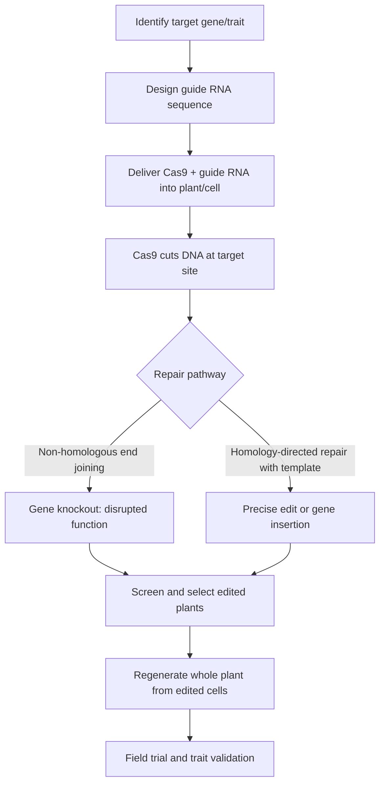

## Synthetic Biology in Agriculture

### Definition and Scope

Synthetic biology (synbio) applies engineering principles—standardization, modularity, and design-build-test-learn iteration—to biological systems, enabling the design of organisms or biological components with functions not found in nature, or the substantial enhancement of natural functions. In agriculture, synthetic biology extends beyond traditional genetic modification (which typically inserts one or a small number of genes) toward the systematic design of entire genetic circuits, metabolic pathways, and even genome-scale edits, applied to crops, livestock, and agriculturally relevant microorganisms.

Synthetic biology in agriculture is distinguished from conventional biotechnology/GMO approaches by its engineering-design orientation: parts (genes, promoters, regulatory elements) are treated as standardized, reusable components (often drawing on frameworks like the Registry of Standard Biological Parts), and systems are designed computationally before being built and tested in the organism.

### Core Toolkit

**Key Points**

- **CRISPR-Cas systems**: RNA-guided DNA-cutting enzymes (most commonly Cas9, also Cas12) that enable precise, targeted edits to a genome at a location specified by a short guide RNA sequence. This is the dominant gene-editing tool in current agricultural synbio due to its relative simplicity, low cost, and programmability compared to earlier tools (zinc finger nucleases, TALENs).
- **Gene circuits**: Engineered combinations of promoters, genes, and regulatory elements designed to produce a specific logical behavior (e.g., a gene that only activates under drought stress, or a metabolic pathway that only runs when a specific input is present), analogous in concept to electronic logic circuits.
- **Synthetic promoters and regulatory elements**: Designed or modified DNA sequences that control when, where, and how strongly a gene is expressed, allowing engineers to fine-tune trait expression rather than relying solely on the gene's native regulatory context.
- **Metabolic pathway engineering**: Introducing or modifying multi-step enzymatic pathways (often assembled from genes sourced across multiple organisms) to produce a novel compound or to redirect existing metabolic flux toward a desired product.
- **Genome-scale design and DNA synthesis**: The falling cost of DNA synthesis has made it increasingly practical to design and synthesize large genetic constructs, or in some cases substantial genome segments, from digital sequence designs rather than only editing existing genomic DNA in place.

### CRISPR Gene Editing Workflow

**Key distinction**: Non-homologous end joining (NHEJ) is the default, error-prone repair pathway that typically disrupts (knocks out) the target gene—useful for removing an undesirable trait. Homology-directed repair (HDR), which requires supplying a DNA repair template alongside the CRISPR machinery, allows precise sequence changes or gene insertion but occurs at substantially lower efficiency in most plant systems than NHEJ. [Inference, exact efficiency differentials are highly species- and construct-dependent.]

### Applications in Crop Improvement

**Disease and Pest Resistance**

Synthetic biology enables both the introduction of novel resistance genes (sourced from wild relatives, other species, or designed de novo) and the precise editing of susceptibility genes—host genes that pathogens exploit to establish infection—so that disrupting them confers resistance without introducing foreign DNA, a strategy that has been used in rice against bacterial blight and in other crops against various fungal and viral pathogens.

**Abiotic Stress Tolerance**

Engineering drought, heat, salinity, and flooding tolerance typically involves modifying genes in stress-response signaling pathways (e.g., abscisic acid signaling for drought response) or introducing genes for compatible solute production (osmoprotectants like proline or glycine betaine) that help cells maintain function under water or osmotic stress.

**Nitrogen Fixation Engineering**

A long-standing synbio ambition is engineering non-legume crops (particularly cereals like wheat, rice, and maize) to fix atmospheric nitrogen either directly or via engineered symbiotic relationships with nitrogen-fixing bacteria, potentially reducing dependence on synthetic nitrogen fertilizer. This remains a technically difficult target because natural nitrogen fixation (via the nitrogenase enzyme complex) is oxygen-sensitive and metabolically costly, and transferring the full genetic machinery into a new host or new cellular compartment is a substantially more complex engineering task than single-gene edits. [Inference, based on this being a widely cited "grand challenge" in the field rather than a solved problem; the technology remains largely in research and early field-trial stages as of the current knowledge horizon.]

**Photosynthetic Efficiency**

Research efforts target improving the efficiency of photosynthesis itself, including engineering more efficient versions or bypasses of the Rubisco enzyme's wasteful photorespiration pathway, and introducing components of more efficient carbon-fixation pathways (such as C4 photosynthesis machinery) into C3 crops like rice, wheat, and soybean, which are naturally less efficient under high light and heat conditions.

### Engineered Microorganisms for Agricultural Inputs

**Key Points**

- **Biofertilizers**: Engineered or selected microbial strains designed to enhance nutrient availability to plants, including nitrogen-fixing bacteria (e.g., engineered *Azotobacter* or root-colonizing strains designed to fix nitrogen in association with cereal crop roots) and phosphate-solubilizing microorganisms.
- **Biopesticides**: Microorganisms or microbial-derived compounds engineered to target specific pests or pathogens with greater specificity than broad-spectrum chemical pesticides, reducing off-target ecological impact. *Bacillus thuringiensis* (Bt) toxin genes, originally used via direct crop transgene insertion, represent an established example of this category, and synbio approaches now extend to engineering novel or enhanced toxin variants and engineered microbial delivery strains.
- **Rhizosphere engineering**: Designing microbial communities or individual strains to colonize the root zone (rhizosphere) and provide functions such as nutrient solubilization, pathogen suppression, or stress-tolerance signaling to the host plant.

### Livestock and Animal Agriculture Applications

Synthetic biology approaches in livestock include gene editing for disease resistance (e.g., editing pig genes associated with susceptibility to Porcine Reproductive and Respiratory Syndrome virus), and editing for production traits (e.g., polled/hornless cattle traits to reduce the need for physical dehorning). These applications typically use the same CRISPR-based toolkit as plant applications, adapted to animal cell and embryo delivery methods (e.g., microinjection into embryos, or editing of somatic cells followed by cloning).

### Design-Build-Test-Learn Cycle (svg_diagram)

<svg xmlns="http://www.w3.org/2000/svg" viewBox="0 0 700 500" font-family="Arial, sans-serif">
<rect x="0" y="0" width="700" height="500" fill="#fafafa" />
<text x="350" y="30" text-anchor="middle" font-size="18" font-weight="bold" fill="#1a1a1a">Design-Build-Test-Learn Cycle (svg_diagram)</text>
<circle cx="350" cy="270" r="150" fill="none" stroke="#ccc" stroke-width="1.5" stroke-dasharray="3,3" />
<rect x="270" y="70" width="160" height="70" rx="8" fill="#e3f2fd" stroke="#1565c0" stroke-width="1.5" />
<text x="350" y="100" text-anchor="middle" font-size="13" font-weight="bold" fill="#0d47a1">Design</text>
<text x="350" y="120" text-anchor="middle" font-size="10" fill="#0d47a1">Computational modeling,</text>
<text x="350" y="134" text-anchor="middle" font-size="10" fill="#0d47a1">circuit/pathway design</text>
<rect x="470" y="240" width="160" height="70" rx="8" fill="#fff3e0" stroke="#e65100" stroke-width="1.5" />
<text x="550" y="270" text-anchor="middle" font-size="13" font-weight="bold" fill="#bf360c">Build</text>
<text x="550" y="290" text-anchor="middle" font-size="10" fill="#bf360c">DNA synthesis,</text>
<text x="550" y="304" text-anchor="middle" font-size="10" fill="#bf360c">construct assembly, delivery</text>
<rect x="270" y="400" width="160" height="70" rx="8" fill="#e8f5e9" stroke="#2e7d32" stroke-width="1.5" />
<text x="350" y="430" text-anchor="middle" font-size="13" font-weight="bold" fill="#1b5e20">Test</text>
<text x="350" y="450" text-anchor="middle" font-size="10" fill="#1b5e20">Phenotype screening,</text>
<text x="350" y="464" text-anchor="middle" font-size="10" fill="#1b5e20">field/greenhouse trials</text>
<rect x="70" y="240" width="160" height="70" rx="8" fill="#f3e5f5" stroke="#6a1b9a" stroke-width="1.5" />
<text x="150" y="270" text-anchor="middle" font-size="13" font-weight="bold" fill="#4a148c">Learn</text>
<text x="150" y="290" text-anchor="middle" font-size="10" fill="#4a148c">Data analysis,</text>
<text x="150" y="304" text-anchor="middle" font-size="10" fill="#4a148c">model refinement</text>
<path d="M 420 140 Q 480 180 500 235" fill="none" stroke="#333" stroke-width="2" marker-end="url(#arrowd)" />
<path d="M 520 310 Q 450 380 425 405" fill="none" stroke="#333" stroke-width="2" marker-end="url(#arrowd)" />
<path d="M 280 435 Q 200 400 170 315" fill="none" stroke="#333" stroke-width="2" marker-end="url(#arrowd)" />
<path d="M 165 235 Q 220 160 275 130" fill="none" stroke="#333" stroke-width="2" marker-end="url(#arrowd)" />
</svg>

### Delivery Methods for Genetic Material

| Method | Mechanism | Common Use Case |
| --- | --- | --- |
| *Agrobacterium*-mediated transformation | Uses the natural gene-transfer mechanism of *Agrobacterium tumefaciens* to insert DNA into plant genome | Dicot crops; well-established, widely used |
| Biolistic (gene gun) | DNA-coated microparticles physically shot into plant cells | Species/tissues recalcitrant to *Agrobacterium*, including many cereals |
| Protoplast transfection | DNA or ribonucleoprotein (RNP) delivered into cells with the cell wall removed | Efficient for direct CRISPR RNP delivery, avoiding foreign DNA integration |
| Viral vectors | Modified plant viruses used to deliver genetic constructs | Rapid, often transient expression for research or specific trait delivery |
| Microinjection | Direct injection into embryos or single cells | Animal/livestock gene editing applications |

### Regulatory Considerations

**Key Points**

- Regulatory treatment of synthetic biology and gene-edited agricultural products varies substantially by jurisdiction and by the specific technique used. A key distinguishing factor in several regulatory frameworks is whether the final product contains foreign (transgenic) DNA, versus edits that only modify the organism's existing genome without inserting foreign genetic material (often termed "gene-edited" as distinct from "genetically modified" in some regulatory contexts, notably in parts of the U.S. and several other countries as of recent years).
- The European Union has historically applied stricter regulatory scrutiny to gene-edited crops compared to some other major agricultural markets, though the specific regulatory classification of newer gene-editing techniques (distinct from older transgenic GMO frameworks) has been an active and evolving area of EU policy discussion. [Unverified — regulatory frameworks are actively evolving; current status should be verified against the relevant national or regional regulatory authority.]
- Because of this jurisdictional variation, the international trade and market-access implications of a given synbio agricultural product depend heavily on the specific technique used and the specific markets targeted, requiring case-by-case regulatory strategy. [Inference, based on general patterns rather than a specific comprehensive comparative regulatory database.]

### Risk, Biosafety, and Containment Considerations

- **Gene drives**: Genetic systems designed to bias inheritance so that an engineered trait spreads through a wild population faster than standard Mendelian inheritance would predict; while more prominent in vector-control (mosquito) contexts than crop agriculture, gene drive concepts are relevant to agricultural pest management research and carry significant ecological risk and containment considerations that are the subject of ongoing biosafety research and international governance discussion.
- **Horizontal gene transfer risk**: Assessment of whether engineered genetic material could transfer to non-target organisms (e.g., wild relatives via cross-pollination) is a standard component of agricultural biosafety evaluation for any new genetically engineered crop.
- **Containment strategies**: Physical isolation distances, genetic containment mechanisms (e.g., engineered sterility in specific contexts), and monitoring protocols are used to manage gene-flow risk during research, field trials, and, where approved, commercial cultivation.

### Comparison: Synthetic Biology vs. Conventional Breeding vs. Traditional GMO

| Attribute | Conventional Breeding | Traditional Transgenic GMO | Synthetic Biology |
| --- | --- | --- | --- |
| Method | Selective crossing, selection over generations | Insertion of one/few foreign genes | Designed circuits, pathways, precise edits, possibly de novo DNA synthesis |
| Precision | Low (whole-genome recombination) | Moderate (targeted insertion, random integration site) | High (specific sequence-level design and control) |
| Foreign DNA | None | Yes, typically | Variable — may involve no foreign DNA (pure editing) or engineered constructs |
| Timeline | Multiple generations (years) | Years (transformation + selection + trials) | Can be faster for design-build-test iteration, though field validation still requires multiple seasons |

### Related Topics

- CRISPR-Cas9 guide RNA design and off-target effect minimization
- Nitrogen-fixing symbiosis engineering in cereal crops
- C4 photosynthesis pathway engineering in C3 crops
- Rhizosphere microbiome engineering and biofertilizer development
- Gene drive technology and ecological risk assessment
- Regulatory frameworks for gene-edited vs. transgenic crops
- Agrobacterium-mediated transformation protocols
- Synthetic promoter and genetic circuit design for stress-responsive traits
- Livestock gene editing for disease resistance
- DNA synthesis cost trends and genome-scale engineering feasibility