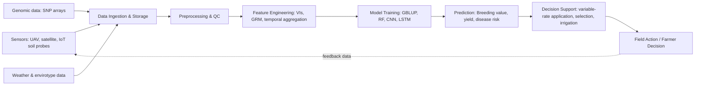

## Big Data and Machine Learning in Crop Science


### Overview

Big data and machine learning (ML) in crop science refer to the collection, integration, and analysis of large-scale, heterogeneous agricultural datasets—spanning genomics, phenomics, remote sensing, soil sensors, weather, and management records—using statistical and computational learning methods to predict outcomes, optimize decisions, and accelerate breeding. This field sits at the intersection of agronomy, plant genetics, data science, and computer vision, and underlies most modern precision agriculture and digital breeding pipelines.

**Key Points**

- Big data in agriculture is defined less by raw volume and more by the "5 Vs": Volume, Velocity, Variety, Veracity, and Value.
- ML complements classical statistics (e.g., ANOVA, mixed linear models) by handling high-dimensional, nonlinear, and multimodal data that traditional quantitative genetics tools struggle with.
- Crop science applications span the full value chain: breeding (genomic selection), field management (precision agriculture), phenotyping (image-based trait extraction), pest/disease detection, yield forecasting, and supply-chain/climate risk modeling.

---

### Data Sources and Types

#### Genomic Data

- Single Nucleotide Polymorphisms (SNPs) from genotyping arrays or whole-genome sequencing (WGS)
- Typical scale: $10^4$ to $10^6$ markers across thousands of individuals
- Formats: VCF (Variant Call Format), PLINK `.bed/.bim/.fam`

#### Phenomic Data

- High-throughput phenotyping (HTP) platforms: drones, ground rovers, gantry systems, satellite constellations
- Sensor modalities: RGB imagery, multispectral, hyperspectral, LiDAR, thermal infrared, chlorophyll fluorescence
- Derived traits: plant height, canopy cover, NDVI (Normalized Difference Vegetation Index), leaf area index (LAI), biomass estimates

#### Environmental/Envirotypic Data

- Weather station and satellite-derived climate data (temperature, precipitation, radiation, humidity)
- Soil data: texture, pH, organic matter, cation exchange capacity, often from proximal sensors (e.g., EM38) or satellite soil moisture products
- Management metadata: planting date, fertilization, irrigation schedule, cultivar

#### Yield and Trial Data

- Combine harvester yield monitors (georeferenced yield maps)
- Multi-environment trial (MET) records: genotype × environment × management combinations

**Example**

| Data Type | Typical Source | Approx. Dimensionality |
| --- | --- | --- |
| SNP genotype | Illumina/Affymetrix array | $10^4$–$10^6$ markers |
| Hyperspectral image | UAV/drone sensor | 100–300 spectral bands |
| Yield monitor | Combine GPS + flow sensor | 1 point/sec, meter-scale resolution |
| Weather | Ground station/satellite | Daily/hourly, multi-decade series |

---

### Core Machine Learning Methods Applied

#### Genomic Selection (GS)

Genomic selection predicts breeding values from marker data without requiring the causal gene to be known, using models such as:

- **GBLUP (Genomic Best Linear Unbiased Prediction)**: extends classical BLUP by replacing the pedigree-based relationship matrix with a marker-based genomic relationship matrix $\mathbf{G}$.
- **Bayesian alphabet methods** (BayesA, BayesB, BayesCπ, Bayesian LASSO): impose different prior distributions on marker effects, allowing variable shrinkage—useful when trait architecture includes a few large-effect loci.
- **Machine learning alternatives**: Random Forest, Support Vector Regression, Gradient Boosting (XGBoost/LightGBM), and deep learning (multilayer perceptrons, convolutional neural networks on marker "images").

The general genomic prediction model can be written as:

$$y = X\beta + Zu + e$$

where $y$ is the phenotype vector, $X\beta$ represents fixed effects, $Zu$ represents random genomic effects with $u \sim N(0, \mathbf{G}\sigma_u^2)$, and $e$ is residual error.

[Inference] Deep learning models tend to outperform GBLUP mainly for traits with strong non-additive (epistatic/dominance) architecture, while for purely additive traits the performance gap is typically small; this is domain-dependent and varies by crop and trait.

#### Image-Based Phenotyping (Computer Vision)

- **Convolutional Neural Networks (CNNs)**: leaf/canopy segmentation, disease lesion classification, seed counting
- **Object detection architectures** (YOLO, Faster R-CNN): counting fruit, panicles, or heads in field images
- **Semantic segmentation** (U-Net, Mask R-CNN): pixel-wise classification of canopy vs. soil vs. weeds
- **Vegetation indices as engineered features**: NDVI, GNDVI, SAVI, EVI, often used as inputs to downstream regression/classification models

#### Yield Prediction and Precision Agriculture

- Ensemble tree methods (Random Forest, Gradient Boosted Trees) are widely used for yield forecasting because they handle mixed-type tabular data (soil + weather + management) well and provide interpretable feature importance.
- Recurrent architectures (LSTM, GRU) and temporal CNNs model time-series inputs such as within-season weather and vegetation index trajectories.
- Gaussian Processes and kriging remain standard for spatial interpolation of yield maps and site-specific management zones.

#### Disease and Pest Detection

- Image classifiers trained on labeled leaf/crop imagery (e.g., PlantVillage-style datasets) detect fungal, bacterial, and viral symptoms.
- [Unverified] Field-deployed accuracy is often substantially lower than benchmark dataset accuracy due to domain shift (lighting, background clutter, disease co-occurrence not represented in training data); reported figures should be checked against validation on independent field conditions.

---

### Illustration: Data-to-Decision Pipeline



---

### Model Validation and Evaluation

#### Cross-Validation Strategies

- **k-fold cross-validation**: standard for i.i.d. assumptions but can overestimate accuracy in genomic prediction due to relatedness between train/test individuals.
- **Leave-one-environment-out (LOEO)**: critical for genomic × environment (G×E) prediction, testing generalization to unseen environments.
- **Spatial cross-validation**: for remote sensing/yield map models, avoids spatial autocorrelation inflating accuracy estimates.

#### Common Metrics

- Prediction accuracy: Pearson correlation $r$ between predicted and observed breeding values
- Root Mean Squared Error (RMSE):

$$\text{RMSE} = \sqrt{\frac{1}{n}\sum_{i=1}^{n}(y_i - \hat{y}_i)^2}$$

- $R^2$ (coefficient of determination) for regression tasks
- For classification (disease detection): precision, recall, F1-score, and AUC-ROC

**Key Points**

- Genomic prediction accuracy is bounded by trait heritability; even a perfect model cannot exceed $\sqrt{h^2}$ correlation with true breeding value under standard assumptions.
- Overfitting is a major risk given $p \gg n$ (many more markers/features than samples)—regularization (LASSO, ridge, elastic net) and dimensionality reduction (PCA, partial least squares) are standard mitigations.

---

### Infrastructure and Tooling

#### Data Management

- Relational and columnar databases for structured trial data (PostgreSQL, often paired with breeding databases like BrAPI-compliant systems—Breeding API is a standardized REST specification for exchanging plant breeding data)
- Data lakes (e.g., cloud object storage) for raw sensor imagery and genomic files
- Workflow orchestration: Apache Airflow, Nextflow (common in genomics pipelines for reproducible processing)

#### Common Software/Libraries

- **R packages**: `rrBLUP`, `BGLR` (Bayesian Generalized Linear Regression), `sommer`, `caret`
- **Python**: `scikit-learn`, `PyTorch`/`TensorFlow` for deep learning, `rasterio`/`GDAL` for geospatial raster processing, `XGBoost`/`LightGBM` for gradient boosting
- **Domain-specific platforms**: T3 (Triticeae Toolbox), Galaxy for genomics workflows, Google Earth Engine for satellite time series

[Inference] Cloud-based platforms are increasingly preferred over on-premise HPC for elastic scaling of genomic and imagery workloads, though on-premise clusters remain common in institutions with existing HPC infrastructure and data governance constraints.

---

### Challenges and Limitations

#### Technical Challenges

- **Missing data**: genotyping and sensor data commonly have gaps requiring imputation (e.g., k-nearest neighbor imputation for SNPs, or Beagle/FImpute software)
- **G×E interaction**: models trained in one environment often fail to generalize; envirotyping (systematic environmental characterization) is an active research area to address this
- **Data heterogeneity**: combining multi-year, multi-platform sensor data introduces batch effects requiring normalization

#### Practical/Adoption Challenges

- Data ownership and sharing agreements between farmers, companies, and public breeding programs
- Interoperability standards (BrAPI, MIAPPE—Minimum Information About a Plant Phenotyping Experiment) needed for cross-institution data pooling
- [Speculation] Smallholder farming systems, which represent a large share of global crop production, may see slower adoption of these tools due to sensor cost and connectivity infrastructure gaps; the pace and extent of this gap closing is uncertain and depends heavily on regional infrastructure investment.

---

### Illustration: Genomic Relationship Matrix Concept (svg_diagram)

<svg xmlns="http://www.w3.org/2000/svg" viewBox="0 0 420 260">
<text x="10" y="20" font-size="13" font-weight="bold" fill="#222">Genomic Relationship Matrix G (svg_diagram)</text>
<g font-size="11" fill="#333">
<rect x="60" y="40" width="300" height="180" fill="none" stroke="#555" stroke-width="1.5" />
<line x1="60" y1="76" x2="360" y2="76" stroke="#ccc" />
<line x1="60" y1="112" x2="360" y2="112" stroke="#ccc" />
<line x1="60" y1="148" x2="360" y2="148" stroke="#ccc" />
<line x1="60" y1="184" x2="360" y2="184" stroke="#ccc" />
<line x1="135" y1="40" x2="135" y2="220" stroke="#ccc" />
<line x1="210" y1="40" x2="210" y2="220" stroke="#ccc" />
<line x1="285" y1="40" x2="285" y2="220" stroke="#ccc" />
<rect x="60" y="40" width="75" height="36" fill="#8fbf8f" />
<rect x="135" y="76" width="75" height="36" fill="#8fbf8f" />
<rect x="210" y="112" width="75" height="36" fill="#8fbf8f" />
<rect x="285" y="148" width="75" height="36" fill="#8fbf8f" />
<text x="90" y="30" text-anchor="middle">Ind. 1</text>
<text x="165" y="30" text-anchor="middle">Ind. 2</text>
<text x="240" y="30" text-anchor="middle">Ind. 3</text>
<text x="315" y="30" text-anchor="middle">Ind. 4</text>
<text x="45" y="63" text-anchor="end">Ind. 1</text>
<text x="45" y="99" text-anchor="end">Ind. 2</text>
<text x="45" y="135" text-anchor="end">Ind. 3</text>
<text x="45" y="171" text-anchor="end">Ind. 4</text>
<text x="97" y="63" text-anchor="middle">1.0</text>
<text x="172" y="99" text-anchor="middle">1.0</text>
<text x="247" y="135" text-anchor="middle">1.0</text>
<text x="322" y="171" text-anchor="middle">1.0</text>
<text x="172" y="63" text-anchor="middle">0.3</text>
<text x="97" y="99" text-anchor="middle">0.3</text>
</g>
<text x="10" y="245" font-size="10" fill="#666">Diagonal = self-relatedness; off-diagonal = marker-based genetic similarity between individuals</text>
</svg>

---

### Practical Example: Simple Genomic Prediction Workflow (R, using `rrBLUP`)

```r
library(rrBLUP)

# geno: matrix of markers coded as -1, 0, 1 (individuals x markers)
# pheno: vector of phenotypic values, one per individual

model <- mixed.solve(y = pheno, Z = geno)

# Extract predicted marker effects
marker_effects <- model$u

# Predict genomic estimated breeding values (GEBVs) for new individuals
GEBV <- new_geno %*% marker_effects
```

**Output**

The resulting `GEBV` vector provides ranked breeding values usable for selection decisions, prior to phenotypic evaluation in the field—this is the core efficiency gain of genomic selection, reducing breeding cycle time.

---

### Emerging Directions

- **Multi-omics integration**: combining genomics, transcriptomics, and metabolomics with ML (multi-view/multi-modal learning) for mechanistic trait prediction
- **Foundation models for agriculture**: [Speculation] large pretrained vision or multimodal models (analogous to foundation models in other domains) are being explored for crop phenotyping and remote sensing tasks, though as of the current literature this remains an active research area without settled best practices.
- **Federated learning**: enabling model training across institutions/farms without centralizing raw data, addressing data privacy and ownership concerns
- **Digital twins of cropping systems**: coupling crop growth simulation models (e.g., DSSAT, APSIM) with ML-based calibration and real-time sensor assimilation
- **Explainable AI (XAI)**: SHAP values and attention visualization increasingly used to make black-box yield/disease models interpretable for agronomists

---

**Related Topics**

- Genomic selection and breeding value estimation
- Remote sensing and UAV-based crop monitoring
- Precision agriculture and variable-rate technology
- Crop growth simulation models (DSSAT, APSIM)
- Envirotyping and genotype × environment interaction
- Computer vision for plant disease diagnostics
- BrAPI and agricultural data interoperability standards
- Federated learning in agricultural data systems