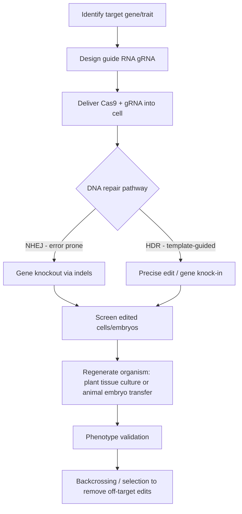

## Gene-Edited Livestock and Crops


### Overview

Gene editing refers to the direct, targeted modification of an organism's DNA sequence using programmable molecular tools, distinguishing it from earlier transgenic approaches that typically inserted foreign DNA from unrelated species. In agriculture, gene editing is applied to both crops and livestock to introduce or remove specific traits—disease resistance, yield, quality, welfare, or environmental adaptation—with greater precision and often faster development timelines than conventional breeding or first-generation genetic modification (GM).

**Key Points**

- The dominant technology is CRISPR-Cas (Clustered Regularly Interspaced Short Palindromic Repeats), though older tools (ZFNs, TALENs) and newer variants (base editing, prime editing) are also relevant.
- Regulatory treatment differs substantially by jurisdiction and by whether the edit introduces foreign DNA (transgenic) or only modifies existing native sequence (cisgenic/edited-only), which affects both crops and livestock differently.
- Applications span single-gene trait knockouts/knock-ins (e.g., disease resistance) to more complex multi-gene edits (e.g., domestication trait stacking).

---

### Core Molecular Tools

#### CRISPR-Cas9

The most widely used system, derived from a bacterial adaptive immune mechanism. It uses:

- A **guide RNA (gRNA)** that binds a complementary DNA sequence
- The **Cas9 nuclease**, which creates a double-strand break (DSB) at the targeted site
- Cellular DNA repair pathways then resolve the break via:
  - **Non-Homologous End Joining (NHEJ)**: error-prone, typically produces insertions/deletions (indels) that disrupt gene function—used for gene knockouts
  - **Homology-Directed Repair (HDR)**: uses a supplied DNA template to introduce precise sequence changes or insert new sequence—used for gene knock-ins

#### Base Editing

Fuses a catalytically impaired Cas9 (nickase) to a deaminase enzyme, allowing direct chemical conversion of one DNA base to another (e.g., C→T or A→G) without creating a double-strand break. [Inference] Base editing is generally associated with lower off-target and unintended indel rates compared to standard Cas9 nuclease editing, though the magnitude of this advantage is context- and locus-dependent.

#### Prime Editing

Combines a Cas9 nickase with a reverse transcriptase and an engineered prime editing guide RNA (pegRNA) to "search and replace" sequence directly, enabling all 12 possible base-to-base conversions plus small insertions/deletions without requiring a DSB or donor template.

#### Older Tools (Historical Context)

- **ZFNs (Zinc Finger Nucleases)**: protein-based DNA-binding domains fused to a nuclease; labor-intensive to engineer per target
- **TALENs (Transcription Activator-Like Effector Nucleases)**: modular protein DNA-binding code, more customizable than ZFNs but still protein-engineering-intensive; largely superseded by CRISPR due to ease of retargeting via gRNA redesign

---

### Illustration: CRISPR-Cas9 Editing Workflow



---

### Applications in Crops

#### Disease and Pest Resistance

- **Rice**: editing of the *SWEET* sucrose transporter genes' promoter regions to disrupt bacterial blight susceptibility (*Xanthomonas oryzae* exploits these genes to access plant sugars)
- **Wheat**: knockout of *MLO* (Mildew Locus O) genes to confer powdery mildew resistance, mirroring naturally occurring loss-of-function resistance alleles
- **Tomato**: editing of susceptibility genes to reduce bacterial spot and powdery mildew infection

#### Quality and Nutritional Traits

- High-oleic soybean and canola varieties with edited fatty acid desaturase genes for improved oil stability
- Reduced browning in mushrooms via knockout of polyphenol oxidase genes (one of the earliest commercially notable CRISPR-edited food products)
- Gluten-reduced wheat lines targeting multiple gliadin gene copies

#### Abiotic Stress Tolerance

- Drought tolerance via editing of genes regulating stomatal density or ABA (abscisic acid) signaling pathways
- [Speculation] Salinity and heat tolerance edits are an active research area with promising greenhouse-stage results in several species, but robust, field-validated commercial products remain comparatively limited as of current literature.

#### De Novo Domestication

- Editing of wild or semi-domesticated relatives to rapidly introduce domestication traits (loss of seed shattering, reduced dormancy, determinate growth) that took millennia to arise through conventional domestication—an emerging strategy to diversify crop portfolios (e.g., work on wild tomato relatives, groundcherry).

---

### Applications in Livestock

#### Disease Resistance

- **Pigs**: editing of the *CD163* gene (specifically the scavenger receptor cysteine-rich domain 5) to remove the receptor exploited by Porcine Reproductive and Respiratory Syndrome Virus (PRRSV), conferring resistance to this economically significant disease
- **Cattle**: editing associated with resistance to bovine tuberculosis and other pathogens is an active research area

#### Welfare Traits

- **Hornless (polled) dairy cattle**: introducing the naturally occurring polled allele from beef breeds into dairy genetics via gene editing rather than a foreign-species transgene, avoiding the need for physical dehorning
- Editing for heat tolerance (e.g., "slick" hair coat variants) to improve welfare and productivity in hot climates

#### Productivity and Reproduction Traits

- Myostatin gene knockouts to increase muscle mass ("double-muscling") in cattle, pigs, sheep, and goats, mirroring naturally occurring myostatin mutations seen in breeds like Belgian Blue cattle
- Sex-selection edits in some research contexts to control offspring sex ratios for production efficiency

**Example**

| Species | Edited Gene(s) | Trait | Editing Approach |
| --- | --- | --- | --- |
| Pig | CD163 | PRRSV resistance | CRISPR knockout |
| Cattle | POLLED locus | Hornlessness | HDR-based allele introduction |
| Cattle | Myostatin | Increased muscle mass | CRISPR knockout |
| Rice | SWEET promoters | Bacterial blight resistance | CRISPR promoter editing |
| Wheat | MLO | Powdery mildew resistance | Multiplex CRISPR knockout |

---

### Delivery Methods

#### In Crops

- **Agrobacterium-mediated transformation**: delivers CRISPR components via T-DNA transfer, standard for many dicot species
- **Biolistics (gene gun)**: physically delivers DNA/RNA/protein-coated particles into plant cells, common for cereals and species recalcitrant to Agrobacterium
- **Protoplast transfection**: delivery of ribonucleoprotein (RNP) complexes (pre-assembled Cas9 protein + gRNA) directly into cells lacking a cell wall, notable because it can avoid integration of foreign DNA entirely—relevant to regulatory classification
- **Tissue culture and regeneration**: essential downstream step to regenerate a whole edited plant from transformed cells, often a significant bottleneck for species with poor regeneration efficiency

#### In Livestock

- **Zygote microinjection**: direct injection of CRISPR components into a fertilized egg (zygote) before implantation
- **Somatic Cell Nuclear Transfer (SCNT)**: editing occurs in cultured somatic cells, which are screened for correct edits, then used as nuclear donors for cloning via SCNT—allows more thorough pre-selection of successfully edited cells before generating an animal
- **Electroporation of embryos**: delivering CRISPR RNPs into embryos via electrical pulses, an alternative to microinjection with logistical advantages for some species

---

### Regulatory Landscape

Regulatory frameworks vary significantly and remain an evolving area:

- **United States**: USDA-APHIS generally does not regulate gene-edited plants that could have been produced through conventional breeding and do not contain foreign DNA, under the SECURE rule framework. The FDA regulates gene-edited animals under its New Animal Drug framework, treating the intentional genomic alteration similarly to a veterinary drug application.
- **European Union**: The Court of Justice of the EU's 2018 ruling classified CRISPR-edited organisms under the same stringent GMO directive as transgenic organisms, regardless of whether foreign DNA was introduced. [Unverified] EU policy in this area has been under active legislative review in recent years; current status should be verified against the latest European Commission and Parliament publications, as this is a fast-moving and politically contested area.
- **Other jurisdictions** (e.g., Japan, Australia, several Latin American countries): many have adopted case-by-case or product-based frameworks that exempt edits without foreign DNA insertion from full GMO regulation, similar in spirit to the US approach.

**Key Points**

- The regulatory distinction between "SDN-1" (Site-Directed Nuclease type 1: small indels, no template), "SDN-2" (small precise edits using a template), and "SDN-3" (larger foreign gene insertion) is commonly used internationally to differentiate stringency of oversight—SDN-3 is typically treated like conventional transgenic GMOs.
- Public and market acceptance (especially in food-labeling-sensitive markets) is a distinct consideration from formal regulatory approval and significantly affects commercialization pathways.

---

### Off-Target Effects and Risk Assessment

- **Off-target editing**: unintended cuts at genomic sites with partial similarity to the guide RNA sequence; assessed via whole-genome sequencing, GUIDE-seq, or computational prediction tools (e.g., CRISPOR, Cas-OFFinder)
- **Mosaicism**: in animals, editing after the single-cell zygote stage can result in different cells carrying different edits, requiring screening across multiple tissue types and often several breeding generations to establish a stable, uniformly edited line
- **Unintended on-target effects**: larger deletions, chromosomal rearrangements, or repair using the wrong template near the cut site—an active area of methodological improvement across the field
- Backcrossing to elite/parental lines over multiple generations remains standard practice to segregate away potential off-target mutations while retaining the intended edit, in both crop and livestock breeding programs

---

### Illustration: Regulatory Classification Logic (svg_diagram)

<svg xmlns="http://www.w3.org/2000/svg" viewBox="0 0 460 240">
<text x="10" y="20" font-size="13" font-weight="bold" fill="#222">Common SDN Classification Logic (svg_diagram)</text>
<g font-size="11" fill="#333">
<rect x="20" y="40" width="120" height="50" fill="#cfe8cf" stroke="#4a4" />
<text x="80" y="60" text-anchor="middle">SDN-1</text>
<text x="80" y="75" text-anchor="middle">Indels, no template</text>



```
<rect x="170" y="40" width="120" height="50" fill="#e8e3a1" stroke="#aa4" />
<text x="230" y="60" text-anchor="middle">SDN-2</text>
<text x="230" y="75" text-anchor="middle">Small precise edit</text>

<rect x="320" y="40" width="120" height="50" fill="#e8b3a1" stroke="#a44" />
<text x="380" y="60" text-anchor="middle">SDN-3</text>
<text x="380" y="75" text-anchor="middle">Foreign gene insertion</text>

<line x1="80" y1="90" x2="80" y2="130" stroke="#555" />
<line x1="230" y1="90" x2="230" y2="130" stroke="#555" />
<line x1="380" y1="90" x2="380" y2="130" stroke="#555" />

<text x="80" y="145" text-anchor="middle">Often exempt</text>
<text x="80" y="158" text-anchor="middle">from GMO rules</text>

<text x="230" y="145" text-anchor="middle">Varies by</text>
<text x="230" y="158" text-anchor="middle">jurisdiction</text>

<text x="380" y="145" text-anchor="middle">Typically regulated</text>
<text x="380" y="158" text-anchor="middle">as conventional GMO</text>
```

</g>
<text x="10" y="220" font-size="10" fill="#666">Classification stringency and exemptions vary significantly by country; treat as illustrative, not authoritative.</text>
</svg>

---

### Comparison: Gene Editing vs. Transgenic GM vs. Conventional Breeding

| Aspect | Conventional Breeding | Transgenic GM | Gene Editing (SDN-1/2) |
| --- | --- | --- | --- |
| DNA source | Same/crossable species only | Often foreign species | Native genome, precisely modified |
| Precision | Low (whole genome recombination) | High (targeted insertion) | High (targeted sequence change) |
| Timeline | Multiple generations (years) | Single generation + regulatory | Single generation + variable regulatory |
| Typical regulatory burden | None | High | Variable, often lower for SDN-1/2 |

---

### Practical Considerations for Deployment

**Next Steps**

- Guide RNA design and off-target prediction using tools such as CRISPOR or Benchling before wet-lab work
- Establishing tissue culture/regeneration protocols specific to the target crop genotype (a major practical bottleneck, since regeneration efficiency is highly genotype-dependent)
- Multi-generation backcrossing and molecular screening (PCR genotyping, sequencing) to confirm edit stability and absence of off-target/foreign DNA
- Engagement with relevant national regulatory bodies early in development to clarify classification pathway
- Field or farm-level trials under appropriate biosafety containment before scale-up

---

**Related Topics**

- CRISPR-Cas9 mechanism and guide RNA design
- Genomic selection and marker-assisted breeding
- Regulatory frameworks for genetically modified organisms (GMOs)
- Somatic cell nuclear transfer and animal cloning
- Multiplex genome editing and trait stacking
- De novo domestication of wild crop relatives
- Public perception and labeling of gene-edited food products
- Off-target detection methods (GUIDE-seq, whole-genome sequencing)