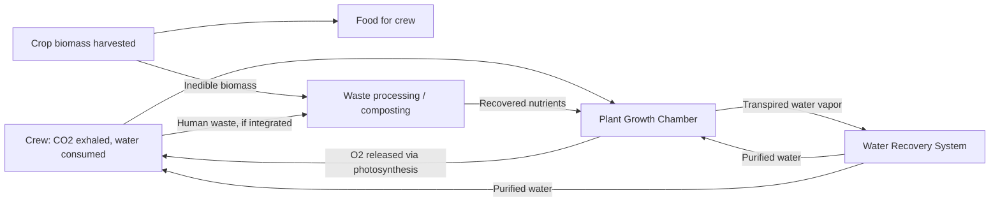

## Space and Extreme-Environment Agriculture Research


### Overview

Space and extreme-environment agriculture research studies plant (and to a lesser extent microbial and animal-protein) production under conditions that depart radically from Earth's standard agricultural envelope: microgravity or partial gravity, elevated ionizing radiation, sealed or highly constrained atmospheres, extreme temperature ranges, and in some cases complete absence of natural soil or sunlight. This research serves two overlapping goals: enabling food production for long-duration space missions (International Space Station, lunar, and Mars exploration) and generating techniques transferable to terrestrial extreme environments (polar research stations, deserts, degraded soils, disaster relief, and controlled-environment agriculture more broadly).

**Key Points**

- The field draws on controlled-environment agriculture (CEA), plant physiology, life support engineering, and space biology.
- "Extreme environment" in this context includes both literal spaceflight conditions and Earth-based analog environments (Antarctic stations, deserts, deep sea) used to test technology before flight.
- Closed-loop life support integration—recycling water, CO2, and nutrients—is a defining engineering constraint not present in most terrestrial agriculture.

---

### Core Environmental Stressors

#### Microgravity and Partial Gravity

- Affects water and nutrient delivery: without gravity-driven drainage, water tends to cling to root surfaces via surface tension, risking waterlogging and root hypoxia if not actively managed
- Alters plant orientation responses: gravitropism (root/shoot orientation relative to gravity) is disrupted, though phototropism (response to light direction) and other tropisms can partially compensate for directional growth cues
- Affects gas exchange at the leaf boundary layer: in microgravity, natural convection (buoyancy-driven air movement) is absent, so CO2 and water vapor can build up around leaf surfaces unless forced-air circulation is provided

#### Radiation Exposure

- Beyond low Earth orbit (e.g., transit to Mars, lunar surface), plants and seeds are exposed to galactic cosmic rays (GCR) and solar particle events (SPE) at levels far exceeding Earth's surface, shielded normally by the magnetosphere and atmosphere
- [Inference] Radiation effects on plant growth and seed viability are generally dose-dependent, with lower doses sometimes showing minimal or even hormetic (mildly stimulatory) effects and higher doses causing DNA damage, reduced germination, and mutagenesis; specific dose-response thresholds vary by species and are still being characterized experimentally.

#### Atmospheric Composition and Pressure

- Spacecraft and habitat atmospheres are engineered (not Earth-normal), often with different total pressure, oxygen partial pressure, and CO2 concentration than sea-level Earth
- Elevated CO2 (compared to ambient Earth ~420 ppm) is sometimes deliberately used in controlled-environment systems to boost photosynthetic rate, within limits tolerable for both plants and human occupants sharing the same atmosphere

#### Thermal Extremes (Analog/Terrestrial Context)

- Polar and desert analog research addresses diurnal and seasonal temperature swings far outside normal crop tolerance ranges, requiring insulated or underground growing structures
- Permafrost and extreme cold environments introduce additional constraints on soil-based (versus soilless) approaches, generally favoring hydroponic/aeroponic systems that avoid frozen or unusable native soil

---

### Growing System Architectures

#### Hydroponics

Nutrient delivery via water-based solution rather than soil; root systems are supported in inert media or suspended directly in circulating nutrient solution.

#### Aeroponics

Roots are suspended in air within an enclosed chamber and periodically misted with nutrient solution—reduces water use compared to hydroponics and has been studied for spaceflight due to easier water/air separation without gravity-driven drainage.

#### Aquaponics

Integrates fish or other aquatic animal production with hydroponic plant growth, using fish waste as a nutrient source for plants and plant filtration to clean water returned to the aquaculture system—explored primarily in terrestrial extreme-environment contexts (e.g., remote or off-grid facilities) more than in spaceflight to date.

#### Plant Growth Chambers and Space-Flown Hardware

- **Veggie (Vegetable Production System)**: a NASA ISS facility using pillow-style rooting media and LED lighting, used to grow leafy greens (e.g., 'Outredgeous' red romaine lettuce) and flowering plants (e.g., zinnias) aboard the ISS
- **Advanced Plant Habitat (APH)**: a more automated, sealed growth chamber on the ISS with closed-loop environmental control (temperature, humidity, CO2, light) and extensive sensor telemetry for research-grade experiments
- Both systems typically use LED lighting arrays tuned to plant-relevant wavebands (commonly red and blue peaks, sometimes supplemented with green or far-red) rather than broad-spectrum lighting, for power efficiency

**Example**

| System | Rooting Medium | Typical Use Context | Water Delivery |
| --- | --- | --- | --- |
| Veggie (ISS) | Arcillite/pillow substrate | ISS crew supplemental food | Passive wicking |
| Advanced Plant Habitat | Porous ceramic substrate | ISS controlled research | Automated, sensor-fed |
| Aeroponic chamber | None (air only) | Spaceflight & analog research | Misted nutrient spray |
| Terrestrial hydroponic tower | Inert media/net pots | Polar/desert stations | Recirculating nutrient film |

---

### Illustration: Closed-Loop Life Support Integration



---

### Space Agriculture Research Programs and Missions

- **NASA Veggie and APH experiments (ISS)**: ongoing since the mid-2010s, focused on leafy greens, radishes, and other rapid-cycle crops to validate microgravity growth and food safety
- **China's Tiangong space station plant experiments**: includes studies on rice and Arabidopsis life cycles in microgravity, contributing to a broader body of international spaceflight plant biology data
- **ESA and other agency analog studies**: ground-based simulation facilities (e.g., clinostats and random positioning machines that simulate microgravity effects on plants by continuously reorienting samples) used to screen candidate crops before costly spaceflight experiments
- [Unverified] Specific current-generation lunar or Mars surface agriculture demonstration missions and their exact status should be checked against the latest agency mission announcements, as this is an area of active, fast-evolving program development.

---

### Crop Selection Criteria for Space Agriculture

Candidate crops are typically evaluated against:

- **Growth cycle length**: fast-cycling crops (lettuce, radish, mizuna, other leafy greens) are favored for short-duration missions and rapid iterative testing
- **Nutritional density per unit volume/mass**: critical given strict mass and volume launch constraints
- **Psychological value**: fresh produce has documented crew morale benefits distinct from pure nutrition, an often-cited rationale for including salad-type crops even when caloric contribution is modest
- **Harvest index and edible biomass fraction**: crops with a high proportion of edible-to-total biomass reduce wasted growing resources
- **Tolerance to elevated CO2 and engineered atmospheres**: some crops perform better than others under the non-Earth-standard atmospheric compositions used in sealed habitats

---

### Terrestrial Extreme-Environment Applications

#### Polar Research Stations

- Facilities such as those at Antarctic research stations have used hydroponic growth chambers to supplement crew diets during periods of complete resupply isolation, serving simultaneously as a technology testbed for spaceflight systems given similar isolation and resource-constraint parallels

#### Desert and Arid-Region Agriculture

- Controlled-environment and low-water-input systems developed for space research (e.g., closed-loop nutrient recycling, aeroponics) have direct relevance to water-scarce terrestrial agriculture, representing a significant technology transfer pathway

#### Vertical Farming and Urban Agriculture

- Many LED lighting optimization techniques, nutrient film hydroponic designs, and environmental control algorithms originally developed or refined for spaceflight research have informed commercial vertical farming operations, though the transfer is bidirectional—commercial CEA advances also feed back into space agriculture design.

---

### Illustration: Comparative Environmental Constraints (svg_diagram)

<svg xmlns="http://www.w3.org/2000/svg" viewBox="0 0 460 250">
<text x="10" y="20" font-size="13" font-weight="bold" fill="#222">Growing Environment Constraint Comparison (svg_diagram)</text>
<g font-size="11" fill="#333">
<line x1="60" y1="220" x2="440" y2="220" stroke="#555" />
<line x1="60" y1="40" x2="60" y2="220" stroke="#555" />
<text x="20" y="45" text-anchor="middle">High</text>
<text x="20" y="225" text-anchor="middle">Low</text>
<text x="250" y="240" text-anchor="middle">Environment Type</text>
<text x="15" y="130" text-anchor="middle" transform="rotate(-90 15 130)">Constraint Severity</text>



```
<rect x="90" y="60" width="50" height="160" fill="#8fbf8f" />
<text x="115" y="235" text-anchor="middle">Terrestrial CEA</text>

<rect x="190" y="150" width="50" height="70" fill="#e8e3a1" />
<text x="215" y="235" text-anchor="middle">Polar/Desert</text>

<rect x="290" y="90" width="50" height="130" fill="#e8b3a1" />
<text x="315" y="235" text-anchor="middle">ISS/LEO</text>

<rect x="390" y="50" width="50" height="170" fill="#c98a8a" />
<text x="415" y="235" text-anchor="middle">Mars transit</text>
```

</g>
</svg>

---

### Open Research Challenges

- **Long-duration radiation shielding effectiveness for crops**: most current data derive from short-duration ISS experiments in low Earth orbit, which is still partially shielded by Earth's magnetosphere; deep-space and Martian surface radiation environments differ substantially and remain less characterized experimentally.
- **Microbial ecology in closed systems**: sealed growth chambers create unique microbiome dynamics (both beneficial and pathogenic) that differ from open terrestrial systems, with implications for both plant health and crew food safety.
- **Scaling from research chambers to production-scale life support**: current spaceflight systems (Veggie, APH) are experimental-scale; scaling to caloric self-sufficiency for a crew is a substantially larger engineering challenge not yet demonstrated at flight scale, to current public knowledge.
- **In-situ resource utilization (ISRU) for growing media**: research into processing lunar regolith or Martian soil analogs for plant growth (versus fully synthetic/hydroponic media) is ongoing, with regolith toxicity (e.g., perchlorates in Martian soil) representing a significant identified obstacle.

---

**Related Topics**

- Controlled-environment agriculture (CEA) and vertical farming
- Bioregenerative life support systems (BLSS)
- Plant physiology under microgravity and altered gravity
- LED lighting spectra optimization for photosynthesis
- In-situ resource utilization (ISRU) for planetary regolith
- Closed-loop water and nutrient recycling systems
- Crew psychological well-being and horticultural therapy in isolation
- Radiation biology and seed mutagenesis studies