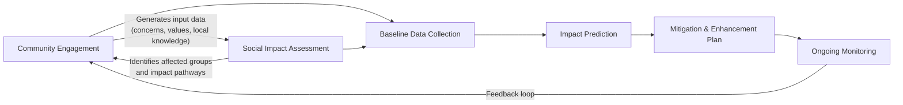

## Defining Community Engagement and Social Impact Assessment

### Overview

Community engagement and Social Impact Assessment (SIA) are two interlocking practices used to understand, predict, and manage how a proposed policy, project, or program affects the people connected to it. Community engagement is the *process* by which those people are identified, informed, consulted, and involved in decision-making. SIA is the *analytical framework* used to identify, forecast, and evaluate the consequences of that project on the social fabric of a community. Together, they form the backbone of participatory planning in fields such as urban development, infrastructure, environmental management, and public policy.

### Defining Community Engagement

**Core Definition**

Community engagement is the deliberate process of involving individuals, groups, and organizations who are affected by or interested in a decision, project, or policy, so that their concerns, needs, and values are incorporated into that decision. It spans a spectrum from simple information-sharing to full community control over outcomes.

**Key Characteristics**

- **Two-way communication**: Distinguishes engagement from mere public relations or notification. Information flows from the implementing body to the community and back.
- **Iterative process**: Engagement is not a single event but a continuous cycle spanning the project lifecycle — from scoping through post-implementation monitoring.
- **Stakeholder inclusivity**: Deliberately seeks out marginalized, vulnerable, or historically excluded groups, not just the most vocal or accessible participants.
- **Power-sharing gradient**: The degree of community control varies by method used (see IAP2 Spectrum below).

**The IAP2 Spectrum of Public Participation**

The International Association for Public Participation (IAP2) provides the most widely referenced model for classifying engagement intensity:

| Level | Goal | Promise to the Public | Example Technique |
| --- | --- | --- | --- |
| Inform | Provide balanced, objective information | "We will keep you informed" | Fact sheets, websites, public notices |
| Consult | Obtain feedback on analysis/decisions | "We will listen and acknowledge concerns" | Public comment periods, surveys |
| Involve | Ensure concerns are understood and considered | "We will work with you to ensure concerns are reflected" | Workshops, focus groups |
| Collaborate | Partner in each aspect of the decision | "We will incorporate your advice to the maximum extent possible" | Citizen advisory committees |
| Empower | Place final decision-making in the public's hands | "We will implement what you decide" | Participatory budgeting, ballot initiatives |

**Why This Spectrum Matters**

[Inference] Practitioners typically use this spectrum diagnostically — to audit whether an agency's stated intent ("we want community involvement") matches its actual chosen technique (e.g., a single public notice, which is only "Inform" level). A mismatch here is a common source of community distrust and legal challenge in planning processes.

### Defining Social Impact Assessment (SIA)

**Core Definition**

Social Impact Assessment is the process of analyzing, monitoring, and managing the intended and unintended social consequences — both positive and negative — of planned interventions (policies, programs, plans, projects) and any social change processes invoked by those interventions, so as to bring about a more sustainable and equitable biophysical and human environment.

This definition follows the widely cited formulation from the International Association for Impact Assessment (IAIA) *International Principles for Social Impact Assessment*.

**Scope of "Social Impact"**

SIA covers changes to:

- **Way of life** — how people live, work, play, and interact day to day
- **Culture** — shared beliefs, customs, values, and language
- **Community** — cohesion, stability, character, facilities, and services
- **Political systems** — extent to which people can participate in decisions affecting their lives, level of democratization
- **Environment** — quality of air/water people rely on, access to/adequacy of sanitation, physical safety
- **Health and wellbeing** — physical, mental, and social wellbeing
- **Personal and property rights** — economic affects, or personal disadvantage
- **Fears and aspirations** — perceptions about safety, fears about the future of their community

**Distinguishing SIA from Environmental Impact Assessment (EIA)**

- [Unverified] In many jurisdictions, SIA historically developed as a subset or companion process to EIA (e.g., under the U.S. National Environmental Policy Act framework), but SIA has since evolved into an independent discipline with its own methodology, standards, and professional body of practice.
- EIA emphasizes biophysical/ecological changes (air quality, hydrology, biodiversity); SIA emphasizes human/social changes, though the two frequently overlap in practice (e.g., health impacts, displacement, livelihood disruption).

**Core Phases of an SIA (per IAIA guidance)**

1. **Scoping** — identify likely social impacts, stakeholders, and community concerns
2. **Baseline/profiling** — document current social conditions before the intervention
3. **Prediction/analysis** — forecast the nature, magnitude, and distribution of impacts
4. **Mitigation and enhancement** — design measures to avoid, minimize, or offset negative impacts and to enhance benefits
5. **Monitoring** — track actual impacts against predictions during and after implementation
6. **Management** — adapt mitigation plans over time based on monitoring data (adaptive management)

### The Relationship Between the Two

**Key Points**

- Community engagement is a **methodology/process**; SIA is an **analytical framework/output**. Engagement is one of the primary *inputs* to a credible SIA — without it, an SIA risks being a desk-based exercise disconnected from lived reality.
- SIA, in turn, structures *what* engagement should be seeking to learn (e.g., prompting targeted questions about livelihood, displacement risk, cultural heritage) rather than open-ended consultation.
- [Inference] Practitioners generally treat weak engagement as the most common root cause of SIA failure, since prediction accuracy depends heavily on the quality and representativeness of the community input gathered.

### Practical Example

**Scenario**: A local government unit (LGU) proposes constructing a flood-control channel that will require relocating 40 households.

- **Community engagement actions**: Door-to-door surveys with affected households, barangay (village-level) assemblies, focus group discussions with women's groups and elderly residents, a grievance redress mechanism for concerns raised during construction.
- **SIA actions**: Baseline profiling of the 40 households (income sources, land tenure status, social networks), prediction of impacts (loss of informal livelihoods tied to the original location, disruption of children's school access, potential loss of extended-family support networks from relocation), and a resettlement action plan with compensation and livelihood-restoration measures.

### Common Misconceptions

- **"Engagement = a single public hearing."** [Inference] This conflates the "Inform" level of the IAP2 spectrum with genuine engagement; a single hearing rarely meets the threshold for meaningful "Consult" or "Involve" participation.
- **"SIA is just a checklist to satisfy a permit requirement."** Treating SIA as a compliance formality rather than a genuine analytical and adaptive management process undermines its capacity to prevent social harm.
- **"Social impacts are the same as economic impacts."** Economic effects (jobs, income) are one category within social impacts but do not capture cultural, psychological, or community-cohesion effects.

**Next Steps**

- History and evolution of SIA as a discipline (Berger Inquiry, IAIA formation)
- Stakeholder identification and mapping techniques
- Free, Prior, and Informed Consent (FPIC) in engagement with Indigenous communities
- Legal and regulatory frameworks mandating SIA (e.g., Philippine EIS System, World Bank/IFC Performance Standards)
- Baseline data collection methods (surveys, key informant interviews, participatory rural appraisal)
- Social impact indicators and measurement frameworks
- Grievance redress mechanisms (GRM) design