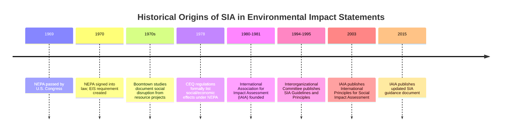

## Historical Origins in Environmental Impact Statements

### Overview

Social Impact Assessment (SIA) did not emerge as an independent discipline. It originated as a component of Environmental Impact Statements (EIS), a regulatory instrument created in the United States in 1969–1970. Understanding this origin explains why SIA methodology still carries the structural imprint of environmental science (baseline-prediction-mitigation-monitoring cycles) even though its subject matter — human social systems — differs fundamentally from biophysical systems.

### The National Environmental Policy Act (NEPA) of 1969

**Legislative Origin**

The National Environmental Policy Act (NEPA), signed into law by U.S. President Richard Nixon on January 1, 1970, is widely credited as the foundational statute that created the modern EIS requirement and, by extension, the institutional space in which SIA later developed.

**Key Provisions Relevant to SIA's Emergence**

- **Section 102(2)(C)** required federal agencies to prepare a detailed statement on the environmental impact of any major federal action significantly affecting the quality of the human environment.
- Critically, NEPA's own text defined "environment" broadly enough to include human and social dimensions, not solely biophysical/ecological ones — a phrase that regulators and courts later used to argue that social effects fell within an agency's assessment duty.
- NEPA established the Council on Environmental Quality (CEQ) to issue implementing regulations and guidance for federal agencies.

**The "Human Environment" Interpretive Turn**

[Inference] Because NEPA's statutory language referenced the "human environment" rather than solely the "natural environment," early implementers and courts had a textual basis to argue that EIS documents should address social, cultural, and economic effects alongside ecological ones. This interpretive space — not a separate, dedicated "Social Impact Assessment Act" — is the mechanism by which social impact analysis was first institutionalized in environmental review.

### CEQ Regulations and the Formal Inclusion of Social Effects

The Council on Environmental Quality's regulations implementing NEPA (first issued 1978, codified in 40 CFR Parts 1500–1508) explicitly clarified that "effects" subject to NEPA review include ecological, aesthetic, historic, cultural, economic, social, or health effects, whether direct, indirect, or cumulative. This regulatory language is frequently cited as the formal textual anchor legitimizing social impact analysis as a required, not optional, component of federal environmental review in the U.S.

### Early Practice: The 1970s Emergence of SIA Methodology

**Trigger Projects**

[Unverified] Historical accounts in the SIA literature commonly point to major energy and resource-extraction projects in the 1970s — such as the Trans-Alaska Pipeline System and various coal and hydroelectric developments in the western United States — as the practical proving grounds where analysts first attempted systematic social impact prediction (e.g., forecasting the effects of large transient workforces, "boomtown" population influxes, on small rural communities).

**The "Boomtown" Literature**

A significant early strand of SIA scholarship, sometimes called boomtown sociology, emerged from studying rapid, resource-driven population growth in small Western U.S. towns during this period. These studies documented social disruption patterns — strain on housing, schools, and social services; increased crime and social pathology indicators; and disruption of existing community social networks — that became foundational case evidence for why social effects needed formal assessment alongside environmental ones.

### Institutionalization and Professionalization

**Formation of Professional Guidance**

- A group of U.S. sociologists working on NEPA-related assessments organized to produce shared professional guidance, culminating in interorganizational committee guidance documents published in the mid-1990s (commonly cited as the 1994/1995 "Guidelines and Principles for Social Impact Assessment," published in *Impact Assessment* journal) that codified SIA as a distinct methodology.
- The International Association for Impact Assessment (IAIA), founded in 1980–1981, subsequently became the primary international professional body sustaining and updating SIA principles, culminating in the widely cited *International Principles for Social Impact Assessment* (2003) and later the *SIA guidance document* (2015 revision), which detangled SIA's principles from strict dependence on U.S. environmental law.

**Global Diffusion**

[Inference] As other countries adopted NEPA-style environmental review frameworks through the 1970s–1990s (e.g., Canada's environmental assessment regime, Australia's state-based EIA systems, and eventually World Bank/IFC safeguard frameworks for development lending), the same pattern repeated: social impact analysis rode into national and institutional practice as an appendage of environmental impact review before later maturing into an independently theorized and, in some jurisdictions, independently regulated practice.

### Timeline of Key Milestones

### Why This Origin Still Matters Methodologically

**Key Points**

- **Structural inheritance**: SIA's standard phase structure (scoping → baseline → prediction → mitigation → monitoring) mirrors EIA methodology directly, because early SIA practitioners were often environmental scientists or sociologists working within EIA teams and reused the EIA process architecture.
- **Legal subordination in some jurisdictions**: [Unverified] In jurisdictions where SIA is still procedurally triggered only as part of an EIA requirement (rather than as a freestanding legal obligation), the scope and rigor of the social analysis performed can be constrained by how "significant" impact thresholds are defined in environmental regulations, which were originally written with ecological — not social — significance in mind.
- **Ongoing critique**: A recurring critique in SIA scholarship is that this environmental-law origin subordinated social analysis to a biophysical-impact framework not well suited to capturing intangible social effects (e.g., loss of a sense of place, disruption of social capital), prompting decades of methodological refinement to develop social-specific indicators and participatory methods distinct from purely quantitative environmental metrics.

### Example: Tracing a Provision from NEPA to Modern Practice

| Era | Instrument | Social-Impact Relevant Language |
| --- | --- | --- |
| 1969–70 | NEPA Sec. 102(2)(C) | "environmental impact of the proposed action" (human environment) |
| 1978 | CEQ Regulations, 40 CFR 1508.8 | Effects include "ecological...aesthetic, historic, cultural, economic, social, or health" |
| 1994–95 | Interorganizational Committee Guidelines | First standardized SIA variable list and methodology |
| 2003 | IAIA International Principles for SIA | SIA defined independently of any single national statute |

**Next Steps**

- The Berger Inquiry (Mackenzie Valley Pipeline, Canada) as a landmark early SIA case study
- Comparison of NEPA-style EIA/SIA systems to World Bank/IFC Performance Standards
- The Philippine EIS System (PD 1586) and its treatment of social impacts
- Boomtown sociology literature and community disruption indicators
- Divergence of SIA from EIA into an independent discipline (post-2000 developments)
- Free, Prior, and Informed Consent (FPIC) as a later addition to social safeguard frameworks